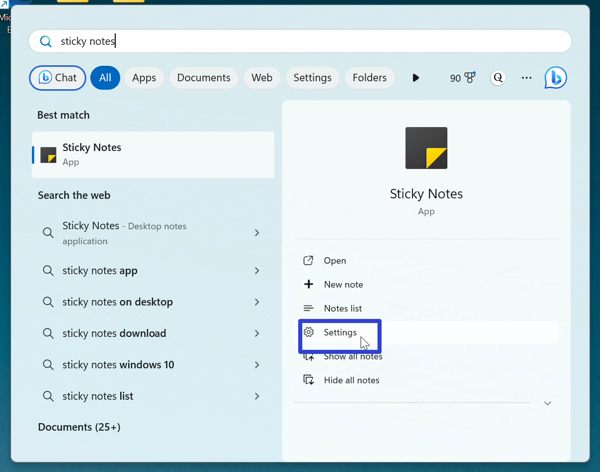
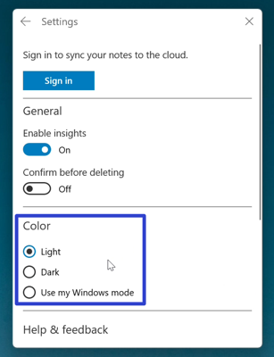
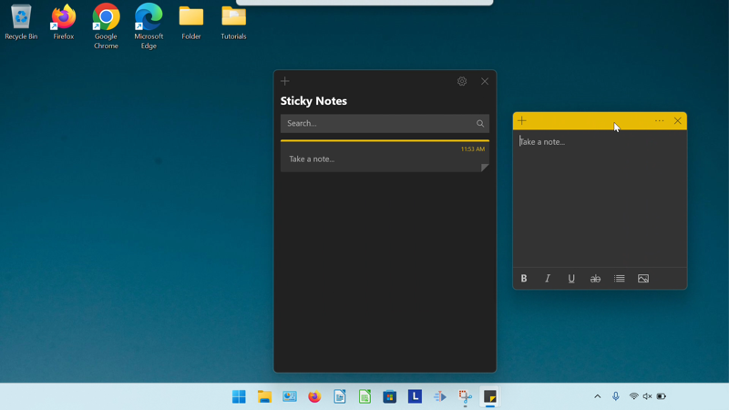
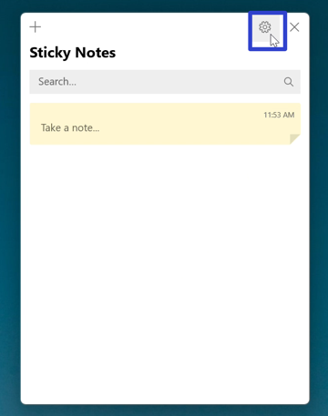
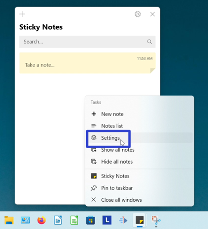

This tutorial covers:

### How to Change the Sticky Notes App Theme Color:
1. [With Start](#1)
2. [With the Notes List](#2)
3. [With Right Click](#3)

 

No time to scroll down? Click through these tutorial slides:

<iframe src="https://docs.google.com/presentation/d/e/2PACX-1vSGhBRDxWPZ9pw6haNFvIYFyPebUTqUqr6KJ8MjMN87inNVaOjDJhT0B87_LxEjJ7WE1Db34k5Adi94/embed?start=false&loop=false&delayms=3000" frameborder="0" width="480" height="299" allowfullscreen="true" mozallowfullscreen="true" webkitallowfullscreen="true"></iframe>

 

Watch a video tutorial:
<iframe class="BLOG_video_class" allowfullscreen="" youtube-src-id="LsWgfgTRB3c" width="100%" height="416" src="https://www.youtube.com/embed/LsWgfgTRB3c"></iframe>

<h1 id="1">How to Change the Sticky Notes App Theme Color With Start</h1>

* Step 1: Go down to the taskbar and click the Start (four blue squares) button. 

* Step 2: In the Start window that opens, click the top search bar and type "sticky notes". 

* Step 3: On the search results screen, click "Settings". 

* Step 4: In the Sticky Notes Settings window that opens, under the "Color" section click to select "Light", "Dark", or "Use my Windows mode". 

* Click "Dark" to select dark mode. Click "Use my Windows mode" to use the current color theme setting of the Windows operating system. 

<h1 id="2">How to Change the Sticky Notes App Theme Color With the Notes List</h1>

* Step 1: [Open](https://qhtutorials.github.io/posts/how-to-open-notes-list/) the Notes List. Go to the upper right and click the "Settings" or gear button. 

* Step 2: In the Sticky Notes Settings window that opens, under the "Color" section click to select "Light", "Dark", or "Use my Windows mode". 

*  Click "Dark" to select dark mode. Click "Use my Windows mode" to use the current color theme setting of the Windows operating system. 

<h1 id="3">How to Change the Sticky Notes App Theme Color With Right Click</h1>

* Step 1: Go down to the taskbar and right click the [open](https://qhtutorials.github.io/posts/how-to-open-sticky-notes/) or [pinned](https://qhtutorials.github.io/posts/how-to-pin-sticky-notes/) Sticky Notes app icon. 

* Step 2: In the menu that opens, click "Settings". 

* Step 3: In the Sticky Notes Settings window that opens, under the "Color" section click to select "Light", "Dark", or "Use my Windows mode". 

*  Click "Dark" to select dark mode. Click "Use my Windows mode" to use the current color theme setting of the Windows operating system. 

Save a copy of these instructions with this free [PDF tutorial.](https://drive.google.com/file/d/1vsRKB87Uj1pmpcZ7MS6ovWZixH8ga6Jz/view?usp=sharing)

 
