This tutorial covers:

## [How to Pin a City to Start](#1)

## How to Compare Cities:
1. [With Click](#2)
2. [With Keyboard](#3)

No time to scroll down? Click through these tutorial slides:

<iframe src="https://docs.google.com/presentation/d/1SwagljFsBt0KdRac6D2CSyS-mDdMJxHkjY-wpLxWVc4/embed?start=false&loop=false&delayms=3000" frameborder="0" width="480" height="299" allowfullscreen="true" mozallowfullscreen="true" webkitallowfullscreen="true"></iframe>

 

Follow along with a video tutorial:
<iframe class="BLOG_video_class" allowfullscreen="" youtube-src-id="FWrYHyLQuoI" width="100%" height="416" src="https://www.youtube.com/embed/FWrYHyLQuoI"></iframe>

 

<h1 id="1">How to Pin a City to Start</h1>

* Step 1: First [switch](https://qhtutorials.github.io/posts/how-to-edit-windows-clock-settings/) to the World Clock mode. Right click a city.  
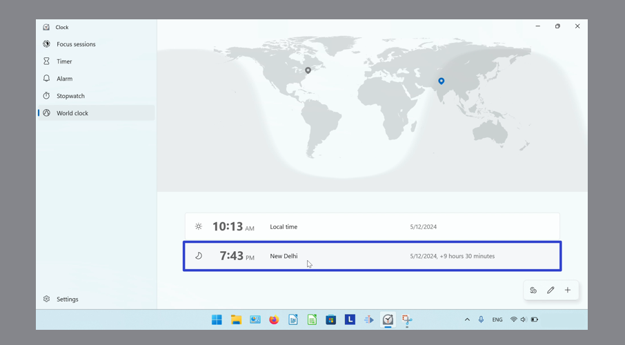
 
* Step 2: In the menu that opens, click "Pin to Start". 
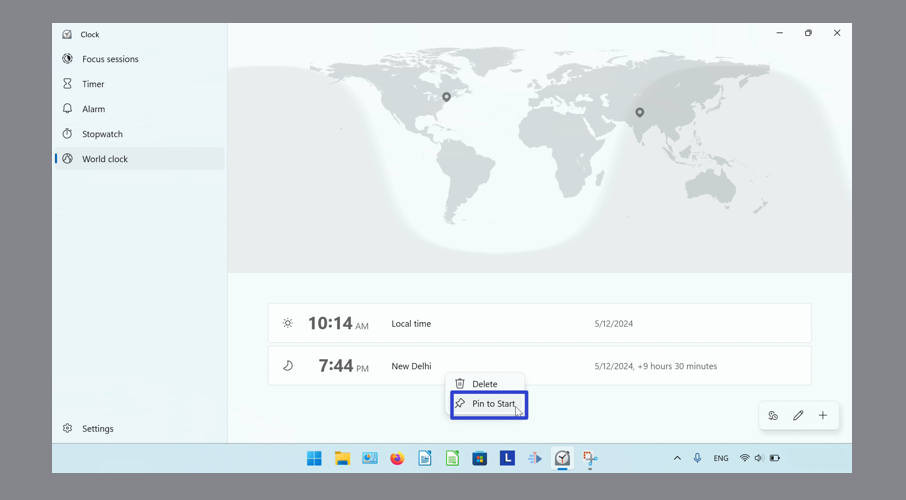
 
* Step 3: In the window that opens, click "Yes". 
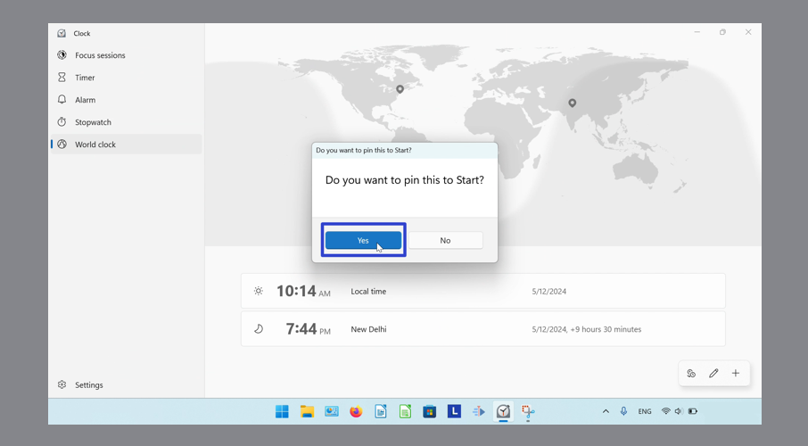
 
* Step 4: Go down to the taskbar and click the Start (four blue squares) button. 
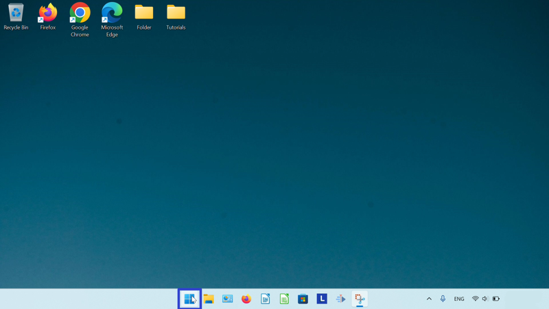
 
* Step 5: In the Start window that opens, click the pinned app icon. 

* The World Clock for the specified city opens. 
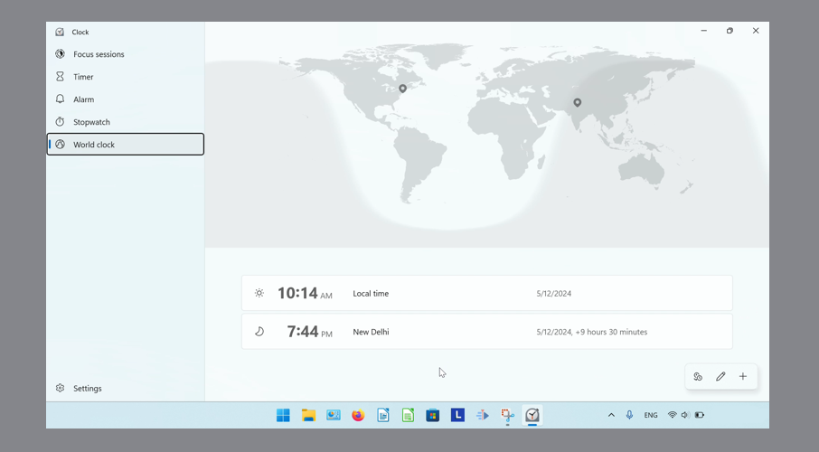
 

<h1 id="2">How to Compare Cities With Click</h1>

* Step 1: [Switch](https://qhtutorials.github.io/posts/how-to-edit-windows-clock-settings/) to the World Clock mode. Click the "Compare" button. 
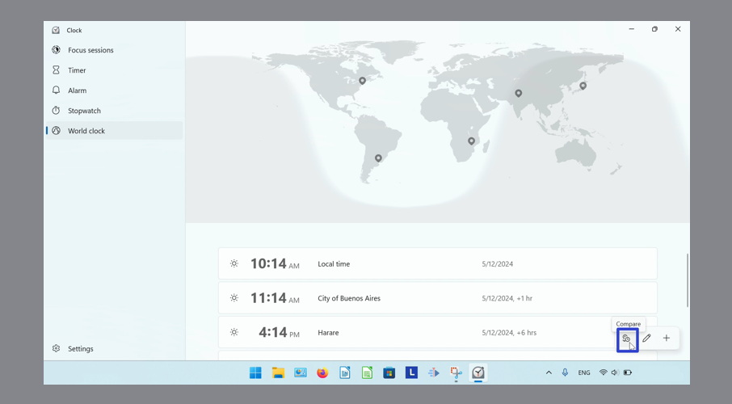
 
* Step 2: Click the left and right arrows to browse the times. Click a time to focus on it. 
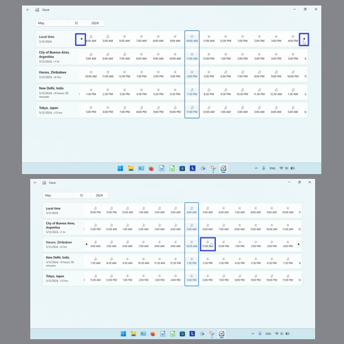

* Step 3: To select a specific date, click the date in the upper left. 
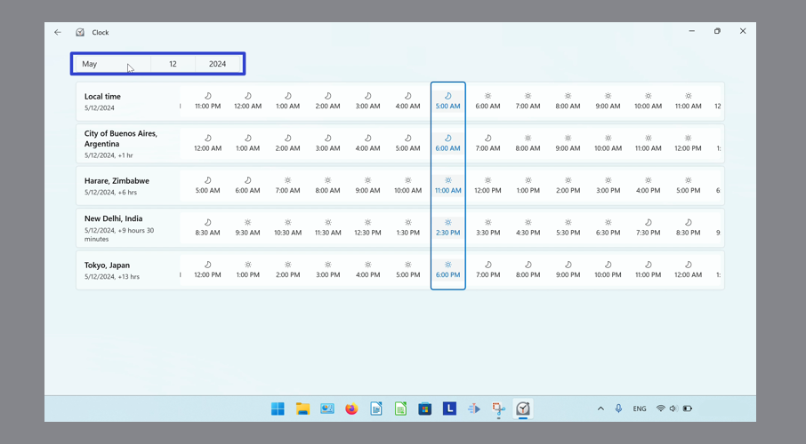
 
* Step 4: In the menu that opens, click to select a date. 
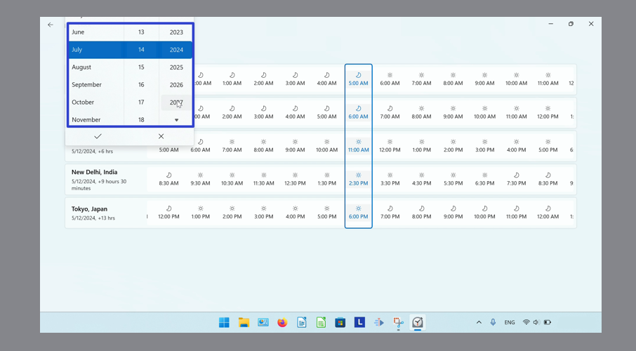
  
* Step 5: Click the check mark button to confirm. To exit the window, click the "X" button, or click anywhere outside the window. 
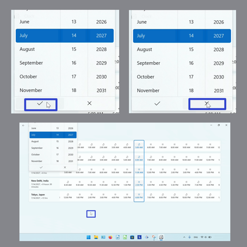
 
* Step 6: Click the back arrow twice to return to the World Clock mode. 
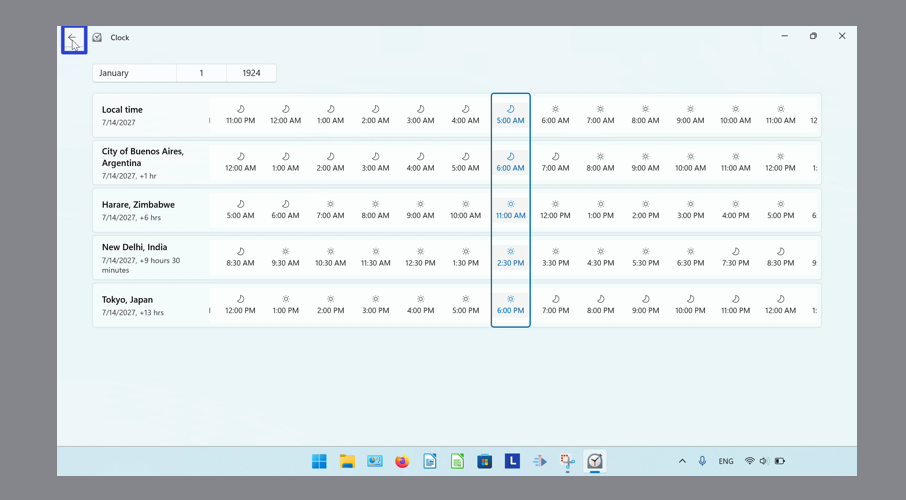
 

<h1 id="3">How to Compare Cities With Keyboard</h1>
 
* Step 1: First [switch](https://qhtutorials.github.io/posts/how-to-edit-windows-clock-settings/) the World Clock mode. On the keyboard press **Alt + C**. 
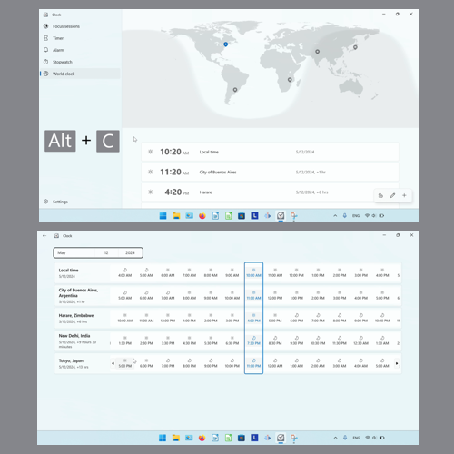

Refer to these instructions for later with this free [tutorial PDF](https://drive.google.com/file/d/1OyKVkdvyRTsSER-d32ZkYiwbu3Fo6iR5/view?usp=sharing).

 

