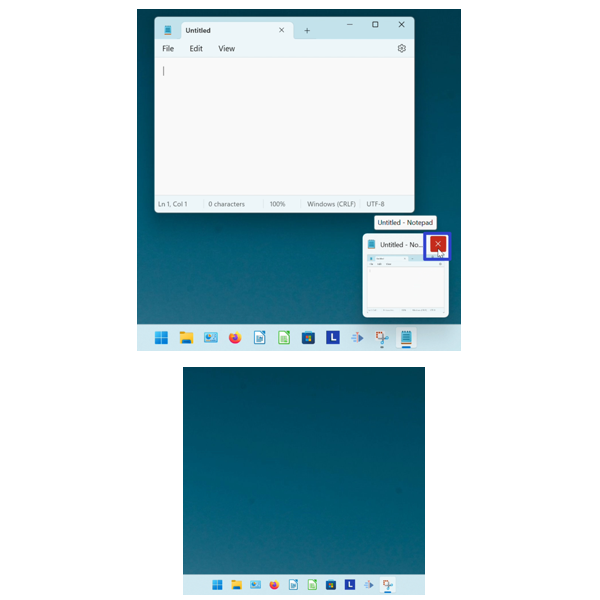

This tutorial covers:

## How to Close a Window:
1. [With Menu](#1)
2. [With Keyboard Shortcuts](#2)
3. [With Click](#3)
4. [With Right Click](#4)
5. [With Double Click](#5)
6. [With Hover](#6)
7. [With Hover and Right Click](#7)
8. [With Right Click on Taskbar](#8)

## [How to Close All Windows With Menu](#9)

## How to Close a Tab:
1. [With Menu](#10)
2. [With Keyboard Shortcut](#11)
3. [With Click](#12)
4. [With Right Click](#13)

## How to Close Tabs:
1. [On the Right Side](#14)
2. [Multiple Tabs](#15)

 

No time to scroll down? Click through this presentation tutorial:

<iframe src="https://docs.google.com/presentation/d/e/2PACX-1vSRbka1eIJYh5JhuuTQBTwLzbb6yvIvE2bsaprjBCmhYRldwohnRP9vSR-cCH2ONfR-RZk2qyv1Peu9/embed?start=false&loop=false&delayms=3000" frameborder="0" width="480" height="299" allowfullscreen="true" mozallowfullscreen="true" webkitallowfullscreen="true"></iframe>

 

Follow along with a video tutorial:
<iframe class="BLOG_video_class" allowfullscreen="" youtube-src-id="zORiC9c5KmI" width="100%" height="416" src="https://www.youtube.com/embed/zORiC9c5KmI"></iframe>

<h1 id="1">How to Close a Window With Menu</h1>

* Step 1: First [open](https://qhtutorials.github.io/posts/how-to-open-notepad/) Notepad. Go to the upper left and click "File". 

* Step 2: In the menu that opens, click "Close window". 

* Step 3: The window closes. 

<h1 id="2">How to Close a Window With Keyboard Shortcuts</h1>

* Step 1: [Open](https://qhtutorials.github.io/posts/how-to-open-notepad/) Notepad. On the keyboard press one of the following:
    - **Ctrl + W** if the Notepad window has only one tab open.
    - **Ctrl + Shift + W** if the Notepad window has multiple tabs open.
    - **Alt+F4** (or **Fn + Alt + F4**) if the Notepad window has one or multiple tabs open.

<h1 id="3">How to Close a Window With Click</h1>

* Step 1: First [open](https://qhtutorials.github.io/posts/how-to-open-notepad/) Notepad. In the upper right corner, click the "Close" or "X" button. The Notepad window closes. 

<h1 id="4">How to Close a Window With Right Click</h1>

* Step 1: [Open](https://qhtutorials.github.io/posts/how-to-open-notepad/) Notepad. Right click the top of the window. 

* Step 2: In the menu that opens, click "Close". The Notepad window closes. FIX !!!!

<h1 id="5">How to Close a Window With Double Click</h1>

* Step 1: First [open](https://qhtutorials.github.io/posts/how-to-open-notepad/) Notepad. Double click the upper left corner of the window. The Notepad window closes. 

<h1 id="6">How to Close a Window With Hover</h1>

* Step 1: [Open](https://qhtutorials.github.io/posts/how-to-open-notepad/) Notepad. Go down to the taskbar and hover the mouse over the Notepad app icon. 

* Step 2: Go to the upper right corner of the small window that appears and click the "Close" or "X" button. The Notepad window closes. 

<h1 id="7">How to Close a Window With Hover and Right Click</h1>

* Step 1: [Open](https://qhtutorials.github.io/posts/how-to-open-notepad/) Notepad. Go down to the taskbar and hover the mouse over the Notepad app icon. 

* Step 2: Right click the small window that appears. 

* Step 3: In the menu that opens, click "Close". The Notepad window closes. 

<h1 id="8">How to Close a Window With Right Click on Taskbar</h1>

* Step 1: First [open](https://qhtutorials.github.io/posts/how-to-open-notepad/) Notepad. Go down to the taskbar and right click the Notepad app icon. 

* Step 2: In the menu that opens, click "Close window" to close one window, or "Close all windows" to close multiple windows. The windows close. 

<h1 id="9">How to Close All Windows With Menu</h1>

* Step 1: [Open](https://qhtutorials.github.io/posts/how-to-open-notepad/) at least two Notepad windows. In the upper left click "File". 

* Step 2: In the menu that opens, click "Exit". All the windows close. 

<h1 id="10">How to Close a Tab With Menu</h1>

* Step 1: First [open](https://qhtutorials.github.io/posts/how-to-open-notepad/) a Notepad window with at least two tabs. In the upper left click "File". 

* Step 2: In the menu that opens, click "Close tab". The current tab closes. 

<h1 id="11">How to Close a Tab With Keyboard Shortcut</h1>

* Step 1: [Open](https://qhtutorials.github.io/posts/how-to-open-notepad/) a Notepad window with at least two tabs. On the keyboard press **Ctrl + W**. The current tab closes. 

<h1 id="12">How to Close a Tab With Click</h1>

* Step 1: First [open](https://qhtutorials.github.io/posts/how-to-open-notepad/) a Notepad window with at least two tabs. On the right side of the tab, click the "Close" or "X" button. The tab closes. 

<h1 id="13">How to Close a Tab With Right Click</h1>

* Step 1: [Open](https://qhtutorials.github.io/posts/how-to-open/notepad/) a Notepad window with at least two tabs. Right click the current tab. 

* Step 2: In the menu that opens, click "Close tab". The current tab closes. 

<h1 id="14">How to Close Tabs on the Right Side</h1>

* Step 1: First [open](https://qhtutorials.github.io/posts/how-to-open-notepad/) a Notepad window with at least three tabs. Right click the leftmost tab. 

* Step 2: In the menu that opens, click "Close tabs to the right". The other two rightmost tabs close. 

<h1 id="15">How to Close Multiple Tabs</h1>

* Step 1: [Open](https://qhtutorials.github.io/posts/how-to-open-notepad/) a Notepad window with at least three tabs. Right click any tab. 

* Step 2: In the menu that opens, click "Close other tabs". The other tabs close. 

Save a copy of this free [tutorial PDF](https://drive.google.com/file/d/19O3cn_Zsxu-DWfEBYs4AdUmDFf8K6QSJ/view?usp=sharing).

 