This tutorial covers:

### [How to Close the Notes List and Sticky Notes With Right Click](#1)

### How to Close the Notes List:
1. [With Click](#2)
2. [With Hover](#3)
3. [With Menu](#4)
4. [With Keyboard Shortcuts](#5)

### How to Close a Sticky Note:
1. [With Click](#6)
2. [With Hover](#7)
3. [With Menu](#8)
4. [With Keyboard Shortcuts](#9)

 

No time to scroll down? Click through this presentation tutorial:

<iframe src="https://docs.google.com/presentation/d/e/2PACX-1vQtsSmQkGI8lM60rs-qCSME5kXYE11I-N-bFqzPQD2_U8iU8bAx-iHx5YsRctkYtMlpdAxEJNuPKM9Y/embed?start=false&loop=false&delayms=3000" frameborder="0" width="480" height="299" allowfullscreen="true" mozallowfullscreen="true" webkitallowfullscreen="true"></iframe>

 

Follow along with a tutorial video:
<iframe class="BLOG_video_class" allowfullscreen="" youtube-src-id="eBsCGgkb0Jw" width="100%" height="416" src="https://www.youtube.com/embed/eBsCGgkb0Jw"></iframe>

<h1 id="1">How to Close the Notes List and Sticky Notes With Right Click</h1>

* Step 1: First [open](https://qhtutorials.github.io/posts/how-to-open-sticky-notes/) the Sticky Notes app. Go down to the taskbar and right click the Sticky Notes app icon. 

* Step 2: In the menu that opens, click "Close window" (if only one window is open) or "Close windows" (if multiple windows are open). 
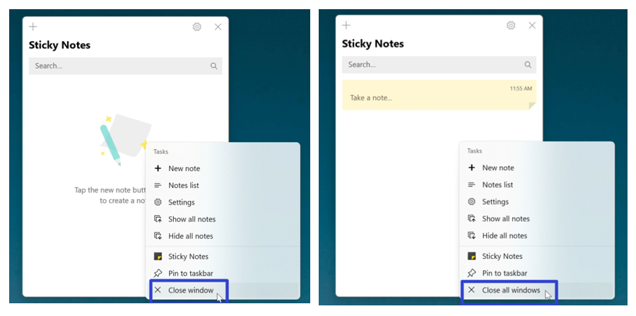

* Both the Notes List and all sticky notes close. 
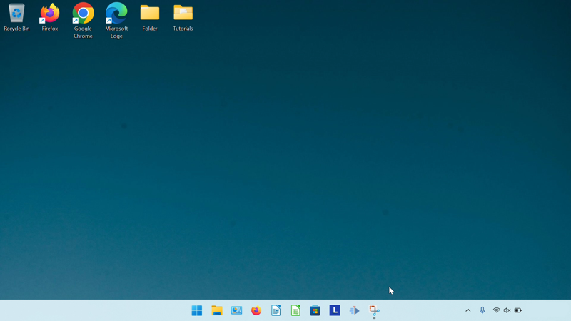

<h1 id="2">How to Close the Notes List With Click</h1>

* Step 1: [Open](https://qhtutorials.github.io/posts/how-to-open-notes-list/) the Notes List. Go to the upper right corner of the Notes List and click the "Close" or "X" button. The Notes List closes. 
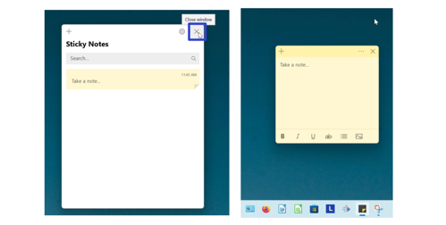

<h1 id="3">How to Close the Notes List With Hover</h1>

* Step 1: First [open](https://qhtutorials.github.io/posts/how-to-open-notes-list/) the Notes List. Go down to the taskbar and hover the mouse over the Sticky Notes app icon. 

* Step 2: Two small windows appear (one is the Notes List and the other is the sticky note). Click the "Close" or "X" button in the upper right of the small Notes List window. The Notes List window closes. 
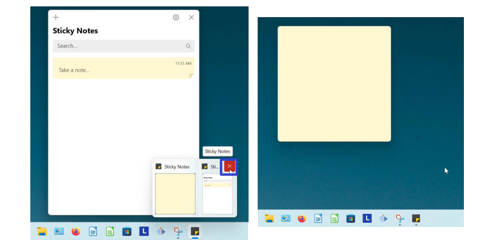

<h1 id="4">How to Close the Notes List With Menu</h1>

* Step 1: [Open](https://qhtutorials.github.io/posts/how-to-open-notes-list/) the Notes List. Go down to the taskbar and hover the mouse over the Sticky Notes app icon. 

* Step 2: Two small windows appear (one is the Notes List and the other is the sticky note). Right click the small Notes List window. 
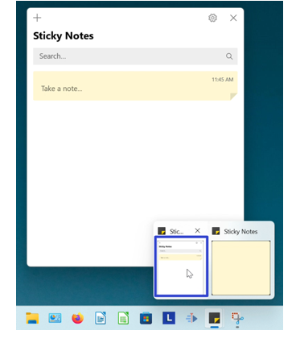

*  Step 3: In the menu that opens, click "Close". The Notes List window closes. 
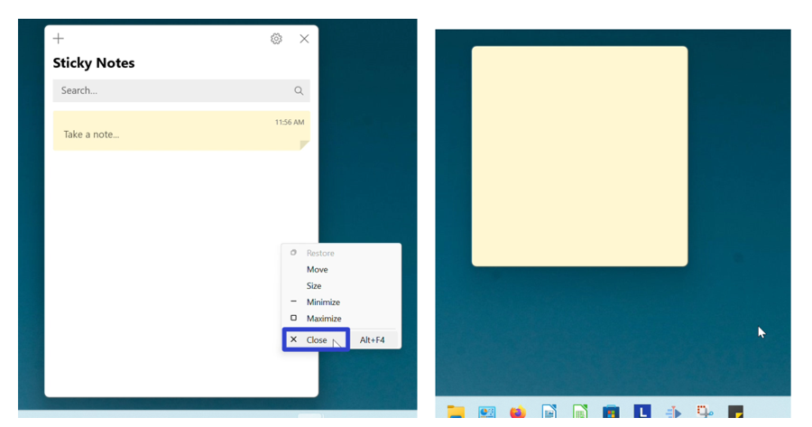

<h1 id="5">How to Close the Notes List With Keyboard Shortcuts</h1>

* Method 1: First [open](https://qhtutorials.github.io/posts/how-to-open-notes-list/) the Notes List. On the keyboard press **Alt + F4**. The Notes List closes. Note: Some computers accept this keyboard shortcut as **Fn + Alt + F4**. 
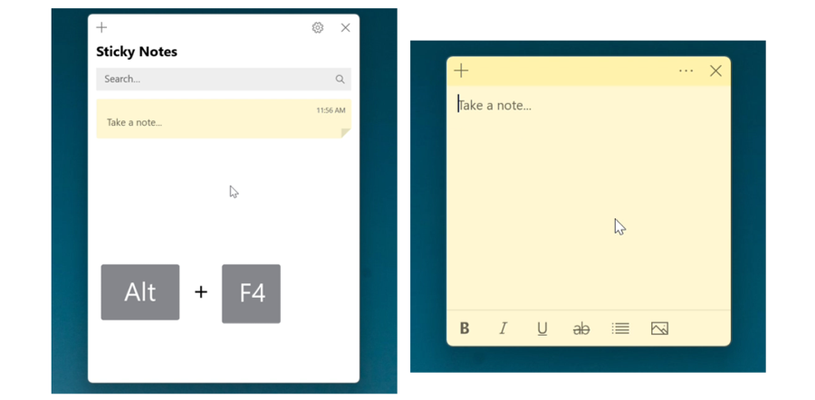

* Method 2: [Open](https://qhtutorials.github.io/posts/how-to-open-notes-list/) the Notes List. On the keyboard press **Ctrl + W**. The Notes List closes. 
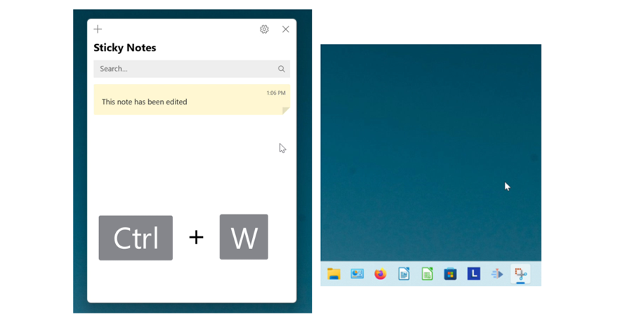

<h1 id="6">How to Close a Sticky Note With Click</h1>

* Step 1: First [open](https://qhtutorials.github.io/posts/how-to-open-a-sticky-note/) a sticky note. Go to the upper right and click the "Close" or "X" button. The sticky note closes. 
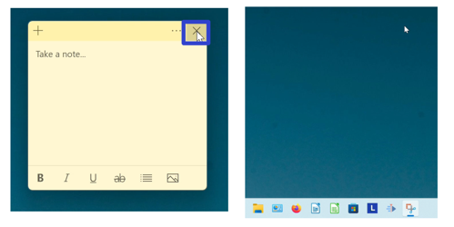

<h1 id="7">How to Close a Sticky Note With Hover</h1>

* Step 1: [Open](https://qhtutorials.github.io/posts/how-to-open-a-sticky-note/) a sticky note. Go down to the taskbar and hover the mouse over the Sticky Notes app icon. 

* Step 2: Two small windows appear (one is the Notes List and the other is the sticky note). Click the "Close" or "X" button in the upper right of the small sticky note window. The sticky note closes. 
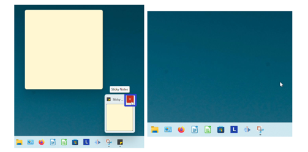

<h1 id="8">How to Close a Sticky Note With Menu</h1>

* Step 1: First [open](https://qhtutorials.github.io/posts/how-to-open-a-sticky-note/) a sticky note. Go down to the taskbar and hover the mouse over the Sticky Notes app icon. 

* Step 2: Two small windows appear (one is the Notes List and the other is the sticky note). Right click the small sticky note window. 
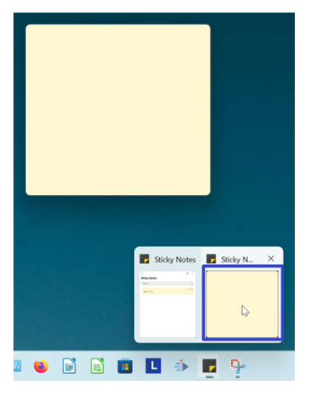

* Step 3: In the menu that opens, click "Close". The sticky note closes. 
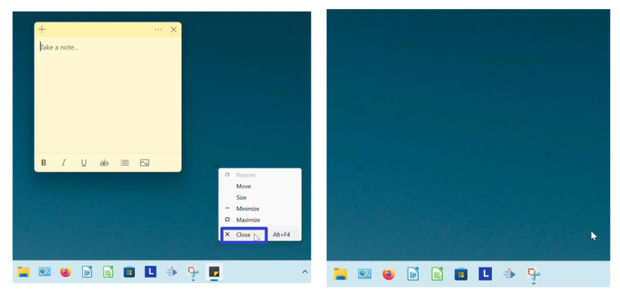

<h1 id="9">How to Close a Sticky Note With Keyboard Shortcut</h1>

* Method 1: [Open](https://qhtutorials.github.io/posts/how-to-open-a-sticky-note/) a sticky note. On the keyboard press **Alt + F4**. The sticky note closes. Note: Some computers accept this shortcut as **Fn + Alt + F4**. 
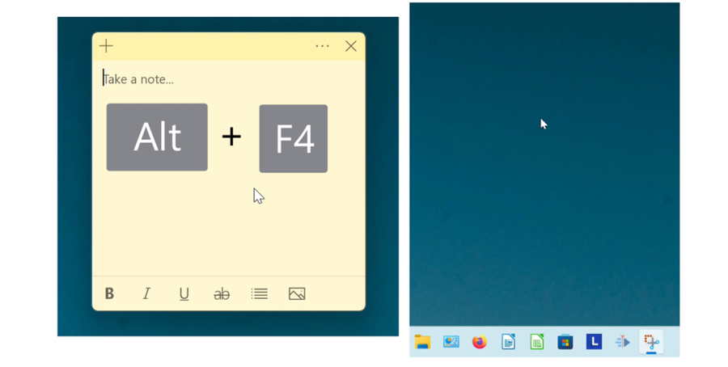

* Method 2: First [open](https://qhtutorials.github.io/posts/how-to-open-a-sticky-note/) a sticky note. On the keyboard press **Ctrl + W**. This shortcut closes edited sticky notes, and deletes unedited sticky notes. 
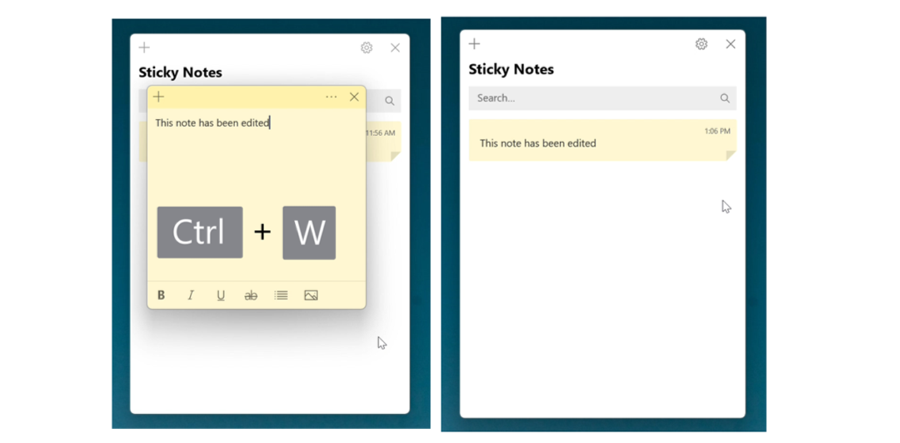

Save a copy of these instructions with this free [PDF tutorial.](https://drive.google.com/file/d/1Ct530t72sPAUoqunMqMh5iq7VHXmzKuh/view?usp=sharing)

 

