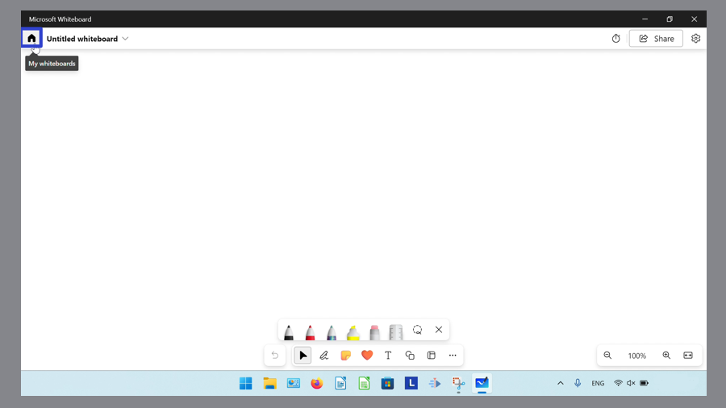
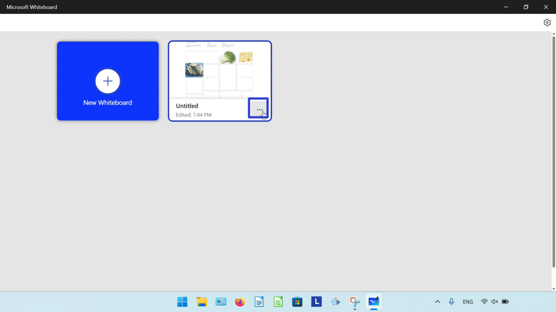
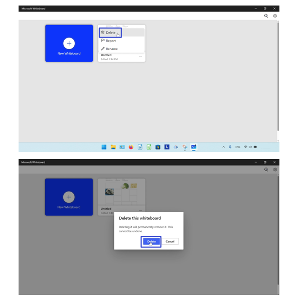
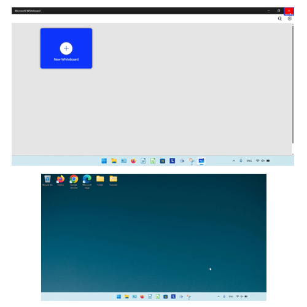
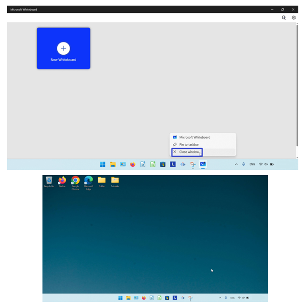
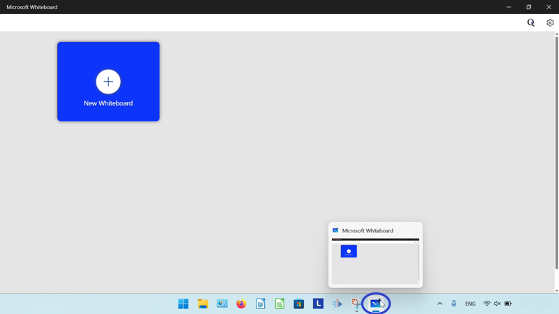
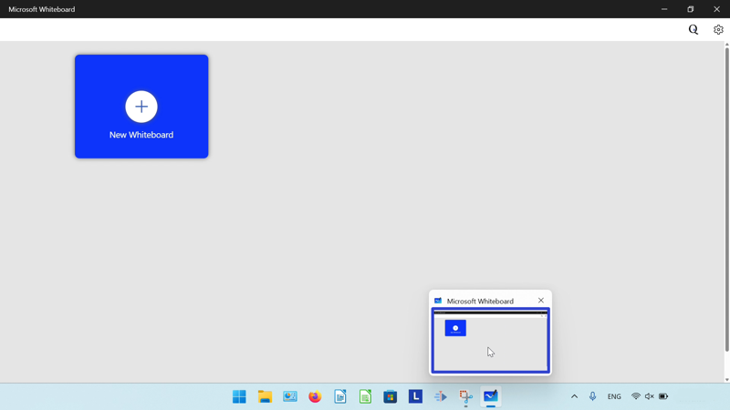
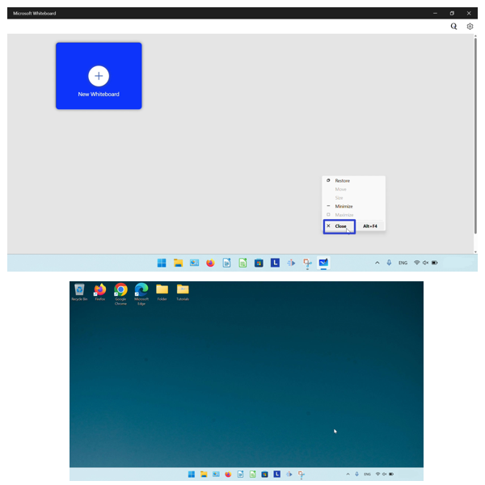
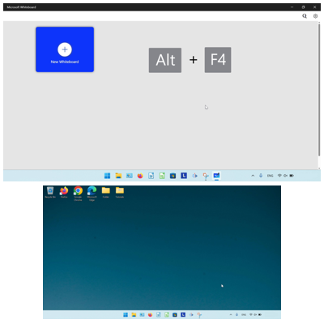
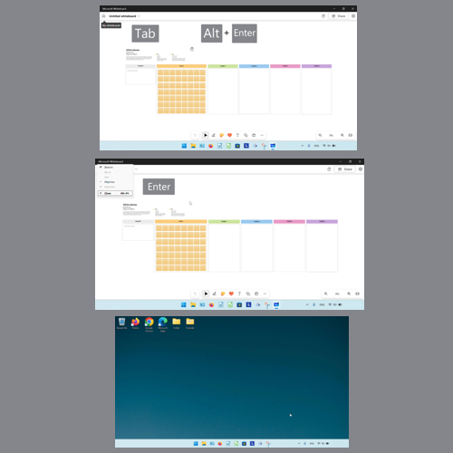

This tutorial covers:

## [How to Delete a Whiteboard](#1)

## How to Close Microsoft Whiteboard:
1. [With Click](#2)
2. [With Right Click](#3)
3. [With Hover](#4)
4. [Witih Hover and Right Click](#5)
5. [With Keyboard Shortcuts](#6)

No time to scroll down? Click through this presentation tutorial:

<iframe src="https://docs.google.com/presentation/d/e/2PACX-1vSTIbfgj4yBg_uwY27RKiLnRxtBuyoB8iZ-qGtgFejmVuRpINPCgilBoHVyTnXSSlJ16SrWHuUEGDwF/embed?start=false&loop=false&delayms=3000" frameborder="0" width="480" height="299" allowfullscreen="true" mozallowfullscreen="true" webkitallowfullscreen="true"></iframe>

 

Watch a tutorial video:
<iframe class="BLOG_video_class" allowfullscreen="" youtube-src-id="xt99RAfevIE" width="100%" height="416" src="https://www.youtube.com/embed/xt99RAfevIE"></iframe>

 

<h1 id="1">How to Delete a Whiteboard</h1>

* Step 1: First [open](https://qhtutorials.github.io/posts/how-to-open-microsoft-whiteboard/) a whiteboard. In the upper left click the "My whiteboards" or house button. 

* Step 2: Hover over a whiteboard and click the "More options" or "..." button. 

* Step 3: In the menu that opens, click "Delete". In the window that opens, click "Delete". 

<h1 id="2">How to Close Microsoft Whiteboard With Click</h1>

* Step 1: [Open](https://qhtutorials.github.io/posts/how-to-open-microsoft-whiteboard/) Microsoft Whiteboard. In the upper right click the "Close" or "X" button. 

<h1 id="3">How to Close Microsoft Whiteboard With Right Click</h1>

* Step 1: First [open](https://qhtutorials.github.io/posts/how-to-open-microsoft-whiteboard/) Microsoft Whiteboard. Go down to the taskbar and right click the Microsoft Whiteboard app icon. 

* Step 2: In the menu that opens, click "Close window". 

<h1 id="4">How to Close Microsoft Whiteboard With Hover</h1>

* Step 1: [Open](https://qhtutorials.github.io/posts/how-to-open-microsoft-whiteboard/) Microsoft Whiteboard. Go down to the taskbar and hover the mouse over the Microsoft Whiteboard app icon. 

* Step 2: Click the "Close" or "X" button in the upper right of the small window that appears. 

<h1 id="5">How to Close Microsoft Whiteboard With Hover and Right Click</h1>

* Step 1: First [open](https://qhtutorials.github.io/posts/how-to-open-microsoft-whiteboard/) Microsoft Whiteboard. Go down to the taskbar and hover the mouse over the Microsoft Whiteboard app icon. 

* Step 2: Right click the small window that appears. 

* Step 3: In the menu that opens, click "Close". 

<h1 id="6">How to Close Microsoft Whiteboard With Keyboard Shortcuts</h1>

* Method 1: [Open](https://qhtutorials.github.io/posts/how-to-open-microsoft-whiteboard/) Microsoft Whiteboard. On the keyboard press **Alt + F4**, or **Fn + Alt + F4**. 

* Method 2: First [open](https://qhtutorials.github.io/posts/how-to-open-microsoft-whiteboard/) Microsoft Whiteboard. Press **Tab** to enter keyboard focus, then press **Alt + Enter**. In the menu that appears in the upper left corner, press the **down arrow** key until the cursor is on the "Close" option and press **Enter**. 

Keep a copy of these instructions for later with this free [tutorial PDF](https://drive.google.com/file/d/1AWcBKM2QlwtiACMOFsoC301ujKYtBgU0/view?usp=sharing).

 

