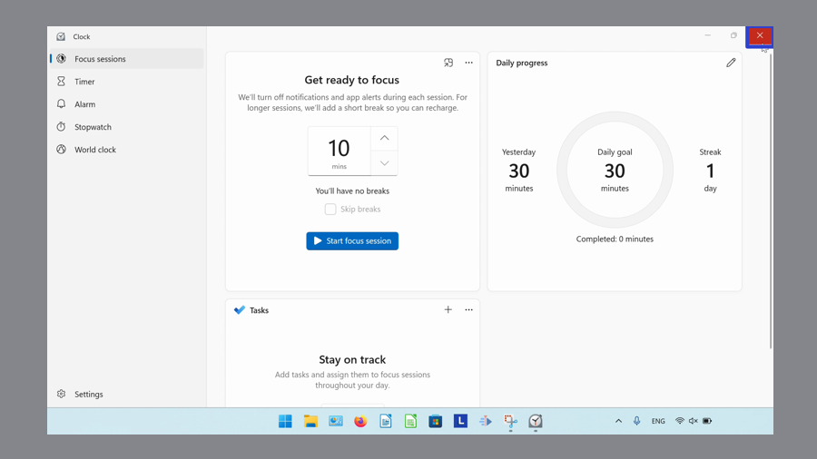
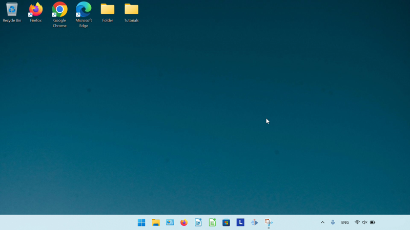
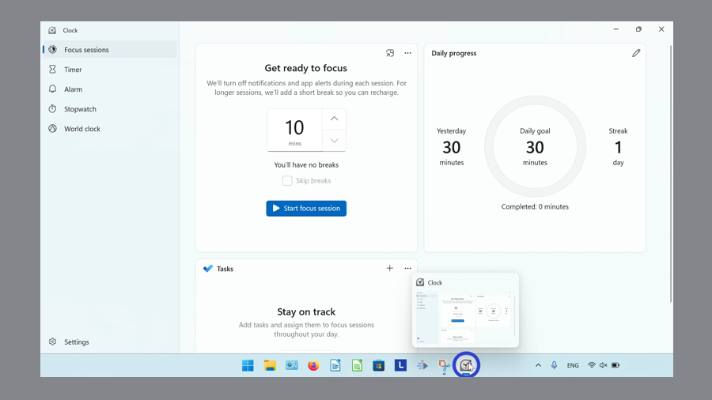
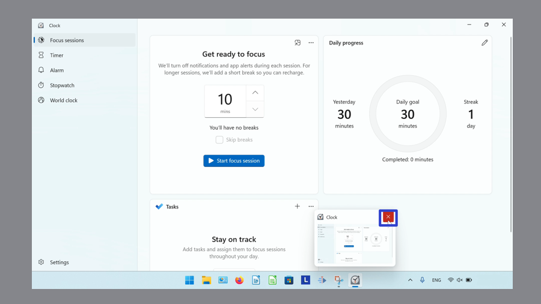
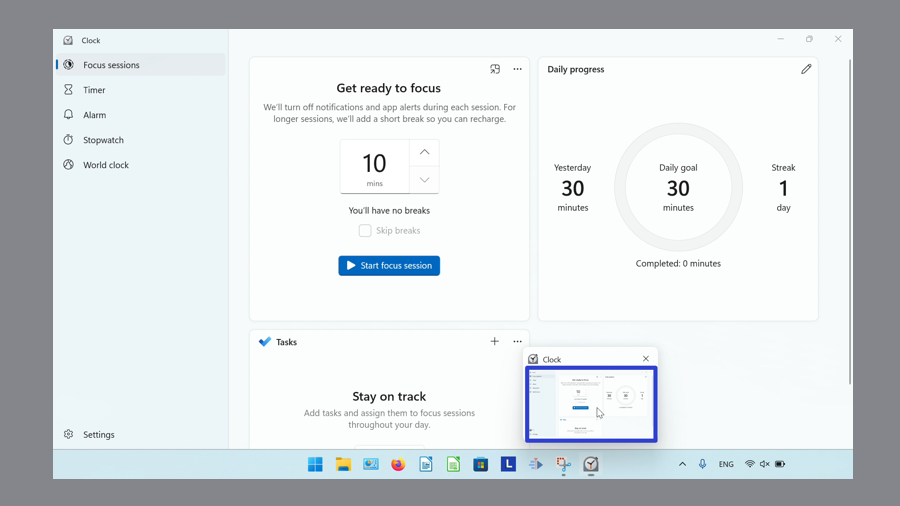
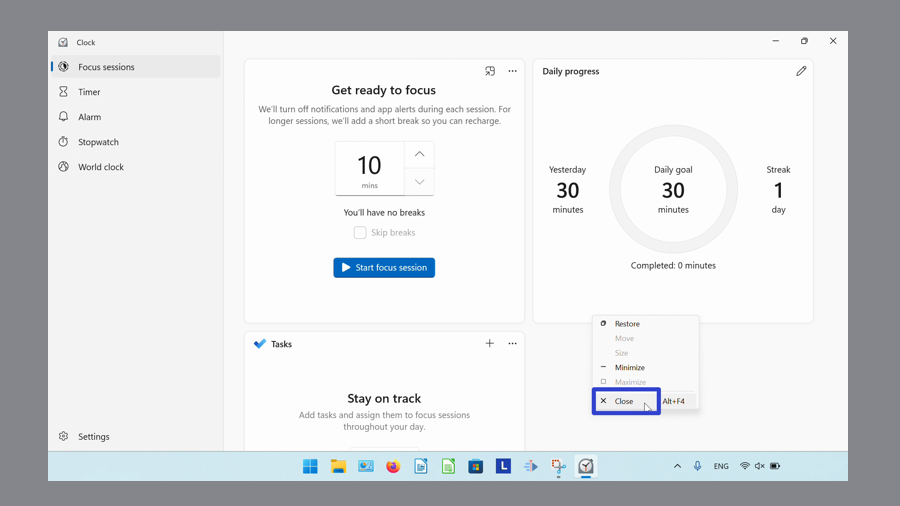
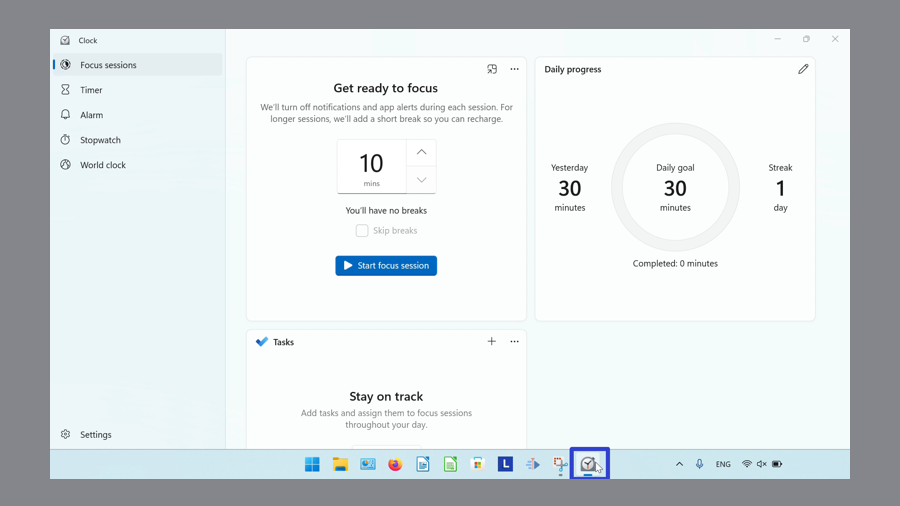
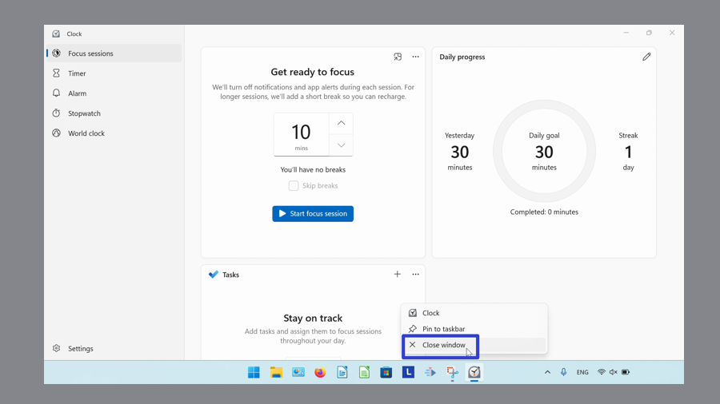
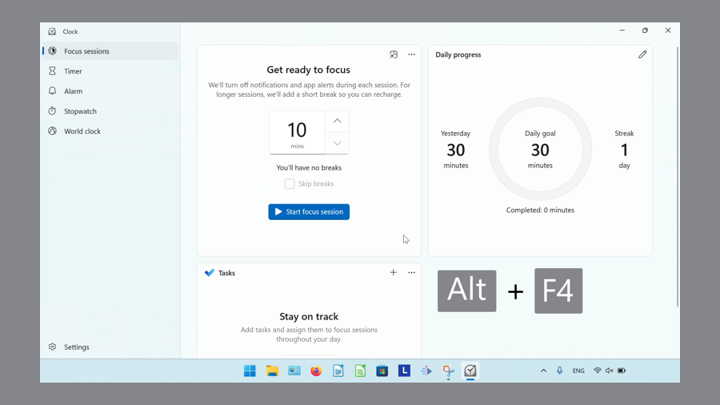

This tutorial covers:

## How to Close the Microsoft Windows Clock:
1. [With Click](#1)
2. [With Hover](#2)
3. [With Menu](#3)
4. [With Right Click](#4)
5. [With Keyboard Shortcut](#5)

No time to scroll down? Click through this tutorial presentation:

<iframe src="https://docs.google.com/presentation/d/1SYz1ip0HcDwZ5wj_qVPDyv3QLKZr_hePhlfJDilb5Tg/embed?start=false&loop=false&delayms=3000" frameborder="0" width="480" height="299" allowfullscreen="true" mozallowfullscreen="true" webkitallowfullscreen="true"></iframe>

 

Watch a tutorial video:
<iframe class="BLOG_video_class" allowfullscreen="" youtube-src-id="pGn0MPo3f1U" width="100%" height="416" src="https://www.youtube.com/embed/pGn0MPo3f1U"></iframe>

 

<h1 id="1">How to Close the Microsoft Windows Clock With Click</h1>

* Step 1: First [open](https://qhtutorials.github.io/posts/how-to-open-microsoft-windows-clock/) Windows Clock. In the upper right corner, click the "Close" or "X" button. 

* The Windows Clock app closes. 

<h1 id="2">How to Close the Microsoft Windows Clock With Hover</h1>

* Step 1: [Open](https://qhtutorials.github.io/posts/how-to-open-microsoft-windows-clock/) Windows Clock. Go down to the taskbar and hover the mouse over the Windows Clock app icon. 

* Step 2: In the upper right of the small window that appears, click the "Close" or "X" button. 

* The Windows Clock app closes. 

<h1 id="3">How to Close the Microsoft Windows Clock With Menu</h1>

* Step 1: First [open](https://qhtutorials.github.io/posts/how-to-open-microsoft-windows-clock/) Windows Clock. Go down to the taskbar and hover the mouse over the Windows Clock app icon. 

* Step 2: Right click the small window that appears. 

* Step 3: In the menu that opens, click "Close". 

* The Windows Clock app closes. 

<h1 id="4">How to Close the Microsoft Windows Clock With Right Click</h1>

* Step 1: [Open](https://qhtutorials.github.io/posts/how-to-open-microsoft-windows-clock/) Windows Clock. Go down to the taskbar and right click the Windows Clock app icon. 

* Step 2: In the menu that opens, click "Close window". 

* The Windows Clock app closes. 

<h1 id="5">How to Close the Microsoft Windows Clock With Keyboard Shortcut</h1>

* Step 1: First [open](https://qhtutorials.github.io/posts/how-to-open-microsoft-windows-clock/) Windows Clock. On the keyboard press **Alt + F4** (some computers accept this shortcut as **Fn + Alt + F4**). 

* The Windows Clock app closes. 

Keep a copy of these instructions for later with this free [PDF tutorial](https://drive.google.com/file/d/1EYmzLwrXSjfVwZDsIB_kZMDPy31qn-h8/view?usp=sharing).

 

