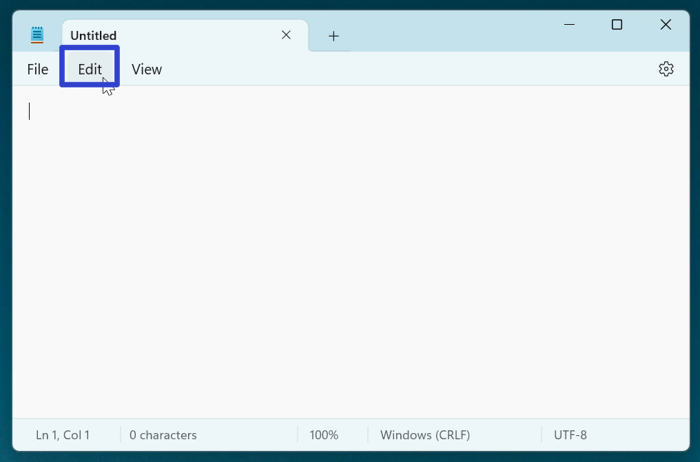
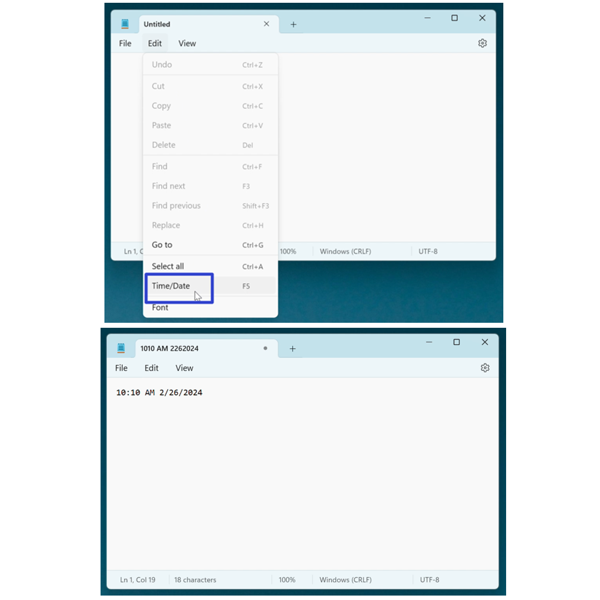
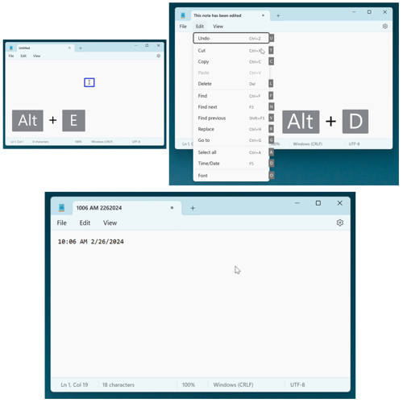
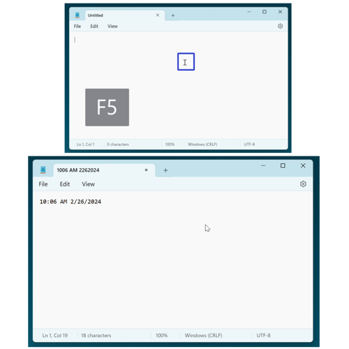
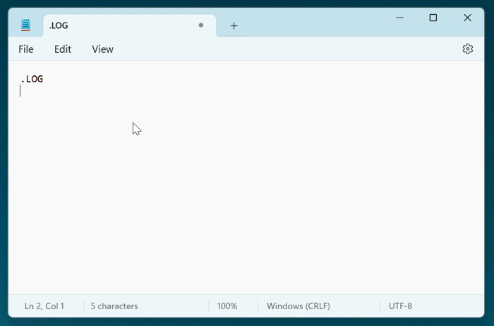
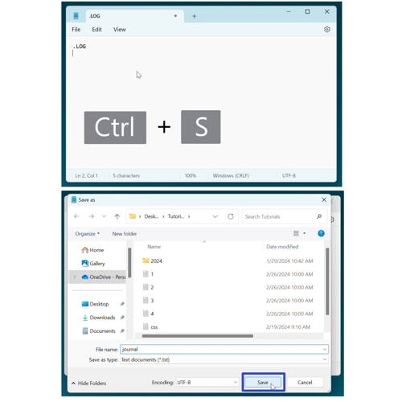
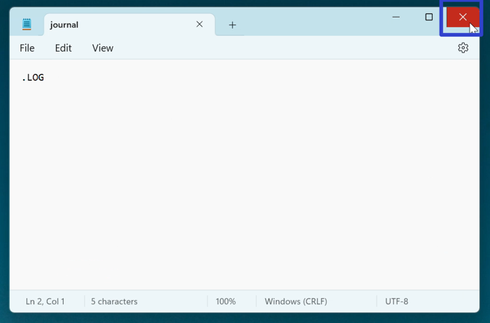
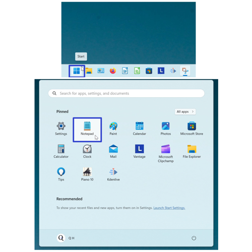
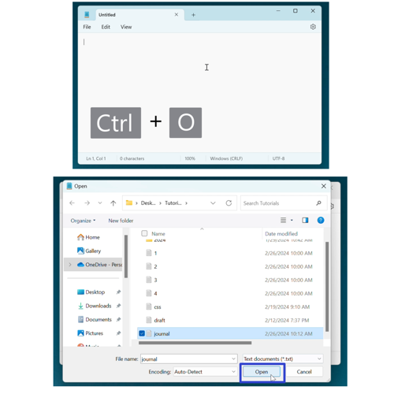
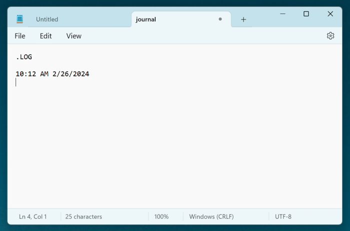

This tutorial covers:

## How to Create a Log in Notepad:
1. [With Menu](#1)
2. [With Keyboard Shortcuts](#2)
3. [With Code](#3)

 

No time to scroll down? Click through this presentation tutorial:

<iframe src="https://docs.google.com/presentation/d/e/2PACX-1vSqwi1ywxN7TaYWWhjyGr9D5KzgWtJ133vyJ_rOyKjG_IWemOLTyWGNRDkTy5ffBd-VEihRCUmhcuP8/embed?start=false&loop=false&delayms=3000" frameborder="0" width="480" height="299" allowfullscreen="true" mozallowfullscreen="true" webkitallowfullscreen="true"></iframe>

 

Watch a tutorial video:
<iframe class="BLOG_video_class" allowfullscreen="" youtube-src-id="8eC8KD8pAEQ" width="100%" height="416" src="https://www.youtube.com/embed/8eC8KD8pAEQ"></iframe>

<h1 id="1">How to Create a Log in Notepad With Menu</h1>

* Step 1: First [open](https://qhtutorials.github.io/posts/how-to-open-notepad/) a Notepad window. In the upper left click the "Edit" button. 

* Step 2: In the menu that opens, click "Time/Date". Notepad inserts the current time and date into the document. 

<h1 id="2">How to Create a Log in Notepad With Keyboard Shortcuts</h1>

* Method 1: [Open](https://qhtutorials.github.io/posts/how-to-open-notepad/) a Notepad window. On the keyboard press **Alt + E + Alt + D**. Notepad inserts the current time and date into the document. 

* Method 2: First [open](https://qhtutorials.github.io/posts/how-to-open-notepad/) a Notepad window. On the keyboard press **F5** or **Fn + F5**. Notepad inserts the current time and date into the document. 

<h1 id="3">How to Create a Log in Notepad With Code</h1>

* Step 1: [Open](https://qhtutorials.github.io/posts/how-to-open-notepad/) a Notepad window. Click inside the window, type ".LOG", and press **Enter**. 

* Step 2: Press **Ctrl + S**. In the "Save as" window that opens, type any text to name the file and click the "Save" button. 

* Step 3: Click the "Close" or "X" button in the upper right of the Notepad window. 

* Step 4: Reopen Notepad. For example, go down to the taskbar and click the Start (four blue squares) button, then click the pinned Notepad app icon. 

* Step 5: In the Notepad window that opens, press **Ctrl + O**, then select the file you saved in step 2 and click "Open". 

* Whenever this file is opened, Notepad adds the current time and date to the document. 

Refer to these instructions later with this free [PDF tutorial](https://drive.google.com/file/d/1rcsYsrFcMdNPEfTWYriwTol3XP1Tpsyw/view?usp=sharing).

 

