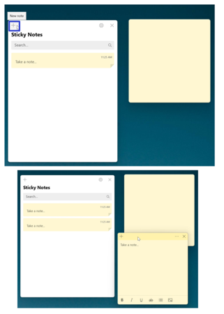
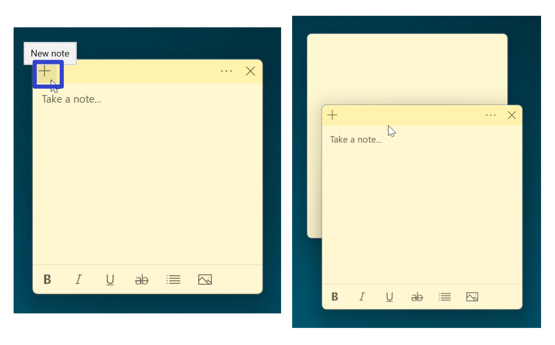
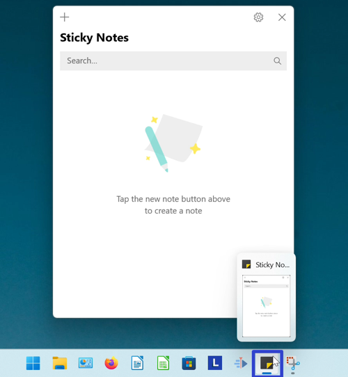
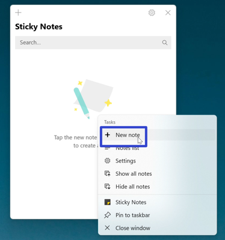
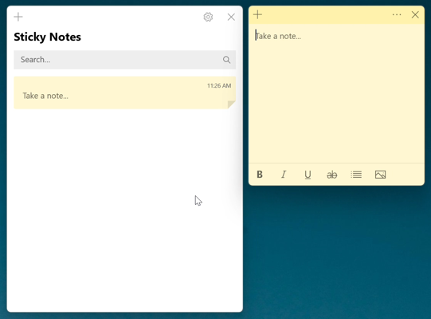
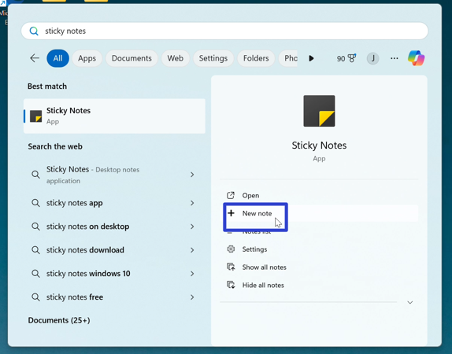
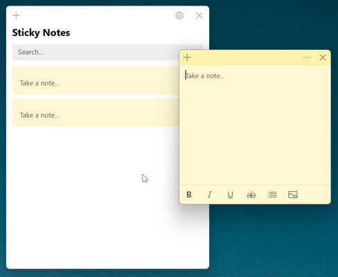
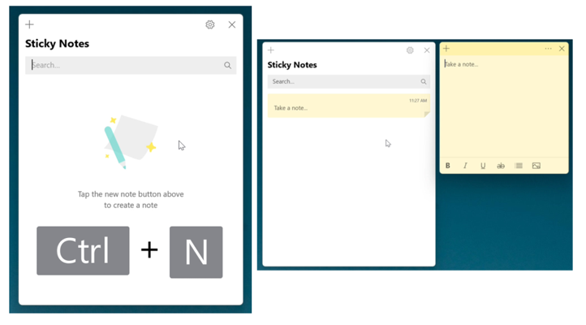
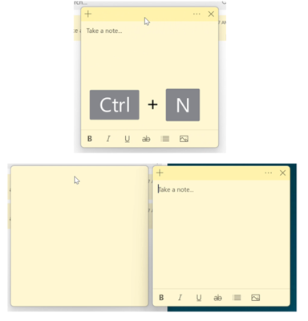

This tutorial covers:

### How to Create a Sticky Note:
1. [With Click](#1)
2. [With Right Click](#2)
3. [With Search](#3)
4. [With Keyboard Shortcut](#4)

 

No time to scroll down? Click through this tutorial presentation:

<iframe src="https://docs.google.com/presentation/d/e/2PACX-1vT4riK9rb25KZo9gU6OnfNKB5_LugJ897VZf9Ct_QR-jbQJogycdj-luoQjJTaZ6SE4beNGFf8Zp4Y7/embed?start=false&loop=false&delayms=3000" frameborder="0" width="480" height="299" allowfullscreen="true" mozallowfullscreen="true" webkitallowfullscreen="true"></iframe>

 

Watch a video tutorial:
<iframe class="BLOG_video_class" allowfullscreen="" youtube-src-id="7nW3REmZ6nE" width="100%" height="416" src="https://www.youtube.com/embed/7nW3REmZ6nE"></iframe>

<h1 id="1">How to Create a Sticky Note With Click</h1>

* Method 1: First [open](https://qhtutorials.github.io/posts/how-to-open-notes-list/) the Notes List. Go to the upper left corner and click the "New note" or "+" button. A new sticky note appears. 

* Method 2: [Open](https://qhtutorioals.github.io/posts/how-to-open-a-sticky-note/) a sticky note. Go to the upper left corner and click the "New note" or "+" button. A new sticky note appears. 

<h1 id="2">How to Create a Sticky Note With Right Click</h1>

* Step 1: First [open](https://qhtutorials.github.io/posts/how-to-open-sticky-notes/) or [pin](https://qhtutorials.github.io/posts/how-to-pin-sticky-notes/) the Sticky Notes app. Go down to the taskbar and right click the Sticky Notes app icon. 

* Step 2: In the menu that opens, click "+ New note". 

* A new sticky note appears. 

<h1 id="3">How to Create a Sticky Note With Search</h1>

* Step 1: Go down to the taskbar and click the Start (four blue squares) button. 

* Step 2: In the Start window that opens, click the top search bar and type "sticky notes". 

* Step 3: On the search results screen, click "+ New note". 

* Step 4: A new sticky note appears. 

<h1 id="4">How to Create a Sticky Note With Keyboard Shortcut</h1>

* Method 1: First [open](https://qhtutorials.github.io/posts/how-to-open-notes-list/) the Notes List. Click the Notes List, and on the keyboard press **Ctrl + N**. A new sticky note appears. 

* Method 2: [Open](https://qhtutorials.github.io/posts/how-to-open-a-sticky-note/) a sticky note. Click the sticky note and on the keyboard press **Ctrl + N**. A new sticky note appears. 

Refer to these instructions later with this free [PDF tutorial](https://drive.google.com/file/d/1Q8pZbaQ-W9rVCz559d_9Gcr-b9gX0PFN/view?usp=sharing).

 

