This tutorial covers:

## How to Minimize Whiteboard:
1. [With Click](#1)
2. [With Menu](#2)
3. [With Keyboard](#3)

## How to Maximize Whiteboard:
1. [With Click](#4)
2. [With Double Click](#5)
3. [With Menu](#6)
4. [With Keyboard](#7)

## How to Restore Whiteboard:
1. [With Click](#8)
2. [With Double Click](#9)
3. [With Menu](#10)
4. [With Keyboard](#11)

## How to Resize Whiteboard:
1. [With Mouse](#12)
2. [With Menu](#13)
3. [With Keyboard](#14)

## How to Move Whiteboard:
1. [With Mouse](#15)
2. [With Menu](#16)
3. [With Keyboard](#17)

No time to scroll down? Click through these tutorial slides:

<iframe src="https://docs.google.com/presentation/d/e/2PACX-1vRaBQst7uar9fq1xmohFf9haOfQ7SZ4yS5oGrit68i8okWJ0Maxb8g0j-cgOlZz79IBcZxFzYT5kiFd/embed?start=false&loop=false&delayms=3000" frameborder="0" width="480" height="299" allowfullscreen="true" mozallowfullscreen="true" webkitallowfullscreen="true"></iframe>

 

See a tutorial video:
<iframe class="BLOG_video_class" allowfullscreen="" youtube-src-id="PacF4oACc-M" width="100%" height="416" src="https://www.youtube.com/embed/PacF4oACc-M"></iframe>

 

<h1 id="1">How to Minimize Whiteboard With Click</h1>

* Step 1: First [open](https://qhtutorials.github.io/posts/how-to-open-microsoft-whiteboard/) Microsoft Whiteboard. In the upper right click the "Minimize" or "-" button. 
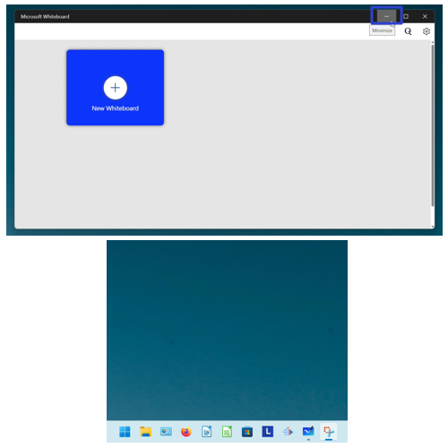

<h1 id="2">How to Minimize Whiteboard With Menu</h1>

* Step 1: [Open](https://qhtutorials.github.io/posts/how-to-open-microsoft-whiteboard/) Microsoft whiteboard. Go down to the taskbar and hover the mouse over the Microsoft Whiteboard app icon. 

* Step 2: Right click the small window that appears. 
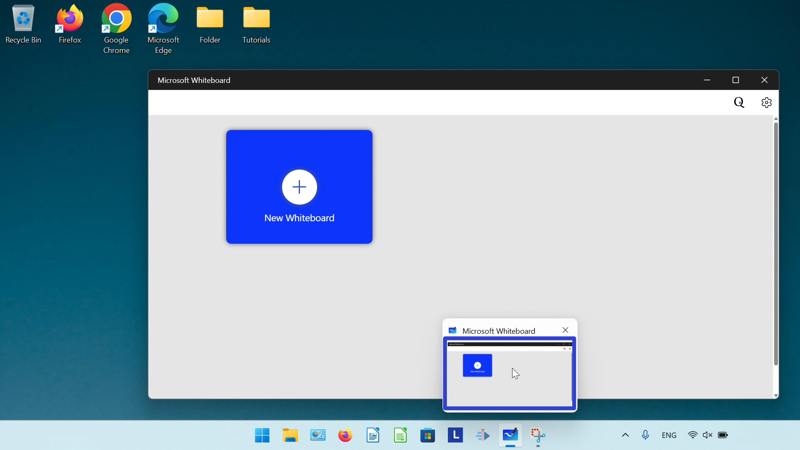

* Step 3: In the menu that opens, click "Minimize". 
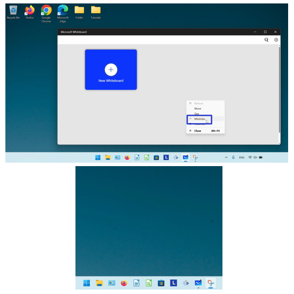

<h1 id="3">How to Minimize Whiteboard With Keyboard</h1>

* Step 1: First [open](https://qhtutorials.github.io/posts/how-to-open-microsoft-whiteboard/) Microsoft Whiteboard, and on the keyboard press the **Tab** key. 
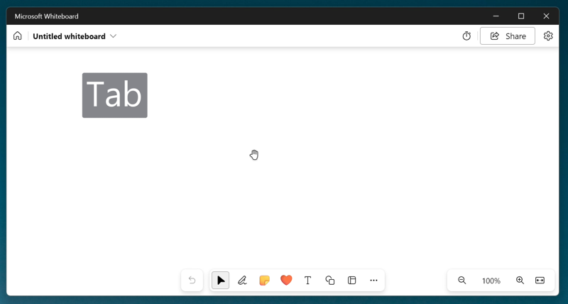

* Step 2: Press the **Alt** key, then press the **Enter** key. 
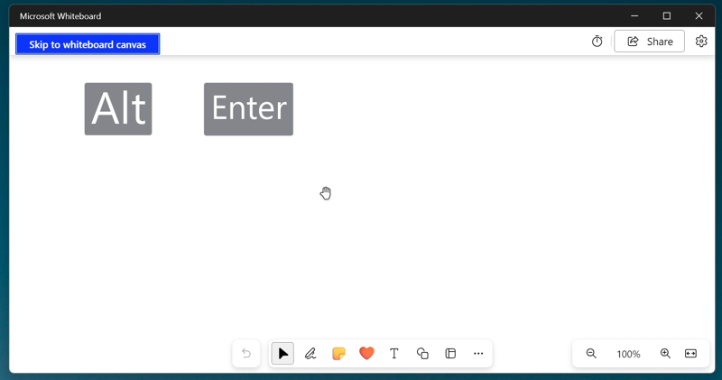

* Step 3: In the menu that opens, press the **down arrow** key and on the "Minimze" option press **Enter**. 

<h1 id="4">How to Maximize Whiteboard With Click</h1>

* Step 1: [Open](https://qhtutorials.github.io/posts/how-to-open-microsoft-whiteboard/) Microsoft Whiteboard. In the upper right click the "Maximize" button. 
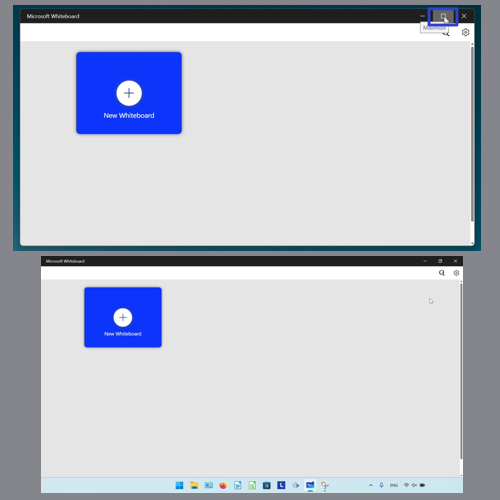

<h1 id="5">How to Maximize Whiteboard With Double Click</h1>

* Step 1: First [open](https://qhtutorials.github.io/posts/how-to-open-microsoft-whiteboard/) Microsoft Whiteboard. Double click the top of the window. 
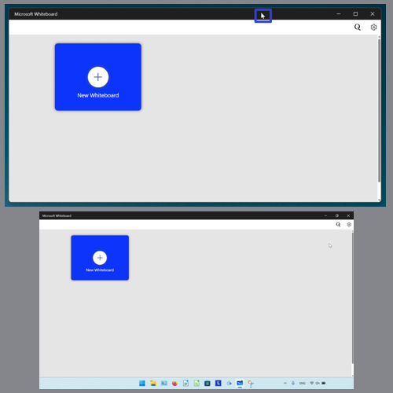

<h1 id="6">How to Maximize Whiteboard With Menu</h1>

* Step 1: [Open](https://qhtutorials.github.io/posts/how-to-open-microsoft-whiteboard) Microsoft Whiteboard. Go down to the taskbar and hover the mouse over the Whiteboard app icon. 

* Step 2: Right click the small window that appears. 

* Step 3: In the menu that opens, click "Maximize". 
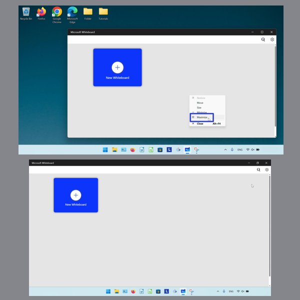

<h1 id="7">How to Maximize Whiteboard With Keyboard</h1>

* Step 1: First [open](https://qhtutorials.github.io/posts/how-to-open-microsoft-whiteboard). a whiteboard, and on the keyboard press the **Tab** key. 

* Step 2: Press the **Alt** key, then press the **Enter** key. 

* Step 3: In the menu that opens, press the **down arrow** key and on the "Maximize" option press **Enter**. 
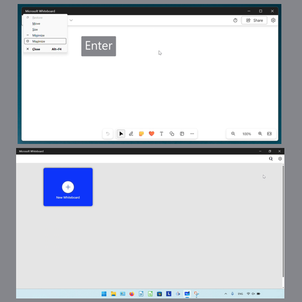

<h1 id="8">How to Restore Whiteboard With Click</h1>

* Step 1: [Maximize](#4) the Microsoft Whiteboard window. In the upper right click the "Maximize" button. 
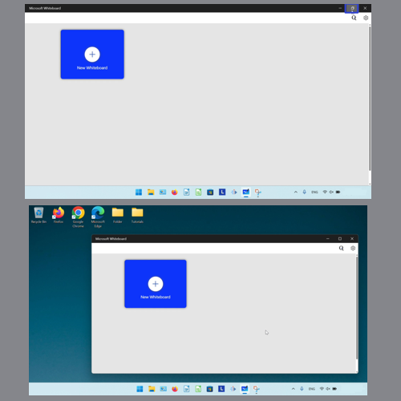

<h1 id="9">How to Restore Whiteboard With Double Click</h1>

* Step 1: First [maximize](#4) the Microsoft Whiteboard window. Double click the top of the window. 
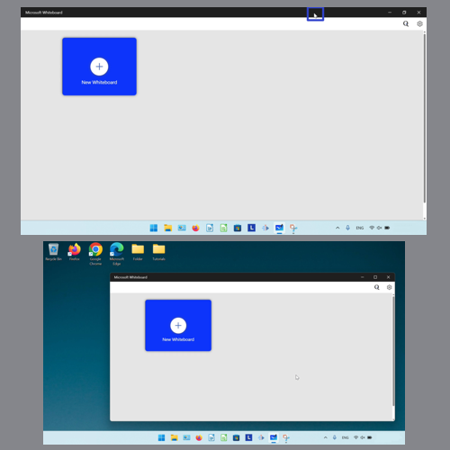

<h1 id="10">How to Restore Whiteboard With Menu</h1>

* Step 1: [Maximize](#4) the Microsoft Whiteboard window. Go down to the taskbar and hover the mouse over the Whiteboard app icon. 
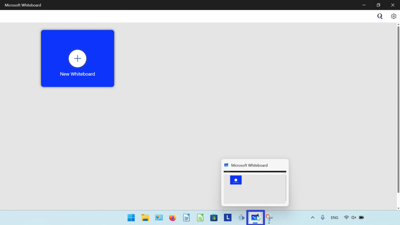

* Step 2: Right click the small window that appears. 

* Step 3: In the menu that opens, click "Restore". 
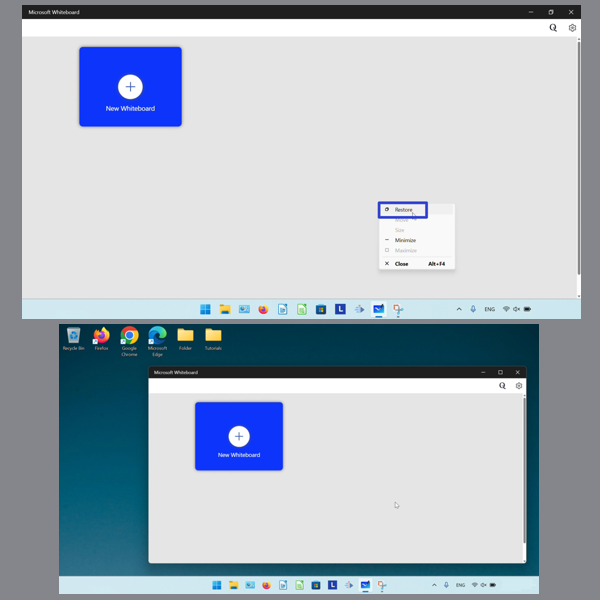

<h1 id="11">How to Restore Whiteboard With Keyboard</h1>

* Step 1: First [maximize](#4) the Microsoft Whiteboard window. On the keyboard press the **Tab** key. 
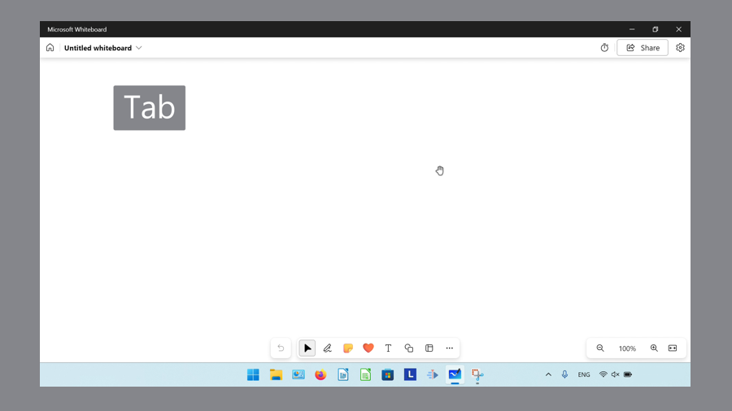

* Step 2: Press **Alt**, then press **Enter**. 
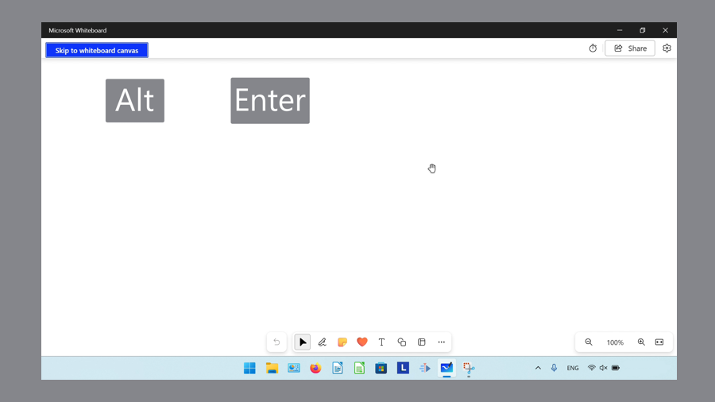

* Step 3: In the menu that opens, press the **Enter** key on the "Restore" option. 
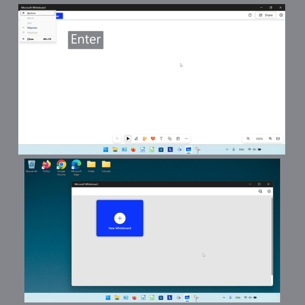

<h1 id="12">How to Resize Whiteboard With Mouse</h1>

* Step 1: [Open](https://qhtutorials.github.io/posts/how-to-open-microsoft-whiteboard/) the Microsoft Whiteboard window. Hover the mouse over any edge or corner of the window, until the cursor becomes a double sided arrow. 
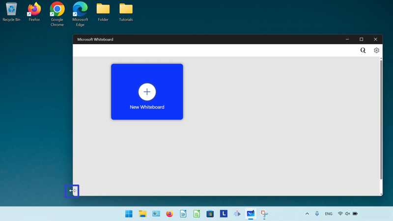

* Step 2: Click, hold, and drag to resize the window. Release the mouse to stop resizing the window. 
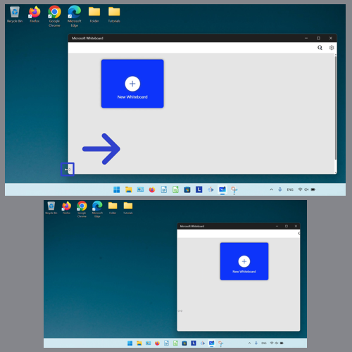

<h1 id="13">How to Resize Whiteboard With Menu</h1>

* Step 1: First [open](https://qhtutorials.github.io/posts/how-to-open-microsoft-whiteboard/) the Microsoft Whiteboard window. Go down to the taskbar and hover the mouse over the Microsoft Whiteboard app icon. 

* Step 2: Right click the small window that appears. 

* Step 3: In the menu that opens, click "Size". 
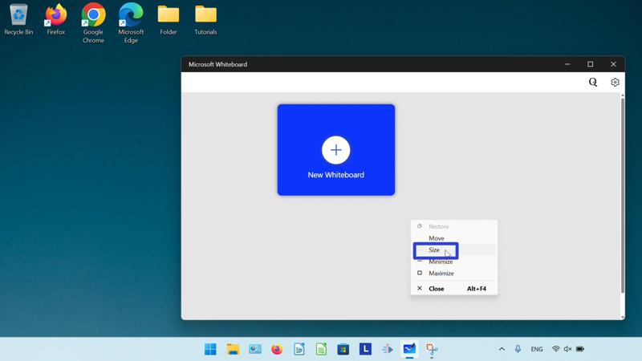

* Step 4: At the top of the Whiteboard window, click, hold, and drag the four arrows cursor to resize the window. Release the mouse to stop resizing the window. 
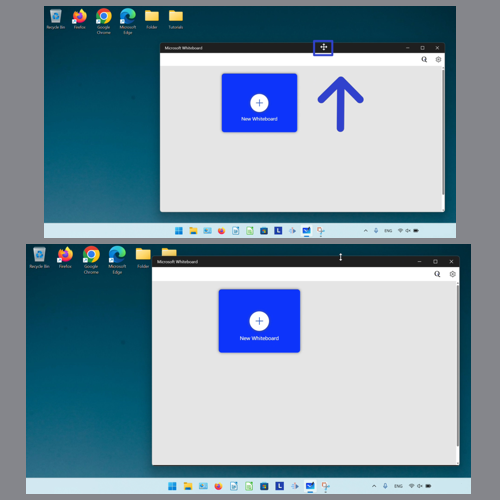

<h1 id="14">How to Resize Whiteboard With Keyboard</h1>

* Step 1: [Open](https://qhtutorials.github.io/posts/how-to-open-microsoft-whiteboard/) a whiteboard, and on the keyboard press the **Tab** key. 

* Step 2: Press the **Alt** key, then press the **Enter** key. 

* Step 3: In the menu that opens, click "Size". 
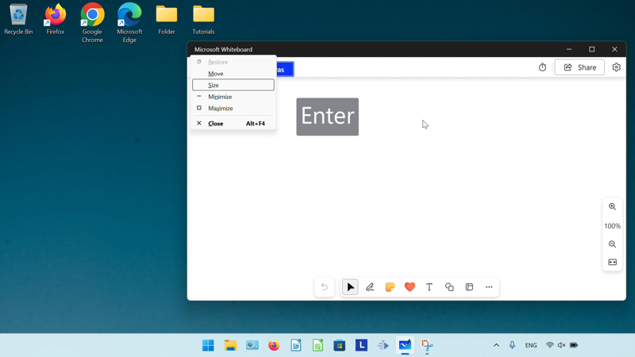

* Step 4: At the top of the Whiteboard window, click, hold, and drag the four arrows cursor to resize the window. Release the mouse to stop resizing the window. 

<h1 id="15">How to Move Whiteboard With Mouse</h1>

* Step 1: First [open](https://qhtutorials.github.io/posts/how-to-open-microsoft-whiteboard/) the Microsoft Whiteboard window. Click, hold, and drag the top of the window to move it. Release the mouse to stop moving the window. 
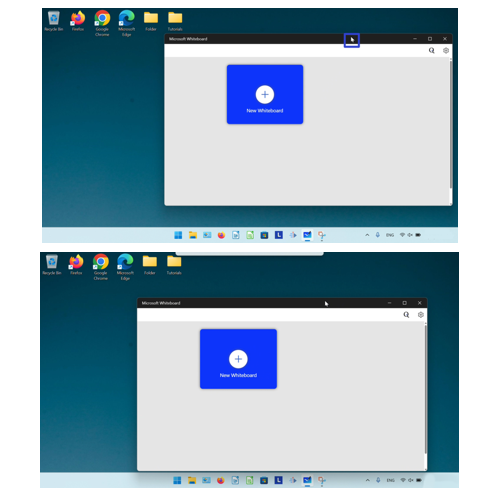

<h1 id="16">How to Move Whiteboard With Menu</h1>

* Step 1: [Open](https://qhtutorials.github.io/posts/how-to-open-microsoft-whiteboard/) the Microsoft Whiteboard window. Go down to the taskbar and hover the mouse over the Microsoft Whiteboard app icon. 

* Step 2: Right click the small window that appears. 

* Step 3: In the menu that opens, click "Move". 
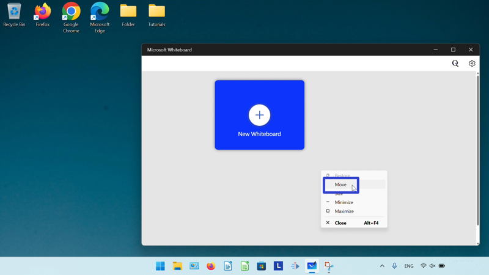

* Step 4: At the top of the window, click, hold, and drag the mouse to move the window. Release the mouse to stop moving the window. 
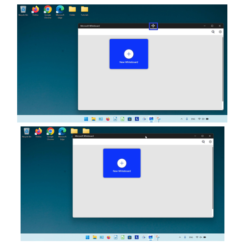

<h1 id="17">How to Move Whiteboard With Keyboard</h1>

* Step 1: First [open](https://qhtutorials.github.io/posts/how-to-open-microsoft-whiteboard/) the Microsoft Whiteboard window. On the keyboard press the **Tab** key. 

* Step 2: Press the **Alt** key, then press the **Enter** key. 

* Step 3: In the menu that opens, press the **down arrow** key and on the "Move" option press **Enter**. 
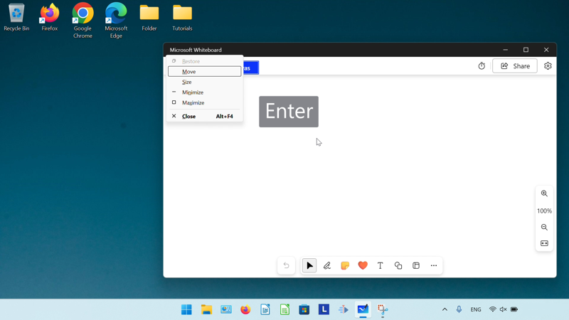

* Step 4: At the top of the window, click, hold, and drag the mouse to move the window. Release the mouse to stop moving the window. 

Save these instructions for later with this free [PDF tutorial](https://drive.google.com/file/d/1gnZp6KpihRYnwfB_z-kZQQk4OkmbIhMJ/view?usp=sharing).

 

