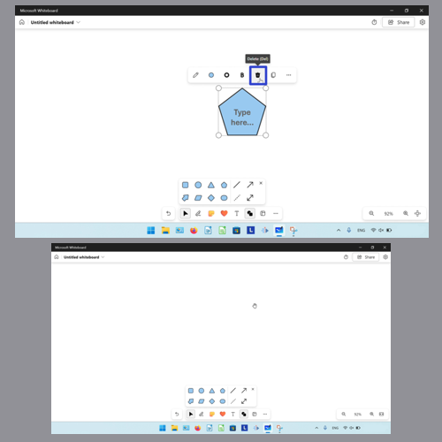
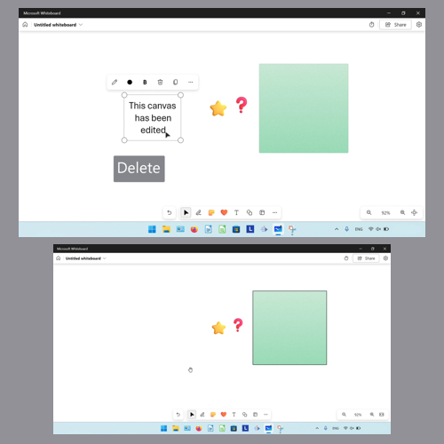
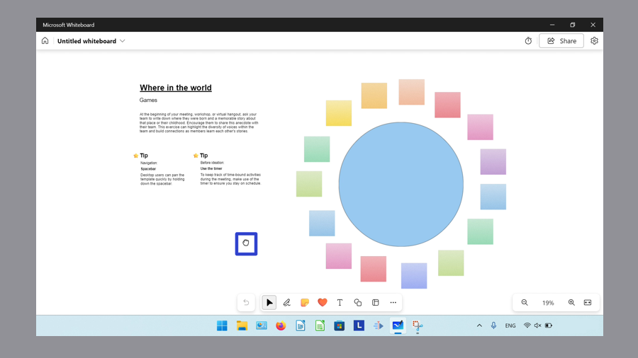
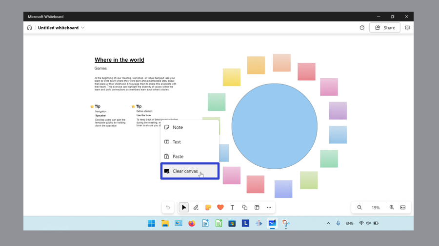
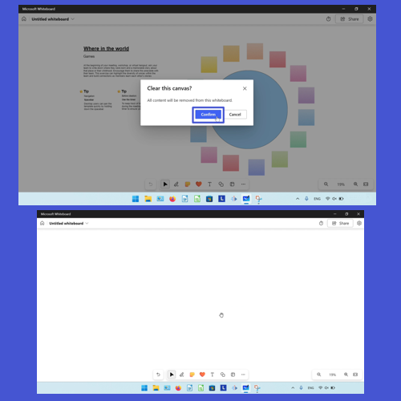
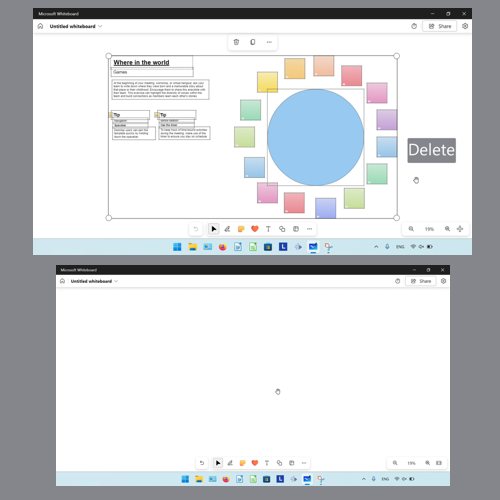

This tutorial covers:

## How to Delete an Object:
1. [With Click](#1)
2. [With Keyboard Shortcut](#2)

## How to Delete All Objects:
1. [With Right Click](#3)
2. [With Keyboard Shortcut](#4)

No time to scroll down? Click through this presentation tutorial:

<iframe src="https://docs.google.com/presentation/d/1Gll25rMk11HfZHe3OszYiqxz152r7XyaG8u_nAwW_iw/embed?start=false&loop=false&delayms=3000" frameborder="0" width="480" height="299" allowfullscreen="true" mozallowfullscreen="true" webkitallowfullscreen="true"></iframe>

 

Watch a tutorial video:
<iframe class="BLOG_video_class" allowfullscreen="" youtube-src-id="KryhNAhSYOQ" width="100%" height="416" src="https://www.youtube.com/embed/KryhNAhSYOQ"></iframe>

 

<h1 id="1">How to Delete an Object With Click</h1>

* Step 1: First [select](https://qhtutorials.github.io/posts/how-to-edit-objects-in-whiteboard/) an object. In the menu that opens, click the "Delete" or trash can button. 

<h1 id="2">How to Delete an Object With Keyboard Shortcut</h1>

* Step 1: [Select](https://qhtutorials.github.io/posts/how-to-edit-objects-in-whiteboard/) an object. On the keyboard press **Delete**. 

<h1 id="3">How to Delete All Objects With Right Click</h1>

* Step 1: In a whiteboard with multiple objects, right click anywhere on the canvas. In the menu that opens, click the "More" or "..." button. 

* Step 2: In the menu that opens, click "Clear canvas". 

* Step 3: In the window that opens, click "Confirm". 

<h1 id="4">How to Delete All Objects With Keyboard Shortcut</h1>

* Step 1: On the keyboard press **Ctrl + A** to select all objects. Then press **Delete**. 

Keep a copy of these instructions for later with this free [PDF tutorial](https://drive.google.com/file/d/1zle_KRT5dkLyj68ntaPFbjoB9dowOFRS/view?usp=sharing).

 

