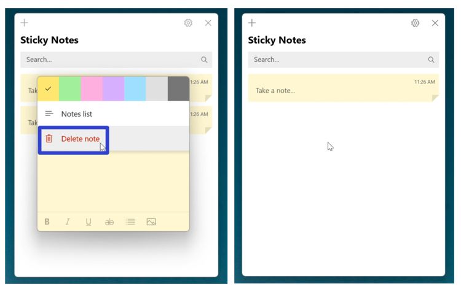
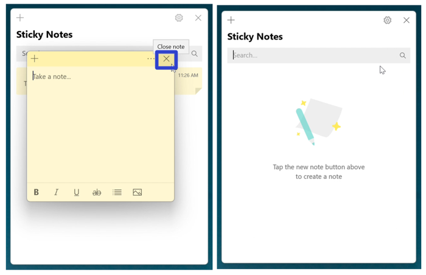
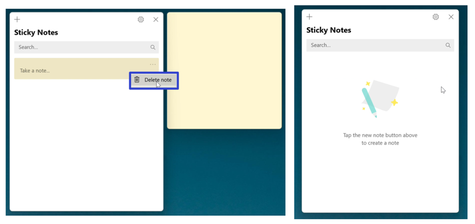
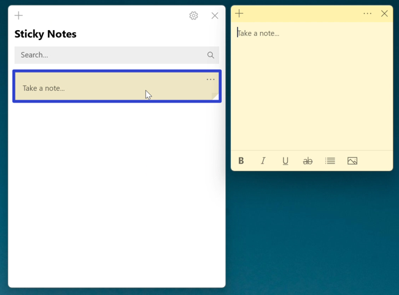
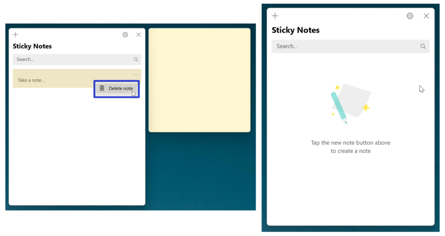
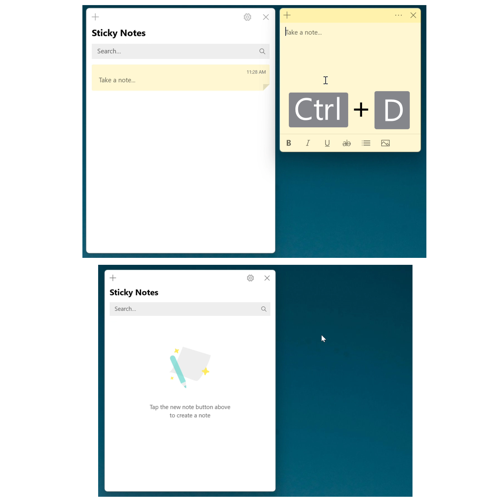

This tutorial covers:

## How to Delete a Sticky Note:
1. [With Menu](#1)
2. [With Click](#2)
3. [From the Notes List](#3)
4. [With Right Click](#4)
5. [With Keyboard Shortcut](#5)

 

No time to scroll down? Click through these tutorial slides:

<iframe src="https://docs.google.com/presentation/d/e/2PACX-1vRNEfroYRWUVSLXeN9H0kWkjMYg2YOrlLAD3KQQBziwwXFuaJ1zMtNcGXWp-TDeCHKpGCg6oOV0MItZ/embed?start=false&loop=false&delayms=3000" frameborder="0" width="480" height="299" allowfullscreen="true" mozallowfullscreen="true" webkitallowfullscreen="true"></iframe>

 

Follow along with a video tutorial:
<iframe class="BLOG_video_class" allowfullscreen="" youtube-src-id="eqC6Mbk2a7w" width="100%" height="416" src="https://www.youtube.com/embed/eqC6Mbk2a7w"></iframe>

<h1 id="1">How to Delete a Sticky Note With Menu</h1>

* Step 1: First [open](https://qhtutorials.github.io/posts/how-to-open-a-sticky-note/) a sticky note. Go to the upper right and click the "Menu" or "..." button. 

* Step 2: In the menu that opens, click "Delete note". 

<h1 id="2">How to Delete a Sticky Note With Click</h1>

* Step 1: [Open](https://qhtutorials.github.io/posts/how-to-open-a-sticky-note/) a sticky note. Go to the upper right corner and click the "Close" or "X" button. 

<h1 id="3">How to Delete a Sticky Note From the Notes List</h1>

* Step 1: First [open](https://qhtutorials.github.io/posts/how-to-open-notes-list/) the Notes List. On a sticky note, click the "Menu" or "..." button. 

* Step 2: In the menu that opens, click "Delete note". 

 

<h1 id="4">How to Delete a Sticky Note With Right Click</h1>

* Step 1: [Open](https://qhtutorials.github.io/posts/how-to-open-notes-list/) the Notes List. Right click a sticky note. 

 
*  Step 2: In the menu that opens, click "Delete note". 

 

<h1 id="5">How to Delete a Sticky Note With Keyboard Shortcut</h1>

* Step 1: First [open](https://qhtutorials.github.io/posts/how-to-open-a-sticky-note/) a sticky note. On the keyboard press **Ctrl + D**. 

Refer to these instructions later with this free [tutorial PDF](https://drive.google.com/file/d/1f_ddkuNn-fqZlZEa8vW_XKXIyp684Mp1/view?usp=sharing).

 

