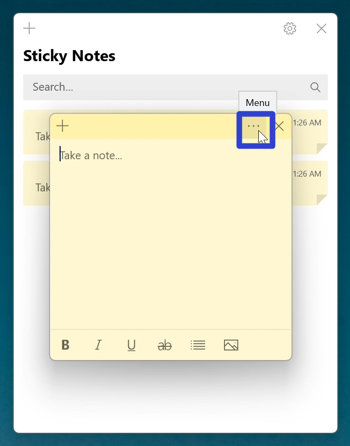
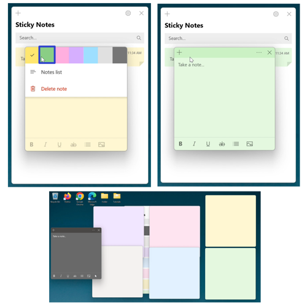
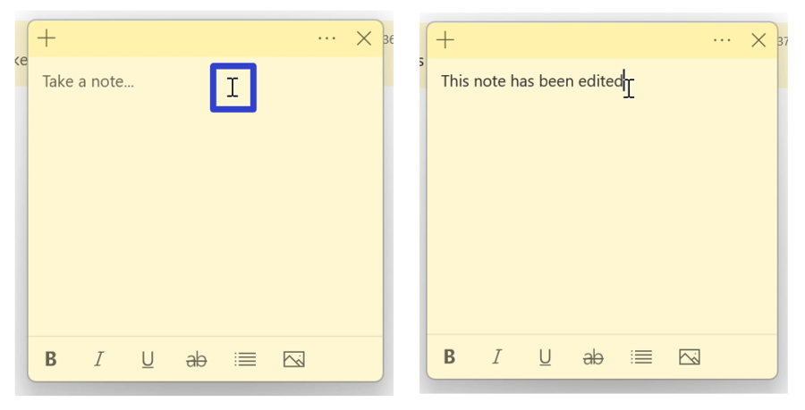
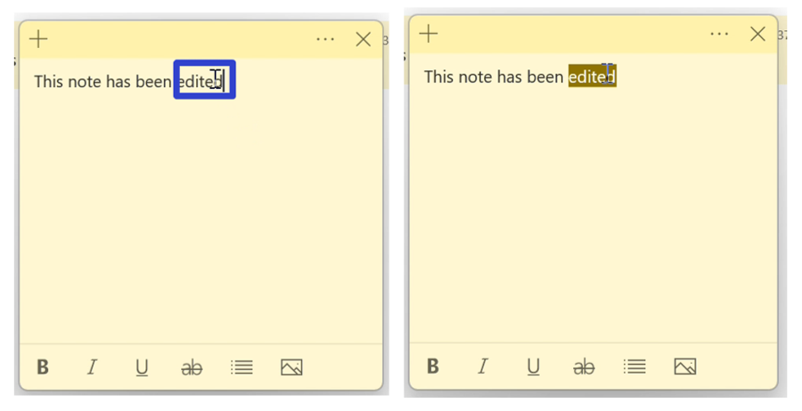
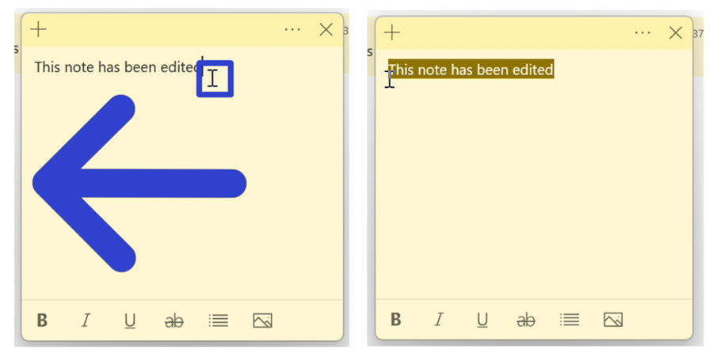
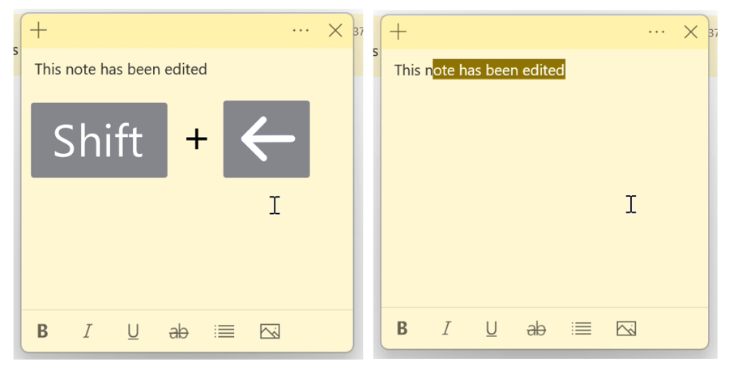
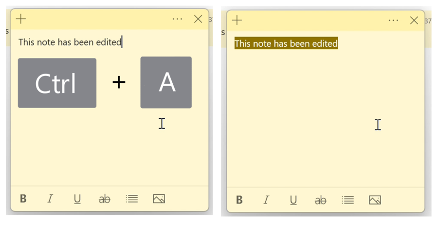
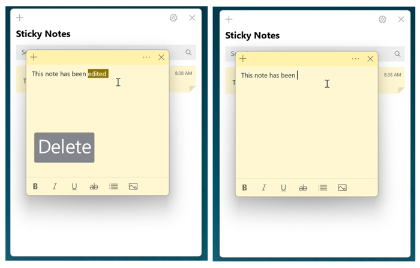
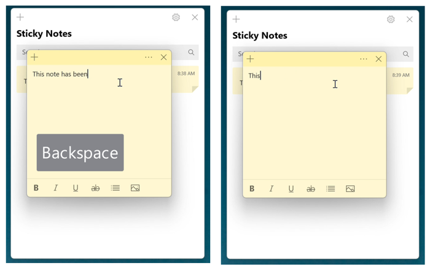

This tutorial covers:

1. [How to Change the Color of a Sticky Note](#1)
2. [How to Edit Text in a Sticky Note](#2)
3. How to Select Text in a Sticky Note:
    * [With Double Click](#3)
    * [With Mouse](#4)
    * [With Keyboard](#5)
    * [With Keyboard Shortcut](#6)
4. [How to Delete Text in a Sticky Note](#7)

 

No time to scroll down? Click through this presentation tutorial:

<iframe src="https://docs.google.com/presentation/d/e/2PACX-1vTa-yqIxQLdLVBg0yFe7Krjr_WUe4qqaNgj4e9nrOrJrZfYnmtJOPyIK3mbopt98WEDBa4B1bjO0-_O/embed?start=false&loop=false&delayms=3000" frameborder="0" width="480" height="299" allowfullscreen="true" mozallowfullscreen="true" webkitallowfullscreen="true"></iframe>

 

See a tutorial video:
<iframe class="BLOG_video_class" allowfullscreen="" youtube-src-id="5qCKiWC0jc8" width="100%" height="416" src="https://www.youtube.com/embed/5qCKiWC0jc8"></iframe>

<h1 id="1">How to Change the Color of a Sticky Note</h1>

* Step 1: First [open](https://qhtutorials.github.io/posts/how-to-open-a-sticky-note/) a sticky note. Go to the upper right and click the "Menu" or "..." button. 

* Step 2: In the menu that opens, click one of the colors at the top to switch to that color. 

<h1 id="2">How to Edit Text in a Sticky Note</h1>

* Step 1: [Open](https://qhtutorials.github.io/posts/how-to-open-a-sticky-note/) a sticky note. Click the sticky note and type any text. 

<h1 id="3">How to Select Text in a Sticky Note With Double Click</h1>

* Step 1: First [edit](#2) a sticky note. Double click any text to select it. 

<h1 id="4">How to Select Text in a Sticky Note With Mouse</h1>

* Step 1: [Edit](#2) a sticky note. Click, hold, and drag the mouse to the left or right of the text to select it. Release the mouse to stop selecting the text. 

<h1 id="5">How to Select Text in a Sticky Note With Keyboard</h1>

* Step 1: First [edit](#2) a sticky note. Click the sticky note, and on the keyboard hold **Shift** and press the **arrow keys** to select the text. 

<h1 id="6">How to Select All Text in a Sticky Note With Keyboard Shortcut</h1>

* Step 1: [Edit](#2) a sticky note. Click the sticky note, and on the keyboard press **Ctrl + A**. 

<h1 id="7">How to Delete Text in a Sticky Note With Keyboard</h1>

* Method 1: First [edit](#2) a sticky note and [select any text](#4). On the keyboard press **Delete**. 

* Method 2: [Edit](#2) a sticky note. Click to the right of the text, and on the keyboard press or hold **Backspace**. 

Refer to these instructions later with this free [PDF tutorial](https://drive.google.com/file/d/1dtfqxgegar3EprkSWvwAMGOsv4b0FogZ/view?usp=sharing).

 

