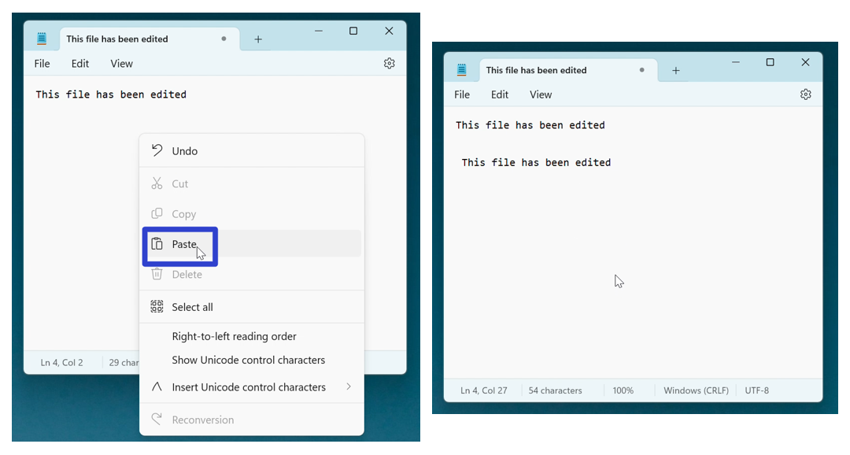

This tutorial covers:

## [How to Edit Text in Notepad](#1)

## [How to Select Text in Notepad:](#2)
1. [With Menu](#3)
2. [With Right Click](#4)
3. [With Keyboard Shortcut](#5)

## How to Copy Text in Notepad:
1. [With Menu](#6)
2. [With Right Click](#7)
3. [With Keyboard Shortcut](#8)

##  How to Cut Text in Notepad:
1. [With Menu](#9)
2. [With Right Click](#10)
3. [With Keyboard Shortcut](#11)

## How to Paste Text in Notepad:
1. [With Menu](#12)
2. [With Right Click](#13)
3. [With Keyboard Shortcut](#14)

## How to Delete Text in Notepad:
1. [With Menu](#15)
2. [With Right Click](#16)
3. [With Keyboard](#17)

 

No time to scroll down? Click through these tutorial slides:

<iframe src="https://docs.google.com/presentation/d/e/2PACX-1vRXrHM_w8wy6BSBpaxoqMaR81pAEGO5wMf8t_eOCO65ey71C6zVWd5DAvtw5YzuQrnyzyNNMz33ry3B/embed?start=false&loop=false&delayms=3000" frameborder="0" width="480" height="299" allowfullscreen="true" mozallowfullscreen="true" webkitallowfullscreen="true"></iframe>

 

See it in action with this tutorial video:
<iframe class="BLOG_video_class" allowfullscreen="" youtube-src-id="nScdx-Ealg0" width="100%" height="416" src="https://www.youtube.com/embed/nScdx-Ealg0"></iframe>

<h1 id="1">How to Edit Text in Notepad</h1>

* Step 1: First [open](https://qhtutorials.github.io/posts/how-to-open-notepad/) Notepad. Click inside a Notepad window or tab, and type any text. 

<h1 id="2">How to Select Text in Notpad</h1>

* Method 1: [Edit](#1) a Notepad file. Double click the text. 

* Method 2: First [edit](#1) a Notepad file. Click, hold, and drag the mouse to the left or right. Release the mouse to stop selecting text. 

* Method 3: [Edit](#1) a Notepad file. Hold **Shift** and press the **arrow keys**. 

<h1 id="3">How to Select Text With Menu</h1>

* Step 1: First [edit](#1) a Notepad file. In the upper left click the "Edit" button. 

* Step 2: In the menu that opens, click "Select all". 

<h1 id="4">How to Select Text With Right Click</h1>

* Step 1: [Edit](#1) a Notepad file. Right click anywhere in the Notepad window. 

* Step 2: In the menu that opens, click "Select all". 

<h1 id="5">How to Select Text With Keyboard Shortcut</h1>

* Step 1: First [edit](#1) a Notepad file. On the keyboard press **Ctrl + A**. 

<h1 id="6">How to Copy Text With Menu</h1>

* Step 1: [Edit](#1) a Notepad file and [select](#2) any text. Click the "Edit" button. 

* Step 2: In the menu that opens, click "Copy". 

<h1 id="7">How to Copy Text With Right Click</h1>

* Step 1: First [edit](#1) and [select](#2) text in a Notepad file. Right click anywhere inside the window. 

* Step 2: In the menu that opens, click "Copy". 

<h1 id="8">How to Copy Text With Keyboard Shortcut</h1>

* Step 1: [Edit](#1) and [select](#2) text in a Notepad file. On the keyboard press **Ctrl + C**. 

<h1 id="9">How to Cut Text With Menu</h1>

* Step 1: First [edit](#1) and [select](#2) text in a Notepad file. Click the "Edit" button. 

* Step 2: In the menu that opens, click "Cut". Notepad copies the selected text and removes it from the window. 

<h1 id="10">How to Cut Text With Right Click</h1>

* Step 1: [Edit](#1) and [select](#2) text in a Notepad file. Right click anywhere in the window. 

* Step 2: In the menu that opens, click "Cut". Notepad copies the selected text and removes it from the window. 

<h1 id="11">How to Cut Text With Keyboard Shortcut</h1>

* Step 1: First [edit](#1) and [select](#2) text in a Notepad file. On the keyboard press **Ctrl + X**. 

<h1 id="12">How to Paste Text With Menu</h1>

* Step 1: [Edit](#1) and [copy](#8) or [cut](#11) text in a Notepad file. Click the "Edit" button. 

* Step 2: In the menu that opens, click "Paste". Notepad pastes the selected text into the window. 

<h1 id="13">How to Paste Text With Right Click</h1>

* Step 1: First [edit](#1) and [copy](#8) or [cut](#11) text in a Notepad file. Right click anywhere in the window. 

* Step 2: In the menu that opens, click "Paste". Notepad pastes the selected text into the window. 

<h1 id="14">How to Paste Text With Keyboard Shortcut</h1>

* Step 1: [Edit](#1) and [copy](#8) or [cut](#11) text in a Notepad file. On the keyboard press **Ctrl + V**. 

<h1 id="15">How to Delete Text With Menu</h1>

* Step 1: First [edit](#1) and [select](#2) text in a Notepad window. Click the "Edit" button. 

* Step 2: In the menu that opens, click "Delete". Notepad deletes the selected text. 

<h1 id="16">How to Delete Text With Right Click</h1>

* Step 1: [Edit](#1) and [select](#2) any text in a Notepad window. Right click anywhere in the window. 

* Step 2: In the menu that opens, click "Delete". Notepad deletes the selected text. 

<h1 id="17">How to Delete Text With Keyboard</h1>

* Method 1: First [edit](#1) and [select](#2) any text in a Notepad window. On the keyboard press **Delete**. 

* Method 2: [Edit](#1) a Notepad file and click to the right of any text. On the keyboard press or hold **Backspace**. 

Refer to these instructions later with this free [PDF tutorial](https://drive.google.com/file/d/1A1zKX1kPmJuxfCQr0LFDYFvNgs-8LgLs/view?usp=sharing).

 

