This tutorial covers:

## [How to Add an Image to a Sticky Note](#1)

## How to View an Image in a Sticky Note:
1. [With Double Click](#2)
2. [With Right Click](#3)

## How to Navigate the Image Viewer Window:
1. [How to Resize the Image Viewer Window](#4)
2. [How to Maximize and Restore the Image Viewer Window](#5)
3. [How to Close the Image Viewer Window](#6)

## How to Save an Image:
1. [With Menu](#7)
2. [With Right Click](#8)

## [How to Open an Image in Photos](#9)

## [How to Edit the Description of an Image](#10)

## [How to Remove the Description of an Image](#11)

## How to Delete an Image:
1. [With Menu](#12)
2. [With Right Click](#13)

 

No time to scroll down? Click through this presentation tutorial:

<iframe src="https://docs.google.com/presentation/d/e/2PACX-1vQg-UTUGuHC3SuuMLq8-Mtq6tlsLXEepkVfvCvchsKwt-o2R2L_HfzplBUXqhRxbZXdZMQBFMAc57am/embed?start=false&loop=false&delayms=3000" frameborder="0" width="480" height="299" allowfullscreen="true" mozallowfullscreen="true" webkitallowfullscreen="true"></iframe>

 

Watch a video tutorial:
<iframe class="BLOG_video_class" allowfullscreen="" youtube-src-id="n4cUXQEC9fg" width="100%" height="416" src="https://www.youtube.com/embed/n4cUXQEC9fg"></iframe>

<h1 id="1">How to Add an Image to a Sticky Note</h1>

* Step 1: First [open](https://qhtutorials.github.io/posts/how-to-open-a-sticky-note/) a sticky note. On the bottom right side click the "Add image" button. 
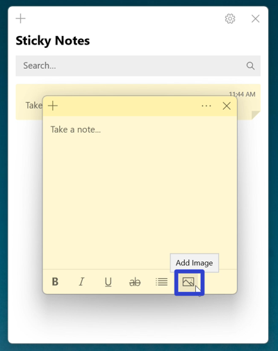

* Step 2: In the "Open" window that opens, click to select an image, then click the "Open" button. The sticky note displays the image. 
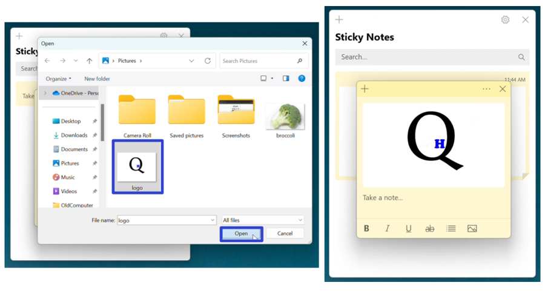

<h1 id="2">How to View an Image in a Sticky Note With Double Click</h1>

* Step 1: [Add an image](#1) to a sticky note, and double click the image. The Image Viewer window opens and displays the image. 
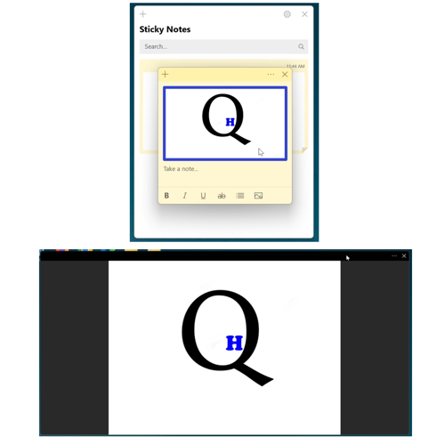

<h1 id="3">How to View an Image in a Sticky Note With Right Click</h1>

* Step 1: First [add an image](#1) to a sticky note, and right click the image. 
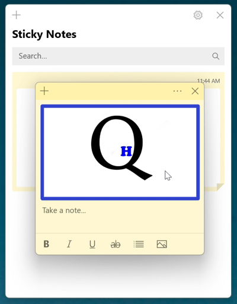

* Step 2: In the menu that opens, click "View image". The Image Viewer window opens and displays the image. 
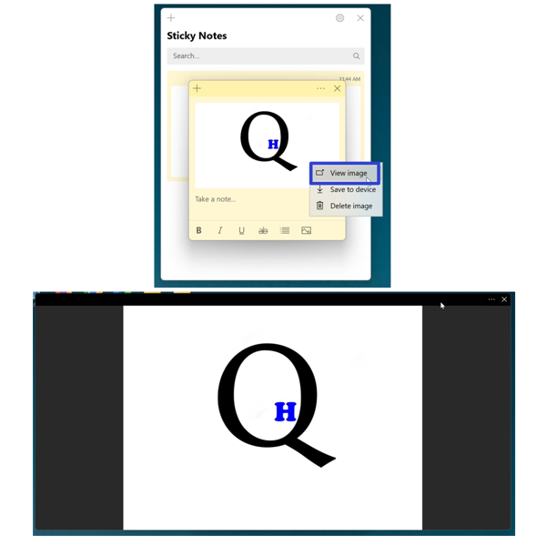
 

<h1 id="4">How to Resize the Image Viewer Window</h1>

* Step 1: [View](#2) an image. Hover the mouse over any edge or corner of the Image Viewer window. Click, hold, and drag the double sided arrow cursor to resize the window, and release the mouse to stop resizing. 
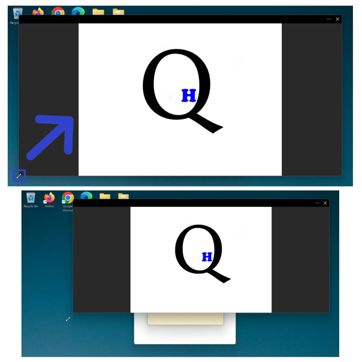
 

<h1 id="5">How to Maximize and Restore the Image Viewer Window</h1>

* Step 1: First [view](#2) an image. Double click the top of the Image Viewer window to maximize it. 
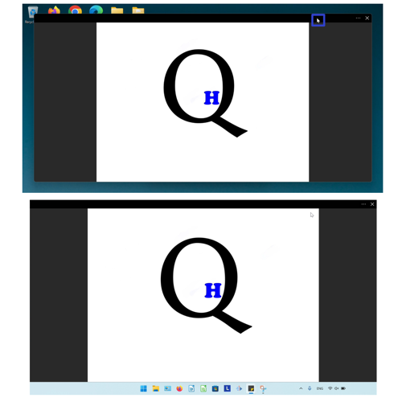

* Step 2: Double click the top of the maximized window to restore it. 
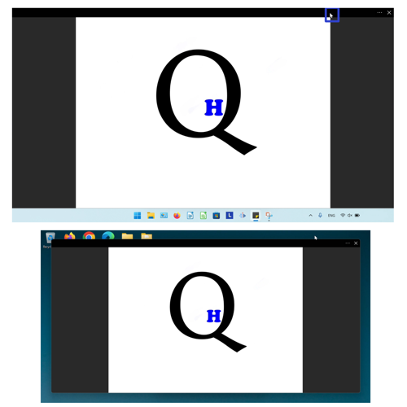

<h1 id="6">How to Close the Image Viewer Window</h1>

* Step 1: [View](#2) an image. Go to the upper right corner and click the "Close" or "X" button. The Image Viewer window closes. 
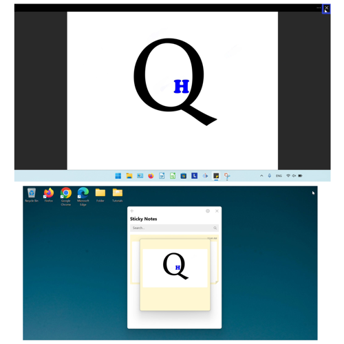

<h1 id="7">How to Save an Image With Menu</h1>

* Step 1: First [view](#1) an image. Go to the upper right and click the "Menu" or "..." button. 
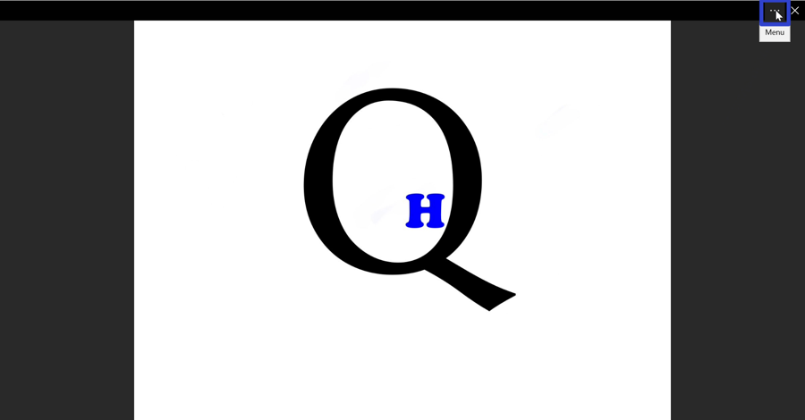

* Step 2: In the menu that opens, click "Save to device". 
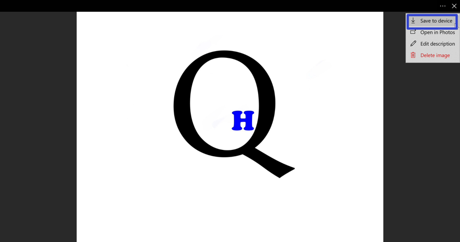

* Step 3: In the "Save As" window that opens, type any text to name the file, and click "Save". 
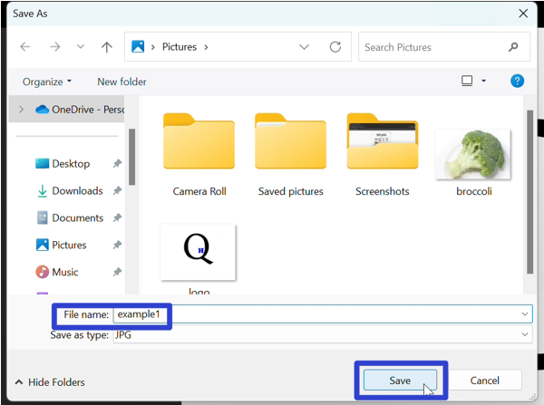

<h1 id="8">How to Save an Image With Right Click</h1>

* Step 1:[Add](#1) an image to a sticky note. Right click the image. 

* Step 2: In the menu that opens, click "Save to device". 
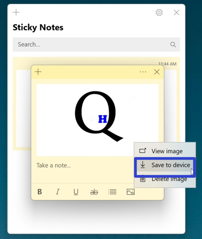

* Step 3: In the "Save As" window that opens, type any text to name the file, and click "Save". 

<h1 id="9">How to Open an Image in Photos</h1>

* Step 1: First [view](#2) an image. Go to the upper right and click the "Menu" or "..." button. 

* Step 2: In the menu that opens, click "Open in Photos". The Microsoft Photos app opens and displays the image. 
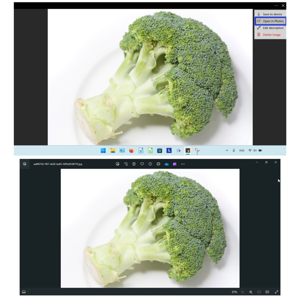

<h1 id="10">How to Edit the Description of an Image</h1>

* Step 1: [View](#2) an image. Go to the upper right and click the "Menu" or "..." button. 

* Step 2: In the menu that opens, click "Edit description". 
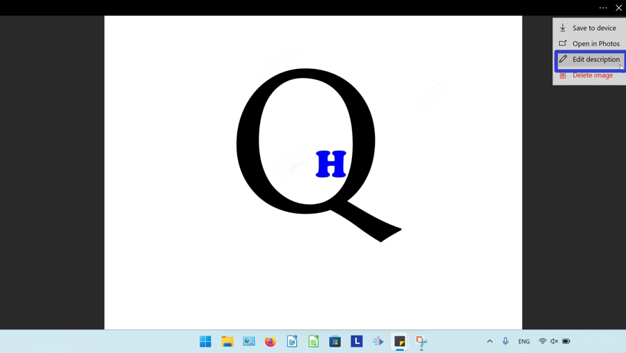

* Step 3: Type any text and click "Done". 
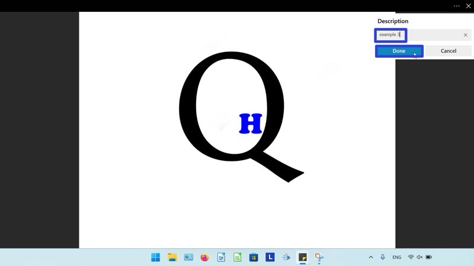

* The image description appears below the image in the Image Viewer window. If the image is saved to device, the description becomes the file name of the image. 
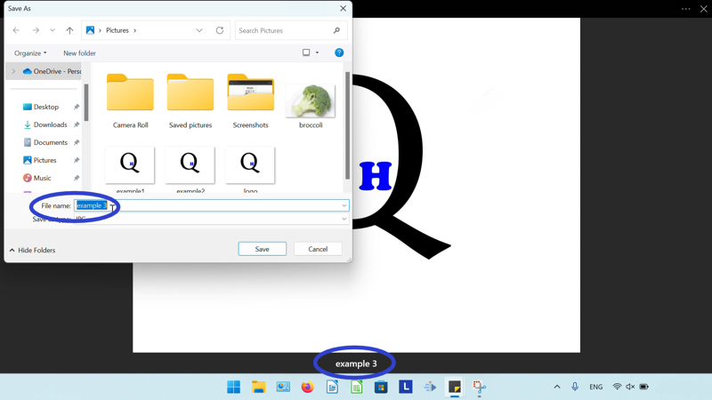

<h1 id="11">How to Remove the Description of an Image</h1>

* Step 1: First [view](#2) the image. Go to the upper right and click the "Menu" or "..." button. 

* Step 2: In the menu that opens, click "Edit description". 

* Step 3: On the far right side of the text box, click the "X" button. 
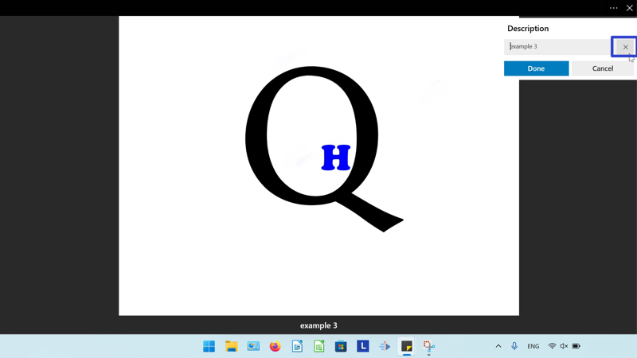

* Step 4: Click "Done". 
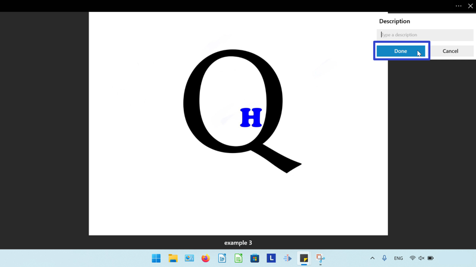

* The description disappears from the Image Viewer window. 
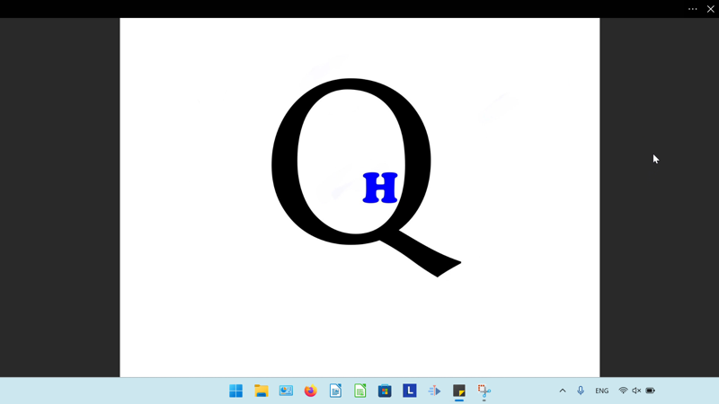

<h1 id ="12">How to Delete an Image With Menu</h1>

* Step 1: [View](#2) an image. Go to the upper right and click the "Menu" or "..." button. 

* Step 2: In the menu that opens, click "Delete image". 
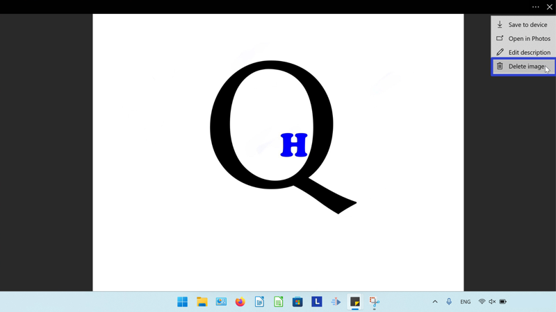

* Step 3: In the window that opens, click "Delete". 
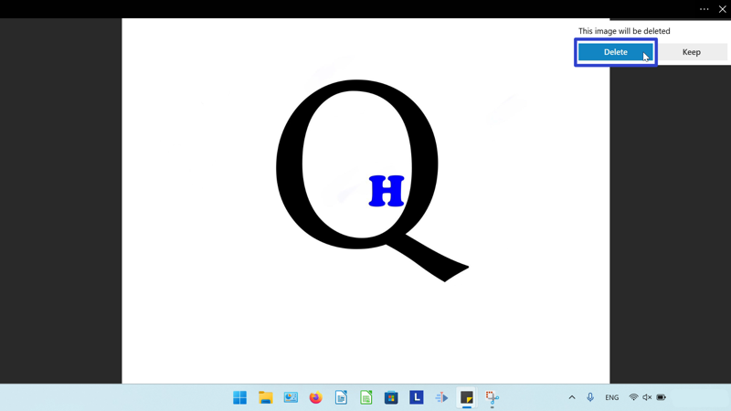

* The image disappears from the sticky note. 
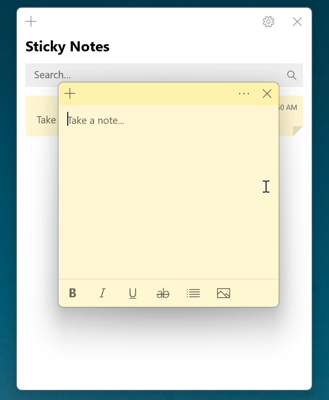

<h1 id="13">How to Delete an Image With Right Click</h1>

* Step 1: First [add](#1) an image to a sticky note, then right click the image. 

* Step 2: In the menu that opens, click "Delete image". 
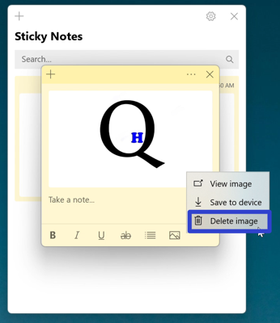

* Step 3: In the window that opens, click "Delete". 
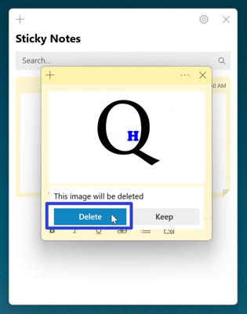

* The image disappears from the sticky note. 

Save these instructions for later with this free [PDF tutorial](https://drive.google.com/file/d/1ryPh-6gcZKUQDmmbdo81KCrw0Iu1V_rI/view?usp=sharing).

 

