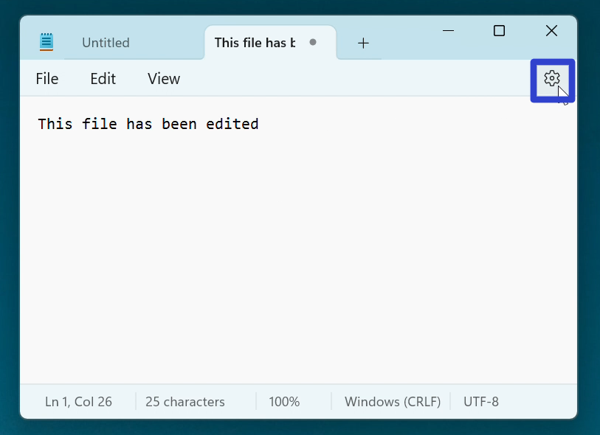

This tutorial covers:

## [How to Choose How Files Are Opened](#1)
## [How to Adjust When Notepad Starts](#2)

 

No time to scroll down? Click through this presentation tutorial:

<iframe src="https://docs.google.com/presentation/d/e/2PACX-1vTShfY_-jX09Wr8iBOnhoS1qzyPrj-lXp6DhCmPSXN1FeEQ2LHSeRlCDmMBVfwRuvgLY77Obyu8jO6x/embed?start=false&loop=false&delayms=3000" frameborder="0" width="480" height="299" allowfullscreen="true" mozallowfullscreen="true" webkitallowfullscreen="true"></iframe>

 

Watch a video tutorial:
<iframe class="BLOG_video_class" allowfullscreen="" youtube-src-id="Bw7rfbs_1Vc" width="100%" height="416" src="https://www.youtube.com/embed/Bw7rfbs_1Vc"></iframe>

<h1 id="1">How to Choose How Files Are Opened</h1>

* Step 1: First [open](https://qhtutorials.github.io/posts/how-to-open-notepad/) Notepad. In the upper right click the "Settings" or gear button. 

* Step 2: In the Settings window that opens, click the "Opening files" drop-down menu and select either "Open in a new tab" or "Open in a new window". 

<h1 id="2">How to Adjust When Notepad Starts</h1>

* Step 1: [Open](https://qhtutorials.github.io/posts/how-to-open-notepad/) Notepad. In the upper right click the "Settings" or gear button. 

* Step 2: In the Settings window that opens, go to the far right side of the "When Notepad starts" section and click the down arrow. 

* Step 3: In the menu that opens, click to select "Open content from previous session" or "Open a new window". 

* Note: "Open content from previous session" disables the saving confirmation window when closing Notepad, and reopened windows display the content from the previous session. In contrast, "Open a new window" enables the saving confirmation when closing Notepad, and reopened windows are blank.

Save a copy of these instructions for later with this free [tutorial PDF](https://drive.google.com/file/d/1vvrFiyV7GvDaNgCmAWWXbWa8HUNhPkil/view?usp=sharing).

 

