This tutorial covers:

## How to Switch to Select Mode:
1. [With Click](#1)
2. [With Keyboard](#2)

## How to Select an Object:
1. [With Click](#3)
2. [With Keyboard](#4)

## How to Select Multiple Objects:
1. [With Shift](#5)
2. [With Lasso and Click](#6)
3. [With Lasso and Keyboard](#7)
4. [With Keyboard Shortcut](#8)

## How to Add an Object to a Multi Selection:
1. [With Click](#9)
2. [With Keyboard](#10)

## How to Deselect an Object
1. [With Click](#11)
2. [With Keyboard](#12)

## How to Remove an Object from a Multi Selection:
1. [With Click](#13)
2. [With Keyboard](#14)

No time to scroll down? Click through these tutorial slides:

<iframe src="https://docs.google.com/presentation/d/e/2PACX-1vTU2BQ9r_YSkM3oc-hr3JQLtWhSevl3xEBYmy3GjbgXKCHNX-WCbWMYw40g0n4MbTncAK366vzPFP_X/embed?start=false&loop=false&delayms=3000" frameborder="0" width="480" height="299" allowfullscreen="true" mozallowfullscreen="true" webkitallowfullscreen="true"></iframe>

 

Watch a tutorial video:
<iframe class="BLOG_video_class" allowfullscreen="" youtube-src-id="fW5yoKp41MM" width="100%" height="416" src="https://www.youtube.com/embed/fW5yoKp41MM"></iframe>

 

<h1 id="1">How to Switch to Select Mode With Click</h1>

* Step 1: First [open](https://qhtutorials.github.io/posts/how-to-open-microsoft-whiteboard/) a whiteboard. On the bottom toolbar click the "Select" or arrow button. 
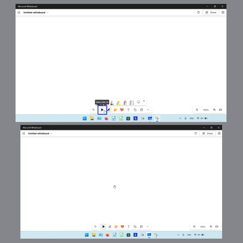

<h1 id="2">How to Switch to Select Mode With Keyboard</h1>

* Step 1: [Open](https://qhtutorials.github.io/posts/how-to-open-microsoft-whiteboard/) a whiteboard. On the keyboard press **Alt + S**. 
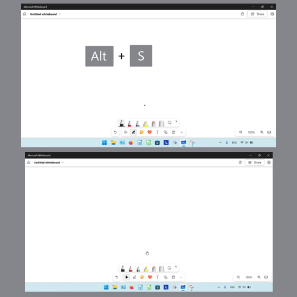

<h1 id="3">How to Select an Object With Click</h1>

* Step 1: First [switch](#1) to Select mode. Click an object on the canvas. 
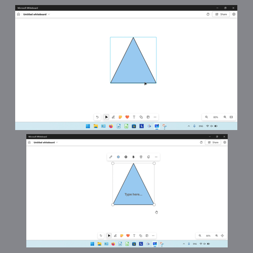

<h1 id="4">How to Select an Object With Keyboard</h1>

* Step 1: On the keyboard press the **Tab** key. 
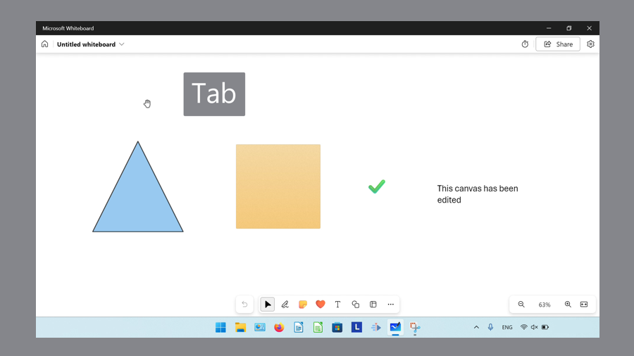

* Step 2: Continue pressing **Tab** until the keyboard focus is on the desired object. Press **Enter** or **Spacebar** to select the object. 
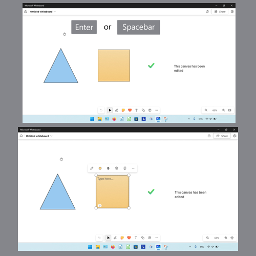

<h1 id="5">How to Select Multiple Objects With Shift</h1>

* Step 1: First [switch](#1) to Select mode. Hold the **Shift** key, then click and drag with the mouse until the blue selection field covers the objects. 
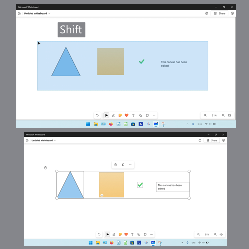

<h1 id="6">How to Select Multiple Objects With Lasso and Click</h1>

* Step 1: On the bottom toolbar click the "Inking" button. 
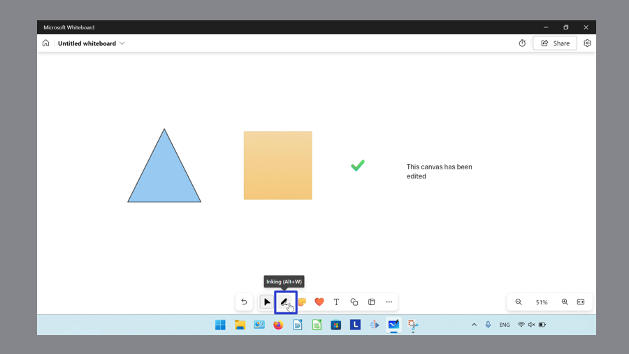

* Step 2: In the menu that opens, click the "Lasso select" button. 
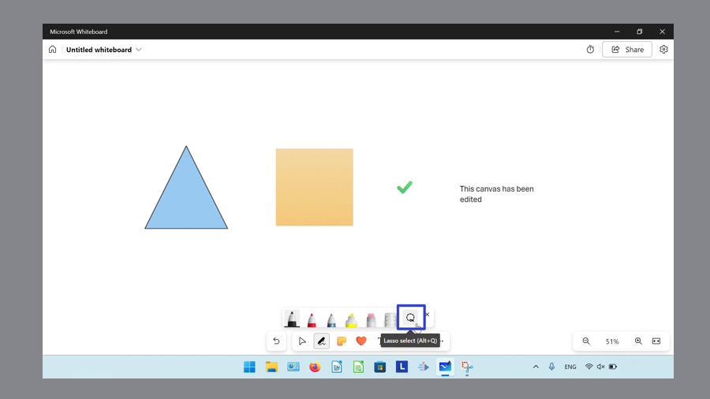

* Step 3: Click and drag the mouse in a clockwise or counterclockwise direction, until the blue selection field covers the objects. 
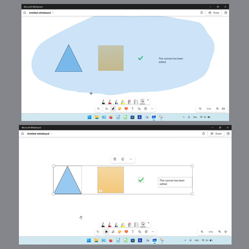

<h1 id="7">How to Select Multiple Objects With Lasso and Keyboard</h1>

* Step 1: On the keyboard, press **Alt + Q** to select the Lasso tool. 
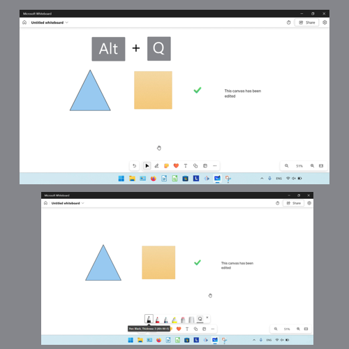

* Step 2: Click and drag the mouse in a clockwise or counterclockwise direction, until the blue selection field covers the objects. 
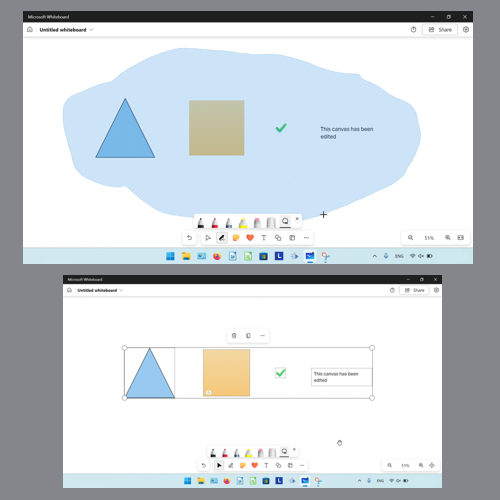

<h1 id="8">How to Select Multiple Objects With Keyboard Shortcut</h1>

* Step 1: First [open](https://qhtutorials.github.io/posts/how-to-open-microsoft-whiteboard/) a whiteboard template. On the keyboard press **Ctrl + A**. 
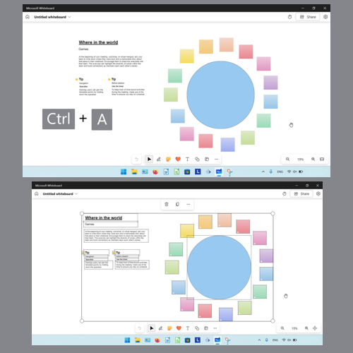

<h1 id="9">How to Add an Object to a Multi Selection With Click</h1>

* Step 1: [Select](#5) multiple objects. Hold the **Ctrl** key and click an object. Microsoft Whiteboard adds the clicked object to the multi selection. 
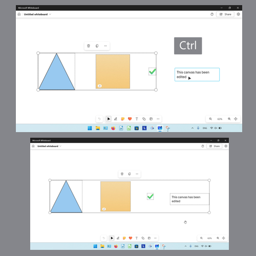

<h1 id="10">How to Add an Object to a Multi Selection With Keyboard</h1>

* Step 1: First [select](#5) multiple objects. On the keyboard press the **Tab** key. 
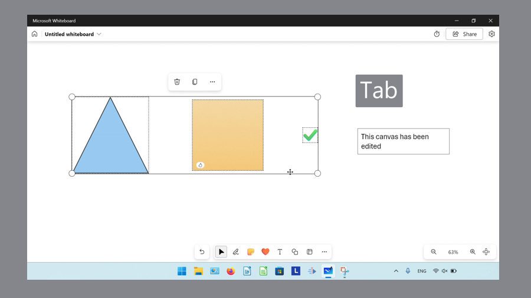

* Step 2: Continue pressing **Tab** until the keyboard focus is on the desired object. Hold **Ctrl**, then press **Enter** or **Spacebar** to add that object to the multi selection. 
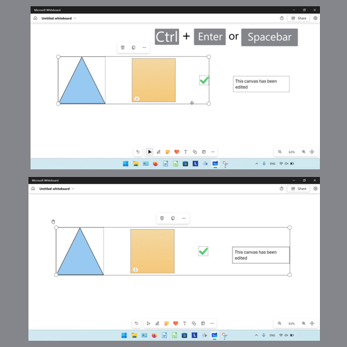

<h1 id="11">How to Deselect an Object With Click</h1>

* Step 1: [Select](#3) an object. Click anywhere on the canvas. 
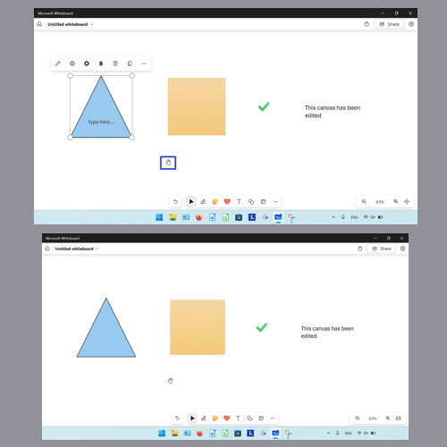

<h1 id="12">How to Deselect an Object With Keyboard</h1>

* Step 1: First [select](#3) an object. On the keyboard press the **Esc** key. 
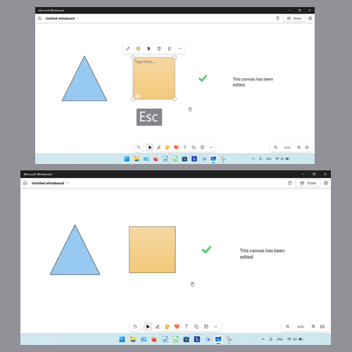

<h1 id="13">How to Remove an Object from a Multi Selection With Click</h1>

* Step 1: [Select](#5) multiple objects. Hold down the **Ctrl** key, then click the object to remove from the multi selection. 
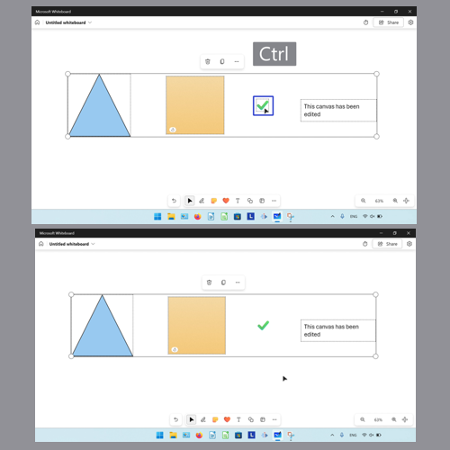

<h1 id="14">How to Remove an Object from a Multi Selection With Keyboard</h1>

* Step 1: First [select](#5) multiple objects. On the keyboard press the **Tab** key. 
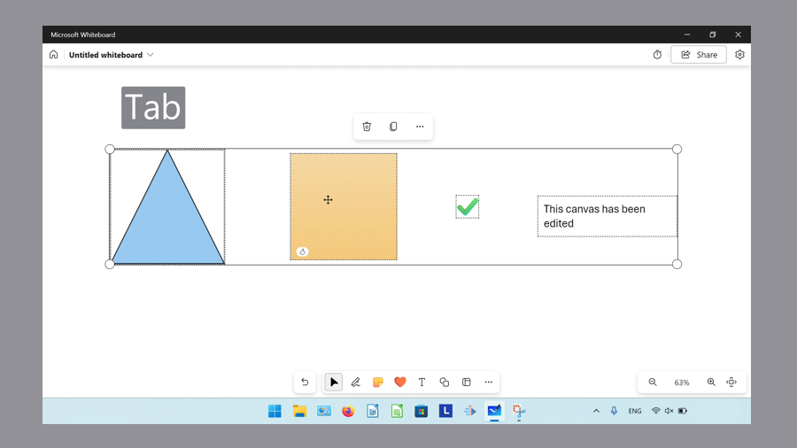

* Step 2: Continue pressing **Tab** until the keyboard focus is on the desired object. Hold the **Ctrl** key, then press **Enter** or **Spacebar** to remove the object from the multi selection. 
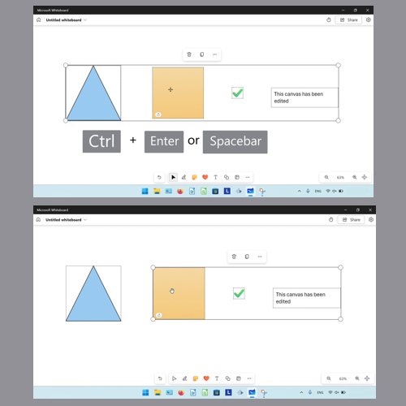

Refer to these instructions later with this free [tutorial PDF](https://drive.google.com/file/d/1WAR1UybMXI8aiT34G9cYi9cvkh3w_2do/view?usp=sharing).

 

