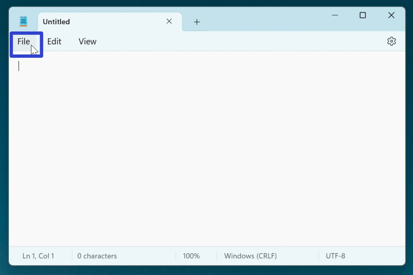

This tutorial covers:

## How to Change Printing Orientation:
1. [With "Print" Menu](#1)
2. [With "More Settings"](#2)
3. [With "Page Setup"](#3)

## How to Change Color Settings:
1. [With "Print" Menu](#4)
2. [With "More Settings"](#5)

## [How to Change Page Order](#6)

## How to Change Paper Source:
1. [With "Print" Menu](#7)
2. [With "Page Setup"](#8)

## [How to Change Paper Media](#9)

## [How to Change Paper Size](#10)

## [How to Change Margins](#11)

 

No time to scroll down? Click through these tutorial slides:

<iframe src="https://docs.google.com/presentation/d/e/2PACX-1vQiHKw10NiLPzGWobQ0oF4x-Ed7GV74gHAe7XU8FjGplLFfkw6gDZPfYX3_3HCT16ihHAypwVOsiDvA/embed?start=false&loop=false&delayms=3000" frameborder="0" width="480" height="299" allowfullscreen="true" mozallowfullscreen="true" webkitallowfullscreen="true"></iframe>

 

Follow along with a video tutorial:
<iframe class="BLOG_video_class" allowfullscreen="" youtube-src-id="MVMvbB5qmpg" width="100%" height="416" src="https://www.youtube.com/embed/MVMvbB5qmpg"></iframe>

<h1 id="1">How to Change Printing Orientation With "Print" Menu</h1>

* Step 1: First [open](https://qhtutorials.github.io/posts/how-to-print-in-notepad/) the "Print" window. Click the drop-down menu under "Orientation" to select either "Portrait" or "Landscape". 

<h1 id="2">How to Print With "More Settings"</h1>

* Step 1: [Open](https://qhtutorials.github.io/posts/how-to-print-in-notepad/) the "Print" window. In the lower left click "More settings". 

* Step 2: In the "Printing Preferences" window that opens, click the drop-down menu under "Orientation" to select either "Portrait" or "Landscape", and click "OK". 

<h1 id="3">How to Change Printing Orientation With "Page Setup"</h1>

* Step 1: First [open](https://qhtutorials.github.io/posts/how-to-open-notepad/) a Notepad window. In the upper left click the "File" button. 

* Step 2: In the menu that opens, click "Page setup". 

* Step 3: In the "Page Setup" window that opens, click under the "Orientation" section to select either "Portrait" or "Landscape", and click "OK". 

<h1 id="4">How to Change Color Settings With "Print" Menu</h1>

* Step 1: [Open](https://qhtutorials.github.io/posts/how-to-print-in-notepad/) the "Print" window. Click the "Color mode" drop-down menu to select either "Color", "Grayscale", or "Monochrome". 

<h1 id="5">How to Change Color Settings With "More Settings"</h1>

* Step 1: First [open](https://qhtutorials.github.io/posts/how-to-print-in-notepad/) the "Print" window. In the lower left click the "More settings" option. 

* Step 2: In the "Printing Preferences" window that opens, click the "Paper/Quality" tab at the top. 

* Step 3: Under the "Color" section, click to select "Black & White" or "Color", and click "OK". 

<h1 id="6">How to Change Page Order</h1>

* Step 1: [Open](https://qhtutorials.github.io/posts/how-to-print-in-notepad/) the "Print" window. In the lower left click "More settings". 

* Step 2: In the "Printing Preferences" window that opens, click the "Page Order" drop-down menu to select "Front to Back" or "Back to Front", and click "OK". 

<h1 id="7">How to Change Paper Source With "Print" Menu</h1>
 
* Step 1: First [open](https://qhtutorials.github.io/posts-how-to-print-in-notepad/) the "Print" window. In the lower left click the "More settings" option. 

* Step 2: At the top of the "Printing Preferences" window that opens, click the "Paper/Quality" tab. 

* Step 3: Click the "Paper Source" drop-down menu to select "Automatically select", "Multipurpose tray", or "Tray 1" and click "OK". 

<h1 id="8">How to Change Paper Source With "Page Setup"</h1>

* Step 1: [Open](https://qhtutorials.github.io/posts/how-to-open-notepad/) a Notepad window. In the upper left click "File". 

* Step 2: In the menu that opens, click "Page Setup". 

* Step 3: Click the "Source" drop-down menu to select "Automatically select", "Multipurpose tray" or "Tray 1", and click "OK". 

<h1 id="9">How to Change Paper Media</h1>

* Step 1: First [open](https://qhtutorials.github.io/posts/how-to-print-in-notepad/) the "Print" window. In the lower left cilck "More settings". 

* Step 2: At the top of the "Printing Preferences" window that opens, click the "Paper/Quality" tab. 

* Step 3: Click the "Media" drop-down menu to select one of the options, and click "OK". 

<h1 id="10">How to Change Paper Size</h1>

* Step 1: [Open](https://qhtutorials.github.io/posts/how-to-open-notepad/) a Notepad window. In the upper left click the "File" button. 

* Step 2: In the menu that opens, click "Page setup". 

* Step 3: In the "Page setup" window that opens, click the "Size" drop-down menu, select one of the options, and click "OK". 

<h1 id="11">How to Change Margins</h1>

* Step 1: First [open](https://qhtutorials.github.io/posts/how-to-open-notepad/) a Notepad window. In the upper left click the "File" button. 

* Step 2: In the menu that opens, click "Page setup". 

* Step 3: In the "Page setup" window that opens, under the "Margins" section type a number in the "Left", "Top", "Right", and "Bottom" fields, then press **Enter** or click "OK". 

Save these instructions for later with this free [tutorial PDF](https://drive.google.com/file/d/1NE-bztnSyIR2qxTqOVul4icsVpfuVNTb/view?usp=sharing).

 

