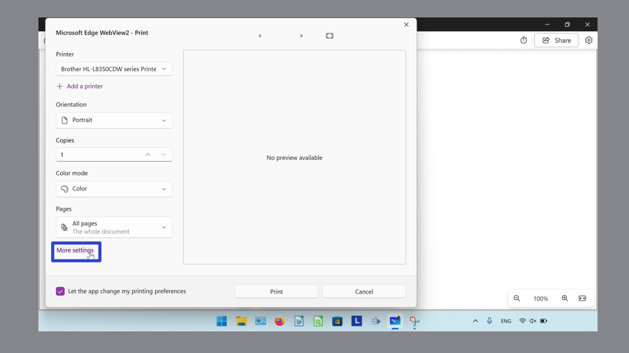

This tutorial covers:

## How to Change Printing Orientation:
1. [With Print Window](#1)
2. [With System Dialog](#2)
3. [With Printing Preferences](#3)

## How to Change Color Settings:
1. [With Print Window](#4)
2. [With System Dialog](#5)
3. [With Printing Preferences](#6)

## [How to Change Paper Size](#7)

## [How to Change Printing Scale](#8)

## [How to Change Pages per Sheet](#9)

## [How to Change Margins](#10)

## [How to Add or Remove the Header and Footer](#11)

## [How to Add or Remove Background Graphics](#12) 

## [How to Change Page Order](#13)

## [How to Change Paper Source](#14)

## [How to Change Media](#15)

No time to scroll down? Click through this presentation tutorial:

<iframe src="https://docs.google.com/presentation/d/e/2PACX-1vRaBQst7uar9fq1xmohFf9haOfQ7SZ4yS5oGrit68i8okWJ0Maxb8g0j-cgOlZz79IBcZxFzYT5kiFd/embed?start=false&loop=false&delayms=3000" frameborder="0" width="480" height="299" allowfullscreen="true" mozallowfullscreen="true" webkitallowfullscreen="true"></iframe>

 

Watch a tutorial video:
<iframe class="BLOG_video_class" allowfullscreen="" youtube-src-id="PacF4oACc-M" width="100%" height="416" src="https://www.youtube.com/embed/PacF4oACc-M"></iframe>

 

<h1 id="1">How to Change Printing Orientation With Print Window</h1>

* Step 1: First [open](https://qhtutorials.github.io/posts/how-to-open-microsoft-whiteboard/) a whiteboard. On the keyboard press **Ctrl + P**. 

* Step 2: In the Print window that opens, under the "Layout" section click to select "Portrait" or "Landscape". 

<h1 id="2">How to Change Printing Orientation With System Dialog</h1>

* Step 1: [Open](https://qhtutorials.github.io/posts/how-to-open-microsoft-whiteboard/) a whiteboard. On the keyboard press **Ctrl + Shift + P**. 

* Step 2: In the System Dialog window that opens, click the "Orientation" drop-down menu to select "Portrait" or "Landscape". 

<h1 id="3">How to Change Printing Orientation With Printing Preferences</h1>

* Step 1: First [open](https://qhtutorials.github.io/posts/how-to-open-microsoft-whiteboard/) a whiteboard, and on the keyboard press **Ctrl + Shift + P**. 

* Step 2: In the lower left of the System Dialog window that opens, click "More settings". 

* Step 3: In the Printing Preferences window that opens, click the "Orientation" drop-down menu to select "Portrait" or "Landscape", and click the "OK" button. 

<h1 id="4">How to Change Color Settings With Print Window</h1>

* Step 1: [Open](https://qhtutorials.github.io/posts/how-to-open-microsoft-whiteboard/). On the keyboard press **Ctrl + P**. 

* Step 2: Scroll down and click the "Color" drop-down menu to select "Black and white" or "Color". 

<h1 id="5">How to Change Color Settings With System Dialog</h1>

* Step 1: First [open](https://qhtutorials.github.io/posts/how-to-open-microsoft-whiteboard/) a whiteboard. On the keyboard press **Ctrl + Shift + P**. 

* Step 2: In the System Dialog window that opens, click the "Color mode" drop-down menu to select "Color", "Grayscale", or "Monochrome". 

 

<h1 id="6">How to Change Color Settings With Printing Preferences</h1>

* Step 1: [Open](https://qhtutorials.github.io/posts/how-to-open-microsoft-whiteboard) a whiteboard and on the keyboard press **Ctrl + Shift + P**. 

* Step 2: In the lower left of the System Dialog window that opens, click "More settings". 

* Step 3: At the top of the Printing Preferences window that opens, click the "Paper/Quality" tab. 

* Step 4: Under the "Color" section, click to select "Black and white" or "Color", and click the "OK" button. 

<h1 id="7">How to Change Paper Size</h1>

* Step 1: First [open](https://qhtutorials.github.io/posts/how-to-open-microsoft-whiteboard). a whiteboard, and on the keyboard press **Ctrl + P**. 

* Step 2: In the Print window that opens, scroll down and click "More settings". 

* Step 3: Click the "Paper size" drop-down menu to select one of the options ("Letter", "Legal", "Executive" "A4", "A5", "B5(JIS)", "Envelope #10", "Envelope DL", "Envelope C5", "Envelope B5", "Envelope Monarch", "A6" or "North America 3x 5"). 

<h1 id="8">How to Change Printing Scale</h1>

* Step 1: [Open](https://qhtutorials.github.io/posts/how-to-open-microsoft-whiteboard/) a whiteboard, and on the keyboard press **Ctrl + P**. 

* Step 2: In the Print window that opens, scroll down and click "More settings". 

* Step 3: Under the "Scale (%)" section, click "Fit to printable area", "Actual size", or "100%". For "100%", either type a number, or click the up and down arrows to adjust the percentage. 

<h1 id="9">How to Change Pages per Sheet</h1>

* Step 1: First [open](https://qhtutorials.github.io/posts/how-to-open-microsoft-whiteboard/) a whiteboard, and on the keyboard press **Ctrl + P**. 

* Step 2: In the Print window that opens, scroll down and click "More settings". 

* Step 3: Click the "Pages per sheet" drop-down menu to select one of the options ("1", "2", "4", "6", "9", or "16"). 

<h1 id="10">How to Change Margins</h1>

* Step 1: [Open](https://qhtutorials.github.io/posts/how-to-open-microsoft-whiteboard/) a whiteboard, and on the keyboard press **Ctrl + P**. 

* Step 2: In the Print window that opens, scroll down and click "More settings". 

* Step 3: Click the "Margins" drop-down menu to select "Default", "None", "Minimum", or "Custom". For the "Custom" option, type a number in the "Top", "Bottom", "Left", and "Right" fields to specify the margins. 

<h1 id="11">How to Change Add or Remove the Header and Footer</h1>

* Step 1: First [open](https://qhtutorials.github.io/posts/how-to-open-microsoft-whiteboard/) a whiteboard, and on the keyboard press **Ctrl + P**. 

* Step 2: In the Print window that opens, scroll down and click "More settings". 

* Step 3: Click to toggle the "Headers and footers" option on or off. 

<h1 id="12">How to Add or Remove Background Graphics</h1>

* Step 1: [Open](https://qhtutorials.github.io/posts/how-to-open-microsoft-whiteboard/) a whiteboard, and on the keyboard press **Ctrl + P**. 

* Step 2: In the Print window that opens, scroll down and click "More settings". 

* Step 3: Click to toggle the "Background graphics" option on or off. 

<h1 id="13">How to Change Page Order</h1>

* Step 1: First [open](https://qhtutorials.github.io/posts/how-to-open-microsoft-whiteboard/) a whiteboard, and on the keyboard press **Ctrl + Shift + P**. 

* Step 2: In the lower left of the System Dialog window that opens, click "More settings". 

* Step 3: In the Printing Preferences window that opens, click the "Page order" drop-down menu to select either "Front to back" or "Back to front" and click the "OK" button. 

<h1 id="14">How to Change Paper Source</h1>

* Step 1: [Open](https://qhtutorials.github.io/posts/how-to-open-microsoft-whiteboard/) a whiteboard, and on the keyboard press **Ctrl + Shift + P**. 

* Step 2: In the lower left of the System Dialog window that opens, click "More settings". 

* Step 3: At the top of the Printing Preferences window that opens, click the "Paper/Quality" tab. 

* Step 4: Click the "Paper Source" drop-down menu to select "Automatically select", "Multipurpose tray", or "Tray 1" and click the "OK" button. 

<h1 id="15">How to Change Media</h1>

* Step 1: First [open](https://qhtutorials.github.io/posts/how-to-open-microsoft-whiteboard/) a whiteboard, and on the keyboard press **Ctrl + Shift + P**. 

* Step 2: In the lower left of the System Dialog window that opens, click "More settings". 

* Step 3: At the top of the Printing Preferences window that opens, click the "Paper/Quality" tab. 

* Step 4: Click the "Media" drop-down menu to select one of the options ("Plain Paper", "Heavyweight paper", "Lightweight paper", "Glossy Paper", "Photo paper", "Label", or "Envelope (plain)"), and click the "OK" button. 

Save these instructions for later with this free [PDF tutorial](https://drive.google.com/file/d/1gnZp6KpihRYnwfB_z-kZQQk4OkmbIhMJ/view?usp=sharing).

 

