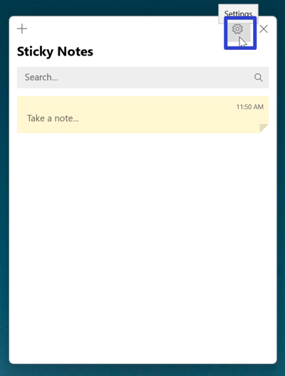
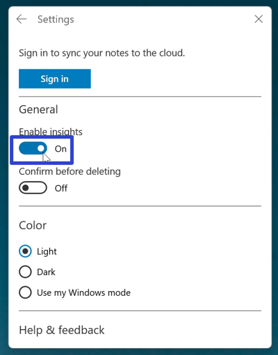
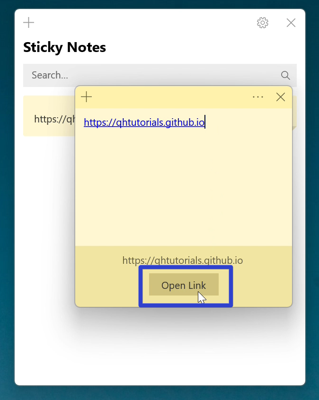
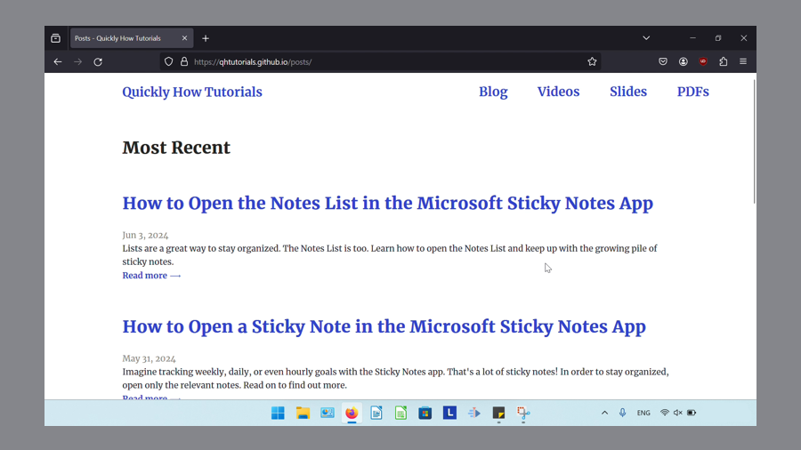
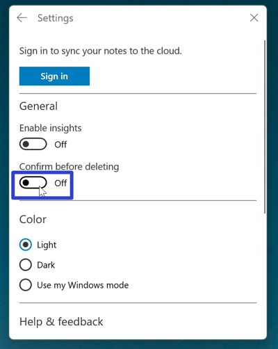
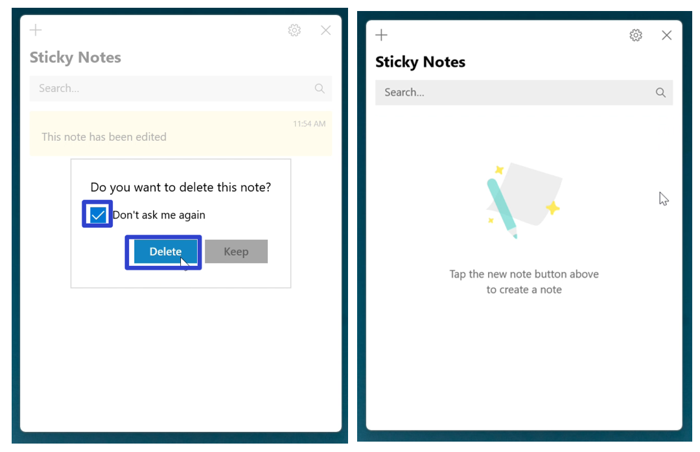

This tutorial covers:

## [How to Enable Insights in a Sticky Note](#1)

## How to Turn "Confirm Before Deleting" Off:
1. [With Settings](#2)
2. [With Click](#3)

 
No time to scroll down? Click through this presentation tutorial:
<iframe src="https://docs.google.com/presentation/d/e/2PACX-1vSV2880s9vdyUb_OD1ivhqEV97x0aiCAbUpFBvxriSV6JKyDp68CTCVEcouok86Bgt4QMAmSQNF9fG5/embed?start=false&loop=false&delayms=3000" frameborder="0" width="480" height="299" allowfullscreen="true" mozallowfullscreen="true" webkitallowfullscreen="true"></iframe>

 

See it in action with this video:
<iframe class="BLOG_video_class" allowfullscreen="" youtube-src-id="VtDNTFB8N-0" width="100%" height="416" src="https://www.youtube.com/embed/VtDNTFB8N-0"></iframe>

<h1 id="1">How to Enable Insights in a Sticky Note</h1>

* Step 1: First [open](https://qhtutorials.github.io/posts/how-to-open-notes-list/) the Notes List. Go to the upper right and click the "Settings" or gear button. 

* Step 2: In the Settings window that opens, click under the "Enable Insights" section to toggle this option on. 

* Step 3: [Open](https://qhtutorials.github.io/posts/how-to-open-a-sticky-note/) a sticky note and type the URL of any website. The Sticky Notes app recognizes the URL and displays an "Open Link" button. Click this button to open the URL in a browser. 

 
* The browser displays the website. 

 
* Note: In Windows 10, Enable Insights recognized dates, times, phone numbers, and addresses typed into a sticky note. Cortana facilitated additional functions such as creating reminders or opening maps (Thurott, 2016). However, as of Fall 2023, Cortana was deprecated as a standalone app (*End of Support For Cortana*, n.d.), and thus Enable Insights only recognizes web addresses as of this writing.

<h1 id="2">How to Turn "Confirm Before Deleting" Off With Settings</h1>

* Step 1: [Open](https://qhtutorials.github.io/posts/how-to-open-notes-list/) the Notes List. Go to the upper right and click the "Settings" or gear button. 

* Step 2: In the Settings window that opens, click under the "Confirm before deleting" section to toggle this option off. Now after deleting sticky notes, the deletion confirmation message does not appear. 

<h1 id="3">How to Turn "Confirm Before Deleting" Off With Click</h1>

* Step 1: First [edit](https://qhtutorials.github.io/posts/how-to-edit-a-sticky-note/) and [delete](https://qhtutorials.github.io/posts/how-to-delete-sticky-notes/) a sticky note. In the deletion confirmation message that appears, click "Don't ask me again" and "Delete". Now after deleting sticky notes, the deletion confirmation message does not appear. 

Save these instructions for later with this free [PDF tutorial](https://drive.google.com/file/d/1xyR-4vUb4pxCzX0beYEWQ2a4sdOCnd6W/view?usp=sharing).

## References

Microsoft. (n.d.). *End of support for cortana*. 

: [https://support.microsoft.com/en-us/topic/end-of-support-for-cortana-d025b39f-ee5b-4836-a954-0ab646ee1efa](https://support.microsoft.com/en-us/topic/end-of-support-for-cortana-d025b39f-ee5b-4836-a954-0ab646ee1efa)

 

Thurott. (2016, October 2). *Windows 10 tip: get cortana insights with sticky notes*. 

: [https://www.thurrott.com/windows/windows-10/81866/windows-10-tip-get-cortana-insights-sticky-notes](https://www.thurrott.com/windows/windows-10/81866/windows-10-tip-get-cortana-insights-sticky-notes)

 

