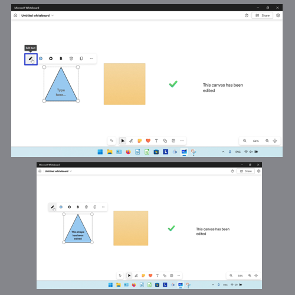
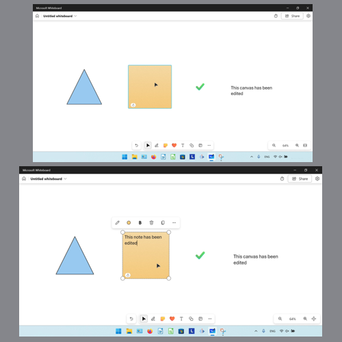
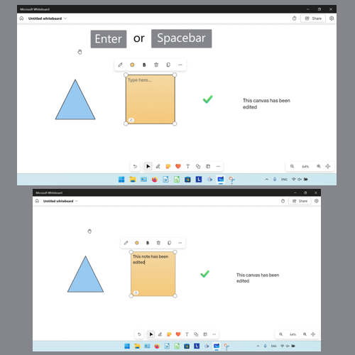
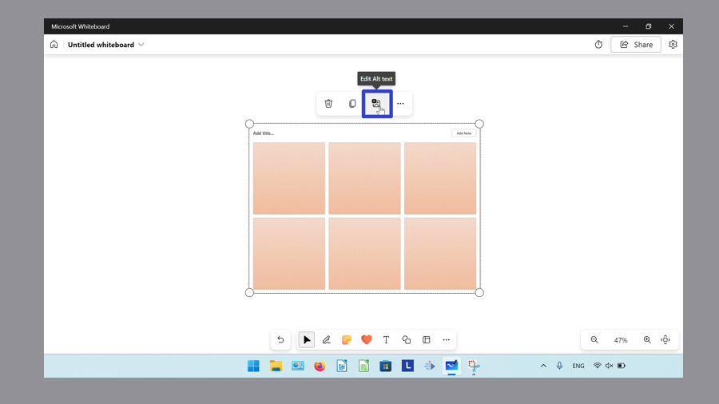
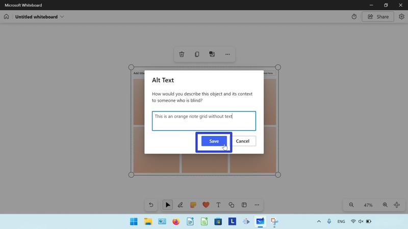
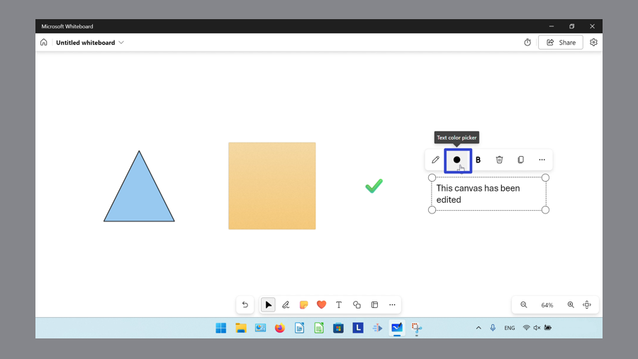
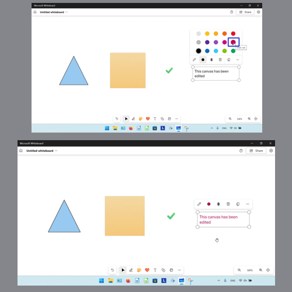
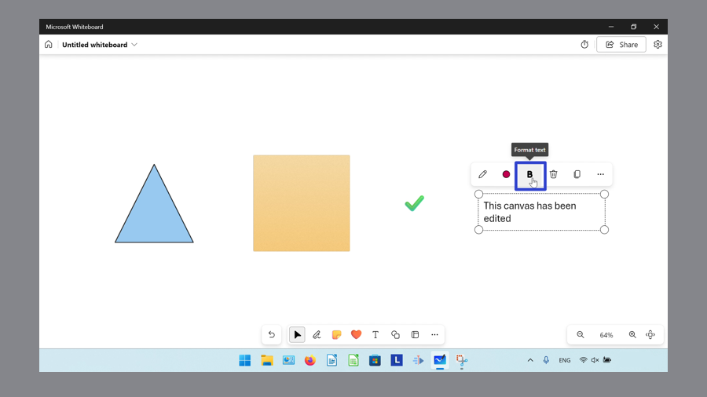
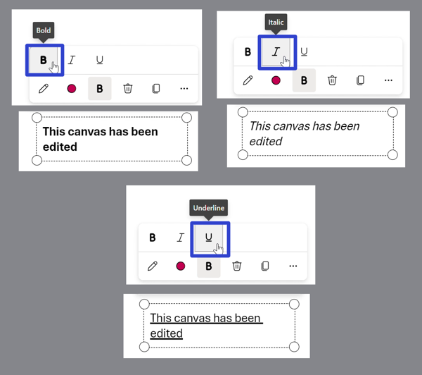

This tutorial covers:

## How to Edit the Text of an Object:
1. [With Click](#1)
2. [With Double Click](#2)
3. [With Keyboard](#3)

## [How to Edit the Alt Text of an Object](#4)

## [How to Change Text Color](#5)

## [How to Change Text Format](#6)

No time to scroll down? Click through this presentation tutorial:

<iframe src="https://docs.google.com/presentation/d/e/2PACX-1vR9fvbFYnyhyAv2sLZ8md7aG73qwzKZLcoTTq_2MPQqDbAXvRYAlkNSYANhpoipn5y6x1w-uTVuXYSx/embed?start=false&loop=false&delayms=3000" frameborder="0" width="480" height="299" allowfullscreen="true" mozallowfullscreen="true" webkitallowfullscreen="true"></iframe>

 

Watch a tutorial video:
<iframe class="BLOG_video_class" allowfullscreen="" youtube-src-id="3_pSq-yZTqQ" width="100%" height="416" src="https://www.youtube.com/embed/3_pSq-yZTqQ"></iframe>

 

<h1 id="1">How to Edit the Text of an Object With Click</h1>

* Step 1: First [select](https://qhtutorials.github.io/posts/how-to-edit-objects-in-whiteboard/) an object. In the menu that opens, click the "Edit text" or pencil button, and type any text. 

<h1 id="2">How to Edit the Text of an Object With Double Click</h1>

* Step 1: Double click an object, then type any text. 

<h1 id="3">How to Edit the Text of an Object With Keyboard</h1>

* Step 1: First [select](https://qhtutorials.github.io/posts/how-to-edit-objects-in-whiteboard/) an object. On the keyboard press **Enter** or **Spacebar** twice, then type any text. 

<h1 id="4">How to Edit the Alt Text of an Object</h1>

* Step 1: [Select](https://qhtutorials.github.io/posts/how-to-edit-objects-in-whiteboard/) an object. In the menu that opens, click the "Edit Alt text" button. 

* Step 2: In the window that opens, type any text and click the "Save" button. 

<h1 id="5">How to Change Text Color</h1>

* Step 1: First [select](https://qhtutorials.github.io/posts/how-to-open-microsoft-whiteboard/) a text object. In the menu that opens, click the "Text color picker" button. 

* Step 2: In the menu that opens, click to select a color. 

<h1 id="6">How to Change Text Format</h1>

* Step 1: [Select](https://qhtutorials.github.io/posts/how-to-edit-objects-in-whiteboard/) a text object. In the menu that opens, click the "Format text" button. 

* Step 2: In the menu that opens, click the "Bold" button for bold text, the "Italic" button for italic text, and the "Underline" button for underlined text. 

Keep a copy of these instructions for later with this free [tutorial PDF](https://drive.google.com/file/d/1m6RpL1ayEqv0krYoTaSgKPtzvtOR8oJ0/view?usp=sharing).

 

