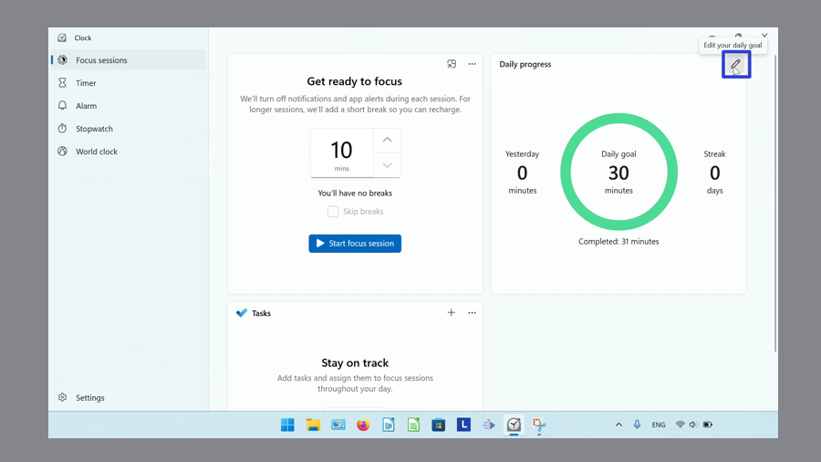
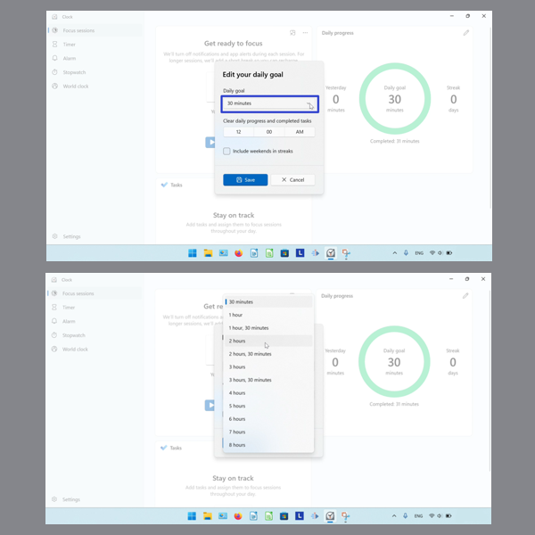
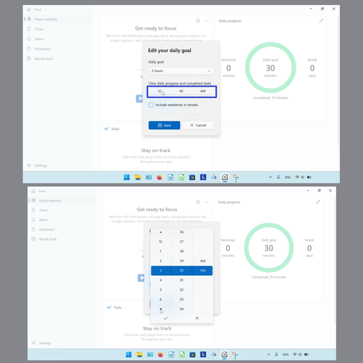
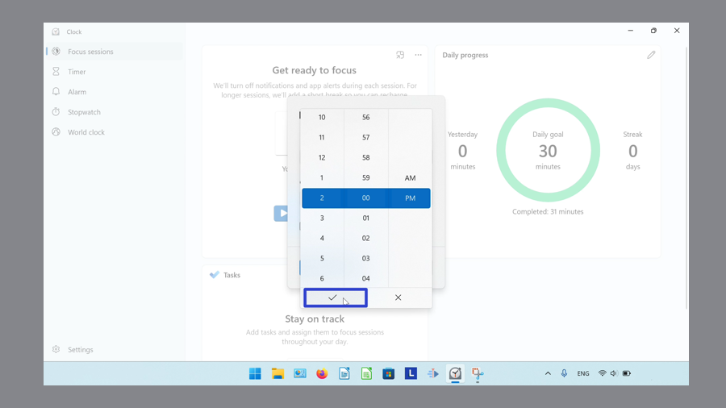
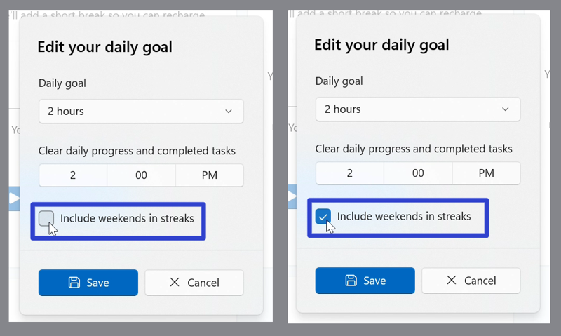
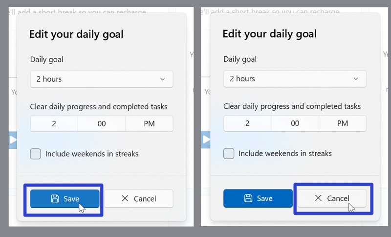
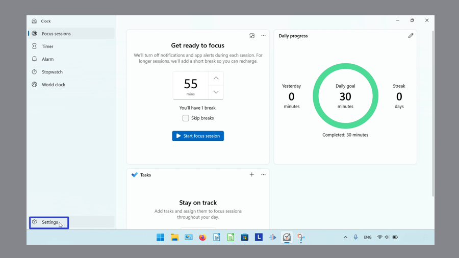
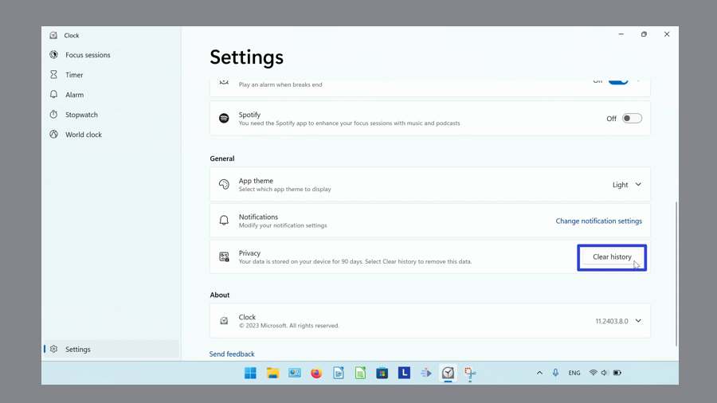

This tutorial covers:

## [How to Edit the Daily Goal](#1)

## [How to Reset the Daily Goal History](#2)

No time to scroll down? Click through these tutorial slides:

<iframe src="https://docs.google.com/presentation/d/1OGeHP5qs9pRhDasuE-bGFH_vqayM7NPbV1i-Z25Dmg4/embed?start=false&loop=false&delayms=3000" frameborder="0" width="480" height="299" allowfullscreen="true" mozallowfullscreen="true" webkitallowfullscreen="true"></iframe>

 

Watch a video tutorial:
<iframe class="BLOG_video_class" allowfullscreen="" youtube-src-id="6zky9-yunyQ" width="100%" height="416" src="https://www.youtube.com/embed/6zky9-yunyQ"></iframe>

 

<h1 id="1">How to Edit the Daily Goal</h1>

* Step 1: First [switch](https://qhtutorials.github.io/posts/how-to-edit-windows-clock-settings/) to Focus Sessions mode. Click the "Edit your daily goal" or pencil button. 

* Step 2: In the window that opens, click the "Daily goal" drop-down menu and click to select the number of minutes. 

* Step 3: Click the "Clear daily progress and completed tasks" button. Then click the arrow buttons, or the specific times, to set the time. 

* Click the check mark button to confirm. To cancel, click the "X" button or anywhere outside the window. 

* Step 4: Click to turn the "Include weekends in streaks" option on or off. 

* Step 5: Click the "Save" button to confirm. Click the "Cancel" button, or click anywhere outside the window, to cancel. 

<h1 id="2">How to Reset the Daily Goal History</h1>

Step 1: [Open](https://qhtutorials.github.io/posts/how-to-open-microsoft-windows-clock/) the Windows Clock. In the lower left click the "Settings" or gear button. 

* Step 2: Scroll down and on the far right side of the "Privacy" section, click the "Clear history" button. 

Keep a copy of these instructions for later with this free [tutorial PDF](https://drive.google.com/file/d/1SWgGc_L_iy4rIIdIQhnpbdxLbTixdDTq/view?usp=sharing).

 

