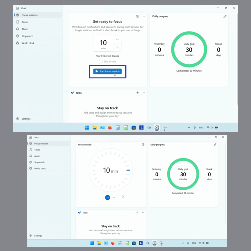
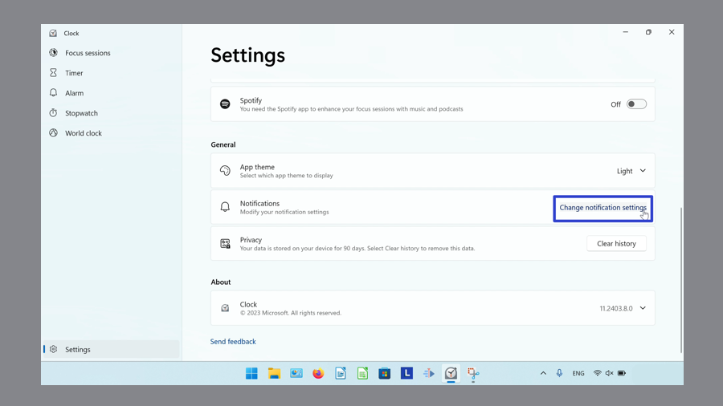
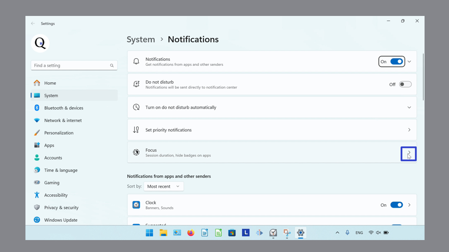
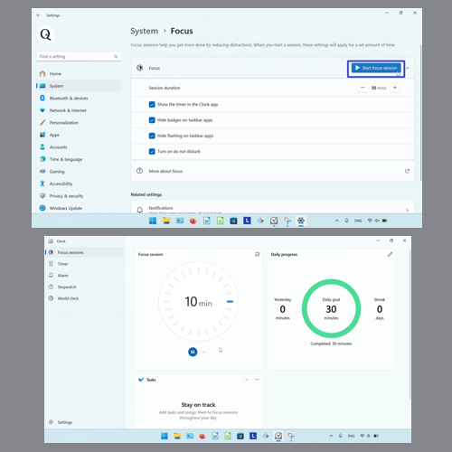
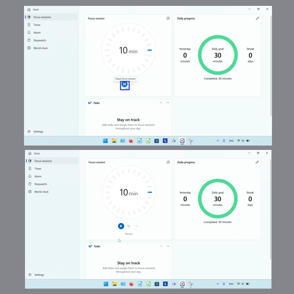
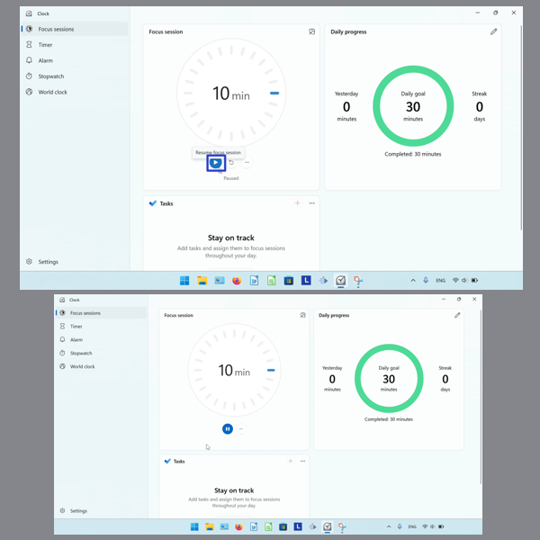
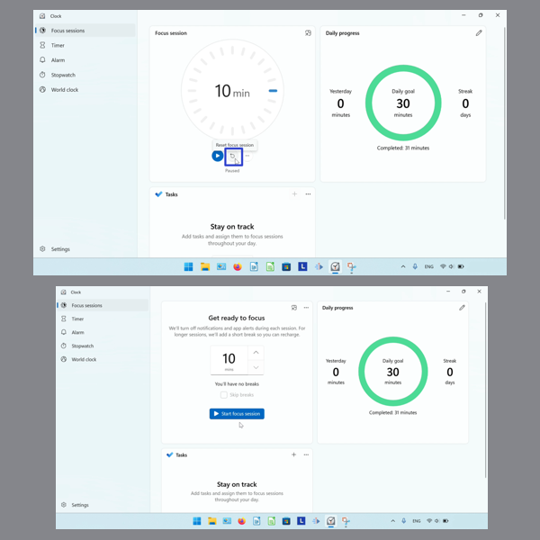
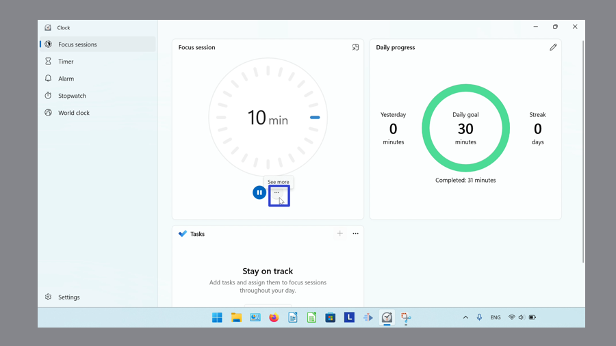
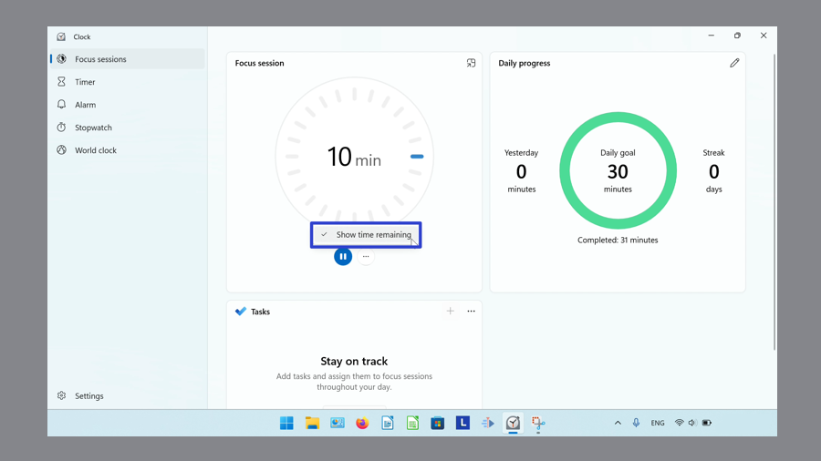
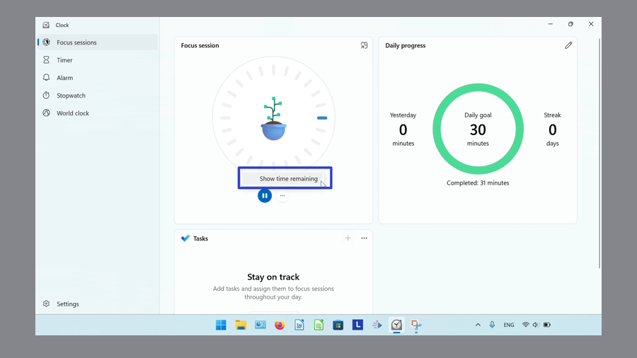

This tutorial covers:

## How to Start a Focus Session:
1. [With Click](#1)
2. [With Windows 11 Settings](#2)

## [How to Pause a Focus Session](#2)

## [How to Resume a Focus Session](#3)

## [How to Reset a Focus Session](#4)

## [How to Show Time Remaining](#5)

No time to scroll down? Click through these presentation slides:

<iframe src="https://docs.google.com/presentation/d/19oEDEH8RNSRqGAyJUNlxm3uXtoB8-l9gN-BOcLg_Zxc/embed?start=false&loop=false&delayms=3000" frameborder="0" width="480" height="299" allowfullscreen="true" mozallowfullscreen="true" webkitallowfullscreen="true"></iframe>

 

Watch a tutorial video:
<iframe class="BLOG_video_class" allowfullscreen="" youtube-src-id="ePuYl14m6Sc" width="100%" height="416" src="https://www.youtube.com/embed/ePuYl14m6Sc"></iframe>

 

<h1 id="1">How to Start a Focus Session With Click</h1>

* Step 1: First [switch](https://qhtutorials.github.io/posts/how-to-edit-windows-clock-settings/) to Focus Sessions mode. Click the "Start focus session" button. 

<h1 id="2">How to Start a Focus Session With Windows 11 Settings</h1>

* Step 1: [Open](https://qhtutorials.github.io/posts/how-to-open-microsoft-windows-clock-/) the Windows Clock. In the lower left, click the "Settings" or gear button. 

* Step 2: Scroll down and on the right side of the "Notifications" section, click the "Change notification settings" option. 

* Step 3: In the Windows 11 Settings window that opens, on the far right side of the "Focus" section click the drop-down menu arrow. 

* Step 4: Click the "Start focus session" button. 

<h1 id="3">How to Pause a Focus Session</h1>

* Step 1: First [start](#1) a Focus Session. Click the "Pause" button. 

 

<h1 id="4">How to Resume a Focus Session</h1>

* Step 1: [Pause](#3) a Focus Session. Click the "Resume" button. 

 

<h1 id="5">How to Reset a Focus Session</h1>

* Step 1: First [pause](#3) a Focus Session. Click the "Reset" button. 

 

<h1 id="6">How to Show Time Remaining</h1>

* Step 1: [Start](#1) a Focus Session. Click the "See more" or "..." button. 

 
* Step 2: In the menu that opens, click to turn "Show time remaining" on or off. 

- "Show time remaining" on 

- "Show time remaining" off 

Refer to these instructions for later with this free [PDF tutorial](https://drive.google.com/file/d/1y1XOd0CHuScKqC3YqBj5HTDvX6FAtH9a/view?usp=sharing).

 

