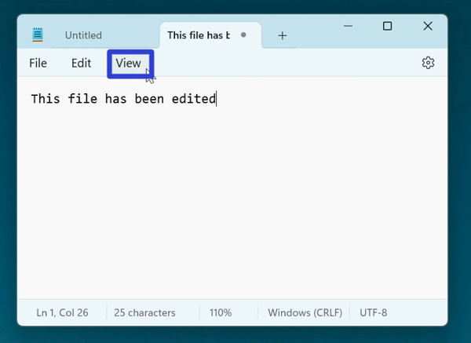
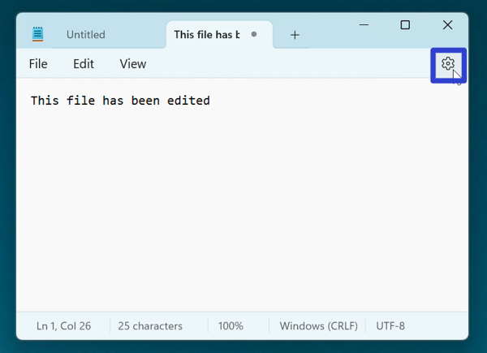
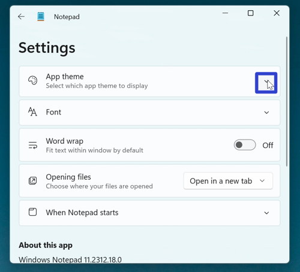
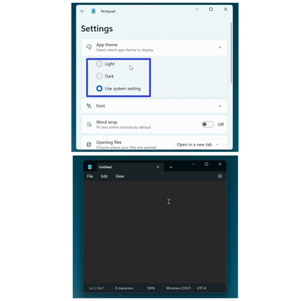

This tutorial covers:

## [How to Add/Remove the Status Bar](#1)

## How to Add/Remove Word Wrap
1. [With Menu](#2)
2. [With Settings](#3)

## [How to Change the Notepad App Theme Color](#4)

 

No time to scroll down? Click through these presentation slides:

<iframe src="https://docs.google.com/presentation/d/e/2PACX-1vS_70fVYZ4YfihWtwODhvr3XiTdg0HRXZYtKLjvdJckKu9bUhX_XB09HOsv-gAk0_RnUDpYNQQbv3S7/embed?start=false&loop=false&delayms=3000" frameborder="0" width="480" height="299" allowfullscreen="true" mozallowfullscreen="true" webkitallowfullscreen="true"></iframe>

 

Watch a tutorial video:
<iframe class="BLOG_video_class" allowfullscreen="" youtube-src-id="IkkAJVVAbxs" width="100%" height="416" src="https://www.youtube.com/embed/IkkAJVVAbxs"></iframe>

<h1 id="1">How to Add/Remove the Status Bar</h1>

* Step 1: First [open](https://qhtutorials.github.io/posts/how-to-open-notepad/) Notepad. In the upper left click the "View" button. 

* Step 2: In the menu that opens, click "Status bar" to toggle this option on or off. When "Status bar" is enabled, the status bar appears at the bottom of the Notepad window. When "Status bar" is disabled, the bottom of the Notepad window is blank. 

<h1 id="2">How to Add/Remove Word Wrap With Menu</h1>

* Step 1: [Open](https://qhtutorials.github.io/posts/how-to-open-notepad/) Notepad. In the lower left click the "View" button. 

* Step 2: In the menu that opens, click "Word wrap" to toggle this option on or off. When "Word wrap" is on, the bottom of the Notepad window does not display a horizontal scroll bar. When "Word wrap" is off, the bottom of the Notepad window displays a horizontal scroll bar. 

<h1 id="3">How to Add/Remove Word Wrap With Settings</h1>

* Step 1: First [open](https://qhtutorials.github.io/posts/how-to-open-notepad/) Notepad. In the upper right click the "Settings" or gear button. 

* Step 2: In the Settings window that opens, click under the "Word wrap" section to toggle this option on or off. When "Word wrap" is on the Notepad window does not display a horizontal scroll bar. When "Word wrap" is off, the Notepad window displays a horizontal scroll bar.  

<h1 id="4">How to Change the Notepad App Theme Color</h1>

* Step 1: [Open](https://qhtutorials.github.io/posts/how-to-open-notepad/) Notepad. In the upper right click the "Settings" or gear button. 

* Step 2: In the Settings window that opens, go to the far right side of the "App theme" section and click the down arrow. 

* Step 3: In the menu that opens, click to select "Light", "Dark", or "Use system setting". 

Refer to these instructions later with this free [PDF tutorial](https://drive.google.com/file/d/1psmsqI5KYCRHJ7VCSvXim30e1FvmLPB8/view?usp=sharing).

 

