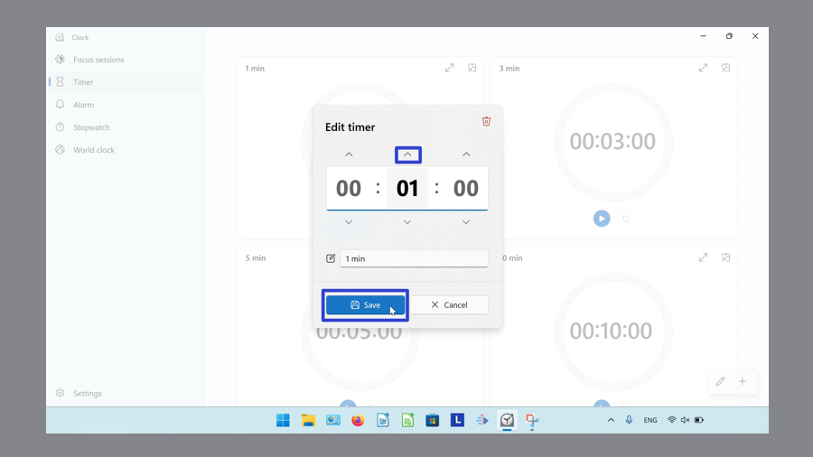

This tutorial covers:

## How to Edit the Timer Length:
1. [With Click](#1)
2. [With Keyboard](#2)
3. [With Right Click](#3)

## How to Edit the Timer Name:
1. [With Click](#4)
2. [With Menu](#5)
3. [With Right Click](#6)
4. [With Keyboard Shortcuts](#7)

## How to Clear the Timer Name:
1. [With Click](#8)
2. [With Keyboard](#9)

## [How to Exit the Timer Name Window](#10)

No time to scroll down? Click through this presentation tutorial:

<iframe src="https://docs.google.com/presentation/d/1v7-2jOswRI_HKpB_E7mt4ywnpZ7-LkfqeKNs5QiApeM/embed?start=false&loop=false&delayms=3000" frameborder="0" width="480" height="299" allowfullscreen="true" mozallowfullscreen="true" webkitallowfullscreen="true"></iframe>

 

See a tutorial video:
<iframe class="BLOG_video_class" allowfullscreen="" youtube-src-id="f1JGHTZlXa4" width="100%" height="416" src="https://www.youtube.com/embed/f1JGHTZlXa4"></iframe>

 

<h1 id="1">How to Edit the Timer Length With Click</h1>

* Step 1: First [switch](https://qhtutorials.github.io/posts/how-to-edit-windows-clock-settings/) to Timer mode. Click anywhere on a Timer. 

* Step 2: In the "Edit timer" window that opens, click the up and down arrow buttons to set the time. 

* Step 3: Click the "Save" button. 

 
* The Timer displays the edited time. 

<h1 id="2">How to Edit the Timer Length With Keyboard</h1>

Step 1: [Switch](https://qhtutorials.github.io/posts/how-to-edit-windows-clock-settings/) to the Timer mode. Click anywhere on a Timer. 

* Step 2: In the "Edit timer" window that opens, click the time. On the keyboard, type a number. 

* Step 3: Click the "Save" button. 

* The Timer displays the edited time. 

<h1 id="3">How to Edit the Timer Length With Right Click</h1>

* Step 1: First [switch](https://qhtutorials.github.io/posts/how-to-edit-windows-clock-settings/) to Timer mode. Right click a Timer. 

* Step 2: In the menu that opens, click "Edit". 

* Step 3: In the "Edit timer" window that opens, click the arrow buttons to set the time. Click the "Save" button. 

* The Timer displays the edited time. 

<h1 id="4">How to Edit the Timer Name With Click</h1>

* Step 1: [Switch](https://qhtutorials.github.io/posts/how-to-edit-windows-clock-settings/) to the Timer mode. Click anywhere on a Timer. 

* Step 2: In the "Edit timer" window that opens, click the "Timer Name" field and type any text. 

* Step 3: In the "Edit timer" window that opens, click the arrow buttons to set the time. Click the "Save" button. 

* The Timer displays the updated name. 

<h1 id="5">How to Edit the Timer Name With Menu</h1>

* Step 1: First [switch](https://qhtutorials.github.io/posts/how-to-edit-windows-clock-settings/) to Timer mode. Right click a Timer. 

* Step 2: In the menu that opens, click "Edit". 

* Step 3: In the "Edit timer" window that opens, click the "Timer Name" field. Type any text, and click the "Save" button. 

* The Timer displays the updated name. 

<h1 id="6">How to Edit the Timer Name With Right Click</h1>

* Step 1: [Switch](https://qhtutorials.github.io/posts/how-to-edit-windows-clock-settings/) to the Timer mode. Click anywhere on a Timer. 

* Step 2: In the "Edit timer" window that opens, right click the "Timer Name" field. 

* Step 3: In the menu that opens, click one of the following:

- "Select All" to select the text. 

- "Copy" to copy the text. 

- "Cut" to cut the text. 

- "Paste" to paste the text. 

- "Undo" to reverse the last action. 

- "Redo" to reverse the last Undo.

<h1 id="7">How to Edit the Timer Name With Keyboard Shortcuts</h1>

* Step 1: First [switch](https://qhtutorials.github.io/posts/how-to-edit-windows-clock-settings/) to Timer mode. Click anywhere on a Timer. 

* Step 2: In the "Edit timer" window that opens, click the "Timer Name" field. 

* Step 3: On the keyboard, press one of the following:

- **Ctrl + A** to select all the text. 

- **Ctrl + C** to copy the text. 

- **Ctrl + X** to cut the text. 

- **Ctrl + V** to paste the text. 

- **Ctrl + Z** to Undo. 

- **Ctrl + Y** to Redo. 

<h1 id="8">How to Clear the Timer Name With Click</h1>

* Step 1: [Edit](#4) the Timer name. Click the "X" button. 

<h1 id="9">How to Clear the Timer Name With Keyboard</h1>

* Step 1: First [edit](#4) the Timer name. On the keyboard press **Delete** or **Backspace**. 

* The "Timer Name" field becomes empty. 

<h1 id="10">How to Exit the "Edit Timer" Window</h1>

* Step 1: [Edit](#1) a Timer. Click the "Cancel" button. 

Keep these instructions for later with this free [PDF tutorial](https://drive.google.com/file/d/1K8P7xqS9BMnDHksZauLpEdxRRE2vFRoF/view?usp=sharing).

 

