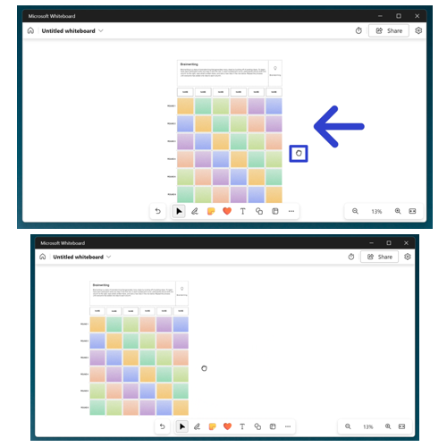
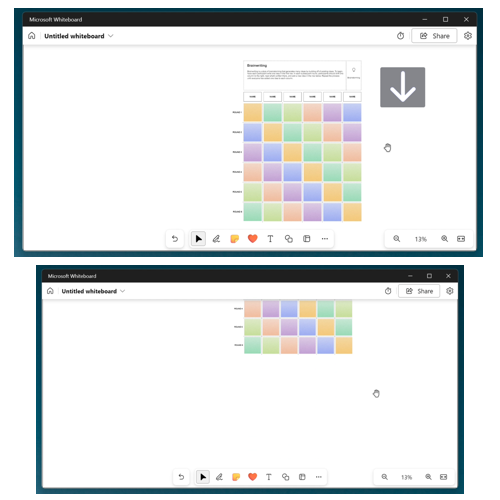
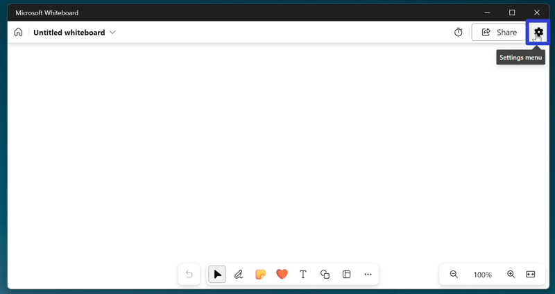
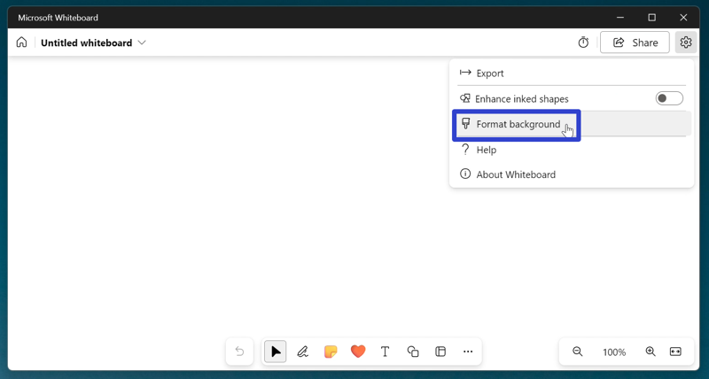
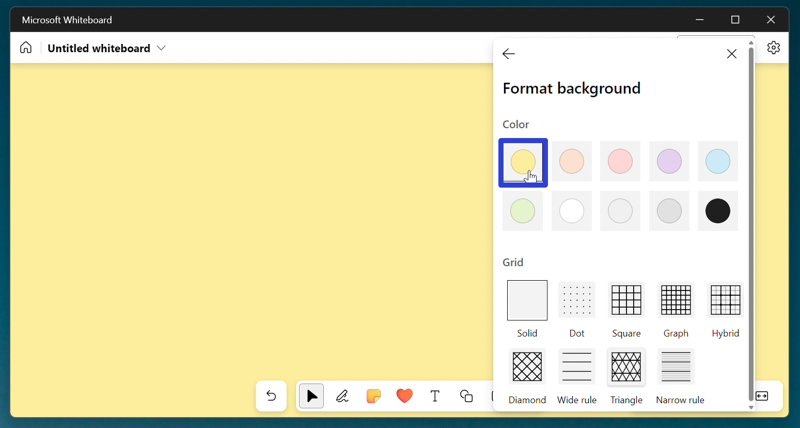
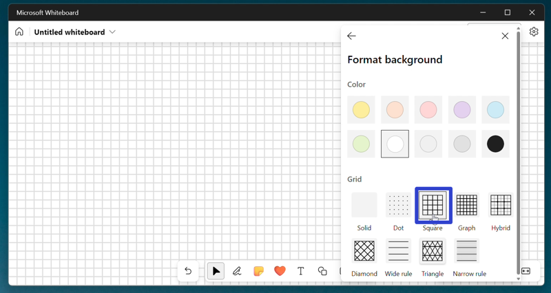
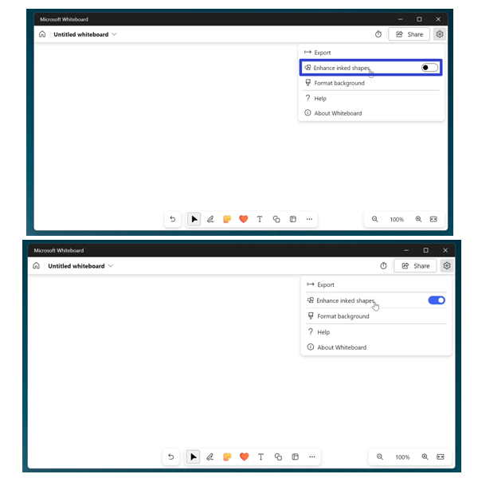
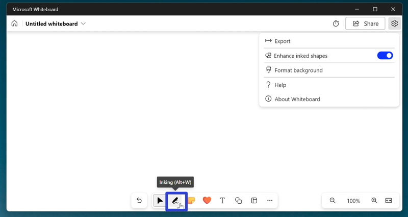
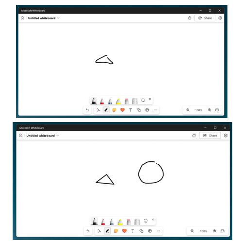

This tutorial covers:

## How to Pan Across the Canvas:
1. [With Click](#1)
2. [With Keyboard](#2)

## [How to Change the Whiteboard Color](#3)

## [How to Change the Whiteboard Background](#4)

## [How to Enhance Inked Shapes](#5)

No time to scroll down? Click through this tutorial presentation:

<iframe src="https://docs.google.com/presentation/d/e/2PACX-1vRNp47Y50OoL8luIsr4eJ6TaJ6FvnnNRPofqDmYBTn9YBS640RK2WLr9lFvriwx1qm_XovNS3HM_cHk/embed?start=false&loop=false&delayms=3000" frameborder="0" width="480" height="299" allowfullscreen="true" mozallowfullscreen="true" webkitallowfullscreen="true"></iframe>

 

Follow along with a video tutorial:
<iframe class="BLOG_video_class" allowfullscreen="" youtube-src-id="e6S67M4-_ow" width="100%" height="416" src="https://www.youtube.com/embed/e6S67M4-_ow"></iframe>

 

<h1 id="1">How to Pan Across the Canvas With Mouse</h1>

* Step 1: First [open](https://qhtutorials.github.io/posts/how-to-open-microsoft-whiteboard/) a whiteboard template. Click, hold, and drag the mouse in any direction to pan across the canvas. Release the mouse to stop panning across the canvas. 

<h1 id="2">How to Pan Across the Canvas With Keyboard</h1>

* Step 1: [Open](https://qhtutorials.github.io/posts/how-to-open-microsoft-whiteboard/) a whiteboard template. On the keyboard press the **arrow** keys to pan across the canvas. 

<h1 id="3">How to Change the Whiteboard Color</h1>

* Step 1: First [open](https://qhtutorials.github.io/posts/how-to-open-microsoft-whiteboard/) a blank whiteboard. In the upper right click the "Settings menu" or gear button. 

* Step 2: In the menu that opens, click "Format background". 

* Step 3: In the menu that opens, click to select a color. 

<h1 id="4">How to Change the Whiteboard Background"</h1>

* Step 1: [Open](https://qhtutorials.github.io/posts/how-to-open-microsoft-whiteboard/) a blank whiteboard. In the upper right click the "Settings menu" or gear button. 

* Step 2: In the menu that opens, click "Format background". 

* Step 3: In the menu that opens, click to select a background. 

<h1 id="5">How to Enhance Inked Shapes</h1>

* Step 1: First [open](https://qhtutorials.github.io/posts/how-to-open-microsoft-whiteboard/) a blank whiteboard. In the upper right click the "Settings menu" or gear button. 

* Step 2: In the menu that opens, click to toggle the "Enhance inked shapes" option on. 

* Step 3: Go down to the bottom toolbar and click the "Inking" button. 

* Step 4: Draw any shape. Microsoft Whiteboard automatically converts the Ink object into a shape. 

Save a copy of these instructions for later with this free [tutorial PDF](https://drive.google.com/file/d/1cj_BBdshwwPUOhHTtt3w_sozsDti7mXc/view?usp=sharing).

 

