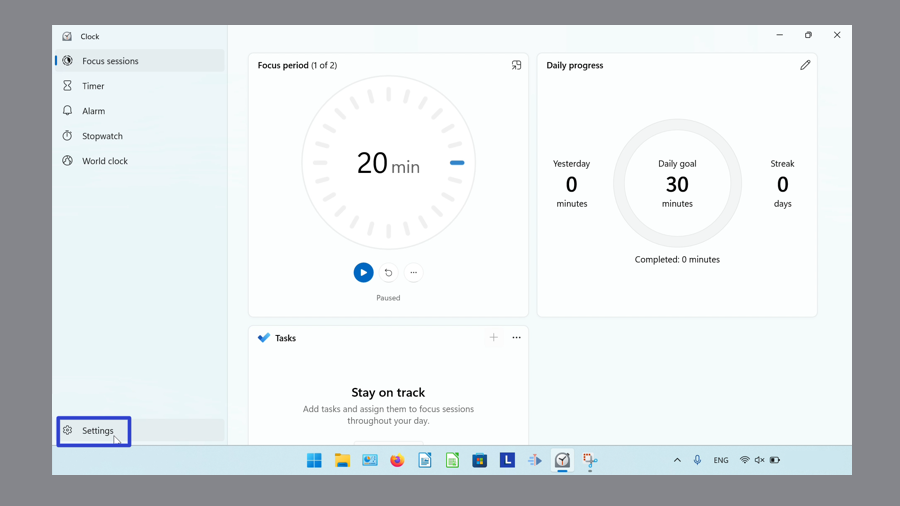

This tutorial covers:

## [How to Change the Windows Clock Theme Color](#1)

## How to Switch Between Clock Modes:
1. [With Click](#2)
2. [With Keyboard Shortcuts](#3)

## [How to Keep Windows Clock on Top](#4)

## [How to Return Windows Clock Back to Full View](#5)

## [How to Expand a Windows Clock Mode](#6)

## [How to Restore a Windows Clock Mode](#7)

## [How to Customize Notification Settings](#8)

No time to scroll down? Click through this presentation tutorial:

<iframe src="https://docs.google.com/presentation/d/10N-vU1mYL0ag-dlYpp2Op2fvaKj5nBUfy1LHXe2z0tg/embed?start=false&loop=false&delayms=3000" frameborder="0" width="480" height="299" allowfullscreen="true" mozallowfullscreen="true" webkitallowfullscreen="true"></iframe>

 

Watch a tutorial video:
<iframe class="BLOG_video_class" allowfullscreen="" youtube-src-id="CjopvrAw5IY" width="100%" height="416" src="https://www.youtube.com/embed/CjopvrAw5IY"></iframe>

 

<h1 id="1">How to Change the Windows Clock Theme Color</h1>

* Step 1: First [open](https://qhtutorials.github.io/posts/how-to-open-microsoft-windows-clock/) Windows Clock. In the lower left click the "Settings" or gear button. 

* Step 2: In the Settings window that opens, scroll down to the "General" section. On the far right side of the "App theme" section, click the drop-down menu arrow. 

* Step 3: In the menu that opens, click to select "Light", "Dark", or "Use system setting". 

* Step 4: Close and reopen the Windows Clock app to view the new color theme. 

<h1 id="2">How to Switch Between Clock Modes With Click</h1>

Step 1: [Open](https://qhtutorials.github.io/posts/how-to-open-microsoft-windows-clock/) Windows Clock. Go to the left menu, and click one of the buttons to switch to the corresponding clock mode: 
- Click the "Focus sessions" button to switch to the Focus Sessions mode. 

- Click the "Timer" button to switch to the Timer mode. 

- Click the "Alarm" button to switch to the Alarm mode. 

- Click the "Stopwatch" button to switch to the Stopwatch mode. 

 
- Click the "World clock" button to switch to the "World clock" mode. 

 

<h1 id="3">How to Switch Between Clock Modes With Keyboard Shortcuts</h1>

Step 1: First [open](https://qhtutorials.github.io/posts/how-to-open-microsoft-windows-clock/) Windows Clock. On the keyboard: 
- Press **Alt +1** to switch to the Focus Sessions mode. 

 
- Press **Alt + 2** to switch to the Timer mode. 

 
- Press **Alt + 3** to switch to the Alarm mode. 

 
- Press **Alt + 4** to switch to the Stopwatch  mode. 

 
- Press **Alt + 5** to switch to the World clock mode. 

 

<h1 id="4">How to Keep the Windows Clock on Top</h1>

* Step 1: [Switch](#2) to the Focus Sessions, Timer, or Stopwatch modes. Click the "Keep on top" button. 

  

<h1 id="5">How to Return Windows Clock Back to Full View</h1>

* Step 1: First [place the Windows Clock on top](#4), then click the "Back to full view" button. 

 

<h1 id="6">How to Expand a Windows Clock Mode</h1>

* Step 1: [Switch](#2) to the Timer or Stopwatch modes. Click the "Expand" button. 

 

<h1 id="7">How to Restore a Windows Clock Mode</h1>

* Step 1: First [expand](#6) a Windows Clock mode. Click the "Restore" button. 

 

<h1 id="8">How to Customize Notification Settings</h1>

* Step 1: [Open](https://qhtutorials.github.io/posts/how-to-open-microsoft-windows-clock/) Windows Clock. In the lower left, click the "Settings" or gear button. 

* Step 2: Scroll down and on the far right side of the "Notifications" section, click "Change notification settings". 

* Step 3: In the Windows 11 Settings window that opens, go to the far right side of the "Focus section" and click the drop-down menu arrow. 

* Step 4: Click to toggle "Show the timer in the Clock app" on or off. 

* Click to toggle "Hide badges on taskbar apps" on or off. 

* Click to toggle "Hide flashing on taskbar apps" on or off. 

* Click to toggle "Turn on do not distrub" on or off. 

Refer to these instructions for later with this free [tutorial PDF](https://drive.google.com/file/d/1T8wb28c1i0vb1ZqRCiR4Y5O2HlzVTlZH/view?usp=sharing).

 

