This tutorial covers:

## How to Copy an Object:
1. [With Click](#1)
2. [With Keyboard Shortcut](#2)
3. [With Menu](#3)

## How to Paste an Object:
1. [With Right Click](#4)
2. [With Keyboard Shortcut](#5)

## [How to Change the Color of a Shape](#6)

## [How to Change the Border Color of a Shape](#7)

## [How to Change the Color of a Sticky Note](#8)

No time to scroll down? Click through this tutorial presentation:

<iframe src="https://docs.google.com/presentation/d/e/2PACX-1vRVrX4iRw1gqSIhlm2A8qvlr_XqlYas6nh_xo4KpCkm2anriJ8StpTeE6u5-hrn30VNB35PfCqa-Ryg/embed?start=false&loop=false&delayms=3000" frameborder="0" width="480" height="299" allowfullscreen="true" mozallowfullscreen="true" webkitallowfullscreen="true"></iframe>

 

See a video tutorial:
<iframe class="BLOG_video_class" allowfullscreen="" youtube-src-id="YK6gQOkqOeU" width="100%" height="416" src="https://www.youtube.com/embed/YK6gQOkqOeU"></iframe>

 

<h1 id="1">How to Copy an Object With Click</h1>

* Step 1: First [select](https://qhtutorials.github.io/posts/how-to-edit-objects-in-whiteboard/) an object. In the menu that opens, click the "Copy" or double squares button. 
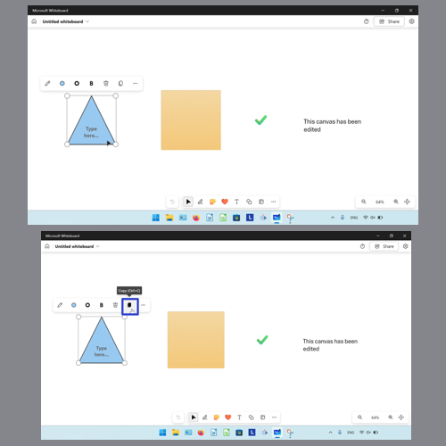

<h1 id="2">How to Copy an Object With Keyboard Shortcut</h1>

* Step 1: [Select](https://qhtutorials.github.io/posts/how-to-edit-objects-in-whiteboard/) an object. On the keyboard press **Ctrl + C**. 
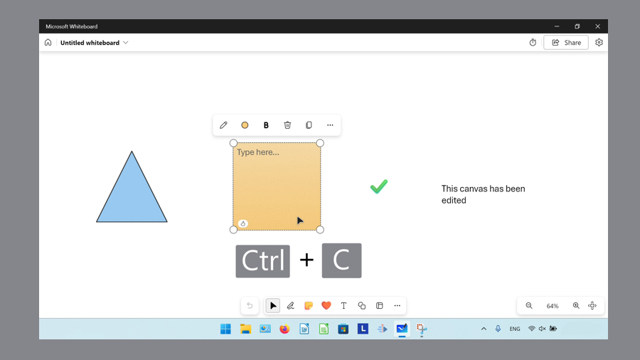

<h1 id="3">How to Copy an Object With Menu</h1>

* Step 1: First [select](https://qhtutorials.github.io/posts/how-to-edit-objects-in-whiteboard/) an object. In the menu that opens, click the "More" or "..." button. 
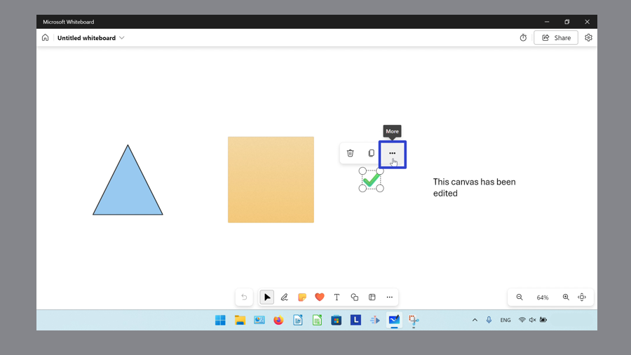

* Step 2: In the menu that opens, click "Duplicate". 
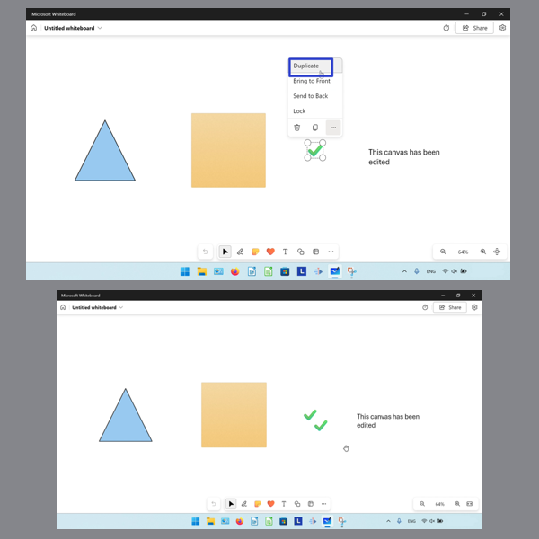

<h1 id="4">How to Paste an Object With Right Click</h1>

* Step 1: [Copy](#1) an object. Right click anywhere on the canvas. 
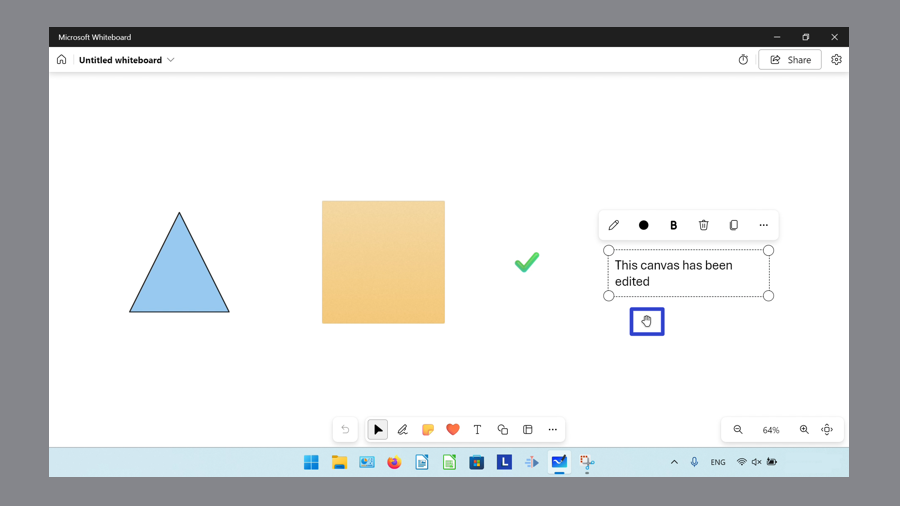

* Step 2: In the menu that opens, click "Paste". 
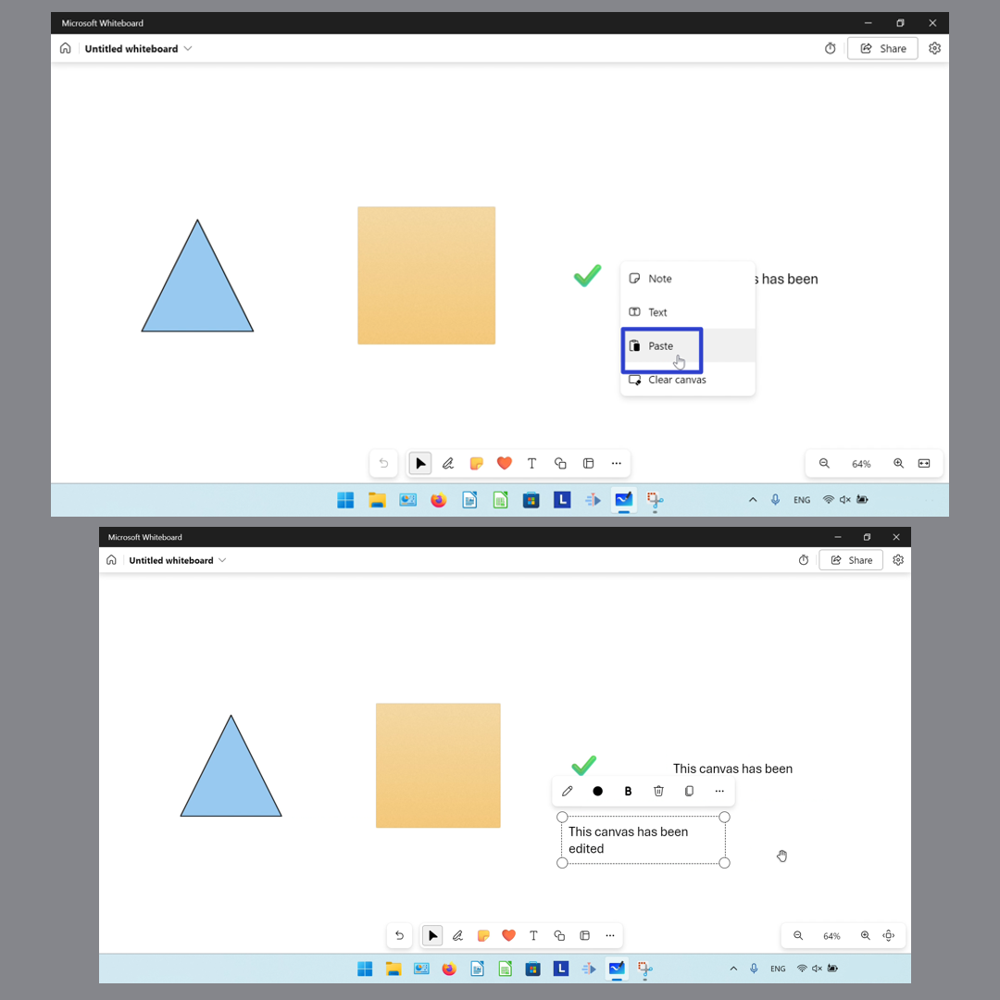

<h1 id="5">How to Paste an Object With Keyboard Shortcut</h1>

* Step 1: First [copy](#1) an object. On the keyboard press **Ctrl + V**. 
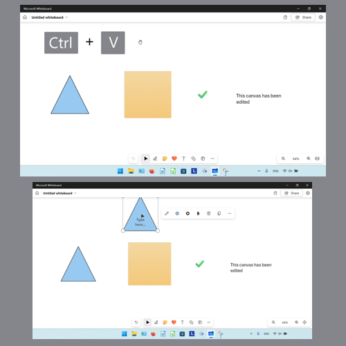

<h1 id="6">How to Change the Color of a Shape</h1>

* Step 1: [Select](https://qhtutorials.github.io/posts/how-to-edit-objects-in-whiteboard/) a shape object. In the menu that opens, click the "Shape color picker" button. 
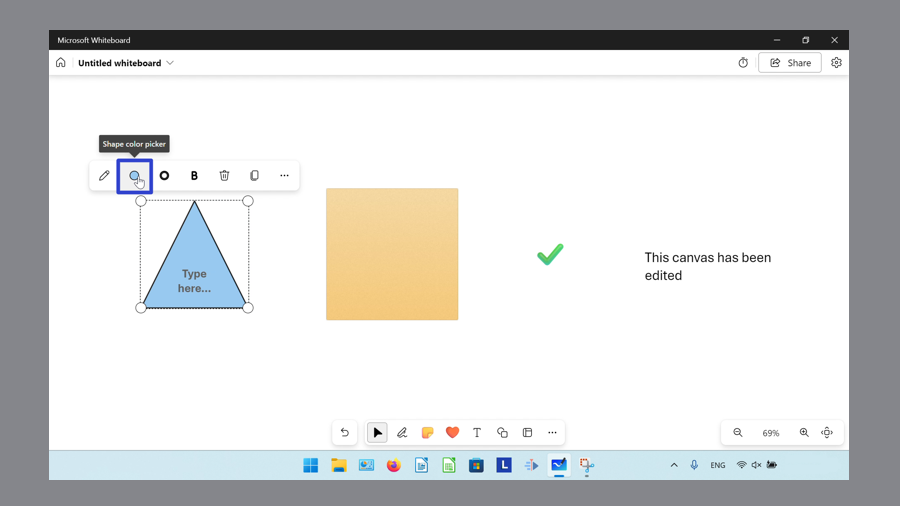

* Step 2: In the menu that opens, click to select a color. 
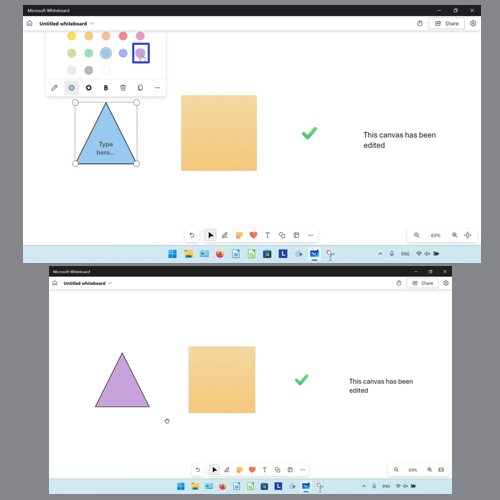

<h1 id="7">How to Change the Border Color of a Shape</h1>

* Step 1: First [select](https://qhtutorials.github.io/posts/how-to-edit-objects-in-whiteboard/) a shape object. In the menu that opens, click the "Shape border color picker" button. 
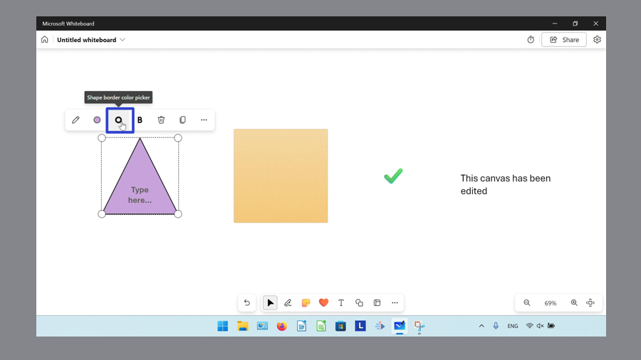

* Step 2: In the menu that opens, click to select a color. 

<h1 id="8">How to Change the Color of a Sticky Note</h1>

* Step 1: [Select](https://qhtutorials.github.io/posts/how-to-edit-objects-in-whiteboard/) a sticky note, and in the menu that opens, click the "Background color picker" button. 
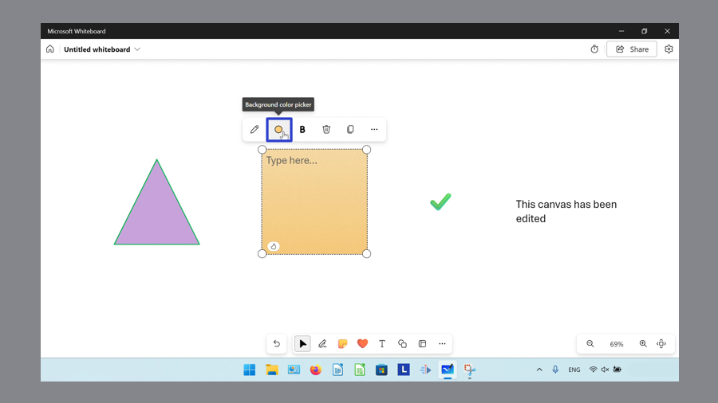

* Step 2: In the menu that opens, click to select a color. 
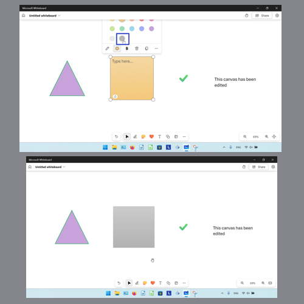

Save a copy of these instructions for later with this free [tutorial PDF](https://drive.google.com/file/d/1hJLEt-sRH0s-hc2Oxgj28b2QsOSjP4ET/view?usp=sharing).

 

