This tutorial covers:

## How to Format Text:
1. [With Click](#1)
2. [With Keyboard Shortcut](#2)

## How to Copy Text:
1. [With Right Click](#3)
2. [With Keyboard Shortcut](#4)

## How to Cut Text:
1. [With Right Click](#5)
2. [With Keyboard Shortcut](#6)

## How to Paste Text:
1. [With Right Click](#7)
2. [With Keyboard Shortcut](#8)

 

No time to scroll down? Click through these tutorial slides:

<iframe src="https://docs.google.com/presentation/d/e/2PACX-1vQDFOyInWFYbWXIrn_5Lw54jZO0AAyDWEuuxToGmkRLBT2RTVqU6wjC3TY3uQZsEC00--AsQQa2qi6v/embed?start=false&loop=false&delayms=3000" frameborder="0" width="480" height="299" allowfullscreen="true" mozallowfullscreen="true" webkitallowfullscreen="true"></iframe>

 

Follow along with a tutorial video:
<iframe class="BLOG_video_class" allowfullscreen="" youtube-src-id="v_zEuRPAgc0" width="100%" height="416" src="https://www.youtube.com/embed/v_zEuRPAgc0"></iframe>

<h1 id="1">How to Format Text With Click</h1>

* Method 1: First [edit](https://qhtutorials.github.io/posts/how-to-edit-a-sticky-note/) a sticky note and select any text. At the bottom of the sticky note, click one of the formatting buttons to add or remove that formatting. 
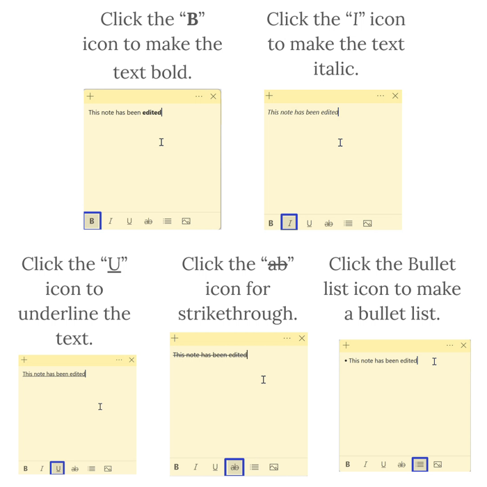

* Method 2: [Open](https://qhtutorials.github.io/posts/how-to-open-a-sticky-note/) a sticky note, click one of the formatting buttons at the bottom, and type any text. The Sticky Notes app automatically applies that formatting to the text. 
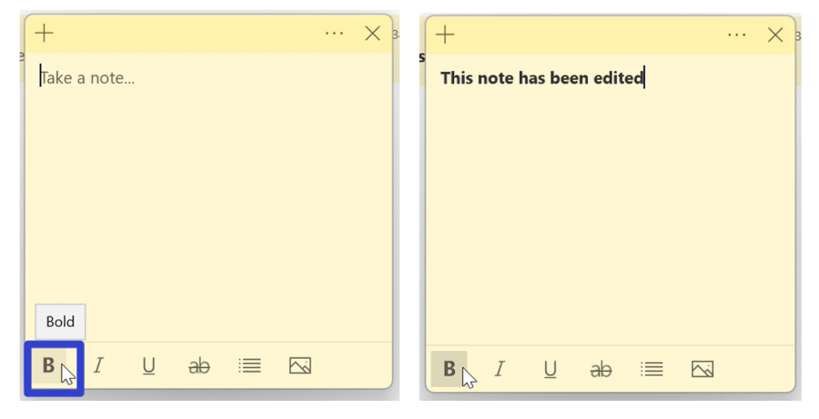

<h1 id="2">How to Format Text With Keyboard Shortcut</h1>

* Step 1: First [edit](https://qhtutorials.github.io/posts/how-to-edit-a-sticky-note/) a sticky note and select any text. On the keyboard, press:
    - **Ctrl + B** to add or remove bold formatting.
    - **Ctrl + I** to add or remove italic formatting.
    - **Ctrl + U** to add or remove underlined formatting.
    - **Ctrl + T** to add or remove strikethrough formatting.
    - **Ctrl + Shift + L** to add or remove bullet point formatting. 
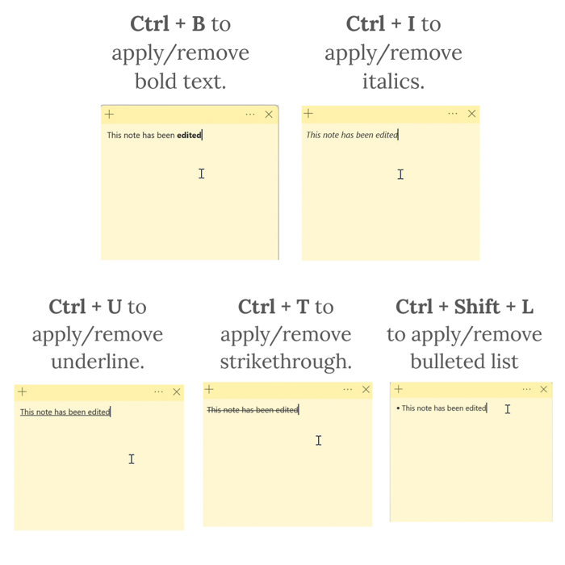

<h1 id="3">How to Copy Text With Right Click</h1>

* Step 1: [Edit](https://qhtutorials.github.io/posts/how-to-edit-a-sticky-note/) a sticky note and select any text. Right click anywhere in the sticky note. 
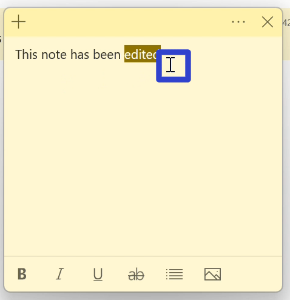

* Step 2: In the menu that opens, click "Copy". 
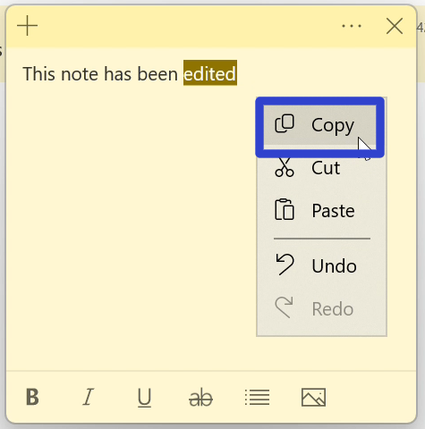
 

<h1 id="4">How to Copy Text With Keyboard Shortcut</h1>

* Step 1: First [edit](https://qhtutorials.github.io/posts/how-to-edit-a-sticky-note/) a sticky note and select any text. On the keyboard press **Ctrl + C**. 
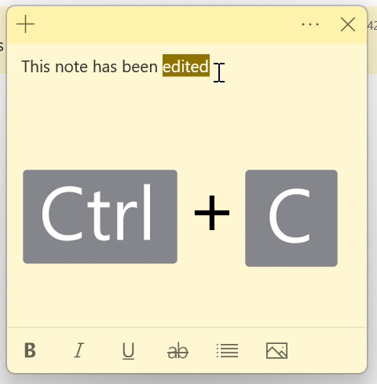
 

<h1 id="5">How to Cut Text With Right Click</h1>

* Step 1: [Edit](https://qhtutorials.github.io/posts/how-to-edit-a-sticky-note/) a sticky note and select any text. Right click anywhere in the sticky note. 
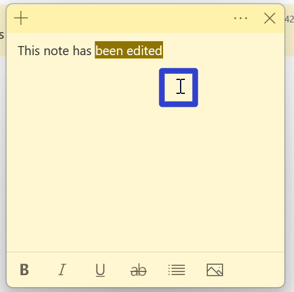

* Step 2: In the menu that opens, click "Cut". The Sticky Notes app copies and removes the text. 
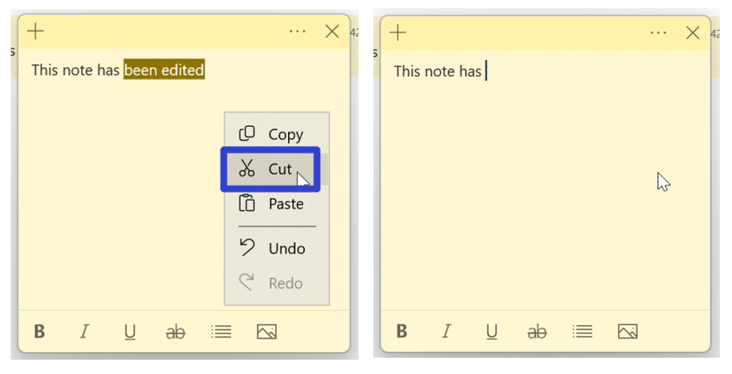

<h1 id="6">How to Cut Text With Keyboard Shortcut</h1>

* Step 1: First [edit](https://qhtutorials.github.io/posts/how-to-edit-a-sticky-note/) a sticky note and select any text. On the keyboard press **Ctrl + X**. 
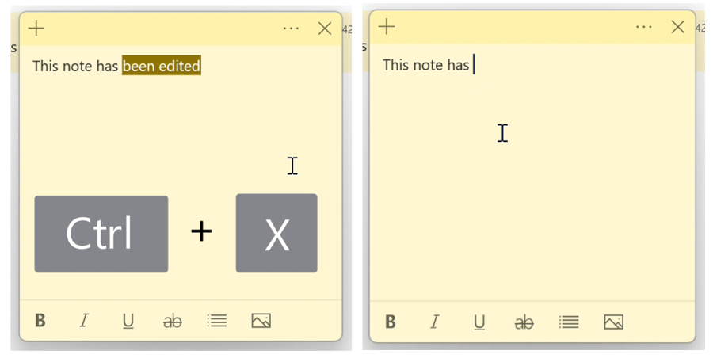

<h1 id="7">How to Paste Text With Right Click</h1>

* Step 1: [Copy](#4) or [cut](#6) text in a sticky note. Right click anywhere in the sticky note. 
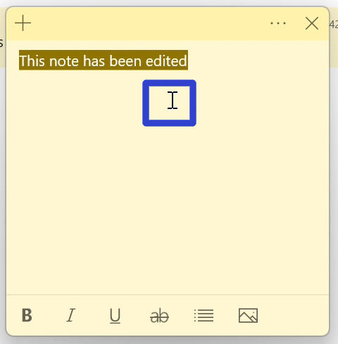

* Step 2: In the menu that opens, click "Paste". 
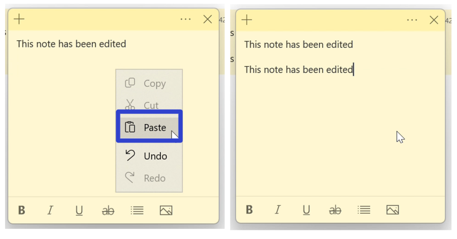

<h1 id="8">How to Paste Text With Keyboard Shortcut</h1>

* Step 1: First [copy](#4) or [cut](#6) text in a sticky note. On the keyboard press **Ctrl + V**. 
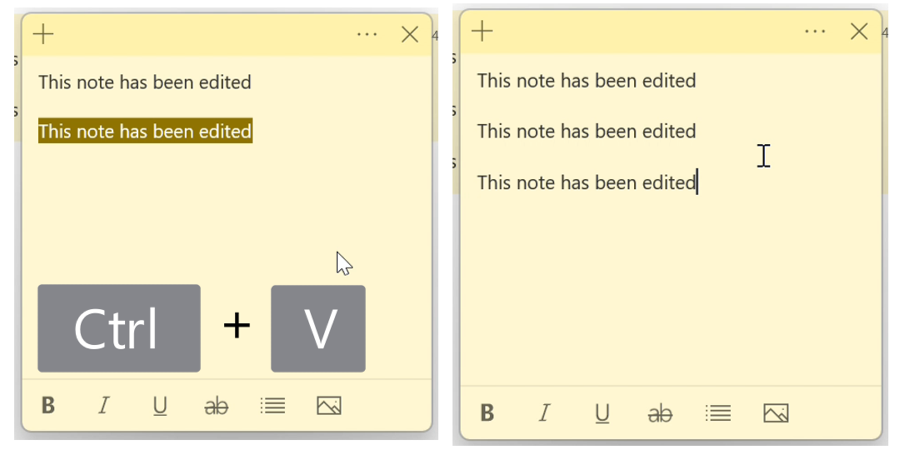

Save these instructions for later with this free [tutorial PDF](https://drive.google.com/file/d/1Y2b2Km_e5DHcvzJ8jx3JpzPOyungCSD9/view?usp=sharing).

 

