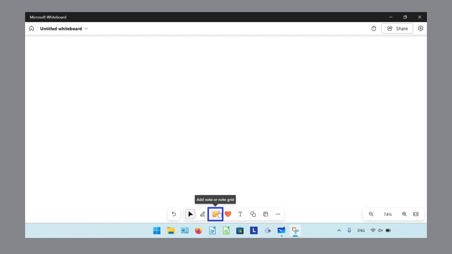
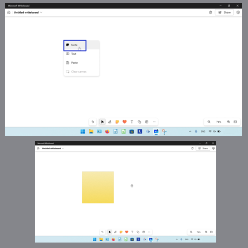

This tutorial covers:

## How to Change an Ink Object to a Shape:
1. [With Click](#1)
2. [With Keyboard](#2)

## How to Insert a Sticky Note:
1. [With Click](#3)
2. [With Right Click](#4)
3. [From a Note Grid](#5)

## [How to Insert a Note Grid](#6)

## How to Insert a Reaction:
1. [With Click](#7)
2. [Into a Sticky Note](#8)

## How to Insert Text:
1. [With Click](#9)
2. [With Right Click](#10)

## [How to Insert Shapes](#11)

## How to Undo:
1. [With Click](#12)
2. [With Keyboard](#13)

## How to Redo:
1. [With Click](#14)
2. [With Keyboard](#15)

No time to scroll down? Click through this tutorial presentation:

<iframe src="https://docs.google.com/presentation/d/e/2PACX-1vTU2BQ9r_YSkM3oc-hr3JQLtWhSevl3xEBYmy3GjbgXKCHNX-WCbWMYw40g0n4MbTncAK366vzPFP_X/embed?start=false&loop=false&delayms=3000" frameborder="0" width="480" height="299" allowfullscreen="true" mozallowfullscreen="true" webkitallowfullscreen="true"></iframe>

 

Follow along with a video tutorial:
<iframe class="BLOG_video_class" allowfullscreen="" youtube-src-id="fW5yoKp41MM" width="100%" height="416" src="https://www.youtube.com/embed/fW5yoKp41MM"></iframe>

 

<h1 id="1">How to Change an Ink Object to a Shape With Click</h1>

* Step 1: First [switch](https://qhtutorials.github.io/posts/how-to-use-ink-objects-in-whiteboard/) to Inking mode, then click and drag the mouse to draw an Ink object. 

* Step 2: On the bottom toolbar click the "Select" or arrow button, then click to select the Ink object. 

* Step 3: In the menu that opens, click the "Convert to shapes" button. 

<h1 id="2">How to Change an Ink Object to a Shape With Keyboard</h1>

* Step 1: [Switch](https://qhtutorials.github.io/posts/how-to-use-ink-objects-in-whiteboard/) to Inking mode and draw an Ink object. 

* Step 2: On the bottom toolbar click the "Select" or arrow button. 

* Step 3: Click to select the Ink object, and on the keyboard press **Alt + B**. 

<h1 id="3">How to Insert a Sticky Note With Click</h1>

* Step 1: First [open](https://qhtutorials.github.io/posts/how-to-open-microsoft-whiteboard/) a whiteboard. On the bottom toolbar, click the "Add note or note grid" button. 

* Step 2: In the menu that opens, click to select a sticky note. 

* Step 3: Click anywhere in the canvas to insert the sticky note. 

<h1 id="4">How to Insert a Sticky Note With Right Click</h1>

* Step 1: [Open](https://qhtutorials.github.io/posts/how-to-open-microsoft-whiteboard/) a whiteboard. Right click anywhere on the canvas. 

* Step 2: In the menu that opens, click the "Note" option. 

<h1 id="5">How to Insert a Sticky Note From a Note Grid</h1>

* Step 1: First [insert](#6) a note grid. In the upper right of the note grid, click the "Add note" button. 

<h1 id="6">How to Insert a Note Grid</h1>

* Step 1: [Open](https://qhtutorials.github.io/posts/how-to-open-microsoft-whiteboard/) a whiteboard. On the bottom toolbar, click the "Add note or note grid" button. 

* Step 2: In the menu that opens, click the "Note grid" button. 

* Step 3: Click to select a note grid. 

* Step 4: Click anywhere in the canvas to insert the note grid. 

<h1 id="7">How to Insert a Reaction With Click</h1>

* Step 1: First [open](https://qhtutorials.github.io/posts/how-to-open-microsoft-whiteboard/) a whiteboard. On the bottom toolbar click the "Add reaction" button. 

* Step 2: In the menu that opens, click to select a reaction. 

* Step 3: Click anywhere in the canvas to insert the reaction. 

<h1 id="8">How to Insert a Reaction into a Sticky Note</h1>

* Step 1: [Insert](#3) a sticky note into the canvas. Hover the mouse over the lower left corner of the sticky note. 

* Step 2: In the menu that opens, click to select a reaction. 

<h1 id="9">How to Insert Text With Click</h1>

* Step 1: First [open](https://qhtutorials.github.io/posts/how-to-open-microsoft-whiteboard/) a whiteboard. On the bottom toolbar click the "Add text" button. 

* Step 2: Click anywhere in the canvas, then type any text. 

<h1 id="10">How to Insert Text With Right Click</h1>

* Step 1: [Open](https://qhtutorials.github.io/posts/how-to-open-microsoft-whiteboard/) a whiteboard. Right click anywhere on the canvas. 

* Step 2: In the menu that opens, click "Text" and type any text. 

<h1 id="11">How to Insert Shapes</h1>

* Step 1: First [open](https://qhtutorials.github.io/posts/how-to-open-microsoft-whiteboard/) a whiteboard. On the bottom toolbar click the "Add shape or line" button. 

* Step 2: In the menu that opens, click to select a shape or line. 

* Step 3: Click anywhere in the canvas to insert that shape, or click and drag to insert a line. 

<h1 id="12">How to Undo With Click</h1>

* Step 1: Insert an object ([Ink object](https://qhtutorials.github.io/posts/how-to-use-ink-objects-in-whiteboard/), [sticky note](#3), [reaction](#7), [text](#9), [shape](#11)) onto the canvas. In the lower left click the "Undo" button. 

<h1 id="13">How to Undo With Keyboard</h1>

* Step 1: First insert an object ([Ink object](https://qhtutorials.github.io/posts/how-to-use-ink-objects-in-whiteboard/), [sticky note](#3), [reaction](#7), [text](#9), [shape](#11)) onto the canvas. On the keyboard press **Ctrl + Z**. 

<h1 id="14">How to Redo With Click</h1>

* Step 1: [Undo](#12) an action. In the lower left click the "Redo" button. 

<h1 id="15">How to Redo With Keyboard</h1>

* Step 1: First [Undo](#13) an object. On the keyboard press **Ctrl + Y**. 

Save a copy of these instructions for later with this free [tutorial PDF](https://drive.google.com/file/d/1WAR1UybMXI8aiT34G9cYi9cvkh3w_2do/view?usp=sharing).

 

