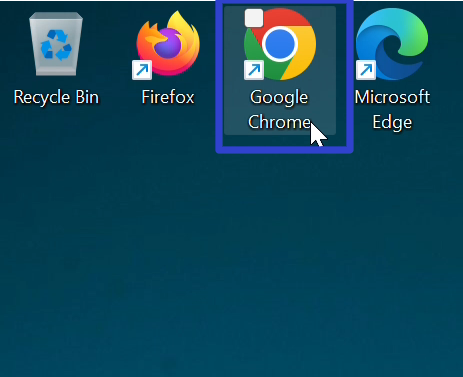
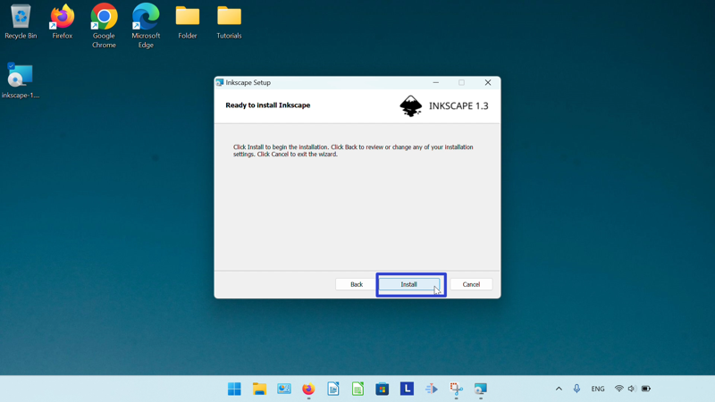

This tutorial covers:

1. [What is Inkscape?](#1)
2. [How to Download Inkscape With the Google Chrome Browser](#2)
3. [How to Download Inkscape With the Firefox Browser](#3)
4. [How to Install Inkscape](#4)
5. [How to Install Inkscape From the Microsoft Store](#5)
6. [How to Open Inkscape](#6)
7. [How to Pin Inkscape to the Taskbar With Search](#7)
8. [How to Pin Inkscape to the Taskbar With Right Click](#8)
9. [How to Pin Inkscape to the Taskbar From Start](#9)
10. [How to Pin Inkscape to Start](#10)
11. [How to Uninstall Inkscape](#11)

 

No time to scroll down? Click through these tutorial slides:

<iframe allowfullscreen="true" frameborder="0" height="299" mozallowfullscreen="true" src="https://docs.google.com/presentation/d/e/2PACX-1vSYrcn96fodjHMwin3XF5ec_6KrCh2JAYlzYmEM16NOTQS_H86yYZBbjcWoAvSA9jjP4crJxybMgwBL/embed?start=false&amp;loop=false&amp;delayms=3000" webkitallowfullscreen="true" width="480"></iframe>

 

Follow along with this video:
<iframe class="BLOG_video_class" allowfullscreen="" youtube-src-id="r0ZXbQzvYkI" width="100%" height="416" src="https://www.youtube.com/embed/r0ZXbQzvYkI"></iframe>

<h1 id="1">What is Inkscape?</h1>

Similar to Adobe Illustrator, Inkscape is a free vector graphics editor. Use Inkscape to create logos, clip art, and typography. Inkscape is an open source software with many contributors, and is customizable with downloadable add-ons.

<h1 id="2">How to Download Inkscape With the Google Chrome Browser</h1>

* Step 1: Double click the Google Chrome shortcut to open the Google Chrome browser. 

* Step 2: In the browser window that opens, go to a search engine website. For example, click the top address bar, type "google.com", and press **Enter**. 

* Step 3: On the search engine website, click the search bar, type "Inkscape", and press **Enter**. 

* Step 4: In the search results, click the https://inkscape.org result. 

* Step 5: On the official Inkscape website, click the "Download Now!" button. 

* Step 6: Scroll down and click the "Windows Installer Package" button. 

* Step 7: After the Inkscape setup file downloads, click the "Downloads" button in the upper right of the browser. 

* Step 8: In the Google Chrome Downloads window, on the Inkscape setup file, click the "Open" button. 

* The "Inkscape Setup" window opens and Inkscape is ready to install. Please see [How to Install Inkscape](#4). 

<h1 id="3">How to Download Inkscape With the Firefox Browser</h1>

* Step 1: Double click the Firefox shortcut to open the Firefox browser. 

* Step 2: In the Firefox browser window that opens, go to a search engine website. For example, click the top address bar, type "google.com", and press **Enter**. 

* Step 3: On the search engine website, click the search bar, type "Inkscape" and press **Enter**. 

* Step 4: In the search results, click the "https://inkscape.org" result. 

* Step 5: On the official Inkscape website, click the "Download Now!" button. 

* Step 6: Scroll down and click the "Windows Installer Package" button. 

* Step 7: In the "Opening inkscape" window that opens, click the "Save File" button. 

 
* Step 8: In the window that opens, click to select a save location (such as the Desktop), and click the "Save" button. 

 
* Step 9: Click the "Minimize" button in the upper right of the Firefox browser window. 

 
* Step 10: Double click the Inkscape setup shortcut to open the "Inkscape Setup" window. Inkscape is now ready to install; please see [How to Install Inkscape](#4). 

 

<h1 id="4">How to Install Inkscape</h1>

* Step 1: In the lower right of the "Inkscape Setup" window, click the "Next" button twice.

* Step 2: Click the "Install" button. If a window with "Do you want to allow this app from an unknown publisher to make changes to your device?" appears, click the "Yes" button. 

* Step 3: After Inkscape finishes installing, click "Finish". 

* Step 4: Double click the Inkscape shortcut to open Inkscape. 

 

<h1 id="5">How to Install Inkscape From the Microsoft Store</h1>

* Step 1: First go down to the taskbar and click the "Start" (four blue squares) button. 

* Step 2: In the Start window that opens, click in the top search bar and type "Microsoft store". 

* Step 3: Click one of these buttons to open the Microsoft Store. 

* Step 4: In the Microsoft Store window that opens, click the top search bar, type "Inkscape", and press **Enter**. 

* Step 5: Click the Inkscape search result. 

* Step 6: Click the "Get" button. After Inkscape downloads and installs, Inkscape is ready to open. Please see [How to Open Inkscape](#6). 

<h1 id="6">How to Open Inkscape</h1>

* Step 1: Go down to the taskbar and click Start (four blue squares). 

* Step 2: In the Start window that opens, click in the top search bar and type "Inkscape". 

* Step 3: Click one of these buttons to open Inkscape. 

* Inkscape opens. 

<h1 id="7">How to Pin Inkscape to the Taskbar With Search</h1>

* Step 1: First go down to the taskbar and click Start (four blue squares). 

* Step 2: In the Start window that opens, click the top search bar and type "Inkscape". 

* Step 3: On the search results screen, click "Pin to taskbar". 

* Step 4: Go down to the taskbar and click the pinned Inkscape icon. 

* Inkscape opens. 

<h1 id="8">How to Pin Inkscape to the Taskbar With Right Click</h1>

* Step 1: [Open](#6) Inkscape. Go down to the taskbar and right click the Inkscape app icon. 

* Step 2: In the menu that opens, click "Pin to taskbar". 

<h1 id="9">How to Pin Inkscape to the Taskbar From Start</h1>

* Step 1: First go down to the taskbar and click Start (four blue squares). 

* Step 2: In the Start window that opens, right click the pinned Inkscape icon (if Inkscape is not already pinned to Start, see [How to Pin Inkscape to Start](#10)). 

 
* Step 3: In the menu that opens, click "Pin to taskbar". 

* Step 4: Go down to the taskbar and right click the pinned Inkscape icon. 

* Step 5: In the menu that opens, click "Inkscape" to open Inkscape. 

* Inkscape opens. 

<h1 id="10">How to Pin Inkscape to Start</h1>

* Step 1: Go down to the taskbar and click Start (four blue squares). 

* Step 2: In the Start window that opens, click the top search bar and type "Inkscape". 

* Step 3: On the search results screen, click "Pin to Start". 

* Step 4: Click the Start button twice, and in the Start window that opens, click the pinned Inkscape icon to open Inkscape. 

* Inkscape opens. 

<h1 id="11">How to Uninstall Inkscape</h1>

* Step 1: First go down to the taskbar and click Start (four blue squares). 

* Step 2: In the Start window that opens, click the "Settings" button. 

* Step 3: In the Settings window that opens, go to the left menu and click "Apps". 

* Step 4: At the top of the window, click "Installed apps". 

* Step 5: Type "Inkscape" in the search bar at the top. 

* Step 6: On the far right side of the Inkscape section, click the "Menu" or "..." button. 

* Step 7: In the menu that opens, click "Uninstall". In the window that opens, click "Uninstall". 

Save a copy of these instructions for later, with this free [tutorial PDF](https://drive.google.com/file/d/1yCABGJc6fdNn2K1rWHdod0kq8jrc8N9d/view?usp=sharing).

 