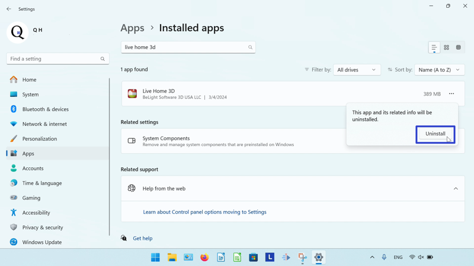

This tutorial covers:

1. [What is Live Home 3D - House Design](#1)
2. [How to Install Live Home 3D - House Design With Google Chrome](#2)
3. [How to Install Live Home 3D - House Design From Microsoft Store](#3)
4. [How to Open Live Home 3D - House Design With Search](#4)
5. [How to Pin Live Home 3D - House Design to the Taskbar With Search](#5)
6. [How to Pin Live Home 3D - House Design to the Taskbar With Right Click](#6)
7. [How to Pin Live Home 3D - House Design to the Taskbar From Start](#7)
8. [How to Pin Live Home 3D - House Design to Start](#8)
9. [How to Uninstall Live Home 3D - House Design](#9)
10. [How to Pin GIMP to the Taskbar With Search](#10)
11. [How to Pin GIMP to the Taskbar With Right Click](#11)
12. [How to Pin GIMP to the Taskbar From Start](#12)

 

No time to scroll down? Click through this tutorial slideshow:
<iframe src="https://docs.google.com/presentation/d/e/2PACX-1vSn513kZulw1mU59jvm6gqGx2db3ZpJXeshsrmetqdqFhhWSkp7DnmObiSNzk3nRBcDQ8QGoMZEdMyL/embed?start=false&loop=false&delayms=3000" frameborder="0" width="480" height="299" allowfullscreen="true" mozallowfullscreen="true" webkitallowfullscreen="true"></iframe>

 

Follow along this video tutorial:
<iframe class="BLOG_video_class" allowfullscreen="" youtube-src-id="dukMuMtWpko" width="100%" height="416" src="https://www.youtube.com/embed/dukMuMtWpko"></iframe>

<h1 id="1">What is Live Home 3D - House Design?</h1>

As a free home design app, Live Home 3D - House Design creates 3D models of buildings, indoor rooms, and furniture. The paid version of the app includes exclusive features, such as 3D models of outdoor terrain. Live Home 3D - House Design includes cameras and video recording that provide a "virtual tour" of the house floor plan.

<h1 id="2">How to Install Live Home 3D - House Design With Google Chrome</h1>

* Step 1: Double click the Google Chrome shortcut to open the Google Chrome browser. 

* Step 2: In the browser window that opens, go to a search engine website. For example, click the top address bar, type "google.com", and press **Enter**. 

* Step 3: On the search engine website, click the search bar, type "Live Home 3D - House Design", and press **Enter**. 

* Step 4: In the search results, click the "https://www.livehome3d.com" result. 

* Step 5: On the official Live Home 3D website, go to the upper right and click the Windows logo. 

* Step 6: Click the "Get it from Microsoft" button. 

* Step 7: If the message "Open Microsoft Store?" appears, click the "Open Microsoft Store" button. 

* Step 8: In the Microsoft Store window that opens, click the "Get" button. 

* Step 9: After the app installs, click the "Open" button. 

* After loading, the Live Home 3D - House Design app opens. 

<h1 id="3">How to Download Live Home 3D - House Design From Microsoft Store</h1>

* Step 1: Go down to the taskbar and click the Start (four blue squares) button. 

* Step 2: In the Start window that opens, click the top search bar and type "Microsoft Store". 

* Step 3: Step 3: On the search results screen, click one of these buttons. 

* Step 4: In the Microsoft Store window that opens, click the top search bar, type "Live Home 3D - House Design", and press **Enter**. 

* Step 5: On the search results screen, click the "Live Home 3D - House Design" result. 

* Step 6: Click the "Get" button. 

* Step 7: After the app installs, click the "Open" button. 

* After loading, the Live Home 3D - House Design app opens. 

<h1 id="4">How to Open Live Home 3D - House Design With Search</h1>

* Step 1: Go down to the taskbar and click the Start (four blue squares) button. 

* Step 2: In the Start window that opens, click the top search bar and type "Live Home 3D - House Design". 

* Step 3: On the search results screen, click one of these buttons. 

* After loading, the Live Home 3D - House Design app opens. 

<h1 id="5">How to Pin Live Home 3D - House Design to the Taskbar With Search</h1>

* Step 1: Go down to the taskbar and click the Start (four blue squares) button. 

* Step 2: In the Start window that opens, click the top search bar and type "Live Home 3D - House Design". 

* Step 3: On the search results screen, click "Pin to taskbar". 

* Step 4: Go down to the taskbar and click the pinned Live Home 3D - House Design app icon. 

* After loading, the Live Home 3D - House Design app opens. 

<h1 id="6">How to Pin Live Home 3D - House Design to the Taskbar With Right Click</h1>

* Step 1: First [open](#4) Live Home 3D - House Design. Go down to the taskbar and right click the app icon. 

* Step 2: In the menu that opens, click "Pin to taskbar". 

<h1 id="7">How to Pin Live Home 3D - House Design to the Taskbar From Start</h1>

* Step 1: Go down to the taskbar and click the Start (four blue squares) button. 

* Step 2: In the Start window that opens, right click the pinned Live Home 3D app icon. If Live Home 3D is not already pinned to Start, please see [How to Pin Live Home 3D - House Design to Start](#8). 

* Step 3: In the menu that opens, click "Pin to taskbar". 

* Step 4: Go down to the taskbar and right click the pinned Live Home 3D app icon. 

* Step 5: In the menu that opens, click "Live Home 3D". 

* After loading, the Live Home 3D - House Design app opens. 

<h1 id="8">How to Pin Live Home 3D - House Design to Start</h1>

* Step 1: Go down to the taskbar and click the Start (four blue squares) button. 

* Step 2: In the Start window that opens, click the top search bar and type "Live Home 3D - House Design". 

* Step 3: On the search results screen, click "Pin to Start". 

* Step 4: Click the Start button twice, and in the Start window that opens, click the pinned Live Home 3D app icon. 

* After loading, the Live Home 3D - House Design app opens. 

<h1 id="9">How to Uninstall Live Home 3D - House Design</h1>

* Step 1: Go down to the taskbar and click the Start (four blue squares) button. 

* Step 2: In the Start window that opens, click the "Settings" button. 

* Step 3: In the Settings window that opens, go to the left menu and click "Apps". 

* Step 4: Click "Installed apps". 

* Step 5: In the Settings window, click the top search bar and type "Live Home 3D - House Design". 

* Step 6: On the far right side of the "Live Home 3D" section, click the "Menu" or "..." button. 

* Step 7: In the menu that opens, click "Uninstall". 

* Step 8: In the window that opens, click "Uninstall". 

Refer to these instructions later with this free [tutorial PDF](https://drive.google.com/file/d/1yWH_KIEgl1NM6A5q2_1zWPN-UV6ynKY-/view?usp=sharing).

 

