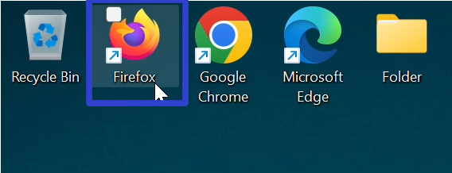

This tutorial covers:

1. [What is Scribus?](#1)
2. [How to Download Scribus With Google Chrome](#2)
3. [How to Download Scribus With Firefox](#3)
4. [How to Install Scribus](#4)
5. [How to Open Scribus With Shortcut](#5)
6. [How to Open Scribus With Search](#6)
7. [How to Pin Scribus to the Taskbar With Search](#7)
8. [How to Pin Scribus to the Taskbar With Right Click](#8)
9. [How to Pin Scribus to the Taskbar From Start](#9)
10. [How to Pin Scribus to Start](#10)
11. [How to Uninstall Scribus](#11)

 

No time to scroll down? Click through these tutorial slides:

<iframe allowfullscreen="true" frameborder="0" height="299" mozallowfullscreen="true" src="https://docs.google.com/presentation/d/e/2PACX-1vRIkOmwHZ_l3R0osupt7cZ7DsDzxbLWPp3BfNtL7Ja_En9cpw-OG06ghXDL2rJMpWfobjzWGK5_rQwU/embed?start=false&amp;loop=false&amp;delayms=3000" webkitallowfullscreen="true" width="480"></iframe>

 

Follow along with this video:
<iframe class="BLOG_video_class" allowfullscreen="" youtube-src-id="bwI8R9mPEY8" width="100%" height="416" src="https://www.youtube.com/embed/bwI8R9mPEY8"></iframe>

<h1 id="1">What is Scribus?</h1>

Scribus is a free page layout editing program. With Scribus, create books, newsletters, brochures, PDFs, and more. As an open source software, Scribus works with Windows, Linux, and mac OS. Create and publish documents from scratch, or edit one of the many Scribus templates.

<h1 id="2">How to Download Scribus With the Google Chrome Browser</h1>

* Step 1: Double click the Google Chrome shortcut to open the Google Chrome browser. 

* Step 2: In the browser window that opens, go to a search engine website. For example, click the top address bar, type "google.com", and press **Enter**. 

* Step 3: On the search engine website, click the search bar, type "Scribus", and press **Enter**. 

* Step 4: In the search results, click the "SourceForge.net" result. 

* Step 5: Click the green "Download" button. 

* Step 6: In the Google Chrome Downloads window that opens, click the "Open" button. 

* Step 7: If the program asks for permission to make changes to the computer, click "Yes". In the window that opens, click the drop-down menu to select a language and click "OK". 

* Scribus is now ready to install. Please see [How to Install Scribus](#4).

<h1 id="3">How to Download Scribus With the Firefox Browser</h1>

* Step 1: Double click the Firefox shortcut to open the Firefox browser. 

* Step 2: In the Firefox browser window that opens, go to a search engine website. For example, click the top address bar, type "google.com", and press **Enter**. 

* Step 3: On the search engine website, click the search bar, type "Scribus" and press **Enter**. 

* Step 4: In the search results, click the "SourceForge.net" result. 

* Step 5: Click the green "Download" button. 

* Step 6: In the window that opens, click "Save File". 

* Step 7: Click to select a save location, such as the Desktop, and click "Save". 

 
* Step 8: Go to the upper right and click the "Minimize" or "-" button. 

  
* Step 9: Double click the Scribus installer shortcut. 

 
* Step 10: If the program asks for permission to make changes to the computer, click "Yes". In the window that opens, click the drop-down menu to select a language and click "OK". 

 
* Scribus is now ready to install. Please see [How to Install Scribus](#4).

<h1 id="4">How to Install Scribus</h1>

* Step 1: In the "Scribus Setup" window, click the "Next" button.

* Step 2: Click "I accept the terms of the License Agreement" and click "Next". 

* Step 3: Click "Next" twice. 

* Step 4: Click "Install". 

 
* Step 5: After Scribus installs, click "Finish". 

 

<h1 id="5">How to Open Scribus With Shortcut</h1>

* Step 1: Double click the Scribus shortcut. 

* Step 2: The Scribus program opens. 

<h1 id="6">How to Open Scribus With Search</h1>

* Step 1: Go down to the taskbar and click Start (four blue squares). 

* Step 2: In the Start window that opens, click in the top search bar and type "Scribus". 

* Step 3: Click one of these buttons to open Scribus. 

* Scribus opens. 

<h1 id="7">How to Pin Scribus to the Taskbar With Search</h1>

* Step 1: First go down to the taskbar and click Start (four blue squares). 

* Step 2: In the Start window that opens, click the top search bar and type "Scribus". 

* Step 3: On the search results screen, click "Pin to taskbar". 

* Step 4: Go down to the taskbar and click the pinned Scribus icon. 

* Scribus opens. 

<h1 id="8">How to Pin Scribus to the Taskbar With Right Click</h1>

* Step 1: [Open](#6) Scribus. Go down to the taskbar and right click the Scribus app icon. 

* Step 2: In the menu that opens, click "Pin to taskbar". 

<h1 id="9">How to Pin Scribus to the Taskbar From Start</h1>

* Step 1: First go down to the taskbar and click Start (four blue squares). 

* Step 2: In the Start window that opens, right click the pinned Scribus icon (if Scribus is not already pinned to Start, see [How to Pin Scribus to Start](#10)). 

 
* Step 3: In the menu that opens, click "Pin to taskbar". 

* Step 4: Go down to the taskbar and right click the pinned Scribus icon. 

* Step 5: In the menu that opens, click "Scribus" to open Scribus. 

* Scribus opens. 

<h1 id="10">How to Pin Scribus to Start</h1>

* Step 1: Go down to the taskbar and click Start (four blue squares). 

* Step 2: In the Start window that opens, click the top search bar and type "Scribus". 

* Step 3: On the search results screen, click "Pin to Start". 

* Step 4: Click the Start button twice, and in the Start window that opens, click the pinned Scribus icon to open Scribus. 

* Scribus opens. 

<h1 id="11">How to Uninstall Scribus</h1>

* Step 1: First go down to the taskbar and click Start (four blue squares). 

* Step 2: In the Start window that opens, click the "Settings" button. 

* Step 3: In the Settings window that opens, go to the left menu and click "Apps". 

* Step 4: At the top of the window, click "Installed apps". 

* Step 5: Type "Scribus" in the search bar at the top. 

* Step 6: On the far right side of the Scribus section, click the "Menu" or "..." button. 

* Step 7: In the menu that opens, click "Uninstall". 

* Step 8: If the program asks for permission to make changes to the computer, click "Yes". In the window that opens, click "Yes". 

* Step 9: Click "Uninstall". 

* Step 10: Click "OK". 

Save a copy of these instructions for later, with this free [tutorial PDF](https://drive.google.com/file/d/1CX1-OQDSp5laic6O-abx353lXaP-qB5v/view?usp=sharing).

 
