This tutorial covers:

## How to Add an Alarm:
1. [With Click](#1)
2. [With Keyboard Shortcut](#2)

## How to Delete an Alarm:
1. [With Click](#3)
2. [With Right Click](#4)
3. [With Menu](#5)

No time to scroll down? Click through this tutorial presentation:

<iframe src="https://docs.google.com/presentation/d/13odiOl0-BpyaRx8Zs8nfTJJsvexfcCxD-A-B2BXoywo/embed?start=false&loop=false&delayms=3000" frameborder="0" width="480" height="299" allowfullscreen="true" mozallowfullscreen="true" webkitallowfullscreen="true"></iframe>

 

Follow along with a video tutorial:
<iframe class="BLOG_video_class" allowfullscreen="" youtube-src-id="Xp3RwwepZEk" width="100%" height="416" src="https://www.youtube.com/embed/Xp3RwwepZEk"></iframe>

 

<h1 id="1">How to Add a Timer With Click</h1>

* Step 1: First [switch](https://qhtutorials.github.io/posts/how-to-edit-windows-clock-settings/) to Alarm mode. In the lower right, click the "+" or "Add an alarm" button.  
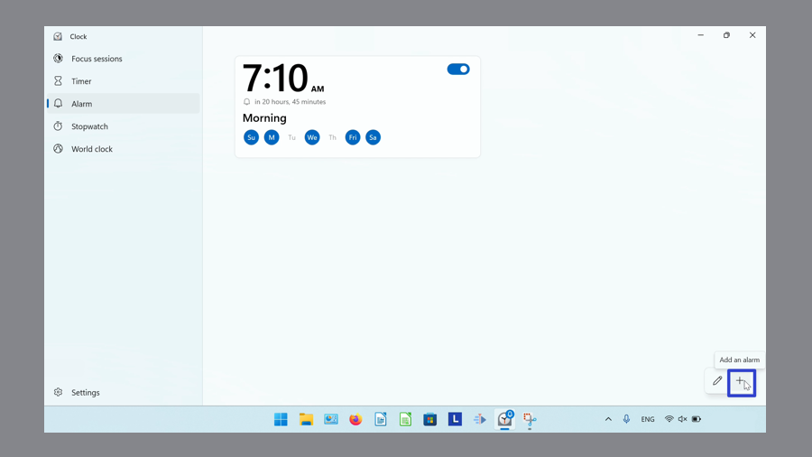
 
* In the "Add new alarm" window that opens, click to edit the alarm settings and click the "Save" button. 
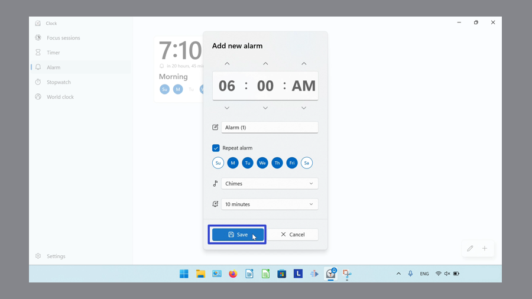
 
* The Windows Clock displays the new Alarm. 
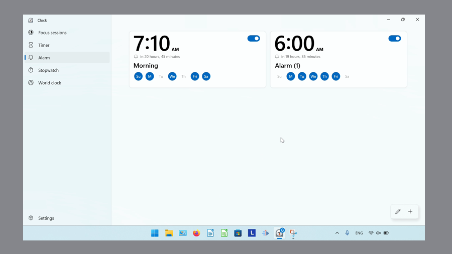
 

<h1 id="2">How to Add an Alarm With Keyboard Shortcut</h1>

* Step 1: [Switch](https://qhtutorials.github.io/posts/how-to-edit-windows-clock-settings/) to Alarm mode. On the keyboard press **Ctrl + N**. 
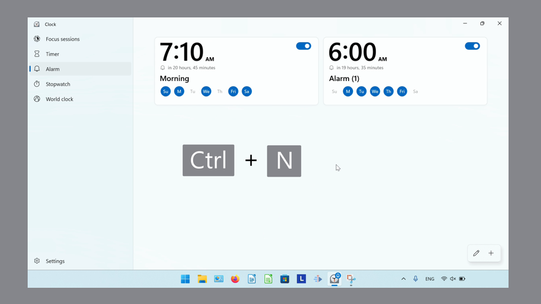
 
* Step 2: In the "Add new alarm" window that opens, click to edit the alarm settings, then click "Save". 
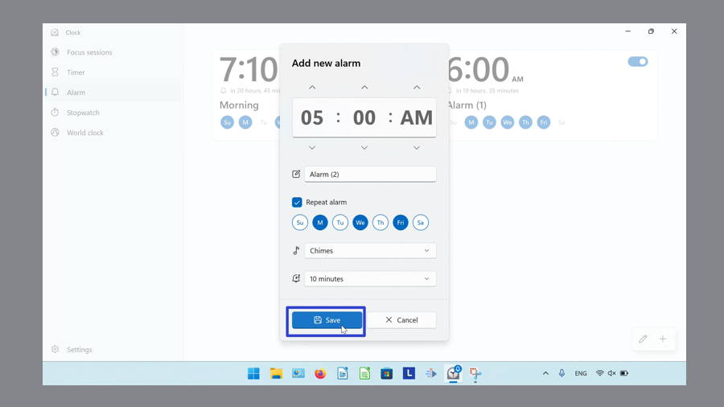

* The Windows Clock displays the new Alarm. 
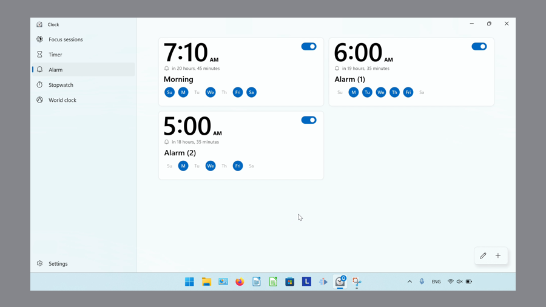

<h1 id="3">How to Delete an Alarm With Click</h1>
 
* Step 1: First [switch](https://qhtutorials.github.io/posts/how-to-edit-windows-clock-settings/) to the Alarm mode. Click an Alarm. 
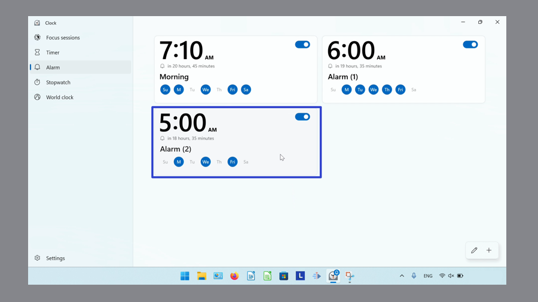

* Step 2: In the "Edit alarm" window that opens, click the "Delete" or trash can button. 
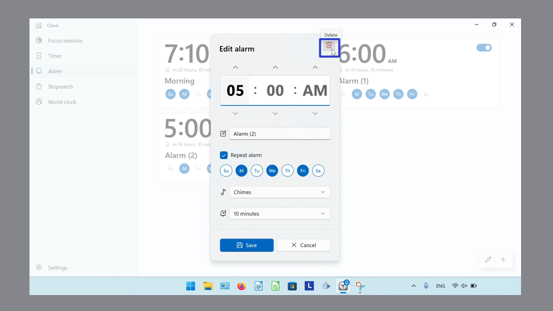

* The Windows Clock app removes the Alarm. 
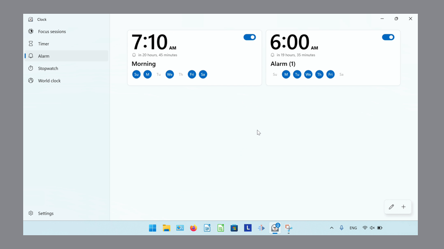

<h1 id="4">How to Delete an Alarm With Right Click</h1>

* Step 1: [Switch](https://qhtutorials.github.io/posts/how-to-edit-windows-clock-settings/) to the Alarm mode. Right click an Alarm. 

* Step 2: In the menu that opens, click "Delete". 
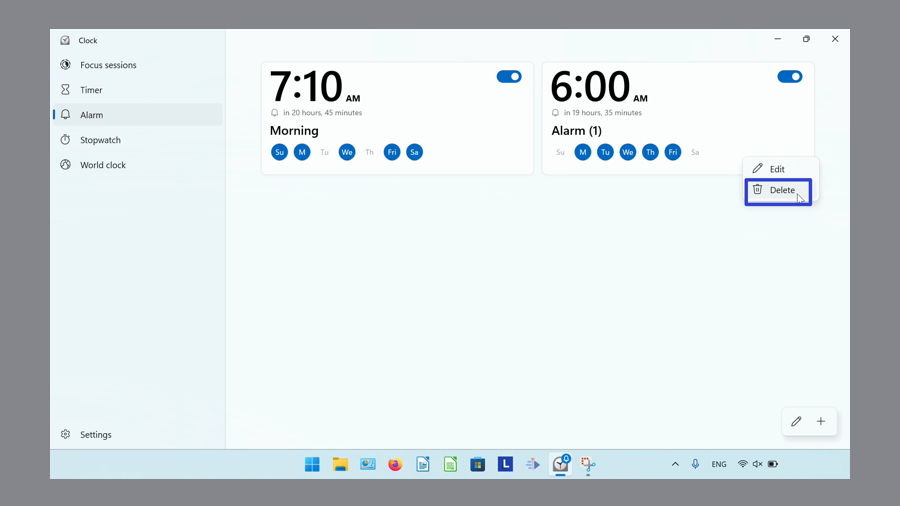

* The Windows Clock app removes the Alarm. 
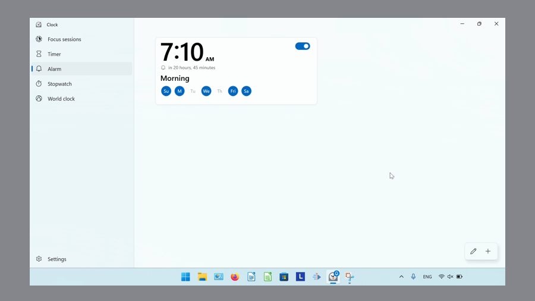
 

<h1 id="5">How to Delete an Alarm With Menu</h1>

* Step 1: First [switch](https://qhtutorials.github.io/posts/how-to-edit-windows-clock-settings/) to Alarm mode. In the lower right click the "Edit timers" or pencil button. 
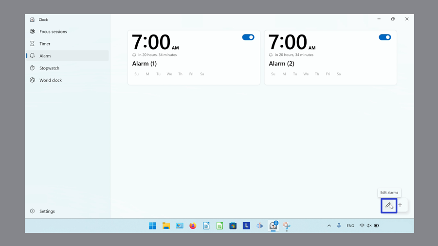

* Step 2: On the upper right corner of an Alarm, click the "Delete" or trash can button. 
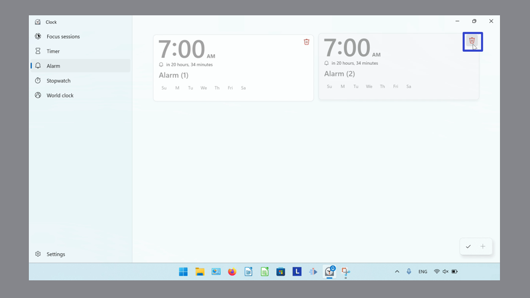
 
* Step 3: Click the "Done" or check mark button. 
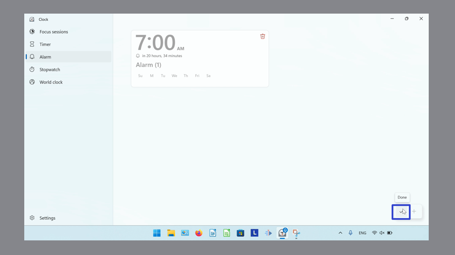

* The Windows Clock app removes the Alarm. 
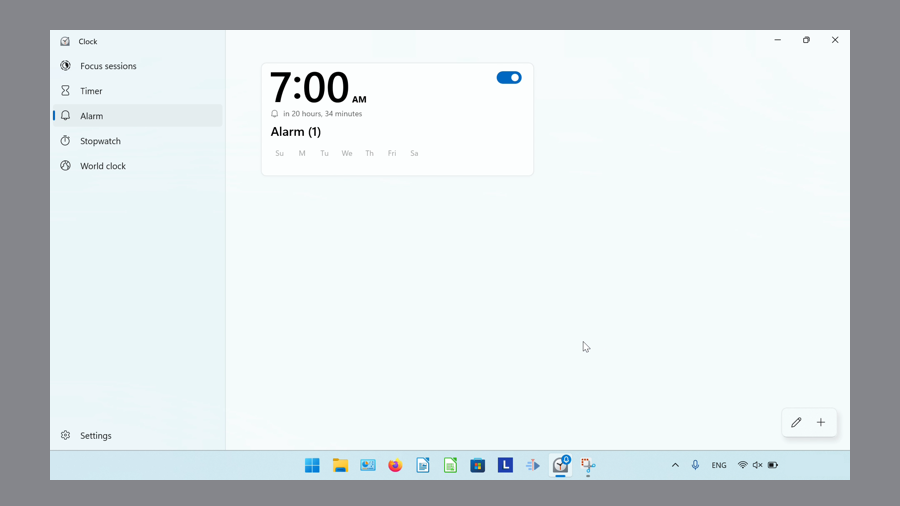

Refer to these instructions for later with this free [PDF tutorial](https://drive.google.com/file/d/1dfehQjWd2DHK8xAsg4JyRLI-mmSLR5Ac/view?usp=sharing).

 

