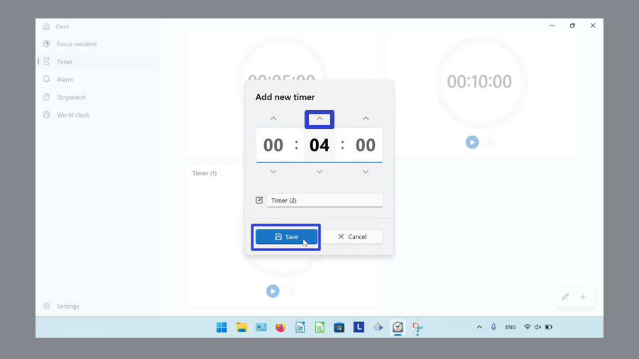

This tutorial covers:

## How to Add a Timer:
1. [With Click](#1)
2. [With Keyboard Shortcut](#2)

## How to Delete a Timer:
1. [With Click](#3)
2. [With Right Click](#4)
3. [With Menu](#5)

No time to scroll down? Click through these tutorial slides:

<iframe src="https://docs.google.com/presentation/d/15QVYnTtF9oPn1fe9VcTNxdyETFfuxiiCh-k7QRepsJg/embed?start=false&loop=false&delayms=3000" frameborder="0" width="480" height="299" allowfullscreen="true" mozallowfullscreen="true" webkitallowfullscreen="true"></iframe>

 

Follow along with a video tutorial:
<iframe class="BLOG_video_class" allowfullscreen="" youtube-src-id="yDSEnORXzVA" width="100%" height="416" src="https://www.youtube.com/embed/yDSEnORXzVA"></iframe>

 

<h1 id="1">How to Add a Timer With Click</h1>

* Step 1: First [switch](https://qhtutorials.github.io/posts/how-to-edit-windows-clock-settings/) to Timer mode. In the lower right click the "+" or "Add new timer" button. 

* Step 2: In the "Add new timer" window that opens, click the arrow buttons to set the time, then click the "Save" button. 

* The new Timer appears. 

<h1 id="2">How to Add a Timer With Keyboard Shortcut</h1>

Step 1: [Switch](https://qhtutorials.github.io/posts/how-to-edit-windows-clock-settings/) to Timer mode. On the keyboard press **Ctrl + N**. 

* Step 2: In the "Add new timer" window that opens, click the arrow buttons to set the time, then click the "Save" button. 

* The new Timer appears. 

<h1 id="3">How to Delete a Timer With Click</h1>

* Step 1: First [switch](https://qhtutorials.github.io/posts/how-to-edit-windows-clock-settings/) to the Timer mode. Click anywhere on a Timer. 

* Step 2: In the "Edit timer" window that opens, click the "Delete" or trash can button. 

* The Timer disappears. 

<h1 id="4">How to Delete a Timer With Right Click</h1>

* Step 1: [Switch](https://qhtutorials.github.io/posts/how-to-edit-windows-clock-settings/) to the Timer mode. Right click a Timer. 

* Step 2: In the menu that opens, click "Delete". 

* The Timer disappears. 

<h1 id="5">How to Delete a Timer With Menu</h1>

* Step 1: First [switch](https://qhtutorials.github.io/posts/how-to-edit-windows-clock-settings/) to the Timer mode. In the lower right, click the "Edit timers" or pencil button. 

* Step 2: Click the "Delete" or trash can button on a Timer. 

* Step 3: Click the "Done" or check mark button. 

* Step 4: The Timer disappears. 

Save these instructions for later with this free [PDF tutorial](https://drive.google.com/file/d/1dGM33njYJXa_R9XQKMXciHAXVAYHA9ca/view?usp=sharing).

 

