This tutorial covers:

## How to Rename a Whiteboard:
1. [With Menu](#1)
2. [With "More Options"](#2)

## [How to Share a Whiteboard](#3)

## How to Export a Whiteboard:
1. [As an Image](#4)
2. [As a PDF](#5)
3. [As a Zip File](#6)

## How to Navigate the Whiteboard Downloads Window:
1. [How to Open the Downloads Window](#7)
2. [How to Close the Downloads Window](#8)
3. [How to Search the Downloads Window](#9)
4. [How to Clear All History in the Downloads Window](#10)
5. [How to Open the Computer Downloads Folder](#11)

## [How to Report a Whiteboard](#12)

No time to scroll down? Click through these tutorial slides:

<iframe src="https://docs.google.com/presentation/d/e/2PACX-1vTS_aqgn8Z7evBoRI39oDuLWD-Lnzno3PLJrHTQx0g15f6hWOVLBeuMSwzWmJ4GiXWjJBa2cnO8pz21/embed?start=false&loop=false&delayms=3000" frameborder="0" width="480" height="299" allowfullscreen="true" mozallowfullscreen="true" webkitallowfullscreen="true"></iframe>

 

See it in action with a video tutorial:
<iframe class="BLOG_video_class" allowfullscreen="" youtube-src-id="K9PKaFHIHN4" width="100%" height="416" src="https://www.youtube.com/embed/K9PKaFHIHN4"></iframe>

 

<h1 id="1">How to Rename a Whiteboard With Menu</h1>

* Step 1: First [open](https://qhtutorials.github.io/posts/how-to-open-microsoft-whiteboard/) a whiteboard. In the upper left click the "Untitled whiteboard" drop-down menu. 
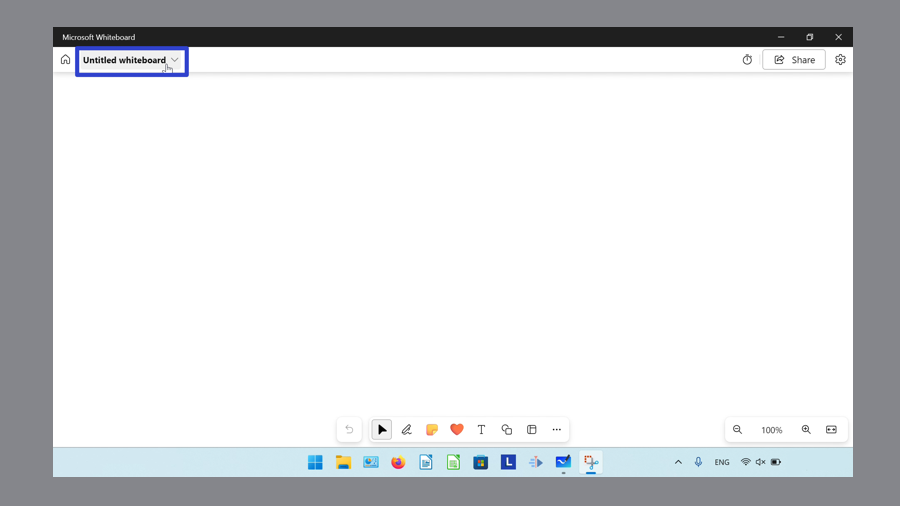

* Step 2: Type any text to rename the whiteboard, and click the "Rename" or check mark button. 

<h1 id="2">How to Rename a Whiteboard With "More Options"</h1>

* Step 1: [Open](https://qhtutorials.github.io/posts/how-to-open-microsoft-whiteboard/) the Microsoft Whiteboard app. Hover over a whiteboard and click the "More options" or "..." button. 
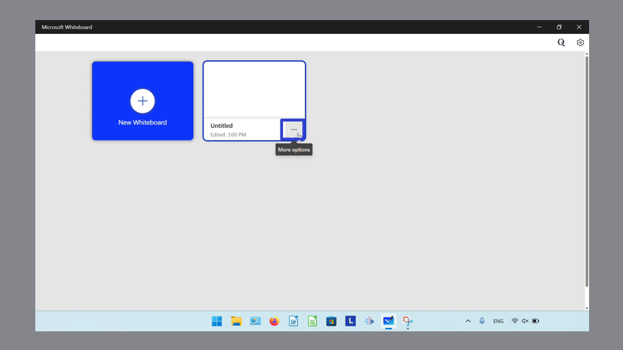

* Step 2: In the menu that opens, click "Rename". 
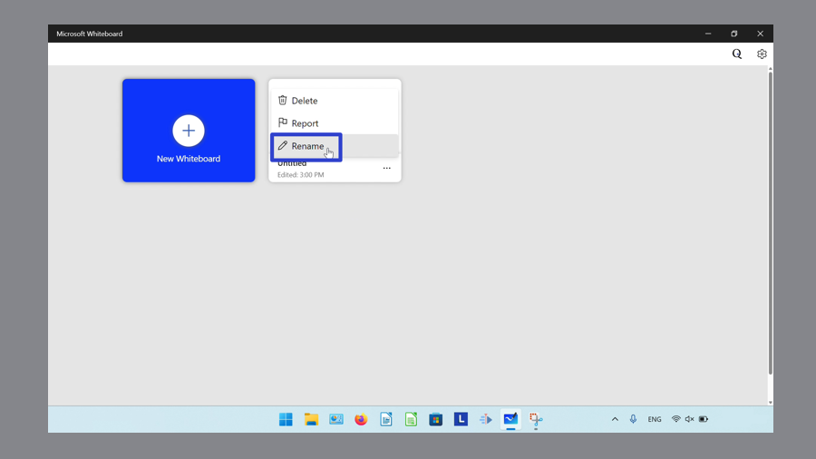

* Step 3: Type any text to rename the whiteboard and click the "Rename" button. 
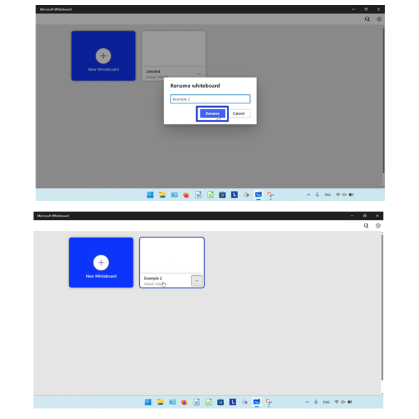

<h1 id="3">How to Share a Whiteboard</h1>

* Step 1: First [open](https://qhtutorials.github.io/posts/how-to-open-microsoft-whiteboard/) a whiteboard. In the upper right click the "Share" button. 
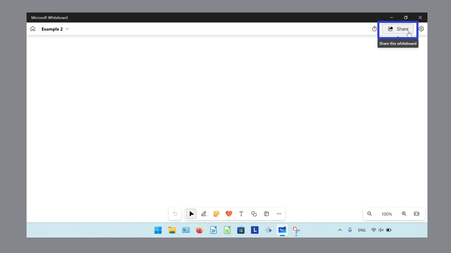

* Step 2: In the window that opens, click the "Share link" option. 
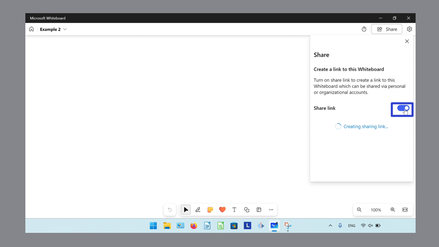

* Step 3: Click the "Copy link" button, then paste this link into another app or program. 
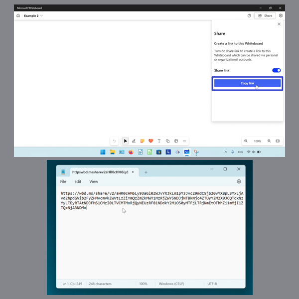

<h1 id="4">How to Export a Whiteboard as an Image</h1>

* Step 1: [Open](https://qhtutorials.github.io/posts/how-to-open-microsoft-whiteboard/) a whiteboard. In the upper right click the "Settings menu" or gear button. 
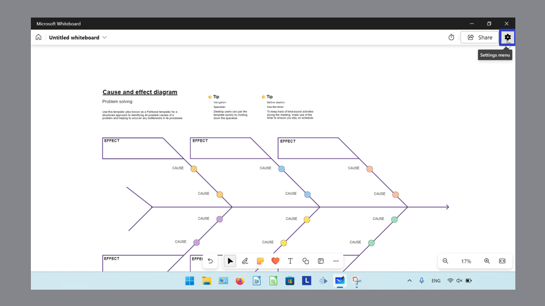

* Step 2: In the menu that opens, click "Export". 
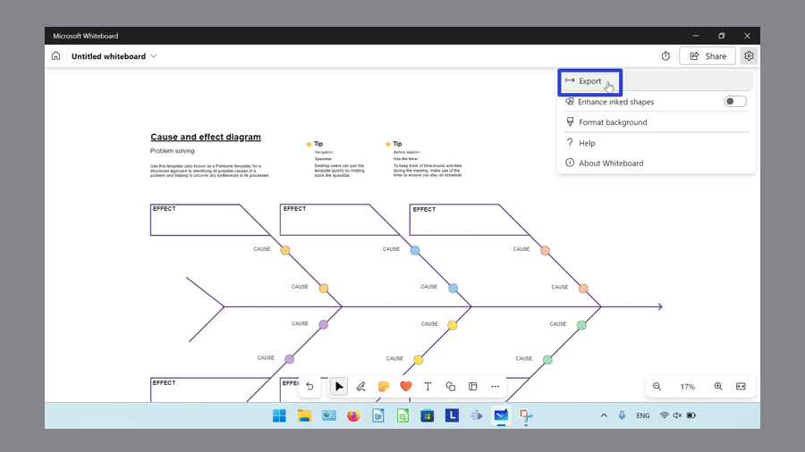

* Step 3: In the menu that opens, click "Image". 
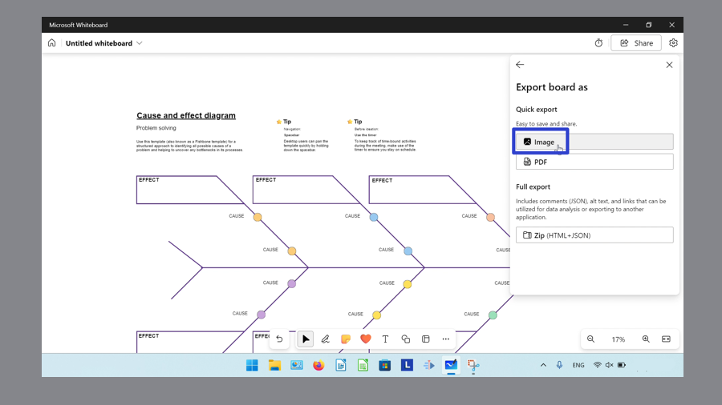

* Step 4: In the window that opens, select an image resolution option, then click the "Export" button. The whiteboard image file is downloaded to the computer. 
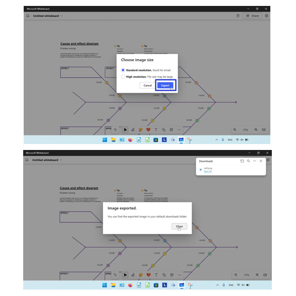

<h1 id="5">How to Export a Whiteboard as a PDF</h1>

* Step 1: First [open](https://qhtutorials.github.io/posts/how-to-open-microsoft-whiteboard/) a whiteboard. In the upper right click the "Settings menu" or gear button. 
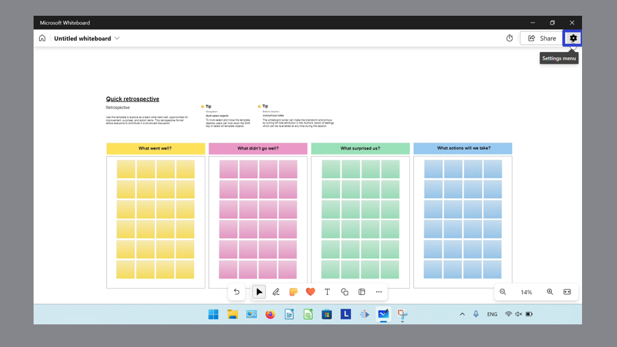

* Step 2: In the menu that opens, click "Export". 
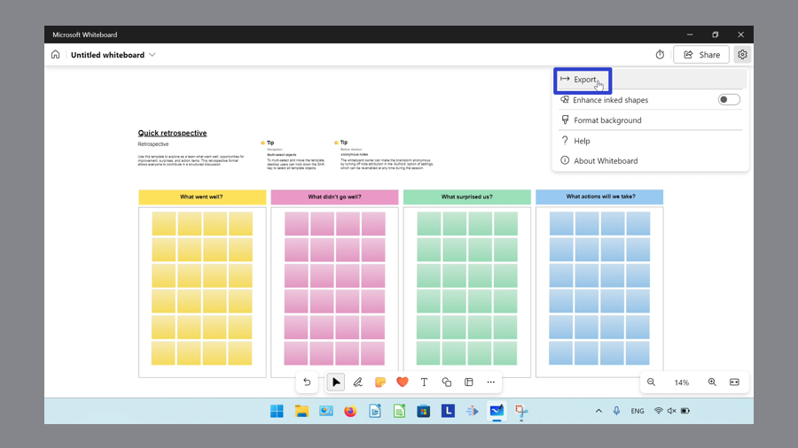

* Step 3: In the menu that opens, click "PDF". 
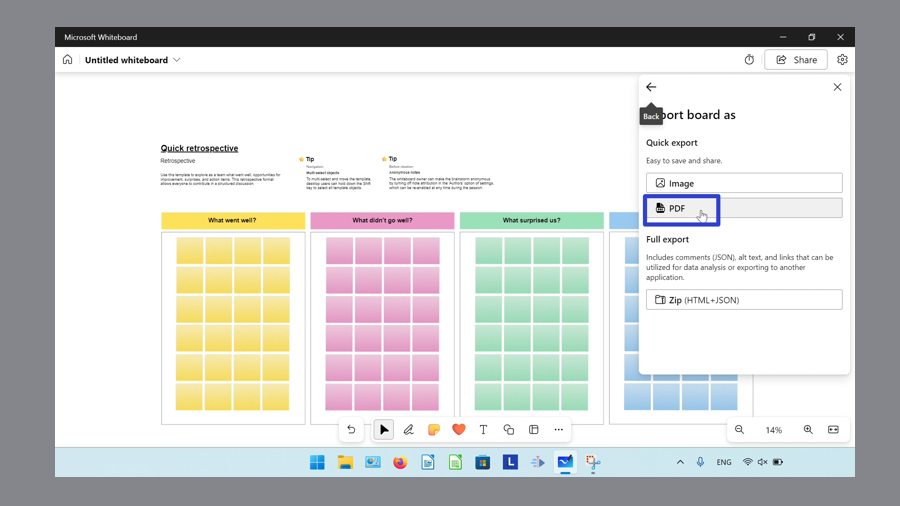

* Step 4: In the "Save as" window that opens, type any text to name the file, and click the "Save" button. 
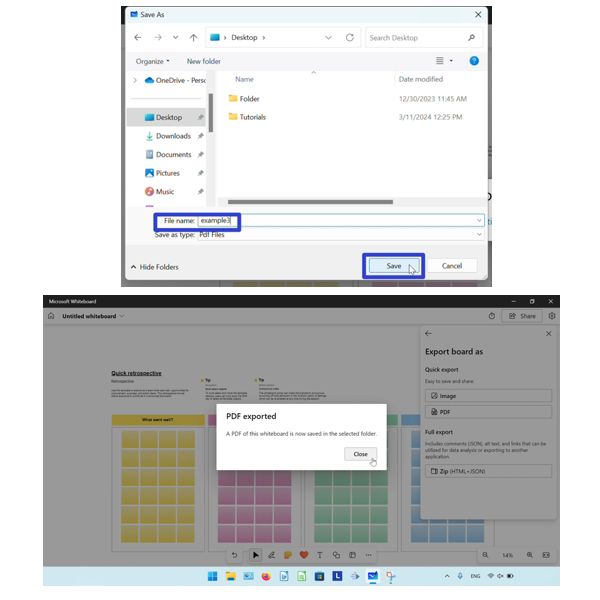

<h1 id="6">How to Export a Whiteboard as a Zip File</h1>

* Step 1: [Open](https://qhtutorials.github.io/posts/how-to-open-microsoft-whiteboard/) a whiteboard. In the upper right click the "Settings menu" or gear button. 
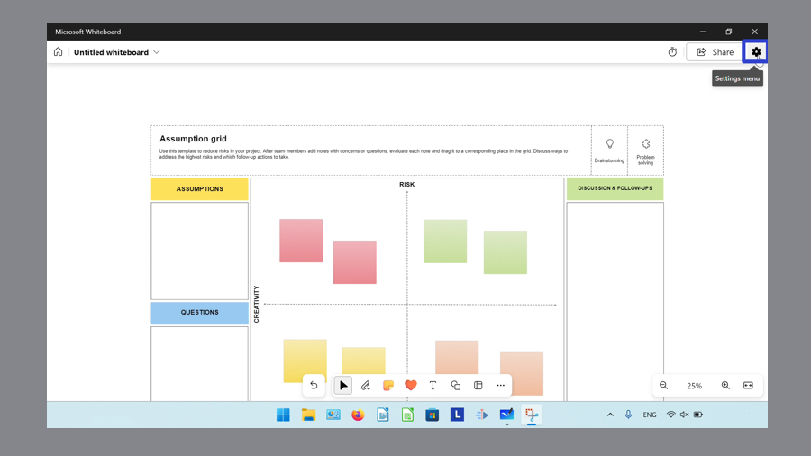

* Step 2: In the menu that opens, click "Export". 
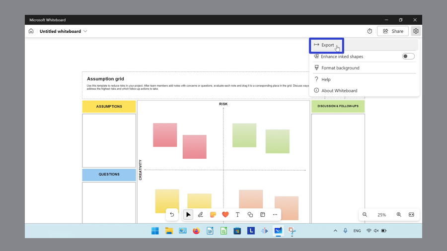

* Step 3: In the menu that opens, click "ZIP (HTML + JSON)". 
' ")

* Step 4: In the Whiteboard Downloads window that opens, click the "Open file" option to open the Zip file. 
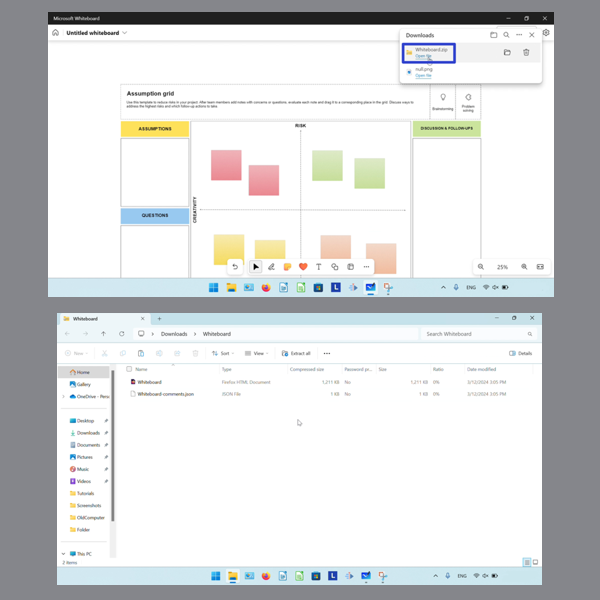

<h1 id="7">How to Open the Whiteboard Downloads Window</h1>

* Step 1: First [open](https://qhtutorials.github.io/posts/how-to-open-microsoft-whiteboard/) a whiteboard. On the keyboard press **Ctrl + J**. 
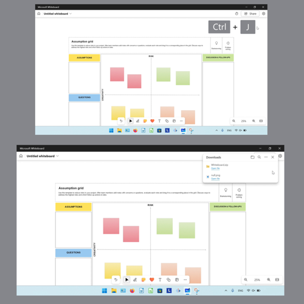

<h1 id="8">How to Close the Whiteboard Downloads Window</h1>

* Step 1: [Open](#7) the Whiteboard Downloads window. Click the "Close" or "X" button in the upper right. 
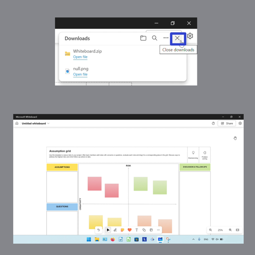

<h1 id="9">How to Search the Whiteboard Downloads Window</h1>

* Step 1: First [open](#7) the Whiteboard Downloads window. Click the "Search downloads" or magnifying glass button. 
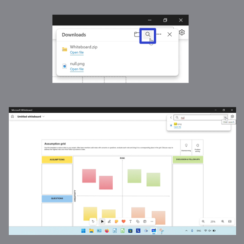

* Step 2: Type any text to search for. Click the "Clear" or "X" button to clear the search bar. Click the "Exit search" or back arrow to exit the search. 
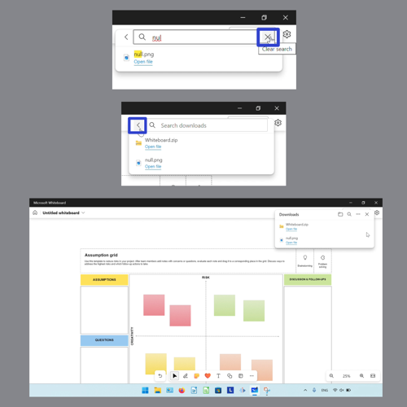

<h1 id="10">How to Clear All History in the Whiteboard Downloads Window</h1>

* Step 1: [Open](#7) the Whiteboard Downloads window. Click the "More options" or "..." button. 
* Step 2: In the menu that opens, click the "Clear all download history" option, then in the window that opens click "Remove all". 
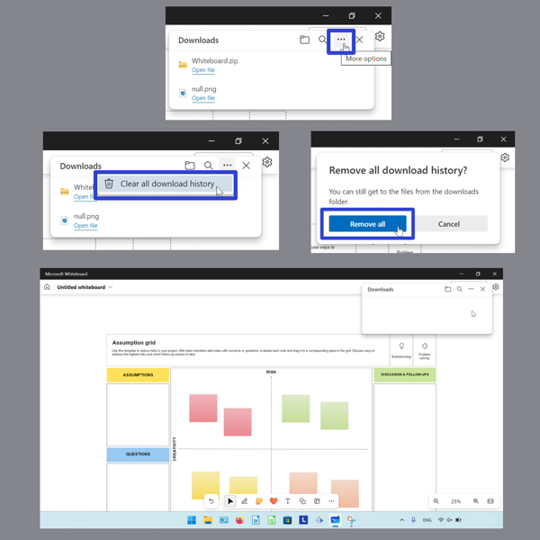

<h1 id="11">How to Open the Computer Downloads Folder</h1>

* Step 1: First [open](#7) the Whiteboard Downloads window. Click the "Open downloads folder" or folder button. 

<h1 id="12">How to Report a Whiteboard</h1>

* Step 1: [Open](https://qhtutorials.github.io/posts/how-to-open-microsoft-whiteboard/) the Microsoft Whiteboard app. Hover over a whiteboard and click the "More options" or "..." button. 

* Step 2: In the menu that opens, click "Report". 

* Step 3: In the window that opens, click the drop-down menu to select a concern. Optionally type any text about the offensive content and click the "Report anonymously" option. Click the "Send report" button. 
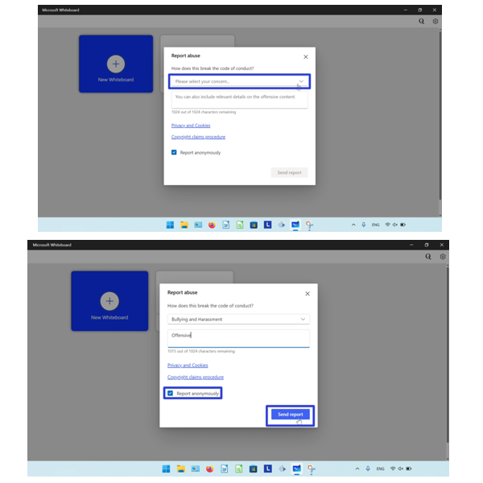

Save a copy of these instructions for later with this free [PDF tutorial](https://drive.google.com/file/d/19VEIO1hmmQnYJtdC8-74nN0zfSVo5NLv/view?usp=sharing).

 

