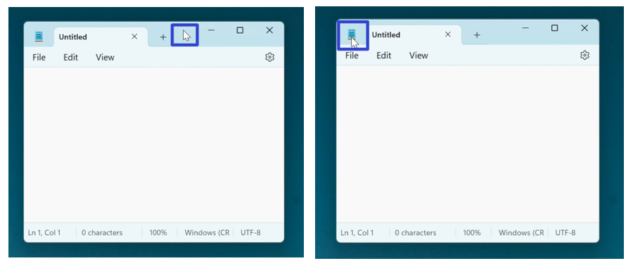
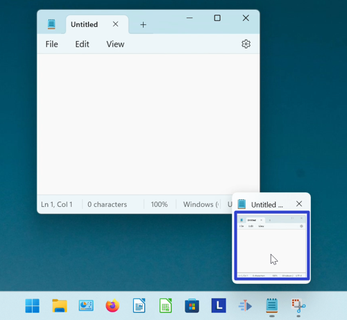

This tutorial covers:

## How to Maximize Notepad:
1. [With Click](#1)
2. [With Double Click](#2)
3. [With Right Click](#3)
4. [With Menu](#4)

 

No time to scroll down? Click through this presentation tutorial:

<iframe src="https://docs.google.com/presentation/d/e/2PACX-1vR0W-xiBGO-hR_4n6ENteNrn6FGuf4DLpdW_ZVYLQHu3wNakYQ_Bh8LkNmjvvORPfF_VMEiqt0Khj_u/embed?start=false&loop=false&delayms=3000" frameborder="0" width="480" height="299" allowfullscreen="true" mozallowfullscreen="true" webkitallowfullscreen="true"></iframe>

 

Follow along with a video:
<iframe class="BLOG_video_class" allowfullscreen="" youtube-src-id="MAp0xgGXSfU" width="100%" height="416" src="https://www.youtube.com/embed/MAp0xgGXSfU"></iframe>

<h1 id="1">How to Maximize Notepad With Click</h1>

* Step 1: First [open](https://qhtutorials.github.io/posts/how-to-open-notepad/) Notepad. Go to the upper right and click the "Maximize" button. The Notepad window maximizes. 

<h1 id="2">How to Maximize Notepad With Double Click</h1>

* Step 1: [Open](https://qhtutorials.github.io/posts/how-to-open-notepad/) Notepad. Double click the top of the window. The Notepad window maximizes. 

<h1 id="3">How to Maximize Notepad With Right Click</h1>

* Step 1: First [open](https://qhtutorials.github.io/posts/how-to-open-notepad/) Notepad. Right click the top of, or the upper left corner of the Notepad window. 

* Step 2: In the menu that opens, click "Maximize". The Notepad window maximizes. 

<h1 id="4">How to Maximize Notepad With Menu</h1>

* Step 1: [Open](https://qhtutorials.github.io/posts/how-to-open-notepad/) Notepad. Go down to the taskbar and hover over the Notepad app icon. 

* Step 2: Right click the small window that appears. 

* Step 3: In the menu that opens, click "Maximize". The Notepad window maximizes. 

Save these instructions for later with this free [tutorial PDF](https://drive.google.com/file/d/1UuDFsS5T0srMAcj9dIqZea5Ceoz_1o0T/view?usp=sharing).

 
