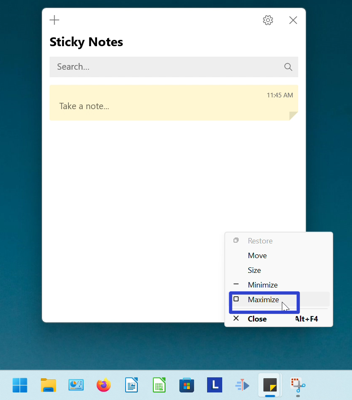
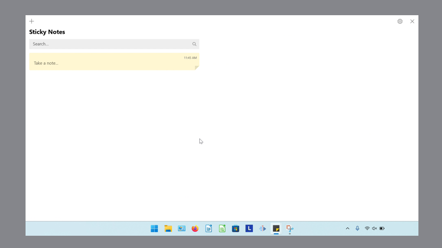
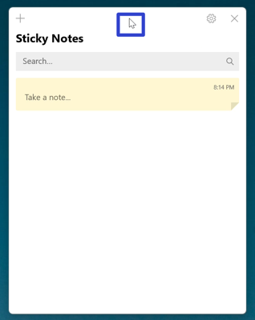
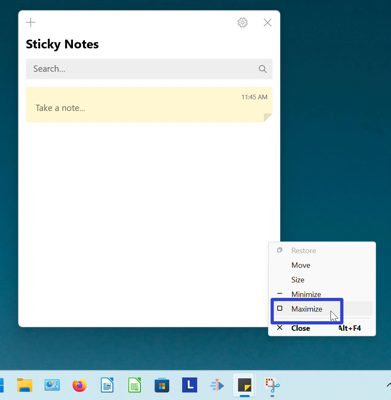
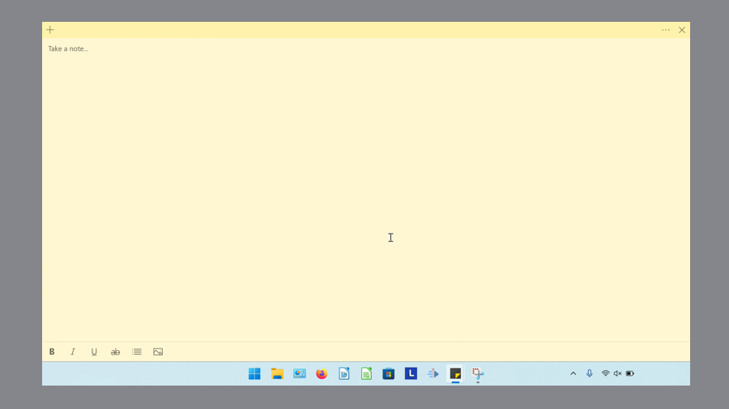
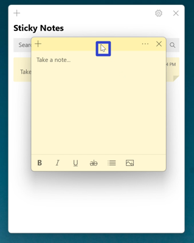

This tutorial covers:

### How to Maximize the Notes List:
1. [With Menu](#1)
2. [With Double Click](#2)

### How to Maximize a Sticky Note:
1. [With Menu](#3)
2. [With Double Click](#4)

 

No time to scroll down? Click through these tutorial slides:

<iframe src="https://docs.google.com/presentation/d/e/2PACX-1vQ5V4SpdMZBiXlDSBsevfu_12GRQ-lJpWwtgzJfGTjhgptXIoaVqe5lnqoUALC-wP1XOM3qoAgr36gT/embed?start=false&loop=false&delayms=3000" frameborder="0" width="480" height="299" allowfullscreen="true" mozallowfullscreen="true" webkitallowfullscreen="true"></iframe>

 

Follow along with a video tutorial:
<iframe class="BLOG_video_class" allowfullscreen="" youtube-src-id="JmUpkc9d_Ig" width="100%" height="416" src="https://www.youtube.com/embed/JmUpkc9d_Ig"></iframe>

<h1 id="1">How to Maximize the Notes List With Menu</h1>

* Step 1: First [open](https://qhtutorials.github.io/posts/how-to-open-notes-list/) the Notes List. Go down to the taskbar and hover the mouse over the Sticky Notes app icon. 

* Step 2: Two small windows appear; one is the Notes List and the other is the sticky note. Right click the small Notes List window. 

*  Step 3: In the menu that opens, click "Maximize". 

* The Notes List maximizes and occupies the entire screen. 

<h1 id="2">How to Maximize the Notes List With Double Click</h1>

* Step 1: [Open](https://qhtutorials.github.io/posts/how-to-open-notes-list/) the Notes List. Double click the top of the Notes List. 

* The Notes List maximizes and occupies the entire screen. 

<h1 id="3">How to Maximize a Sticky Note With Menu</h1>

* Step 1: First [open](https://qhtutorials.github.io/posts/how-to-open-a-sticky-note/) a sticky note. Go down to the taskbar and hover the mouse over the Sticky Notes app icon. 

* Step 2: Two small windows appear; one is the Notes List and the other is the sticky note. Right click the small sticky note window. 

*  Step 3: In the menu that opens, click "Maximize". 

* The sticky note maximizes and occupies the entire screen. 

<h1 id="4">How to Maximize a Sticky Note With Double Click</h1>

* Step 1: [Open](https://qhtutorials.github.io/posts/how-to-open-a-sticky-note/) a sticky note. Double click the top of the sticky note.

* The sticky note maximizes and occupies the entire screen. 

Save a copy of these instructions with this free [PDF tutorial.](https://drive.google.com/file/d/1Dhxk_DT1T1ZG2p8wzbDSmvbjLjzPTUgE/view?usp=sharing)

 
