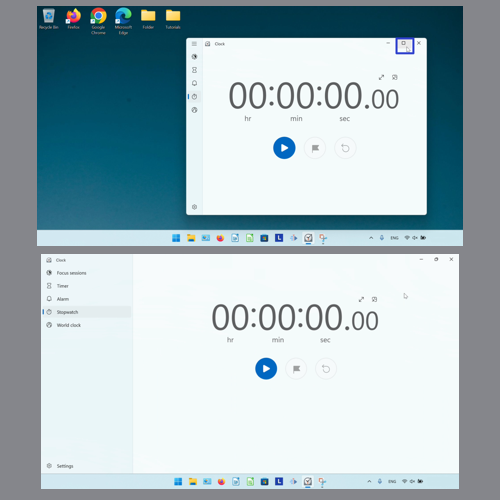
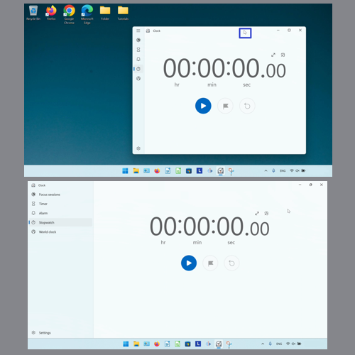
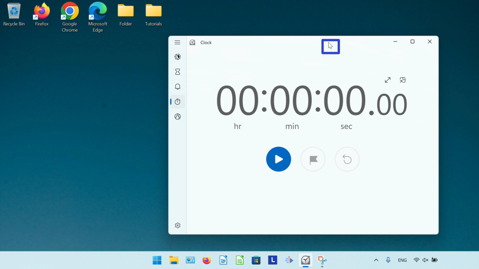
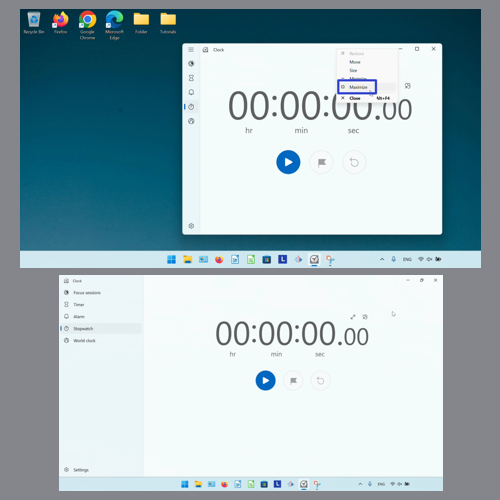

This tutorial covers:

## How to Maximize the Microsoft Windows Clock:
1. [With Click](#1)
2. [With Double Click](#2)
2. [With Menu](#3)
3. [With Right Click](#4)

No time to scroll down? Click through these tutorial slides:

<iframe src="https://docs.google.com/presentation/d/1pvB-OGy86_k8fSAOqClPBNmnM4HyB7bhY7lDI6mgrF8/embed?start=false&loop=false&delayms=3000" frameborder="0" width="480" height="299" allowfullscreen="true" mozallowfullscreen="true" webkitallowfullscreen="true"></iframe>

 

Watch a video tutorial:
<iframe class="BLOG_video_class" allowfullscreen="" youtube-src-id="qpcwS6A9v5I" width="320" height="266" src="https://www.youtube.com/embed/qpcwS6A9v5I"></iframe>

 

<h1 id="1">How to Maximize the Microsoft Windows Clock With Click</h1>

* Step 1: First [open](https://qhtutorials.github.io/posts/how-to-open-microsoft-windows-clock/) Windows Clock. In the upper right corner, click the "Maximize" button. 

<h1 id="2">How to Maximize the Microsoft Windows Clock With Double Click</h1>

* Step 1: [Open](https://qhtutorials.github.io/posts/how-to-open-microsoft-windows-clock/) Windows Clock. Double click the top of the app window. 

<h1 id="3">How to Maximize the Microsoft Windows Clock With Menu</h1>

* Step 1: First [open](https://qhtutorials.github.io/posts/how-to-open-microsoft-windows-clock/) Windows Clock. Go down to the taskbar and hover the mouse over the Windows Clock app icon. 

* Step 2: Right click the small window that appears. 

* Step 3: In the menu that opens, click "Maximize". 

<h1 id="4">How to Maximize the Microsoft Windows Clock With Right Click</h1>

* Step 1: [Open](https://qhtutorials.github.io/posts/how-to-open-microsoft-windows-clock/) Windows Clock. Right click the top of the window. 

* Step 2: In the menu that opens, click "Maximize". 

Save these instructions for later with this free [tutorial PDF](https://drive.google.com/file/d/1BITqmTaMlu3tTVtu6H9wqJy0gYjdADfq/view?usp=sharing).

 

