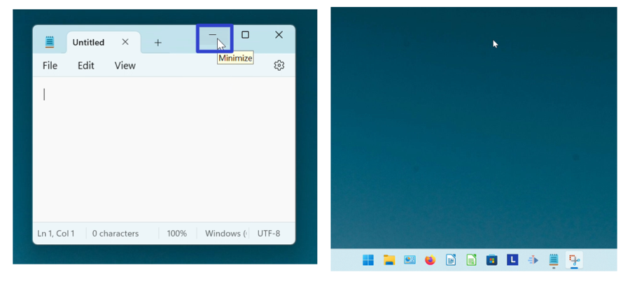
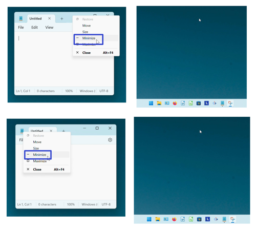
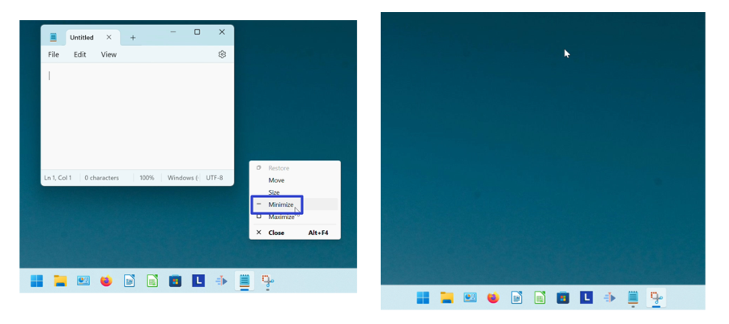

This tutorial covers:

## How to Minimize Notepad:
1. [With Click](#1)
2. [With Right Click](#2)
3. [With Menu](#3)

 

No time to scroll down? Click through these tutorial slides:

<iframe src="https://docs.google.com/presentation/d/e/2PACX-1vQ4v4TIw27JyQDYm8WRRz4kYlajasoKmYfsBNSTsXR8JUdXA-_5PraV7vw5q2KQ0RvZdal6euHo_ZD_/embed?start=false&loop=false&delayms=3000" frameborder="0" width="480" height="299" allowfullscreen="true" mozallowfullscreen="true" webkitallowfullscreen="true"></iframe>

 

Watch a video tutorial:
<iframe class="BLOG_video_class" allowfullscreen="" youtube-src-id="qdPApbNVOHQ" width="100%" height="416" src="https://www.youtube.com/embed/qdPApbNVOHQ"></iframe>

<h1 id="1">How to Minimize Notepad With Click</h1>

* Step 1: First [open](https://qhtutorials.github.io/posts/how-to-open-notepad/) Notepad. Go to the upper right and click the "Minimize" or "-" button. The Notepad window minimizes. 

<h1 id="2">How to Minimize Notepad With Right Click</h1>

* Step 1: [Open](https://qhtutorials.github.io/posts/how-to-open-notepad/) Notepad. Right click either the top or the upper left corner of the window. 

* Step 2: In the menu that opens, click "Minimize". The Notepad window minimizes. 

<h1 id="3">How to Minimize Notepad With Menu</h1>

* Step 1: First [open](https://qhtutorials.github.io/posts/how-to-open-notepad/) Notepad. Go down to the taskbar and hover the mouse over the Notepad app icon. 

* Step 2: Right click the small window that appears. 

* Step 3: In the menu that opens, click "Minimize". The Notepad window minimizes. 

Save these instructions for later with this free [PDF tutorial](https://drive.google.com/file/d/1rjGFdndbdyE8gDHRadlGtsxTmRJ_6VTC/view?usp=sharing).

 