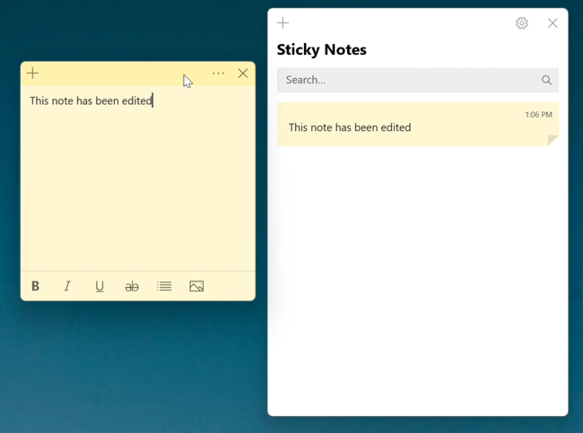

This tutorial covers:

### How to Minimize a Sticky Note:
1. [With Click](#1)
2. [From the Notes List](#2)
3. [From the Notes List With Right Click](#3)
4. [With Menu](#4)

### How to Minimize the Notes List:
1. [With Click](#5)
2. [With Menu](#6)
3. [With Right Click](#7)
4. [With Start](#8)
5. [With Keyboard Shortcut](#9)

 

No time to scroll down? Click through this tutorial presentation:

<iframe src="https://docs.google.com/presentation/d/e/2PACX-1vQffjYV71J_KGa6lMM8-m_EAsc4EV2P4rtH5-pRPqb7Mokw_fh3fh7rKqsWfm4yc49P6rrcvMigl3Lh/embed?start=false&loop=false&delayms=3000" frameborder="0" width="480" height="299" allowfullscreen="true" mozallowfullscreen="true" webkitallowfullscreen="true"></iframe>

 

Watch a tutorial video:
<iframe class="BLOG_video_class" allowfullscreen="" youtube-src-id="gbhEICDg11w" width="100%" height="416" src="https://www.youtube.com/embed/gbhEICDg11w"></iframe>

<h1 id="1">How to Minimize a Sticky Note With Click</h1>

* Step 1: First [open](https://qhtutorials.github.io/posts/how-to-open-notes-list/) the Notes List and [open](https://qhtutorials.github.io/posts/how-to-open-a-sticky-note/) a sticky note. Click anywhere inside the Notes List. The Sticky note minimizes and remains behind the Notes List. 

<h1 id="2">How to Minimize a Sticky Note From the Notes List</h1>

* Step 1: [Open](https://qhtutorials.github.io/posts/how-to-open-notes-list/) the Notes List and [open](https://qhtutorials.github.io/posts/how-to-open-a-sticky-note/) a sticky note. Click inside the sticky note and type any text. At the top of the sticky note, click, hold, drag, and release to move the sticky note anywhere outside the Notes List.

* Step 2: Click the "Menu" or "..." button on the far right side of a sticky note in the Notes List. 

* Step 3: In the menu that opens, click "Close note". The sticky note minimizes and does not appears on the computer screen. 

<h1 id="3">How to Minimize a Sticky Note From the Notes List With Right Click</h1>

* Step 1: [Open](https://qhtutorials.github.io/posts/how-to-open-notes-list/) the Notes List and [open](https://qhtutorials.github.io/posts/how-to-open-a-sticky-note/) a sticky note. Click inside the sticky note and type any text. At the top of the sticky note, click, hold, drag, and release to move the sticky note anywhere outside the Notes List.

* Step 2: Right click a sticky note in the Notes List. 

* Step 3: In the menu that opens, click "Close note". The sticky note minimizes and does not appear on the computer screen. 

<h1 id="4">How to Minimize a Sticky Note With Menu</h1>

* Step 1: First [open](https://qhtutorials.github.io/posts/how-to-open-sticky-notes/) the Sticky Notes app. Go down to the taskbar and hover the mouse over the Sticky Notes app icon. 

* Step 2: Two small windows appear; one is the Notes List and the other is the sticky note. Right click the small sticky note window.

 
* Step 3: In the Menu that opens, click "Minimize". The sticky note minimizes and does not display on the computer screen. 

 

<h1 id="5">How to Minimize the Notes List With Click</h1>

* Step 1: First open any other window or app, such as the Microsoft Store. Then [open](https://qhtutorials.github.io/posts/how-to-open-notes-list/) the Notes List. 

* Step 2: Click anywhere outside of the Notes List. The Notes List window minimizes and does not display on the computer screen. 

<h1 id="6">How to Minimize the Notes List With Menu</h1>

* Step 1: First [open](https://qhtutorials.github.io/posts/how-to-open-sticky-notes/) the Sticky Notes app. Go down to the taskbar and hover the mouse over the Sticky Notes app icon. 

* Step 2: Two small windows appear; one is the Notes List and the other is the sticky note. Right click the small Notes List window.

* Step 3: In the Menu that opens, click "Minimize". The Notes List minimizes and does not display on the computer screen. 

 

<h1 id="7">How to Minimize the Notes List With Right Click</h1>

* Step 1: [Open](https://qhtutorials.github.io/posts/how-to-open-sticky-notes/) the Sticky Notes app. Go down to the taskbar and right click the Sticky Notes app icon. 

* Step 2: In the menu that opens, click "Hide all notes". Both the Notes List and all sticky notes minimize and do not display on the computer screen. 

<h1 id="8">How to Minimize the Notes List With Start</h1>

* Step 1: First [open](https://qhtutorials.github.io/posts/how-to-open-sticky-notes/) the Sticky Notes app. Go down to the taskbar and click Start (four blue squares). 

* Step 2: In the Start window that opens, click the top search bar and type "sticky notes". 

* Step 3: On the search results screen, click "Hide all notes". Both the Notes List and all sticky notes minimize and do not display on the computer screen. 

<h1 id="9">How to Minimize the Notes List With Keyboard Shortcut</h1>

* Step 1: [Open](https://qhtutorials.github.io/posts/how-to-open-sticky-notes/) the Sticky Notes app. On the keyboard, press **Ctrl + O**. Both the Notes List and all sticky notes minimize and do not display on the computer screen. 

Save a copy of these instructions with this free [PDF tutorial.](https://drive.google.com/file/d/1PvvX2g7KN9l7v1FN183V9FI9FHQwKMFe/view?usp=sharing)

 