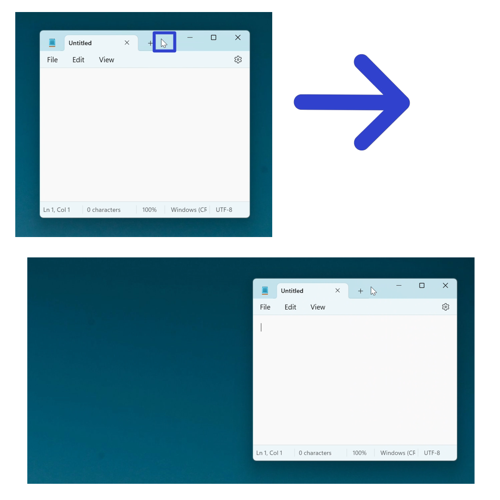
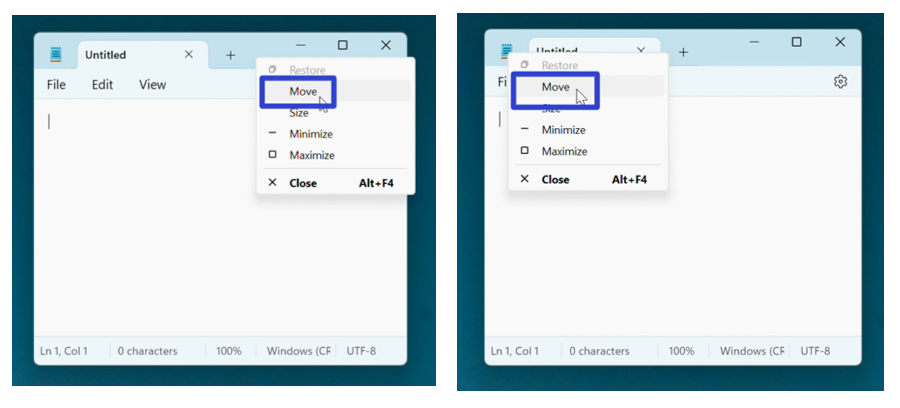
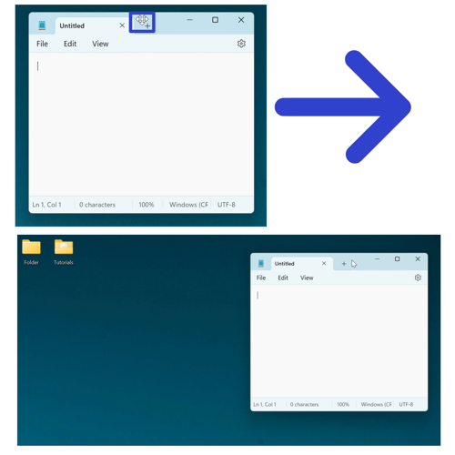
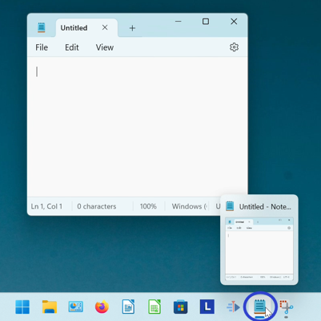
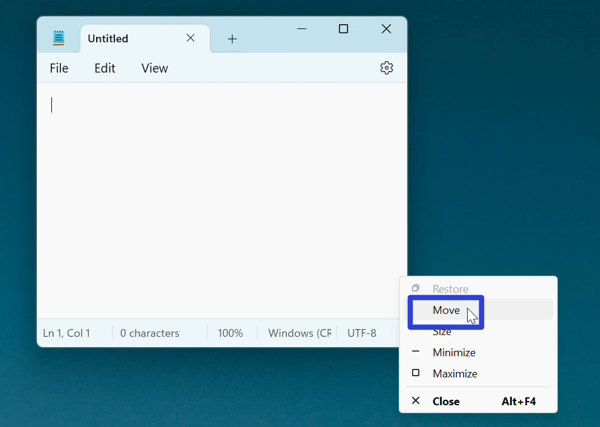
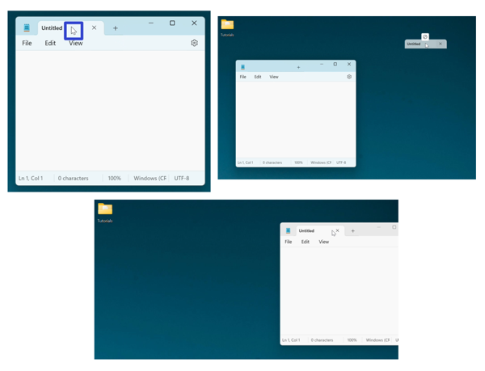
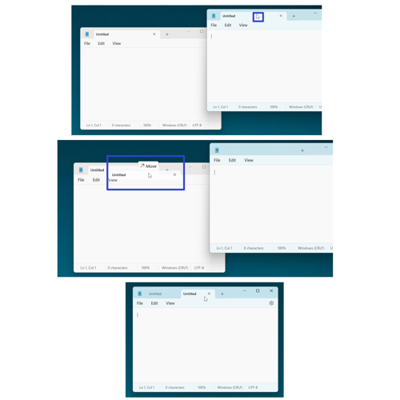

This tutorial covers:

## How to Move Notepad:
1. [With Mouse](#1)
2. [With Right Click](#2)
3. [With Menu](#3)
4. [With a Tab](#4)

## How to Move a Tab:
1. [Outside a Window](#5)
2. [Into a Window](#6)

 

No time to scroll down? Click through these presentation slides:

<iframe src="https://docs.google.com/presentation/d/e/2PACX-1vQr_yJR7yhses2-AR4GLdp3aOgmt03lYWflbMth1763uwQgOYRsebsjTRjEvh_tEf0KqFFqsxN6kSoI/embed?start=false&loop=false&delayms=3000" frameborder="0" width="480" height="299" allowfullscreen="true" mozallowfullscreen="true" webkitallowfullscreen="true"></iframe>

 

Watch a video tutorial:
<iframe class="BLOG_video_class" allowfullscreen="" youtube-src-id="OIbL6ZKVRJ0" width="100%" height="416" src="https://www.youtube.com/embed/OIbL6ZKVRJ0"></iframe>

<h1 id="1">How to Move Notepad With Mouse</h1>

* Step 1: First [open](https://qhtutorials.github.io/posts/how-to-open-notepad/) Notepad. At the top of the window, click, hold, and drag the mouse to move the window. Release the mouse to stop moving the window. 

<h1 id="2">How to Move Notepad With Right Click</h1>

* Step 1: [Open](https://qhtutorials.github.io/posts/how-to-open-notepad/) Notepad. Right click the top of, or the upper left corner of the Notepad window. 

* Step 2: In the menu that opens, click "Move". 

* Step 3: Move the four arrows cursor to the top of the Notepad window. Click, hold, and drag to move the window, and release the mouse to stop moving the window. 

<h1 id="3">How to Move Notepad With Menu</h1>

* Step 1: [Open](https://qhtutorials.github.io/posts/how-to-open-notepad/) Notepad. Go down to the taskbar and hover over the Notepad app icon. 

* Step 2: Right click the small window that appears. 

* Step 3: In the menu that opens, click "Move". 

* Step 4: Move the four arrows cursor to the top of the Notepad window. Click, hold, and drag to move the window, and release the mouse to stop moving the window. 

<h1 id="4">How to Move Notepad a Tab</h1>

* Step 1: First [open](https://qhtutorials.github.io/posts/how-to-open-notepad/) Notepad. Click, hold, and drag a tab to another location on the screen. After releasing the mouse, the Notepad window moves to that location. 

<h1 id="5">How to Move a Tab Outside a Window</h1>

* Step 1: [Open](https://qhtutorials.github.io/posts/how-to-open-notepad/) a Notepad window with at least two tabs. Click, hold, and drag a tab to another location on the screen. After releasing the mouse, the tab opens in another separate Notepad window. 

<h1 id="6">How to Move a Tab Into a Window</h1>

* Step 1: First [open](https://qhtutorials.github.io/posts/how-to-open-notepad/) two Notepad windows. Click, hold, and drag a tab from one window into the second window, until the word "Move" appears. After releasing the mouse, the second Notepad window has two tabs. 

Save these instructions for later with this free [PDF tutorial](https://drive.google.com/file/d/1GPt1-CnivjO7Ue-6vF1C0RldQHbEY_G4/view?usp=sharing).

 
