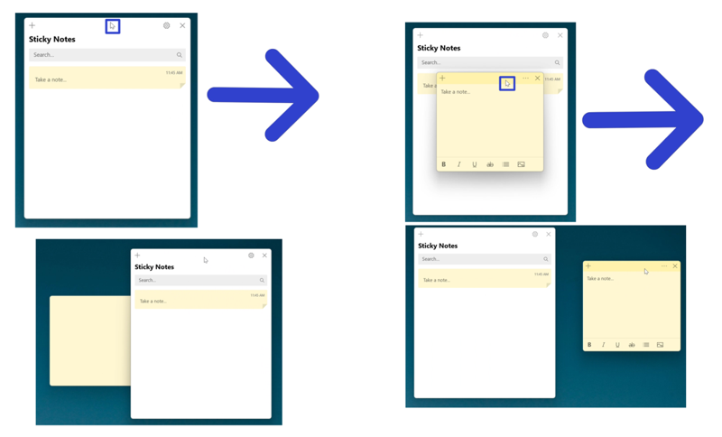
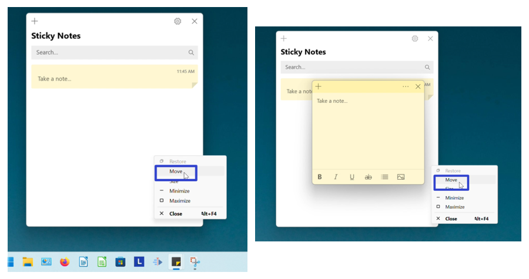
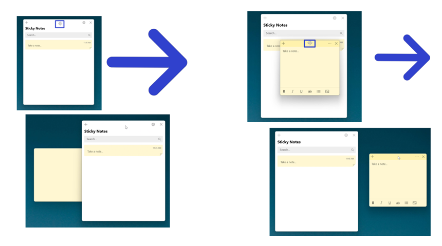

This tutorial covers:

1. [How to Move the Sticky Notes App Window With Mouse](#1)
2. [How to Move the Sticky Notes App Window With Menu](#2)

 

No time to scroll down? Click through this presentation tutorial:

<iframe src="https://docs.google.com/presentation/d/e/2PACX-1vQKVKxnJV4IATqFasPw8EjWns78jdc6VT7N-Rmr3Rsatc67-cQ1DGPlCyZc2Qk819RMS6_oiG0Gw7By/embed?start=false&loop=false&delayms=3000" frameborder="0" width="480" height="299" allowfullscreen="true" mozallowfullscreen="true" webkitallowfullscreen="true"></iframe>

 

Follow along with a tutorial video:
<iframe class="BLOG_video_class" allowfullscreen="" youtube-src-id="Vh4kpw3Wa5c" width="100%" height="416" src="https://www.youtube.com/embed/Vh4kpw3Wa5c"></iframe>

<h1 id="1">How to Move the Sticky Notes App Window With Mouse</h1>

* Step 1: First [open](https://qhtutorials.github.io/posts/how-to-open-sticky-notes/) the Sticky Notes app. At the top of the window, click, hold, and drag to move the window. Release the mouse to stop moving the window.  

<h1 id="2">How to Move the Sticky Notes App Window With Menu</h1>

* Step 1: [Open](https://qhtutorials.github.io/posts/how-to-open-sticky-notes/) the Sticky Notes app. Go down to the taskbar and hover the mouse over the Sticky Notes app icon. 

* Step 2: Two small windows appear; one is the Notes List and the other is the sticky note. Right click one of the windows. 

*  Step 3: In the menu that opens, click "Move". 

* Step 4: Click, hold, and drag the four arrows cursor at the top of the Notes List or sticky note window to move it. Release the mouse to stop moving the window. 

Save a copy of these instructions with this free [PDF tutorial.](https://drive.google.com/file/d/1KiYN3vB4PujkZ8o3FFzV5RXHDe6Icedi/view?usp=sharing)

 

