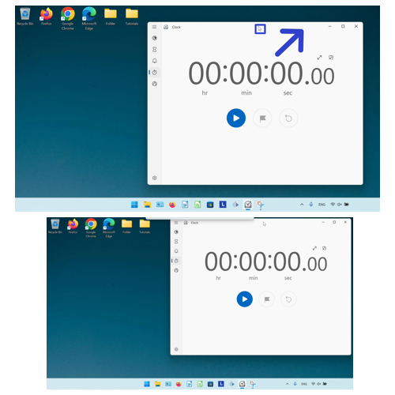
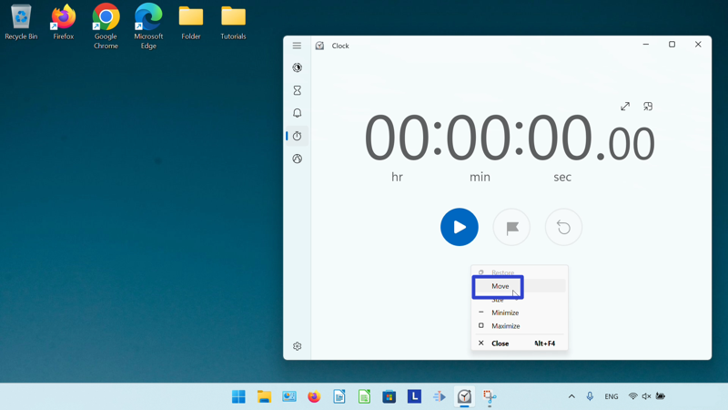
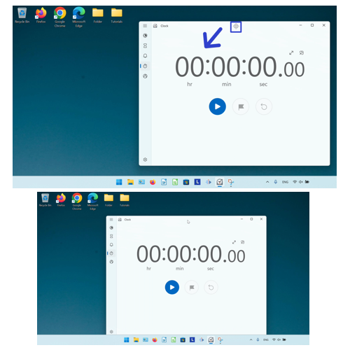
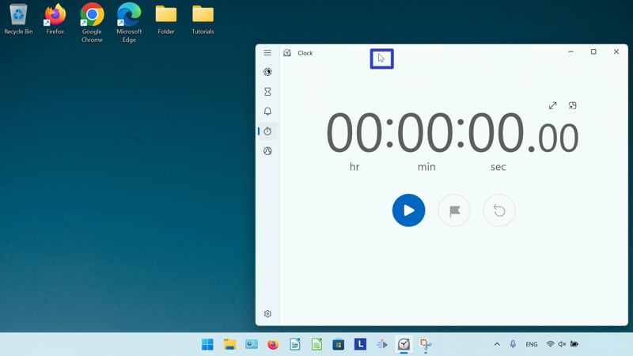
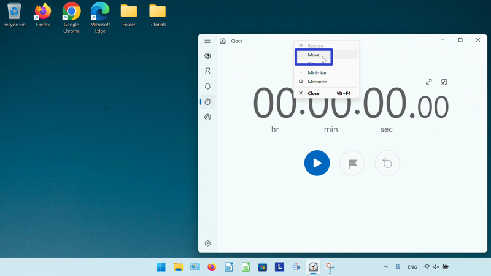

This tutorial covers:

## How to Move the Microsoft Windows Clock:
1. [With Mouse](#1)
2. [With Menu](#2)
3. [With Right Click](#3)

No time to scroll down? Click through these tutorial slides:

<iframe src="https://docs.google.com/presentation/d/1pPXMEIrOCo1B-BdDWNjpuVH12xwE4apDE74oGPlf8Fk/embed?start=false&loop=false&delayms=3000" frameborder="0" width="480" height="299" allowfullscreen="true" mozallowfullscreen="true" webkitallowfullscreen="true"></iframe>

 

Follow along with a video tutorial:
<iframe class="BLOG_video_class" allowfullscreen="" youtube-src-id="TBQarqGJtkY" width="100%" height="416" src="https://www.youtube.com/embed/TBQarqGJtkY"></iframe>

 

<h1 id="1">How to Move the Microsoft Windows Clock With Mouse</h1>

* Step 1: First [open](https://qhtutorials.github.io/posts/how-to-open-microsoft-windows-clock/) Windows Clock. Click, hold, and drag the top of the window to move it. Release the mouse to stop moving the window. 

<h1 id="2">How to Move the Microsoft Windows Clock With Menu</h1>

* Step 1: [Open](https://qhtutorials.github.io/posts/how-to-open-microsoft-windows-clock/) Windows Clock. Go down to the taskbar and hover the mouse over the Windows Clock app icon. 

* Step 2: Right click the small window that appears. 

* Step 3: In the menu that opens, click "Move". 

* Step 4: Click, hold, and drag the four arrows cursor at the top of the window to move it. Release the mouse to stop moving the window. 

<h1 id="3">How to Move the Microsoft Windows Clock With Right Click</h1>

* Step 1: First [open](https://qhtutorials.github.io/posts/how-to-open-microsoft-windows-clock/) Windows Clock. Right click the top of the window. 

* Step 2: In the menu that opens, click "Move". 

* Step 3: Click, hold, and drag the four arrows cursor at the top of the window to move it. Release the mouse to stop moving the window. 

Save these instructions for later with this free [PDF tutorial](https://drive.google.com/file/d/17Jn6OrLw5wYdfwRuAs9SREFSmFKweli2/view?usp=sharing).

 

