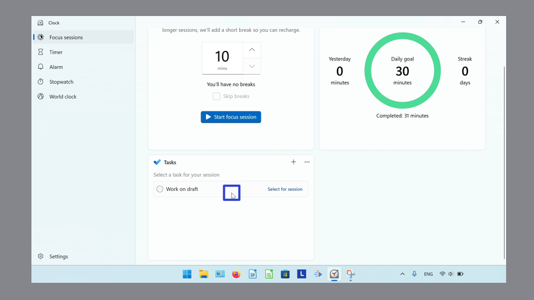
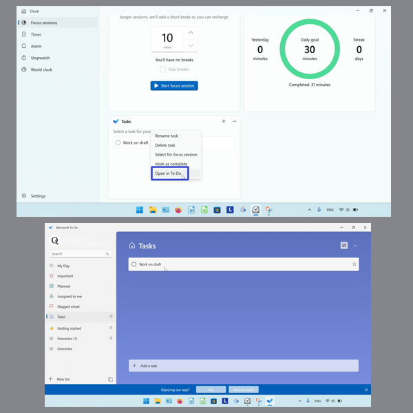
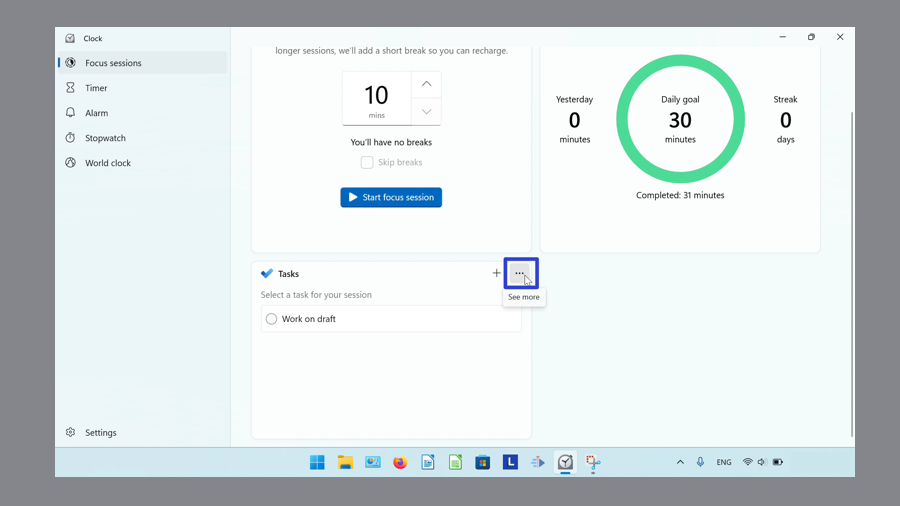
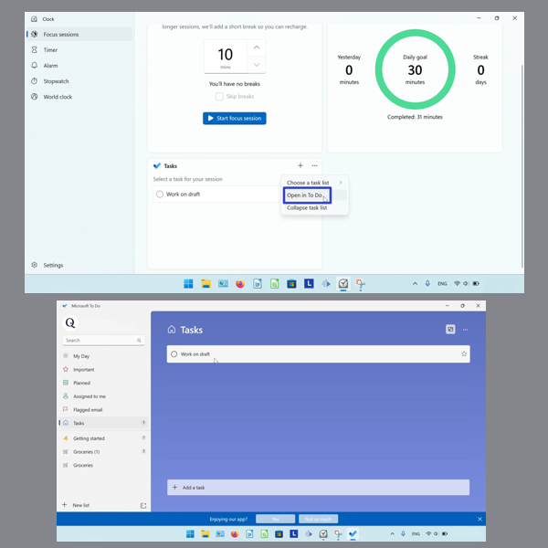
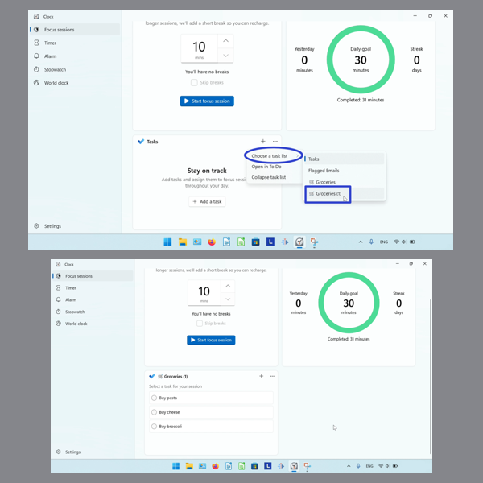
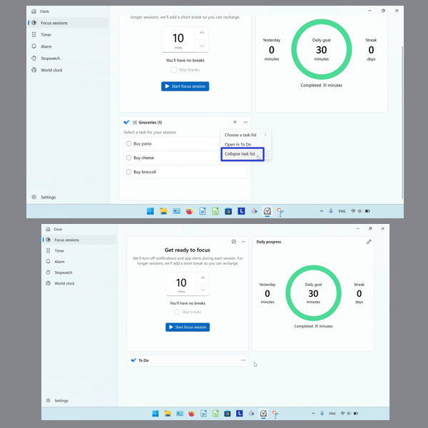
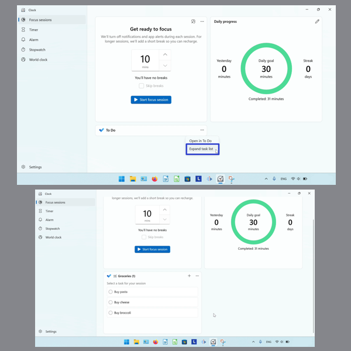

This tutorial covers:

## How to Open a Task in the Microsoft "To Do" App:
1. [With Right Click](#1)
2. [With Menu](#2)

## [How to Switch the Task List](#3)

## [How to Collapse the Task List](#4)

## [How to Expand the Task List](#5)

No time to scroll down? Click through this presentation tutorial:

<iframe src="https://docs.google.com/presentation/d/1OGeHP5qs9pRhDasuE-bGFH_vqayM7NPbV1i-Z25Dmg4/embed?start=false&loop=false&delayms=3000" frameborder="0" width="480" height="299" allowfullscreen="true" mozallowfullscreen="true" webkitallowfullscreen="true"></iframe>

 

Follow along with a tutorial video:
<iframe class="BLOG_video_class" allowfullscreen="" youtube-src-id="6zky9-yunyQ" width="100%" height="416" src="https://www.youtube.com/embed/6zky9-yunyQ"></iframe>

 

<h1 id="1">How to Open a Task in "To Do" With Right Click</h1>

* Step 1: First [add](https://qhtutorials.github.io/posts/how-to-set-up-tasks-for-focus-sessions/) a task. Right click the task. 

* Step 2: In the menu that opens, click "Open in To Do". 

<h1 id="2">How to Open a Task in "To Do" With Menu</h1>

Step 1: [Add](https://qhtutorials.github.io/posts/how-to-set-up-tasks-for-focus-sessions/) a task. Click the "See more" or "..." button. 

* Step 2: In the menu that opens, click "Open in To Do". 

<h1 id="3">How to Switch the Task List</h1>

* Step 1: First [switch](https://qhtutorials.github.io/posts/how-to-edit-windows-clock-settings/) to Focus Sessions mode. In the "Task" section, click the "See more" or "..." button. 

 
* Step 2: In the menu that opens, hover over "Choose a task list". In the second menu that opens, click to select a task list. 

<h1 id="4">How to Collapse the Task List</h1>

* Step 1: [Switch](https://qhtutorials.github.io/posts/how-to-edit-windows-clock-settings/) to Focus Sessions mode. Click the "See more" or "..." button. 

 
* Step 2: In the menu that opens, click "Collapse task list". 

 

<h1 id="5">How to Expand the Task List</h1>

* Step 1: First [collapse](#4) the task list. Click the "See more" or "..." button. 

 
* Step 2: In the menu that opens, click "Expand task list". 

 

Save a copy of these instructions for later with this free [PDF tutorial](https://drive.google.com/file/d/1SWgGc_L_iy4rIIdIQhnpbdxLbTixdDTq/view?usp=sharing).

 

