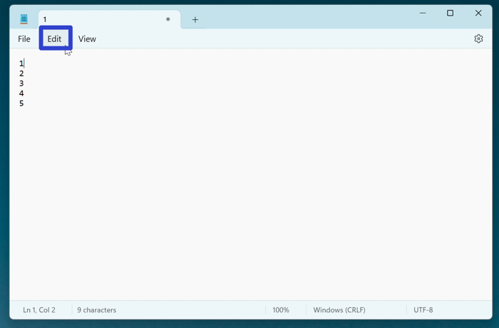
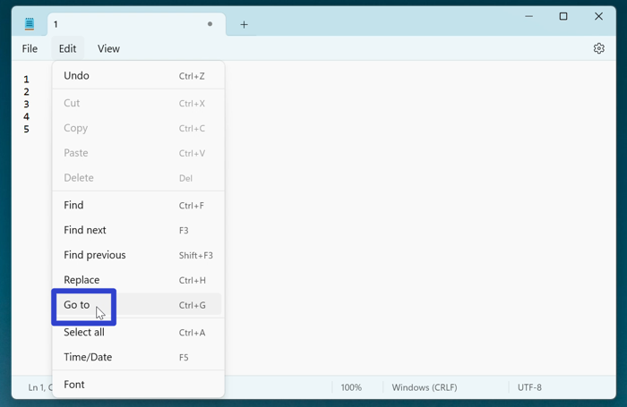
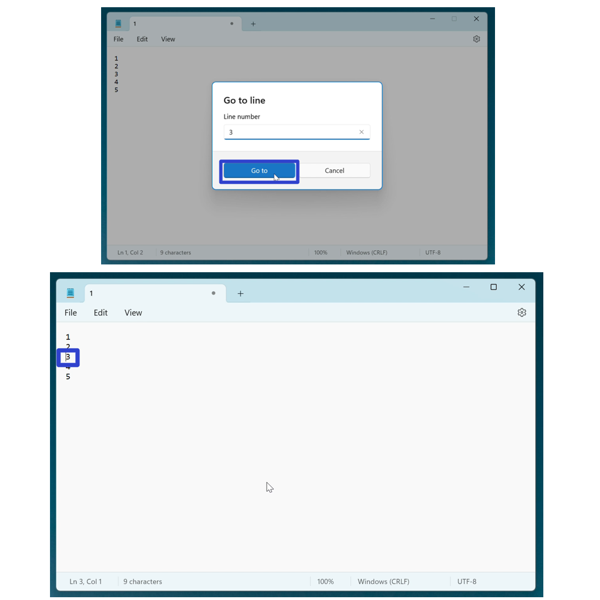
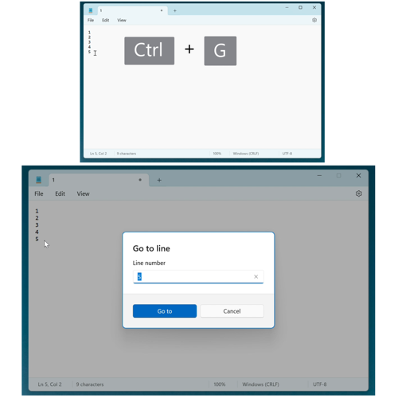
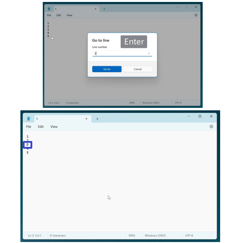
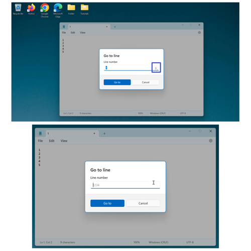
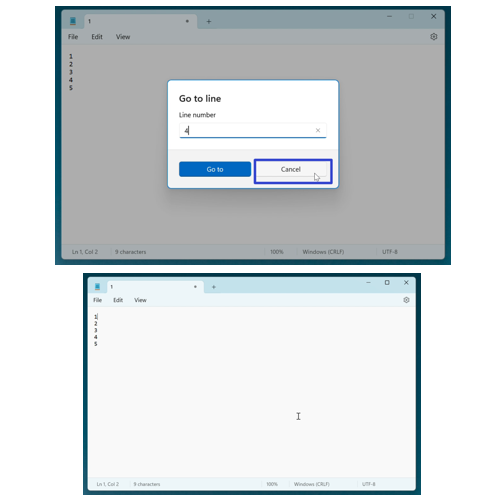
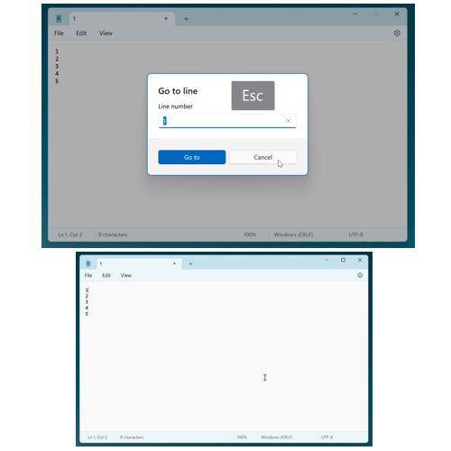

This tutorial covers:

## How to Use "Go To":
1. [With Menu](#1)
2. [With Keyboard Shortcut](#2)

## [How to Clear the "Go To" Window](#3)

## How to Exit the "Go To" Window:
1. [With Click](#4)
3. [With Keyboard](#5)

 

No time to scroll down? Click through this presentation tutorial:

<iframe src="https://docs.google.com/presentation/d/e/2PACX-1vREYYGcqR8nLnMr_Q6v_wHTFeK3d1otfVU4WNgT-Q1P_GzHoIOHJZIkYVCm11459_4yFZ2JdZ8T1mM0/embed?start=false&loop=false&delayms=3000" frameborder="0" width="480" height="299" allowfullscreen="true" mozallowfullscreen="true" webkitallowfullscreen="true"></iframe>

 

Watch a tutorial video:
<iframe class="BLOG_video_class" allowfullscreen="" youtube-src-id="T6eK5MhJzT0" width="100%" height="416" src="https://www.youtube.com/embed/T6eK5MhJzT0"></iframe>

<h1 id="1">How to Use "Go To" With Menu</h1>

* Step 1: First [edit](https://qhtutorials.github.io/posts/how-to-edit-files-in-notepad/) a Notepad file. In the upper left click the "Edit" button. 

* Step 2: In the menu that opens, click "Go to". 

* Step 3: In the Go to window that opens, type a line number and click the "Go to" button. The insertion point, or blinking vertical line, jumps to the corresponding line number in the Notepad window. 

<h1 id="2">How to Use "Go To" With Keyboard Shortcut</h1>

* Step 1: [Edit](https://qhtutorials.github.io/posts/how-to-edit-files-in-notepad/) a Notepad file. On the keyboard press **Ctrl + G**. 

* Step 2: In the "Go to" window that opens, type a line number and press **Enter**. The insertion point, or blinking vertical line, jumps to the corresponding line number in the Notepad window. 

<h1 id="3">How to Clear the "Go To" Window</h1>

* Step 1: First [open](#2) the "Go to" window. On the far right side of the search bar, click the "X" button. The search bar clears as the search term disappears. 

<h1 id="4">How to Exit the "Go To" Window With Click</h1>

* Step 1: [Open](#2) the "Go to" window. Click the "Cancel" button. 

<h1 id="5">How to Use Exit the "Go To" Window With Keyboard</h1>

* Step 1: First [open](#2) the "Go to" window. On the keyboard press **Esc**. 

Refer to these instructions later with this free [tutorial PDF](https://drive.google.com/file/d/1z_euoRzkKXEj1jFr2Nh5ewYe-Ied-9g4/view?usp=sharing).

 

