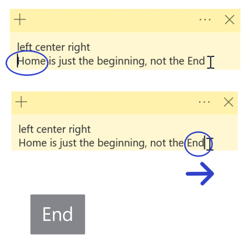

This tutorial covers:

## How to Switch Between Windows
1. [How to Cycle Forward Through All Windows](#1)
2. [How to Cycle Backwards Through All Windows](#2)

## How to Search For Sticky Notes
1. [How to Search for a Sticky Note Witih Click](#3)
2. [How to Clear the Search Bar](#4)
3. [How to Exit the Search Bar With Click](#5)
4. [How to Search for a Sticky Note With Keyboard Shortcut](#6)
5. [How to Clear the Search Bar With Keyboard Shortcut](#7)

## How to Move to a Word
1. [How to Move One Word to the Left](#8)
2. [How to Move One Word to the Right](#9)
3. [How to Move to the Start of a Line](#10)
4. [How to Move to the End of a Line](#11)
5. [How to Move to the Start of a Sticky Note](#12)
6. [How to Move to the End of a Sticky Note](#13)

## How to Move and Delete Words
1. [How to Delete the Previous Word](#14)
2. [How to Delete the Next Word](#15)

 
No time to scroll down? Click through this tutorial slideshow:
<iframe src="https://docs.google.com/presentation/d/e/2PACX-1vSV2880s9vdyUb_OD1ivhqEV97x0aiCAbUpFBvxriSV6JKyDp68CTCVEcouok86Bgt4QMAmSQNF9fG5/embed?start=false&loop=false&delayms=3000" frameborder="0" width="480" height="299" allowfullscreen="true" mozallowfullscreen="true" webkitallowfullscreen="true"></iframe>

 

Follow along this video tutorial:
<iframe class="BLOG_video_class" allowfullscreen="" youtube-src-id="_BKsSMEEt0w" width="100%" height="416" src="https://www.youtube.com/embed/_BKsSMEEt0w"></iframe>

<h1 id="1">How to Cycle Forward Through All Windows</h1>

* Step 1: First [open](https://qhtutorials.github.io/posts/how-to-open-notes-list/) the Notes List. Click the "New note" or "+" button to create one or more sticky notes. 

* Step 2: On the keyboard press **Ctrl + Tab** to cycle forward through all sticky notes and the Notes List window. 

<h1 id="2">How to Cycle Backwards Through All Windows</h1>

* Step 1: [Open](https://qhtutorials.github.io/posts/how-to-open-notes-list/) the Notes List. Click the "New note" or "+" button to create one or more sticky notes. 

* Step 2: On the keyboard press **Ctrl + Shift + Tab** to cycle backwards through all sticky notes and the Notes List window. 

 

<h1 id="3">How to Search for a Sticky Note With Click</h1>

* Step 1: First [open](https://qhtutorials.github.io/posts/how-to-open-notes-list/) the Notes List. Click in the search bar and type any text. 

* Step 2: In the search results, double click a sticky note to open it. 

<h1 id="4">How to Clear the Search Bar</h1>

* Method 1: Click the "X" button on the right side of the search bar. 

* Method 2: First click inside the search bar at the top of the Notes List, and on the keyboard press **Backspace**. 

* Method 3: Select any text in the search bar of the Notes List, and on the keyboard press **Delete**. 

<h1 id="5">How to Exit the Search Bar With Click</h1>

* Step 1: Click anywhere inside the Notes List to exit the search bar. 

<h1 id="6">How to Search for a Sticky Note With Keyboard Shortcut</h1>

* Step 1: First [open](https://qhtutorials.github.io/posts/how-to-open-notes-list/) the Notes List. On the keyboard press **Ctrl + F** and type any text. 

* Step 2: Press the **Enter** key twice to open the first sticky note in the search results list. 

<h1 id="7">How to Clear the Search Bar With Keyboard Shortcut</h1>

* Step 1: [Open](https://qhtutorials.github.io/posts/how-to-open-notes-list/) the Notes List. On the keyboard press the **Esc** key. The Sticky Notes app clears all the search terms from the search bar. 

<h1 id="8">How to Move One Word to the Left</h1>

* Step 1: First [edit](https://qhtutorials.github.io/posts/how-to-edit-a-sticky-note/) a sticky note. On the keyboard press **Ctrl + Left Arrow** key to move the insertion point, or blinking vertical line, one word to the left. Continue pressing **Ctrl + Left Arrow** key to continue moving one word to the left. 

<h1 id="9">How to Move One Word to the Right</h1>

* Step 1: [Edit](https://qhtutorials.github.io/posts/how-to-edit-a-sticky-note/) a sticky note. On the keyboard press **Ctrl + Right Arrow** key to move the insertion point, or blinking vertical line, one word to the right. Continue pressing **Ctrl + Right Arrow** key to continue moving one word to the right. 

<h1 id="10">How to Move to the Start of a Line</h1>

* Step 1: First [edit](https://qhtutorials.github.io/posts/how-to-edit-a-sticky-note/) a sticky note. On the keyboard, press the **Home** key (some computers accept this shortcut as **Fn + Home**). The insertion point, or blinking vertical line, jumps to the start of the current line. 

<h1 id="11">How to Move to the End of a Line</h1>

* Step 1: [Edit](https://qhtutorials.github.io/posts/how-to-edit-a-sticky-note/) a sticky note. On the keyboard, press the **End** key (some computers accept this shortcut as **Fn + End**). The insertion point, or blinking vertical line, jups to the end of the current line. 

<h1 id="12">How to Move to the Start of a Sticky Note</h1>

* Step 1: First [edit](https://qhtutorials.github.io/posts/how-to-edit-a-sticky-note/) a sticky note. On the keyboard press **Ctrl + Home** (some computers accept this shortcut as **Fn + Ctrl + Home** in that order). The insertion point, or blinking vertical line, jumps to the start of the sticky note. 

<h1 id="13">How to Move to the End of a Sticky Note</h1>

* Step 1: [Edit](https://qhtutorials.github.io/posts/-how-to-edit-a-sticky-note/) a sticky note. On the keyboard press **Ctrl + End** (some computers accept this shortcut as **Ctrl + Fn + End**). The insertion point, or blinking vertical line, jumps to the end of the sticky note. 

<h1 id="14">How to Delete the Previous Word</h1>

* Step 1: First [edit](https://qhtutorials.github.io/posts/how-to-edit-a-sticky-note/) a sticky note. On the keyboard press **Ctrl + Backspace** to delete the previous word. Continue pressing **Ctrl + Backspace** to continue deleting the previous word, one at a time. 

<h1 id="15">How to Delete the Next Word</h1>

* Step 1: [Edit](https://qhtutorials.github.io/posts-how-to-edit-a-sticky-note/) a sticky note. On the keyboard press **Ctrl + Delete** to delete the next word. Continue pressing **Ctrl + Delete** to continue deleting the next word, one at a time. 

Save these instructions for later with this free [tutorial PDF](https://drive.google.com/file/d/1GLw16W73tdn5hKlQUR6tIXZj4XhUkIJu/view?usp=sharing).

 

