This tutorial covers:

## [How to Open Images](#1)

## [How to Open PDFs](#2)

## [How to Open the Timer](#3)

## How to Open the Ruler:
1. [With Menu](#4)
2. [With Keyboard Shortcut](#5)

## [How to Open the Source Code](#6)

## [How to Open the "Find" Window](#7)

No time to scroll down? Click through these tutorial slides:

<iframe src="https://docs.google.com/presentation/d/e/2PACX-1vSTIbfgj4yBg_uwY27RKiLnRxtBuyoB8iZ-qGtgFejmVuRpINPCgilBoHVyTnXSSlJ16SrWHuUEGDwF/embed?start=false&loop=false&delayms=3000" frameborder="0" width="480" height="299" allowfullscreen="true" mozallowfullscreen="true" webkitallowfullscreen="true"></iframe>

 

Follow along with a video tutorial:
<iframe class="BLOG_video_class" allowfullscreen="" youtube-src-id="xt99RAfevIE" width="100%" height="416" src="https://www.youtube.com/embed/xt99RAfevIE"></iframe>

 

<h1 id="1">How to Open Images</h1>

* Step 1: First [open](https://qhtutorials.github.io/posts/how-to-open-microsoft-whiteboard/) a whiteboard. On the bottom toolbar click the "More options" or "..." button. 
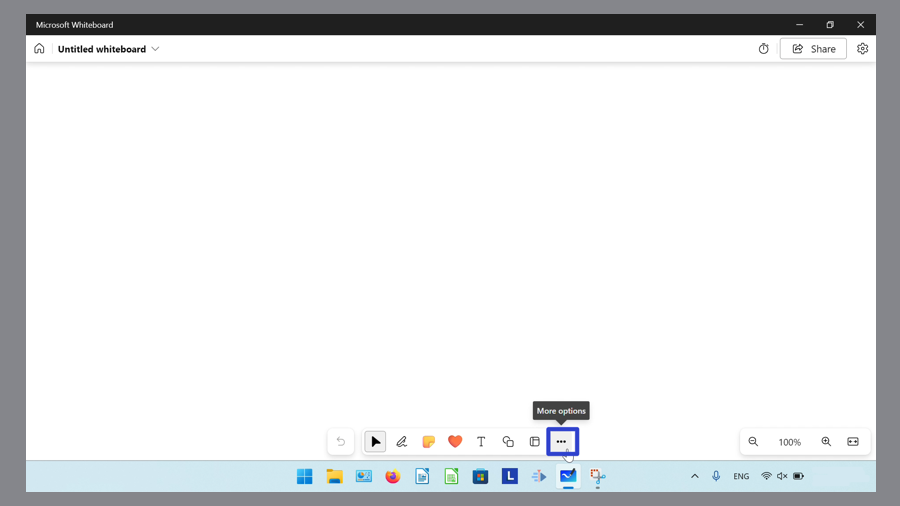

* Step 2: In the menu that opens, click the "Add image" button. 
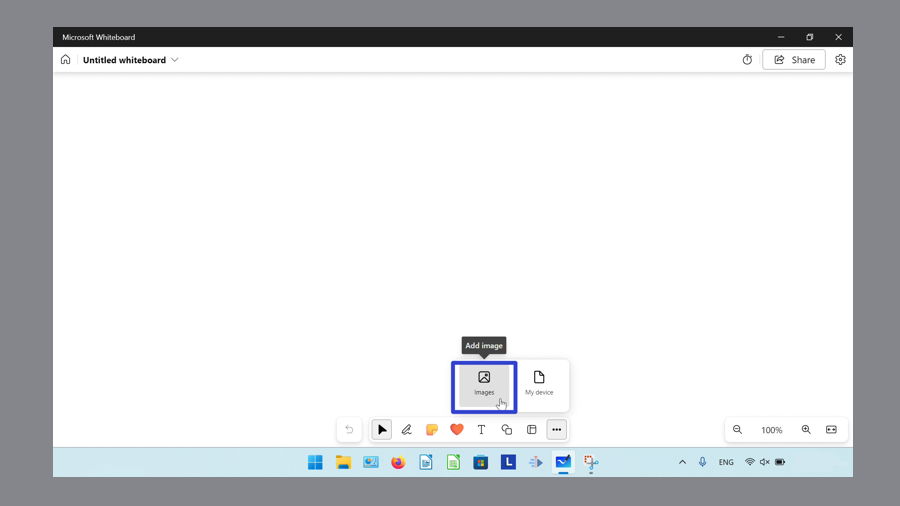

* Step 3: In the "Open" window that opens, select an image and click "Open". 
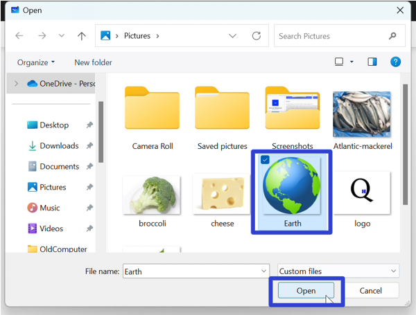

* The canvas displays the image. 
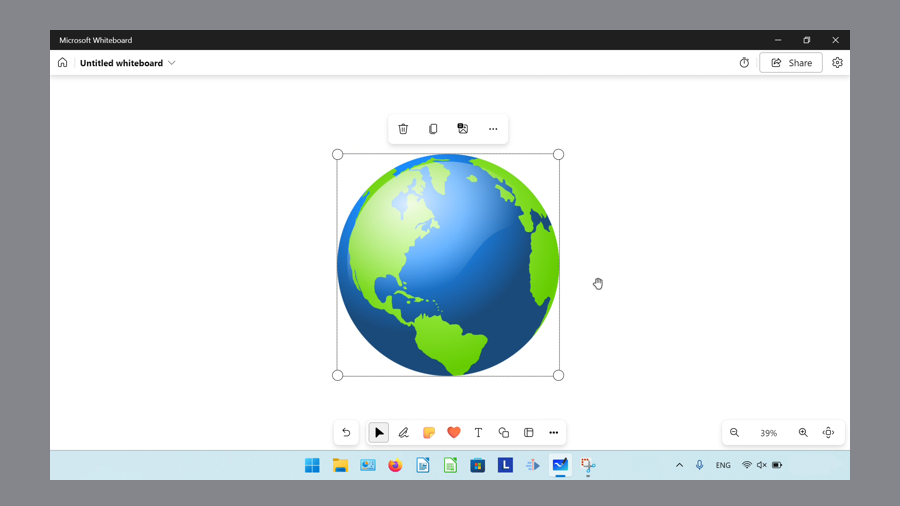

<h1 id="2">How to Open PDFs</h1>

* Step 1: [Open](https://qhtutorials.github.io/posts/how-to-open-microsoft-whiteboard/) a whiteboard. On the bottom toolbar click the "More options" or "..." button. 

* Step 2: In the menu that opens, click "My device". 

* Step 3: In the "Select PDF file to insert" window, select a PDF file and click "Open". 
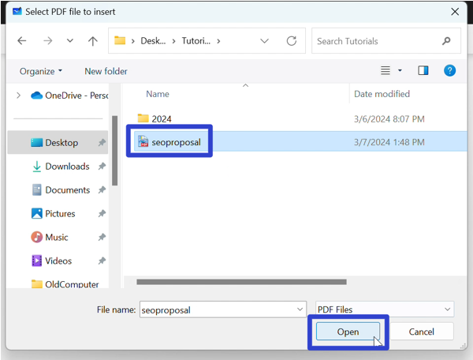

* Step 4: In the window that opens, click to select the specific pages of the PDF, and click "Insert". 
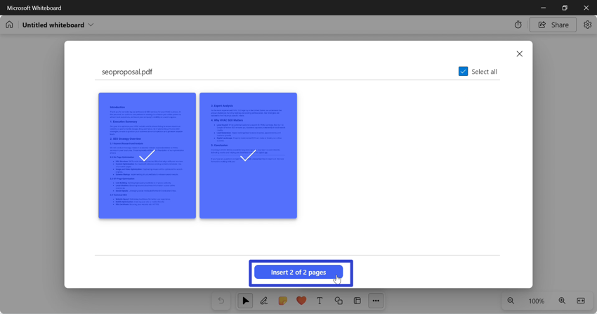

* The canvas displays the PDF. 
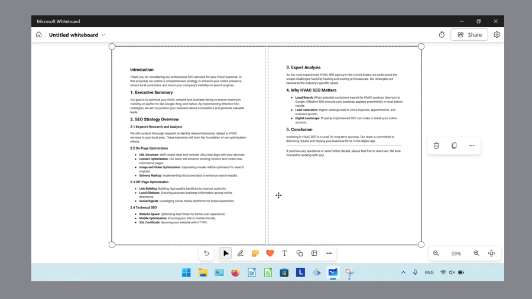

<h1 id="3">How to Open the Timer</h1>

* Step 1: First [open](https://qhtutorials.github.io/posts/how-to-open-microsoft-whiteboard/) a whiteboard. In the upper right click the "Timer" button. 
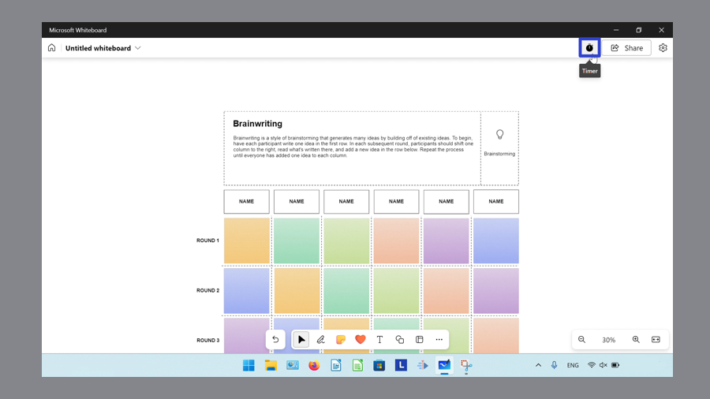

* Step 2: In the Timer window that opens, type a number to edit the time. Alternatively, click the "Minus 1 min" or "-" button to subtract one minute, or the "Add 1 min" or "+" button to add one minute to the timer. 
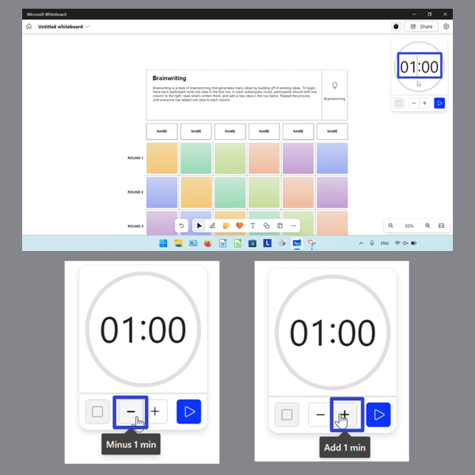

* Step 3: Click the following buttons to perform the corresponding function. After using the Timer, click the "Timer" button again to close the Timer.

- Click the "Start timer" button to start the Timer. 
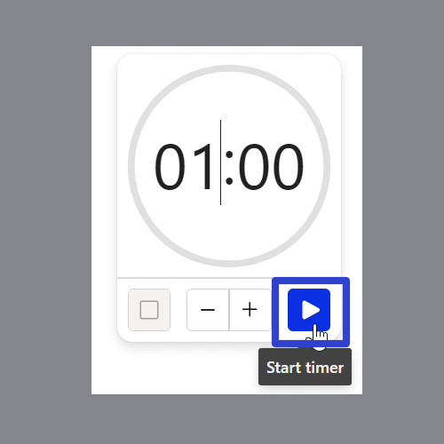

- Click the "Stop timer" button to stop the Timer. 
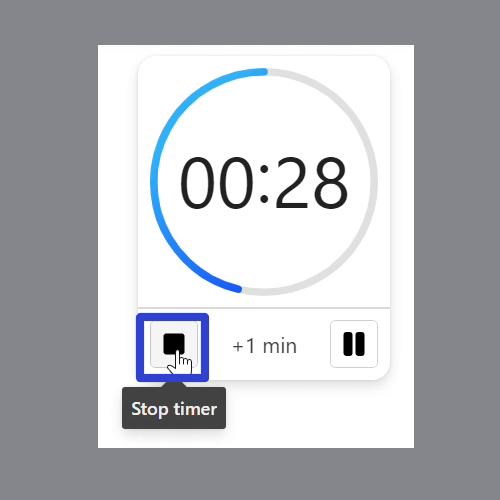

- Click the "Pause timer" button to pause the Timer. Click the "Resume timer" button to resume the Timer. 
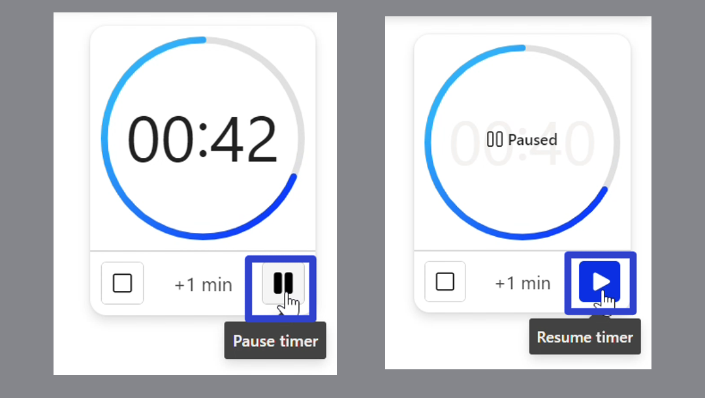

- Click the "Add 1 min" or "+1 min" button to add more time. 
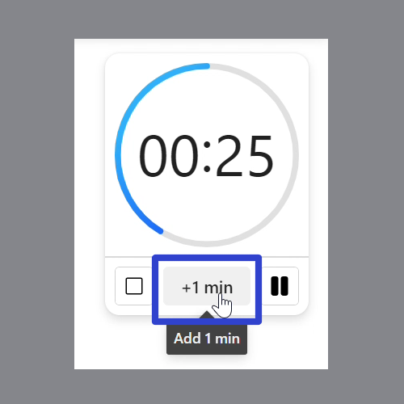

<h1 id="4">How to Open the Ruler With Menu</h1>

* Step 1: [Open](https://qhtutorials.github.io/posts/how-to-open-microsoft-whiteboard/) a whiteboard. Go to the bottom toolbar and click the "Inking" button. 
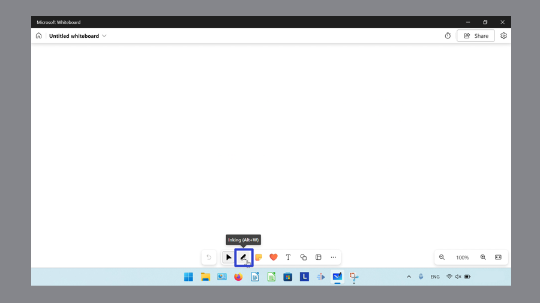

* Step 2: In the menu that opens, click the ruler button. 
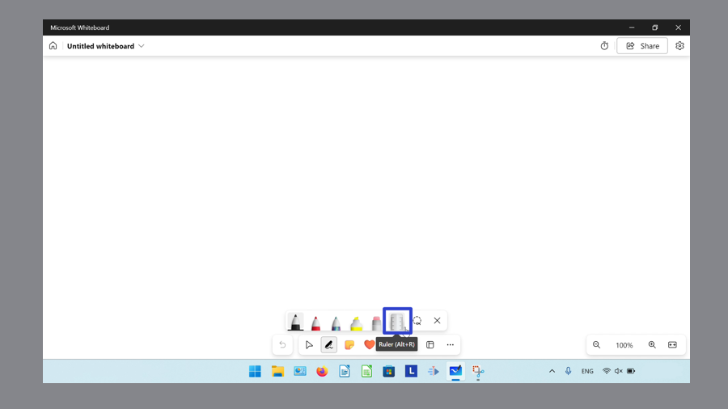

* Step 3: Click, hold, and drag the ruler to move the ruler. Release the mouse to stop moving the ruler. For touch screen devices, use two fingers to rotate the ruler. Click the ruler button again to remove the ruler. 
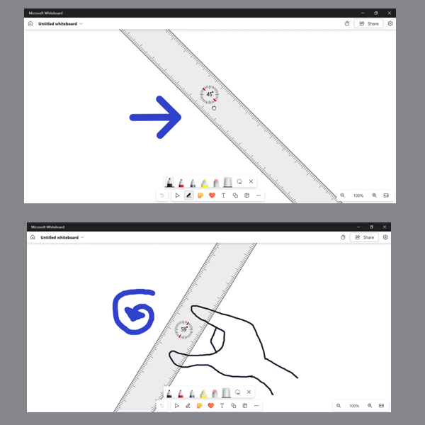

<h1 id="5">How to Open the Ruler With Keyboard Shortcut</h1>

* Step 1: First [open](https://qhtutorials.github.io/posts/how-to-open-microsoft-whiteboard/) a whiteboard. On the keyboard press **Alt + R** to open or remove the ruler. 
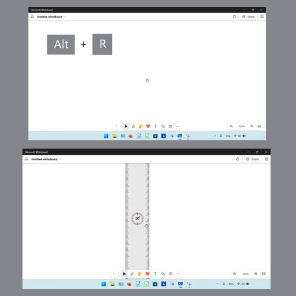

<h1 id="6">How to Open the Source Code</h1>

* Step 1: [Open](https://qhtutorials.github.io/posts/how-to-open-microsoft-whiteboard/) a whiteboard. On the keyboard press **Ctrl + U**. 
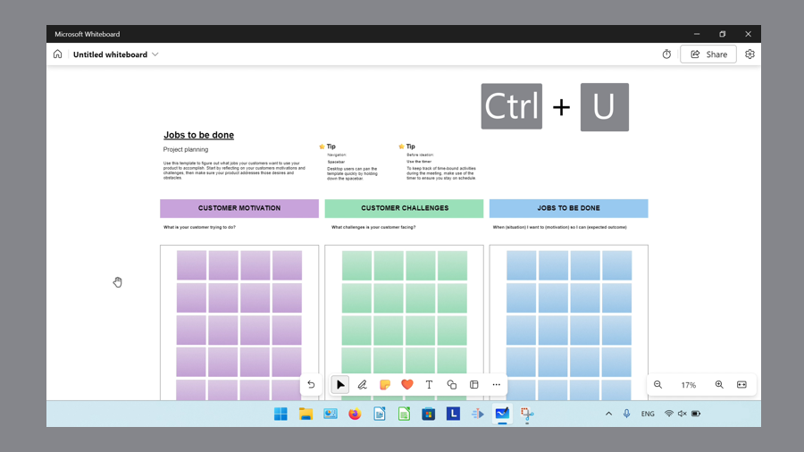

* Microsoft Whiteboard opens a separate window that displays the source code for that whiteboard. This source code can be copied but not edited. 
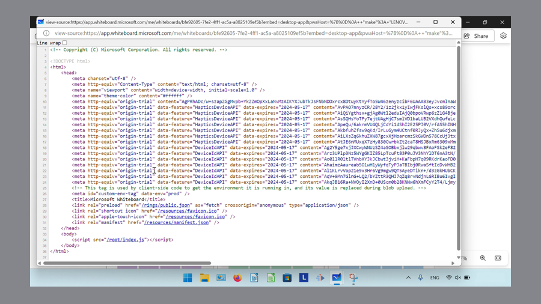

<h1 id="7">How to Open the "Find" Window</h1>

* Step 1: First [open](https://qhtutorials.github.io/posts/how-to-open-microsoft-whiteboard/)) a whiteboard. On the keyboard press **Ctrl + F**. 
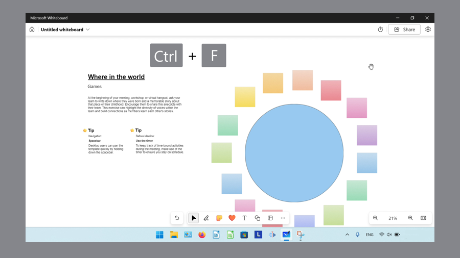

* Step 2: In the "Find" window that opens, type any text and press **Enter** to search for it. Click the "Previous result" or up arrow button to find the previous instance of that text. Click the "Next result" or down arrow button to find the next instance of that text. 
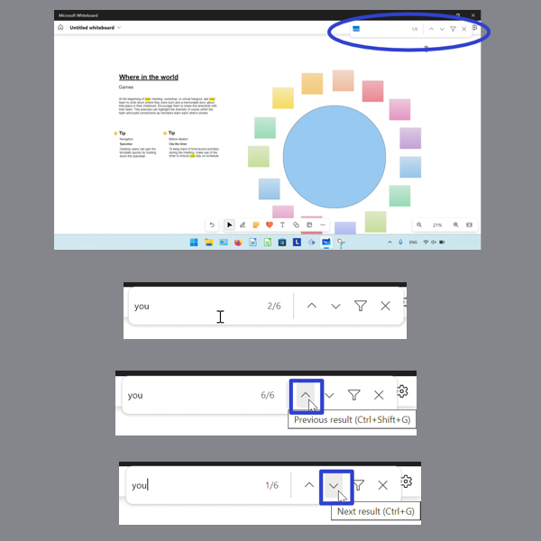

* Alternatively, press **Shift + Ctrl + G** to find the previous instance of text, and **Ctrl + G** to find the next instance of text. 

 

* Step 3: Click the "Show find options" or filter button, then click the "Match case" and "Match whole word" options to toggle them on or off. With "Match case" on, Microsoft Whiteboard finds text that exactly matches the upper and lowercase letters. With "Match whole word on", Microsoft Whiteboard finds whole words that match regardless of upper or lowercase letters. 
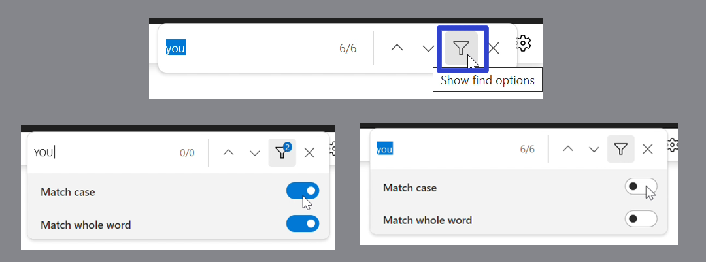

* Step 4: Click the "Close" or "X" button to close the "Find" window. 
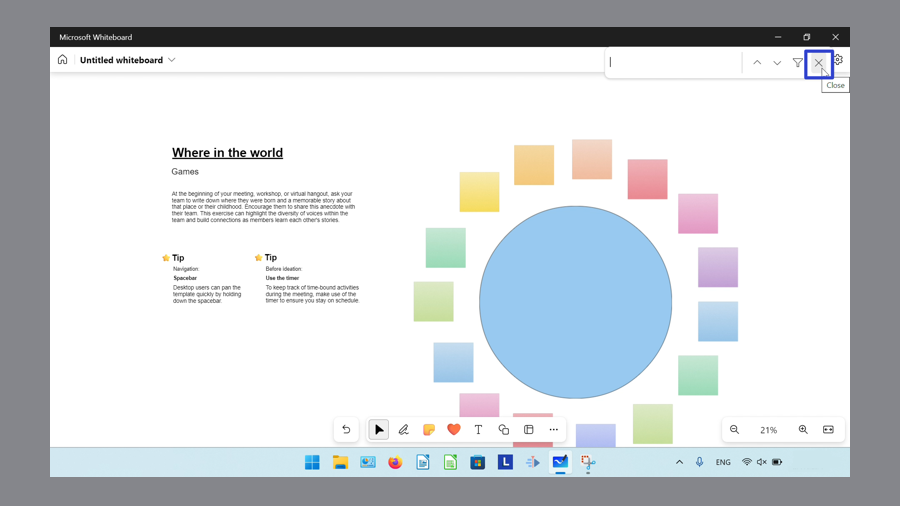

* Alternatively, on the keyboard press **Esc** to close the "Find" window. 
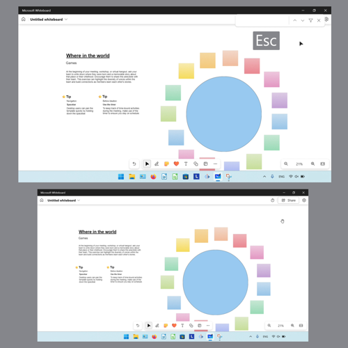

Save a copy of these instructions for later with this free [PDF tutorial](https://drive.google.com/file/d/1AWcBKM2QlwtiACMOFsoC301ujKYtBgU0/view?usp=sharing).

 

