This tutorial covers:

## How to Open a File:
1. [With Menu](#1)
2. [With Keyboard Shortcut](#2)

## How to Open a Window:
1. [With Menu](#3)
2. [With Keyboard Shortcut](#4)

## How to Open a Tab:
1. [With Menu](#5)
2. [With Keyboard Shortcut](#6)
3. [With Click](#7)
4. [With Right Click](#8)

 

No time to scroll down? Click through these presentation slides:

<iframe src="https://docs.google.com/presentation/d/e/2PACX-1vTFYzC09vSOyRLAs2PrbD0JoML9j-GxAeGaJFM20XxhMP3MKNV77F2ByQZ90GH28VNvNX50MUjqrAZK/embed?start=false&loop=false&delayms=3000" frameborder="0" width="480" height="299" allowfullscreen="true" mozallowfullscreen="true" webkitallowfullscreen="true"></iframe>

 

Watch a video tutorial:
<iframe class="BLOG_video_class" allowfullscreen="" youtube-src-id="ofbpuy2stK4" width="100%" height="416" src="https://www.youtube.com/embed/ofbpuy2stK4"></iframe>

<h1 id="1">How to Open a File With Menu</h1>

* Step 1: First [open](https://qhtutorials.github.io/posts/how-to-open-notepad/) Notepad. Go to the upper left and click "File". 

* Step 2: In the menu that opens, click "Open". 
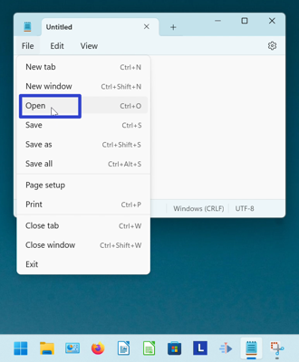

* Step 3: In the "Open" window, click to select a file, and in the lower right click the "Open" button. 
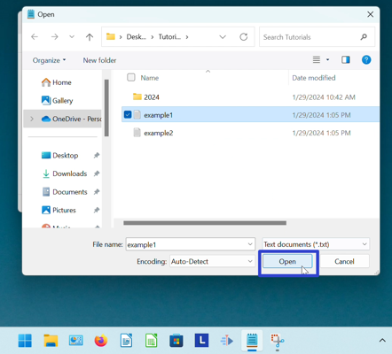

* The file opens. 
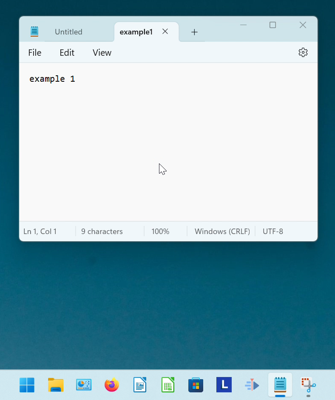

<h1 id="2">How to Open a File With Keyboard Shortcut</h1>

* Step 1: [Open](https://qhtutorials.github.io/posts/how-to-open-notepad/) Notepad. On the keyboard press **Ctrl + O**. 
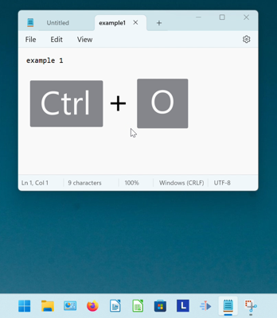

* Step 2: In the "Open" window, click to select a file, and in the lower right click the "Open" button. 

* The file opens. 

 

<h1 id="3">How to Open a Window With Menu</h1>

* Step 1: First [open](https://qhtutorials.github.io/posts/how-to-open-notepad/) Notepad. Go to the upper left and click "File". 

* Step 2: In the menu that opens, click "New window". A new Notepad window opens. 
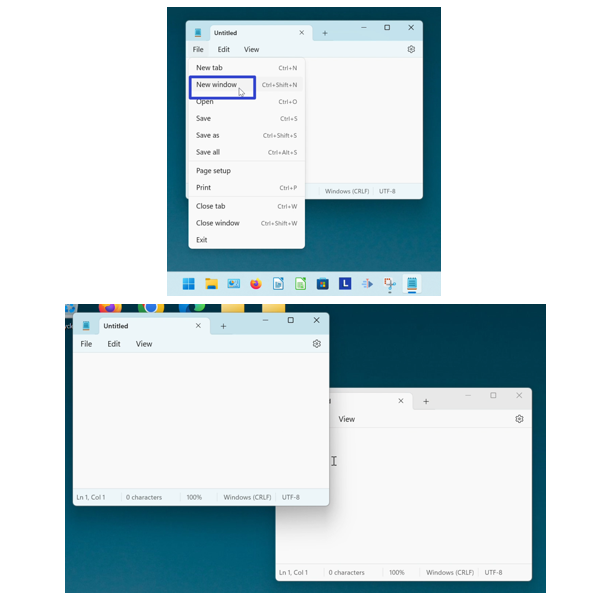

<h1 id="4">How to Open a Window With Keyboard Shortcut</h1>

* Step 1: [Open](https://qhtutorials.github.io/posts/how-to-open-notepad/) Notepad. On the keyboard press **Ctrl + Shift + N**. A new Notepad window opens. 
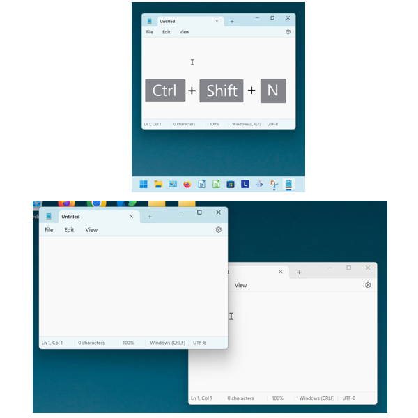

<h1 id="5">How to Open a Tab With Menu</h1>

* Step 1: First [open](https://qhtutorials.github.io/posts/how-to-open-notepad/) Notepad. Go to the upper left and click "File". 

* Step 2: In the menu that opens, click "New tab". A new tab opens in the current Notepad window.
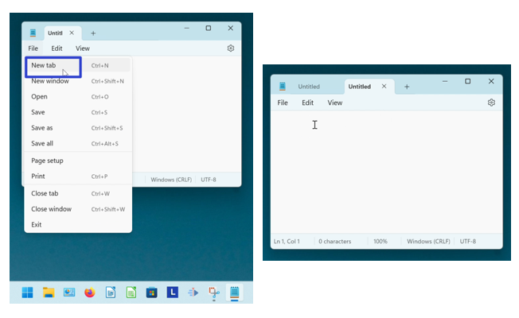

<h1 id="6">How to Open a New Tab With Keyboard Shortcut</h1>

* Step 1: [Open](https://qhtutorials.github.io/posts/how-to-open-notepad/) Notepad. On the keyboard press **Ctrl + N** or **Ctrl + T**. A new tab opens in the current Notepad window. 
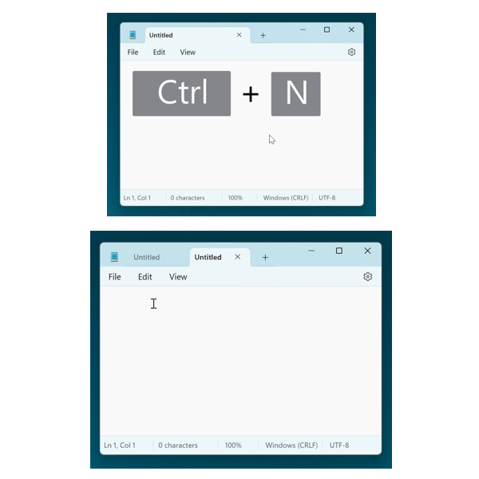

<h1 id="7">How to Open a New Tab With Click</h1>

* Step 1: First [open](https://qhtutorials.github.io/posts/how-to-open-notepad/) Notepad. Go to the right side of the current tab and click the "Add new tab" or "+" button. A new tab opens in the current Notepad window. 
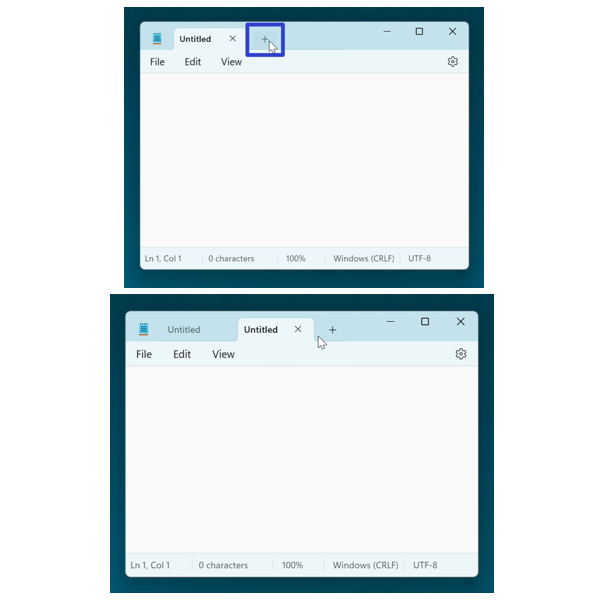

<h1 id="8">How to Open a New Tab With Right Click</h1>

* Step 1: [Open](https://qhtutorials.github.io/posts/how-to-open-notepad/) Notepad. Right click the current tab. 
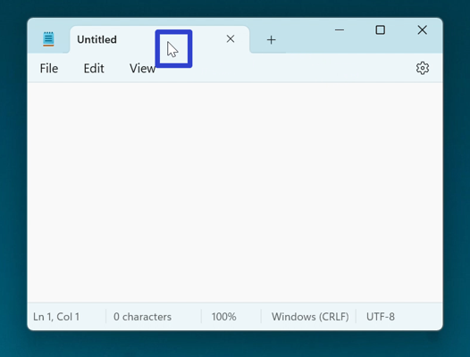

* Step 2: In the menu that opens, click "New tab". A new tab opens in the current Notepad window. 
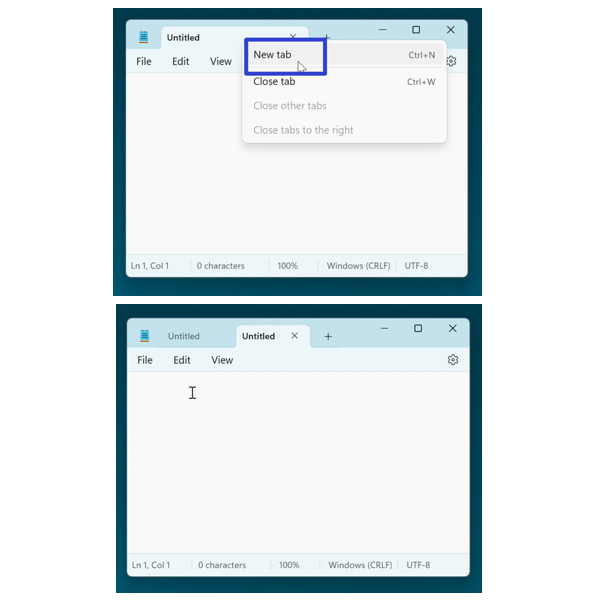

Download a free [tutorial PDF](https://drive.google.com/file/d/1ebogW52rZPUh5NlZ7fUEDofbyOpzWgOf/view?usp=sharing).

 