This tutorial covers:

## [What is Microsoft Whiteboard?](#1)

## [How to Open Microsoft Whiteboard With Search](#2)

## How to Open a Blank Whiteboard:
1. [With Click](#3)
2. [With Close](#4)
3. [By Default](#5)

## How to Open a Whiteboard Template:
1. [With the Templates Window](#6)
2. [With Preview](#7)
3. [With Menu](#8)

## [How to Refresh a Whiteboard](#8)

No time to scroll down? Click through these tutorial slides:

<iframe src="https://docs.google.com/presentation/d/e/2PACX-1vSqwi1ywxN7TaYWWhjyGr9D5KzgWtJ133vyJ_rOyKjG_IWemOLTyWGNRDkTy5ffBd-VEihRCUmhcuP8/embed?start=false&loop=false&delayms=3000" frameborder="0" width="480" height="299" allowfullscreen="true" mozallowfullscreen="true" webkitallowfullscreen="true"></iframe>

 

Follow along with a video tutorial:
<iframe class="BLOG_video_class" allowfullscreen="" youtube-src-id="8eC8KD8pAEQ" width="100%" height="416" src="https://www.youtube.com/embed/8eC8KD8pAEQ"></iframe>

 

<h1 id="1">What is Microsoft Whiteboard?</h1>

As a cloud-based or online app, Microsoft Whiteboard enables multiple users to collaborate on digital whiteboards in real time. Microsoft Whiteboard is a creative brainstorming environment with sticky notes, pens, and shapes. Use Microsoft Whiteboard for team building meetings, organizing tasks, sharing opinions, and more.

<h1 id="2">How to Open Microsoft Whiteboard With Search</h1>

* Step 1: Go down to the taskbar and click the Start (four blue squares) button. 

* Step 2: In the Start window that opens, click the top search bar and type "whiteboard". 

* Step 3: On the search results screen, click one of these buttons.
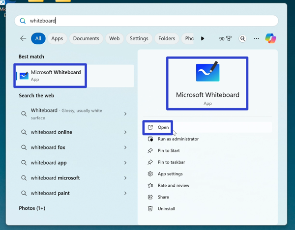

* Microsoft Whiteboard opens. 

<h1 id="3">How to Open a Blank Whiteboard With Click</h1>

* Step 1: First [open](#2) the Microsoft Whiteboard app. Click the "+ New Whiteboard" button. 
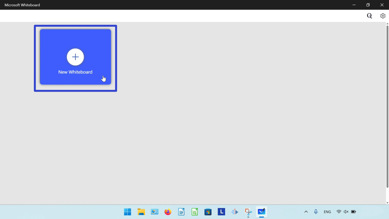

* Step 2: In the "Templates" window that opens, click the "Start with blank canvas" button. 
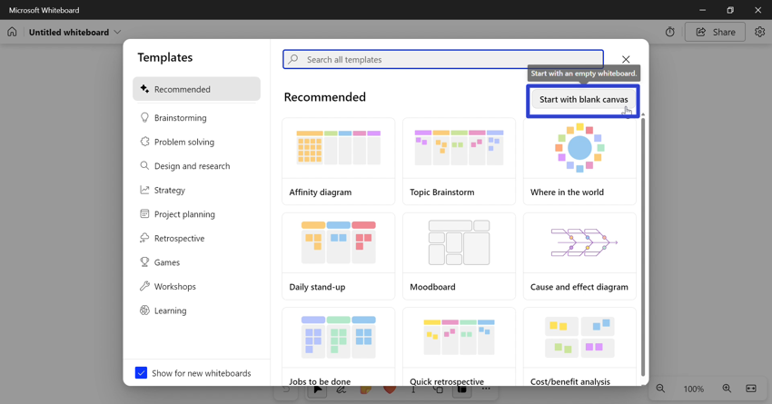

* A blank canvas opens. 
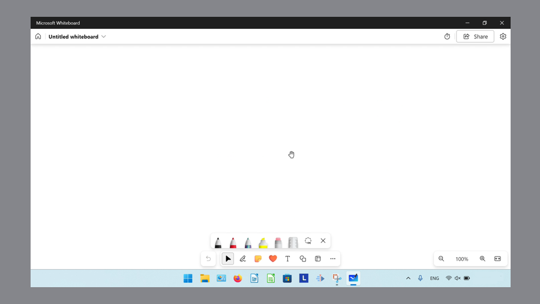

<h1 id="4">How to Open a Blank Whiteboard With Close</h1>

* Step 1: [Open](#2) the Microsoft Whiteboard app. Click the "+ New Whiteboard" button. 

* Step 2: In the "Templates" window that opens, click the "Close" or "X" button in the upper right corner. 
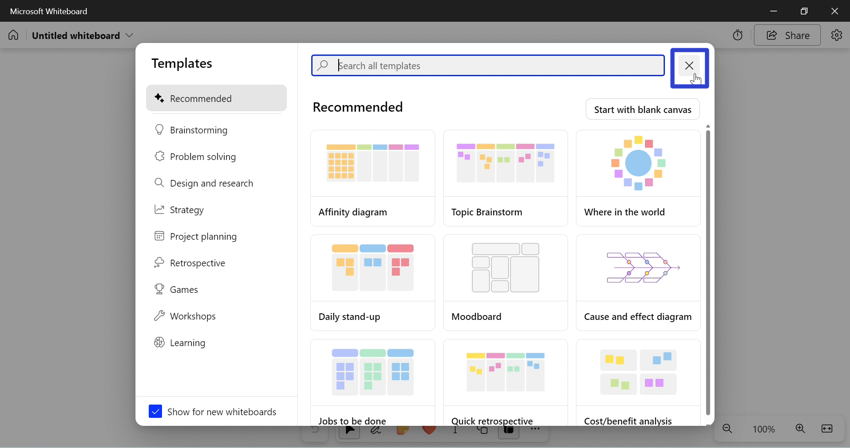

* A blank canvas opens. 

<h1 id="5">How to Open a Blank Whiteboard By Default

* Step 1: First [open](#2) the Microsoft Whiteboard app. Click the "+ New Whiteboard" button. 

* Step 2: In the "Templates" window that opens, click to deselect the "Show for new whiteboards" option, then click the "X" or click anywhere outside the window. 
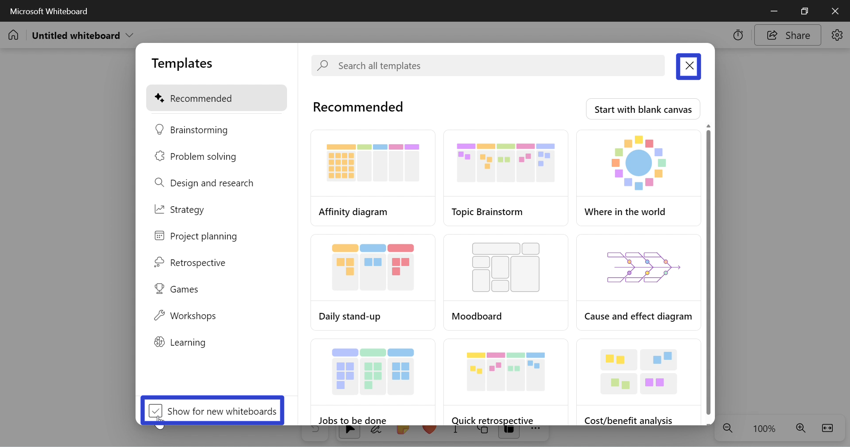

* Step 3: Click the "My whiteboards" or house button in the upper left. 

* Step 4: Click the "+ New Whiteboard" button again. 

* Microsoft Whiteboard does not display the "Templates" window and instead opens a blank canvas. 

<h1 id="6">How to Open a Whiteboard Template With the Templates Window</h1>

* Step 1: [Open](#2) the Microsoft Whiteboard app. Click the "+ New Whiteboard" button. 

* Step 2: In the "Templates" window that opens, hover over any of the templates, then click the "Use this template" button. 

* Step 3: In the canvas that opens, click anywhere to insert the template. 
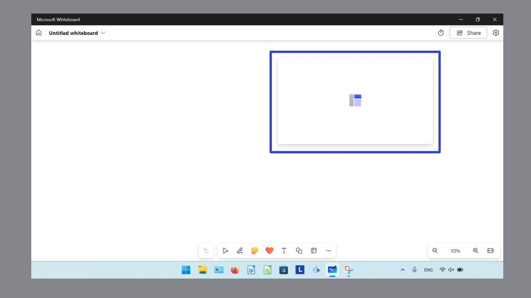

* The template opens. 
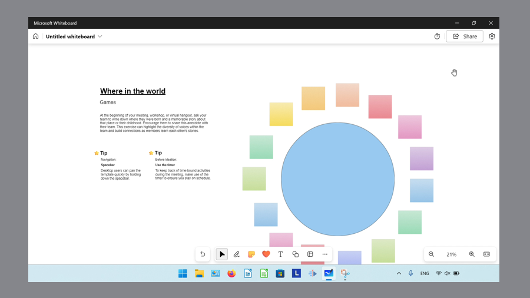

<h1 id="7">How to Open a Whiteboard Template With Preview</h1>

* Step 1: First [open](#2) the Microsoft Whiteboard app. Click the "+ New Whiteboard" button. 

* Step 2: In the "Templates" window that opens, hover over any of the templates and click the "Preview" button. 
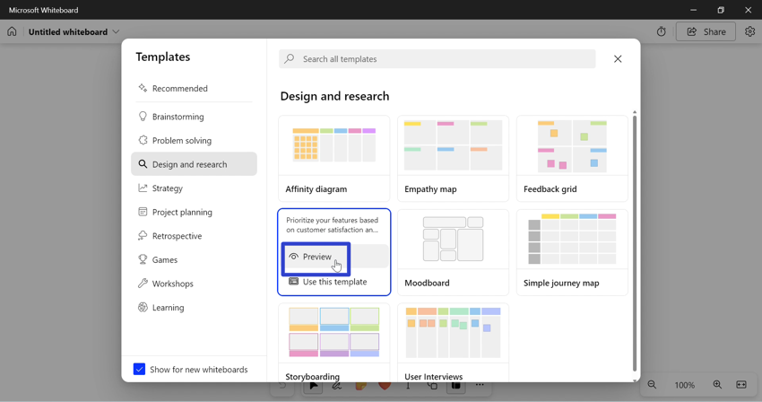

* Step 3: In the "Preview" window, click the "Use this template" button. 
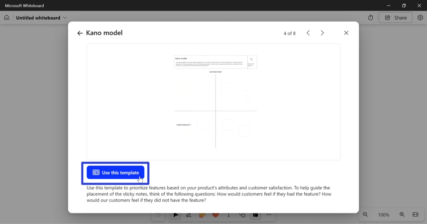

* Step 4: In the canvas that opens, click anywhere to insert the template. 

* The template opens. 

<h1 id="8">How to Open a Whiteboard Template With Menu</h1>

* Step 1: [Open](#3) a blank whiteboard. On the lower toolbar click the "Add template" button. 
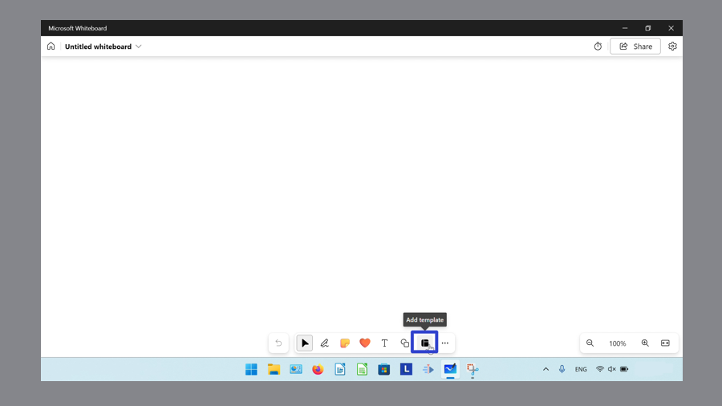

* Step 2: In the "Templates" window that opens, hover over any of the templates, then click the "Use this template" button. 

* Step 3: In the canvas that opens, click anywhere to insert the template. 

* The template opens. 

<h1 id="9">How to Refresh a Whiteboard</h1>

* Step 1: First [open](#6) a whiteboard template. On the keyboard press **Ctrl + R**. 
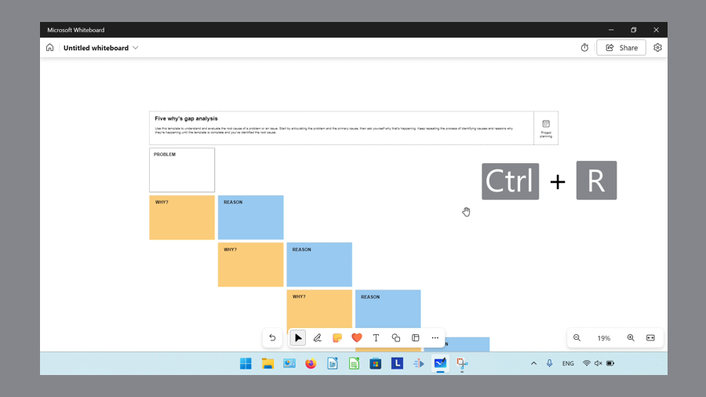

* Microsoft Whiteboard reloads the current whiteboard. 
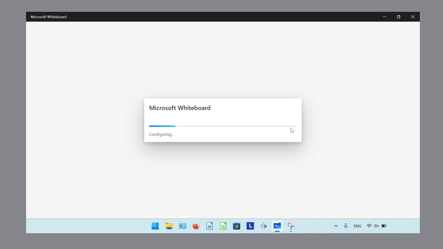

Save a copy of these instructions for later with this free [PDF tutorial]().

 

