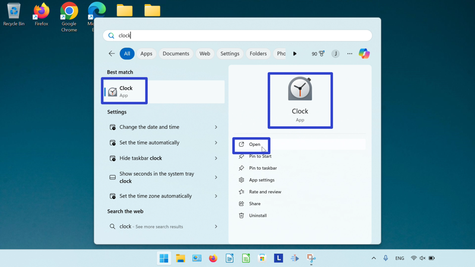
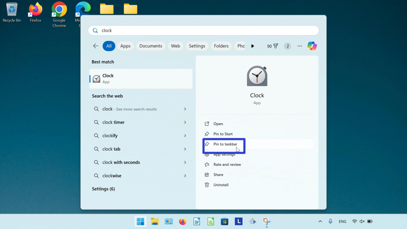
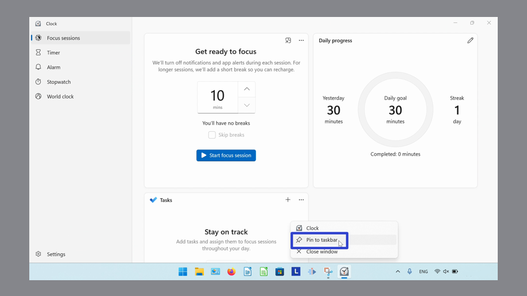
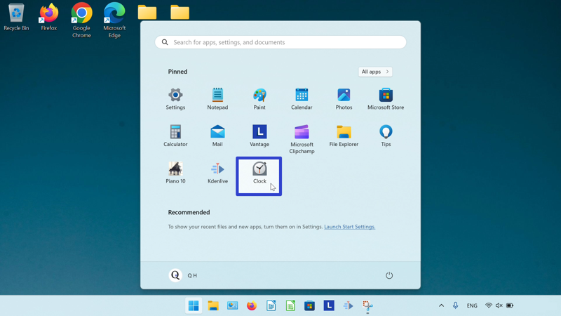
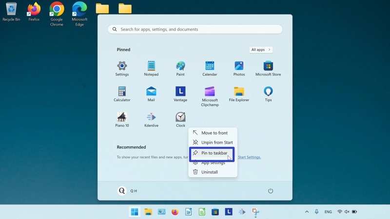
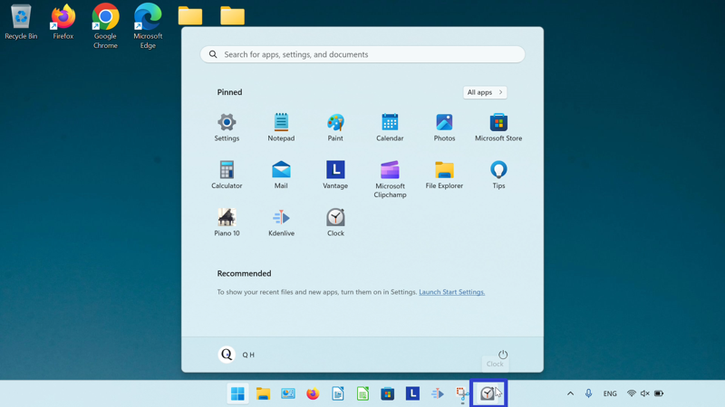
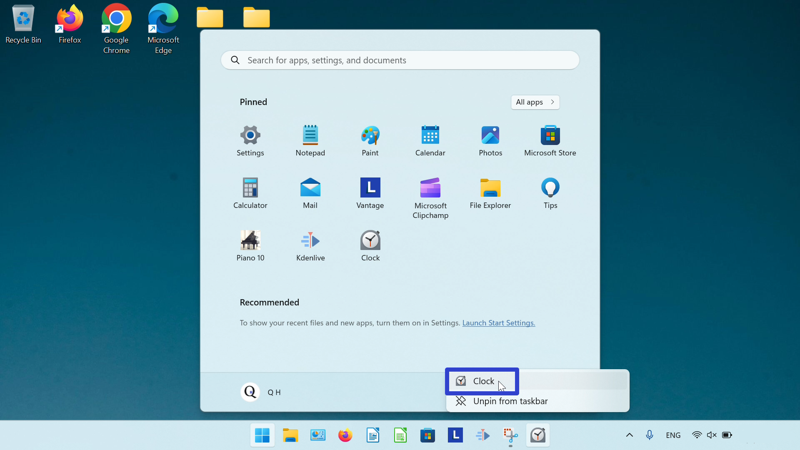
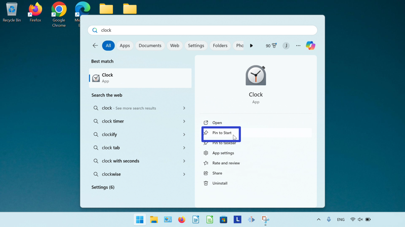
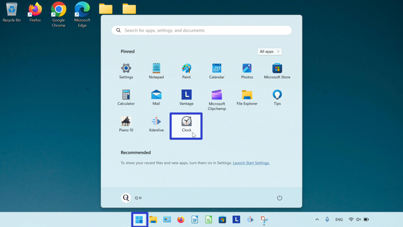

This tutorial covers:

## [What is the Microsoft Windows Clock](#1)

## [How to Open Microsoft Windows Clock With Search](#2)

## How to Pin the Microsoft Windows Clock to the Taskbar:
1. [With Search](#3)
2. [With Right Click](#4)
3. [From Start](#5)

## [How to Pin the Microsoft Windows Clock to Start](#6)

No time to scroll down? Click through these tutorial slides:

<iframe src="https://docs.google.com/presentation/d/1NavRehmKE0M23qxyE1OhqNpW-7nKd3YGbhSTN8O_1YI/embed?start=false&loop=false&delayms=3000" frameborder="0" width="480" height="299" allowfullscreen="true" mozallowfullscreen="true" webkitallowfullscreen="true"></iframe>

 

Follow along with a video tutorial:
<iframe class="BLOG_video_class" allowfullscreen="" youtube-src-id="AoUtHesmpm4" width="100%" height="416" src="https://www.youtube.com/embed/AoUtHesmpm4"></iframe>

 

<h1 id="1">What is the Microsoft Windows Clock</h1>

Windows 11 comes with the Windows Clock app. The Windows Clock includes a timer, alarm, stopwatch, and world clock. Integrate Spotify with Windows Clock to play music during Focus Sessions, or keep track of tasks with both the Windows Clock and the Microsoft To Do app. 

<h1 id="2">How to Open Microsoft Windows Clock With Search</h1>

* Step 1: First go down to the taskbar and click the "Start" (four blue squares) button. 

* Step 2: In the Start window that opens, click in the search bar at the top and type "clock". 

* Step 3: On the search results screen, click one of these three buttons. 

* The Windows Clock app opens. 

<h1 id="3">How to Pin Microsoft Windows Clock to the Taskbar With Search</h1>

* Step 1: Go down to the taskbar and click the "Start" (four blue squares) button. 

* Step 2: In the Start window that opens, click in the search bar at the top and type "clock". 

* Step 3: On the search results screen, click "Pin to taskbar". 

* Step 4: Click the pinned Windows Clock icon on the taskbar to open Windows Clock. 

* The Windows Clock app opens. 

<h1 id="4">How to Pin Microsoft Windows Clock to the Taskbar With Right Click</h1>

* Step 1: First [open](#2) the Windows Clock app. Go down to the taskbar and right click the app icon. 

* Step 2: In the menu that opens, click "Pin to taskbar". 

<h1 id="5">How to Pin Microsoft Windows Clock to the Taskbar From Start</h1>

* Step 1: Go down to the taskbar and click the "Start" (four blue squares) button. 

* Step 2: In the Start window that opens, right click the pinned Windows Clock app icon (if Windows Clock is not yet pinned to start, see [How to Pin Microsoft Windows Clock to Start](#6)). 

* Step 3: In the menu that opens, click "Pin to taskbar". 

* Step 4: Go down to the taskbar and right click the pinned Windows Clock icon. 

* Step 5: In the menu that opens, click "Clock" to open Windows Clock. 

* The Windows Clock app opens. 

<h1 id="6">How to Pin Microsoft Windows Clock to Start</h1>

* Step 1: First go down to the taskbar and click the "Start" (four blue squares) button. 

* Step 2: In the Start window that opens, click in the search bar at the top and type "clock". 

* Step 3: On the search results screen, click "Pin to Start". 

* Step 4: Click the Start button twice, and in the Start window that opens, click the pinned Windows Clock app icon to open Windows Clock. 

* The Windows Clock app opens. 

Save a copy of these instructions for later with this free [tutorial PDF](https://drive.google.com/file/d/1GdcziAlbasAc5jn_g1OZgqEK4ahJ4AOM/view?usp=sharing).

 

